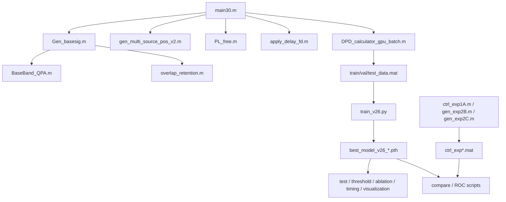
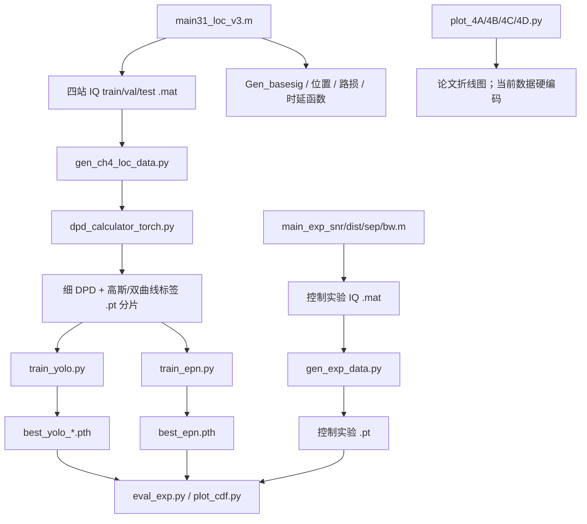

# 第一阶段：论文与第三、第四章代码接管审查

> 首次审查日期：2026-08-20  
> 当前更新状态：已完成完整论文阅读、源码静态审查、环境与资源预检，以及 Gate 0 运行基础改造  
> 验证边界：未生成研究数据、未训练模型、未执行论文实验；本文不把入口可运行或静态通过等同于结果复现。

## 1. 结论先行

本项目研究的是：在分布式多站被动接收场景中，面对多个信号在时间、频率和空间上的混叠，先从一组粗粒度 DPD 空间谱中同时完成频带检测与源数计数，再对检测到的混叠频带生成细粒度 DPD 空间谱，通过热力图与亚像素偏移回归完成多源定位。

第三章和第四章不是两套无关模型，而是一条理论上串联的处理链：


静态审查的总体判断如下。

| 维度 | 第三章 | 第四章 |
|---|---|---|
| 核心方法实现 | 基本完整，与论文主体高度相符 | 基本完整，与论文主体高度相符 |
| 数据生成链 | 完整的 MATLAB 入口和辅助函数 | 完整的 MATLAB IQ 入口与 Python DPD/标签入口 |
| 训练链 | 主模型训练、验证、测试入口存在 | 主模型、EPN 对比模型训练入口存在 |
| 评估链 | 主要实验入口存在；M=100 消融评估缺少现成配置 | 指标计算入口存在，但主要 4A–4D 绘图脚本使用硬编码数组 |
| 端到端联动 | 不适用 | 未真正接入第三章预测；评估直接使用真实源数 |
| 本机运行基础 | Gate 0 已通过；入口可导入，MATLAB 默认 smoke | Gate 0 已通过；入口可导入，GPU 固定为 `cuda:0` |
| 尚存运行障碍 | 缺少数据/权重；正式规模整库载入内存风险未解决 | 缺少数据/权重；中间数据可超过 740 GB，默认 batch 也不适合 16 GB 显存 |
| 当前能否声称复现 | 不能，尚未运行 | 不能，尚未运行且图表证据链不闭合 |

结论不是“代码残缺无法继承”，而是“研究实现主体可继承”。Gate 0 已解决最基础的工程可移植性；后续工作的重点已经从“入口能否启动”转为“最小链是否正确、资源是否可承受、论文指标是否能够在可追溯条件下复现”。

## 2. 如何理解整篇论文

### 2.1 研究对象

论文关注非合作无线信号环境。四个同步接收站位于半径 500 m 的圆周上，观测区域为中心附近 ±2000 m。每个信号到不同接收站的传播时延不同，接收信号包含路径损耗、传播时延和噪声。

传统流程通常先估计 TDOA、频率或信号数，再做定位；在多源同频或近频时，信号分离、参数配对和峰值解析都会变得困难。论文的核心思路是将物理模型生成的 DPD 空间谱作为深度网络输入，让网络学习空间谱的形态与多源结构。

### 2.2 DPD 空间谱是什么

对一个候选位置 \(p\)，可以根据该位置到各接收站的几何距离计算理论时延。代码对每一对接收站构造互谱，并用候选位置对应的差分时延进行相位补偿，得到一个位置相关的多站相关矩阵；取该矩阵的最大特征值作为 DPD 谱值。

直观上：候选位置正确时，多站信号经时延补偿后更相干，相关矩阵的能量更集中，最大特征值通常更大。于是遍历二维网格便得到空间谱。代码实现位于 `DPD_calculator_gpu_batch.m` 和 `dpd_calculator_torch.py`。

这一步是两章的物理先验桥梁：网络并非直接对原始 IQ 做黑盒映射，而是在 DPD 已编码的几何相干信息上学习。

### 2.3 两章的任务分工

- 第三章回答“有哪些频带被占用、共有几个信号”。它需要较大覆盖范围和较低计算成本，所以使用 50 m 步长的 81×81 粗网格。
- 第四章回答“已知目标混叠频带及其中信号数时，各信号在哪里”。它需要高定位精度，所以使用 10 m 步长的 401×401 细网格，并通过 offset 回归突破 10 m 网格量化限制。

### 2.4 论文各章关系

| 章节 | 作用 | 与代码的关系 |
|---|---|---|
| 第一章 | 问题背景、传统方法与深度学习方法综述 | 定义研究动机，不是主要代码入口 |
| 第二章 | 信号、传播、TDOA/DPD 与深度学习基础 | 为两章数据仿真和网络设计提供理论基础 |
| 第三章 | 基于多子带空间谱的检测与计数 | `第三章代码/` |
| 第四章 | 基于空间谱图像重建的多源定位 | `第四章代码/` |
| 第五章 | 总结与未来工作 | 指出多径/NLOS、布局鲁棒性、轻量化部署等后续方向 |

### 2.5 从发射信号到四站 IQ：论文公式如何落到代码

接收站由 `main30.m` 和 `main31_loc_v3.m` 以半径 500 m 均匀放在圆周上，因此四个二维坐标依次为

\[
\mathbf r_1=(500,0),\quad
\mathbf r_2=(0,500),\quad
\mathbf r_3=(-500,0),\quad
\mathbf r_4=(0,-500)\ \text{m}.
\]

设第 (q) 个源的位置为 \(\mathbf p_q=(x_q,y_q)\)，则它到第 (m) 个接收站的传播距离和传播时延为

\[
d_{qm}=\lVert\mathbf p_q-\mathbf r_m\rVert_2,
\qquad
\tau_{qm}=\frac{d_{qm}}{c},
\]

其中代码使用 \(c=299792458\ \text{m/s}\)。`PL_free.m` 采用自由空间路径损耗

\[
PL_{qm}=20\log_{10}\frac{4\pi d_{qm}}{\lambda_c}-G_t-G_r,
\qquad \lambda_c=\frac{c}{f_c},
\]

并由发射功率反推出接收功率

\[
P_{r,qm}=P_{t,q}\,10^{-PL_{qm}/10}.
\]

`Gen_basesig.m` 产生单位平均功率的成形 BPSK 基带信号。`main30.m` 先乘
\(e^{j2\pi f_q n/f_s}\) 将其搬移到随机中心频偏，再由 `apply_delay_fd.m` 在频域乘

\[
e^{-j2\pi f_k\tau_{qm}}
\]

施加任意小数采样时延。代码实际构造的第 (m) 站复基带序列可写为

\[
x_m[n]=\sum_{q=1}^{Q}
\sqrt{P_{r,qm}}\,
s_q\!\left(\frac{n}{f_s}-\tau_{qm}\right)
e^{j2\pi f_q(n/f_s-\tau_{qm})}+w_m[n].
\]

这里有三个需要记住的实现事实：

1. 5.8 GHz 载频用于自由空间路径损耗；程序处理和保存的是复基带 IQ，不直接离散 5.8 GHz 射频波形。
2. 四站接收的是同一源信号的不同衰减、不同延迟版本。定位信息主要来自站间差分时延，而不是某一站的绝对到达时刻。
3. 第三章按发射功率和路径损耗形成自然 SNR；第四章则按目标混叠频带的联合带宽 `BW_union` 定义带内噪声功率，再反推各源发射功率。两章 SNR 的生成口径不能混为同一个实验变量。

对应关系如下。

| 物理量 | 数学含义 | 代码变量或函数 | 单位/形状 |
|---|---|---|---|
| 接收站位置 | \(\mathbf r_m\) | `rcvPos` | `(4,2)`，m |
| 源位置 | \(\mathbf p_q\) | `src_pos` | `(Q,2)`，m |
| 传播距离 | \(d_{qm}\) | `norm(src_pos(s,:)-rcvPos(m,:))` | m |
| 传播时延 | \(\tau_{qm}\) | `tau_m` | s |
| 路径损耗 | \(PL_{qm}\) | `PL_free` / `PL_dB` | dB |
| 中心频偏 | \(f_q\) | `fc_off` | Hz |
| 延迟信号 | \(s_q(t-\tau_{qm})\) | `apply_delay_fd` | `1×4096` complex |
| 四站叠加 IQ | \(x_m[n]\) | `sig_rcv` | `(4,4096)` complex |

### 2.6 DPD 空间谱的推导、矩阵和代码维度

对第 (m) 站序列做 FFT，记为 \(X_m(f_k)\)。第 (m_1,m_2\) 站对的互谱为

\[
C_{m_1m_2}(f_k)=X_{m_1}(f_k)X_{m_2}^{*}(f_k).
\]

若候选位置为 \(\mathbf p\)，由几何关系得到该位置相对于这两个站的理论差分时延

\[
\Delta\tau_{m_1m_2}(\mathbf p)
=\tau_{m_1}(\mathbf p)-\tau_{m_2}(\mathbf p).
\]

代码对互谱施加相位补偿并沿频率求和：

\[
R_{m_1m_2}(\mathbf p)
=\sum_k C_{m_1m_2}(f_k)
e^{j2\pi f_k\Delta\tau_{m_1m_2}(\mathbf p)}.
\]

当候选位置等于真实源位置时，互谱中由真实差分时延产生的相位斜率被抵消，各频点趋向同相叠加；候选位置错误时，相位无法充分对齐，频率求和会相互抵消。所有站对组成一个 Hermitian 相关矩阵

\[
\mathbf R(\mathbf p)\in\mathbb C^{4\times4},
\]

对角元素是各站频域能量，非对角元素是上述补偿后的互谱和。程序定义空间谱

\[
P_{\mathrm{DPD}}(\mathbf p)=
\max_i\left|\lambda_i\bigl(\mathbf R(\mathbf p)\bigr)\right|.
\]

正确位置附近的多站相干成分更接近一个占主导地位的低秩结构，因此最大特征值通常抬升。多源、低 SNR、有限带宽和有限观测长度会令峰展宽、偏移或互相融合，这正是后续网络需要学习的空间谱形态。

第三章 `DPD_calculator_gpu_batch.m` 的主要维度为：

| 中间量 | 形状 | 含义 |
|---|---:|---|
| `sig_rcv_batch` | `(19,4,4096)` | 19 个子带、4 站频域信号 |
| `cs_mat` | `(4096,6,19)` | 6 个站对的互谱 |
| `taus` | `(6561,4)` | 81×81 候选点到四站的时延 |
| `phase_mat` | `(6561,4096)` | 某一站对的候选位置相位补偿 |
| `val` | `(6561,19)` | 该站对全部网格、全部子带的补偿互谱和 |
| `R_all` | `(4,4,6561×19)` | 所有位置、子带的相关矩阵页 |
| `mtr_batch` | `(19,81,81)` | 19 幅粗 DPD 谱 |

`pageeig` 在 CPU 上对所有 4×4 矩阵页求特征值。第四章的 PyTorch 版本保持同一数学定义，但只保留目标频带内的 FFT 点，并将 160,801 个候选点分块处理；相关矩阵在 GPU 上构造后仍搬到 CPU 做 `eigvalsh`。

### 2.7 阅读空间谱时最容易混淆的概念

- DPD 谱值不是概率。它是位置相关矩阵的最大特征值，经过 `log(x+1)` 和 z-score 后更不能解释为物理功率或置信概率。
- 网格步长不是实际误差上限。50 m 或 10 m 只规定采样间隔；噪声、几何精度因子、带宽和多源干扰都可能使峰偏离多个网格。
- `lamda` 在两个章节代码中表示“空间搜索网格步长”，不是载波波长。载波波长只在 `PL_free.m` 内由 `c/fc` 计算。
- 每站功率归一化会削弱绝对接收功率差的影响，使谱更偏向表达跨站相干几何；代价是网络不能直接把绝对幅度当作可靠 SNR 线索。
- 粗谱与细谱使用同一种物理量，只是任务和分辨率不同：第三章用 19 幅粗谱判断频带结构，第四章用目标频带的一幅细谱恢复位置。

## 3. 第三章：检测与计数方法

### 3.1 输入如何形成

1. 生成 100 MHz 采样率、4096 点的四站复基带信号。
2. 将全带宽划为 19 个重叠子带：窗宽 10 MHz、步长 5 MHz。
3. 每个接收站、每个子带分别滤波并按子带功率归一化，降低绝对功率和距离衰落对空间谱形态的支配。
4. 对每个子带计算 81×81 DPD 最大特征值空间谱。
5. 对每个样本的 19 幅谱执行 `log(x+1)` 和样本级 z-score，形成形状 `(19, 81, 81)` 的网络输入。

训练样本包含 0、1、2、3 个源，概率分别为 0.20、0.20、0.30、0.30。源位于 0–2000 m 范围内，源间距至少 300 m；BPSK 符号率 10 MHz，按代码滚降扩展后的实际带宽为 13 MHz。

### 3.2 为什么要用“槽位”表示信号

输出不是单个源数分类，而是 `(M, 19)` 的二值占用矩阵：每个槽位代表一个潜在信号，每一列代表一个子带。一个槽位只要存在占用子带，就被视为一个信号；非空槽位数就是计数结果。

多源集合天然没有顺序。如果不规定槽位含义，同一组信号可用多种槽位排列表示，训练会受到排列歧义影响。代码先按中心频偏从小到大排序，再将第 1、2、3 个信号写入相应槽位，从而建立稳定监督顺序。额外空槽位全零。

子带标签分三类：

- 主瓣与子带重叠比例至少 0.3：正样本；
- 只覆盖少量主瓣或滚降区：`ignore_mask=1`，不进入损失；
- 其余：负样本。

### 3.3 网络结构

每个子带共用同一个残差 CNN：

```text
1×81×81
→ Conv(32, 5×5, stride 2) + ResBlock
→ Conv(64, 3×3, stride 2) + ResBlock
→ Conv(128, 3×3, stride 2) + ResBlock
→ Global Average Pooling
→ 128维子带特征
```

19 个子带特征加上可学习位置编码后，通过 1 层、4 头 Transformer Encoder 建模跨子带关系，再沿子带维平均池化，经 256 维全局编码器送入 10 个相互独立的槽位头。每个头输出 19 个 logit。

静态实例化得到论文主模型 `Transformer + M=10` 为 826,142 个参数，即 0.826 M，与论文约 0.83 M 一致。对照模型参数量为：

| 融合方式 | M=3 | M=10 | M=100 |
|---|---:|---:|---:|
| 拼接 | 1,157,273 | 1,281,054 | 2,872,524 |
| Transformer | 702,361 | 826,142 | 2,417,612 |

### 3.4 损失、推理与评价

每个有效槽位—子带元素使用 Focal BCE，`gamma=2`；`ignore_mask` 对应位置不计入平均损失。推理时对 sigmoid 概率阈值化，统计非空槽位数得到源数。

论文和代码包含三类重点实验：

- Exp 1A：单源，SNR 从 -15 dB 到 +15 dB，步长 1 dB，每点 1000 样本；比较检测概率与多种传统检测器。
- Exp 2B：双源，频率间隔从 0 到 4 倍符号率，步长 0.2，每点 500 样本。
- Exp 2C：1/2/3 个同频源，SNR 从 -15 dB 到 +5 dB，每点 500 样本。

`compare_samepfa_exp1A_v4.py` 在验证集零源样本上校准阈值，使“一个样本的 19 个子带中出现任一检测段”的概率不超过 1%。因此这里的 Pfa 是样本级/全频带 family-wise 指标，不是逐子带独立虚警率；论文表述后续应保持这一统计口径。

### 3.5 第三章代码结构与入口



| 类型 | 入口 | 作用 |
|---|---|---|
| 正式数据生成 | `main30.m` | 生成 train/val/test 的粗 DPD 谱和标签 |
| 主模型训练/测试 | `train_v26.py` | 方案 A/B、不同槽位数训练和测试 |
| 单样本检查 | `test_single_v26.py` | 读取单样本并显示槽位预测 |
| Exp 1A | `ctrl_exp1A.m` → `compare_samepfa_exp1A_v4.py` / `roc_exp1A_L4.py` | 检测概率、ROC、同虚警率比较 |
| Exp 2B | `gen_exp2B.m` → `compare_exp2B.py` | 双源频率分辨能力 |
| Exp 2C | `gen_exp2C.m` → `compare_exp2C.py` | 同频多源计数能力 |
| 消融 | `eval_ablation.py` | 拼接/Transformer、M=3/10 比较 |
| 阈值敏感性 | `eval_threshold_sensitivity.py` | 输出阈值变化 |
| 复杂度 | `eval_inference_time.py` | GPU/CPU 推理时间 |
| 可解释性 | `vis_feature_activation*.py` | 中间特征可视化 |

`DAD_calculator_gpu_batch.m`、`MVDR_calculator_gpu_batch.m`、`wangge30.m` 更像备用或探索脚本，不在论文主链入口中。

### 3.6 第三章论文—代码一致性

| 论文要素 | 代码证据 | 判断 |
|---|---|---|
| 4 个圆周分布接收站、半径 500 m | `main30.m` | 一致 |
| 100 MHz、4096 点、19 个重叠子带 | `main30.m` | 一致 |
| 81×81、50 m 粗网格 | `main30.m` | 一致 |
| 每站每子带功率归一化 | `main30.m` | 一致 |
| DPD 最大特征值谱 | `DPD_calculator_gpu_batch.m` | 一致 |
| log 与样本级 z-score | `train_v26.py` | 一致 |
| 共享残差 CNN + 4 头单层 Transformer | `train_v26.py` | 一致 |
| 10 槽位输出、非空槽位计数 | `train_v26.py` | 一致 |
| 按频率排序解决槽位排列 | `main30.m` | 一致 |
| Focal BCE，gamma=2，忽略边缘带 | `train_v26.py` | 一致 |
| 40k/5k/5k，batch 64，100 epoch，5 warmup，patience 25 | `main30.m`、`train_v26.py` | 一致 |
| Adam 优化器 | 代码实际为 AdamW，`weight_decay=5e-4` | 轻微不一致 |
| M=3/10/100 消融 | 训练入口可接受 M=100；现成消融评估只列 M=3/10 | 复现实验链部分缺失 |

### 3.7 手算一次子带标签：彻底理解“正—忽略—负”

100 MHz 观测带宽被 19 个窗覆盖。第 (k) 个子带的范围为

\[
\mathcal B_k=
\left[-50+5(k-1),\,-40+5(k-1)\right]\ \text{MHz},
\quad k=1,\ldots,19.
\]

对中心频偏为 \(f_q\) 的信号，代码把符号率 10 MHz 对应的主瓣定义为

\[
\mathcal M_q=[f_q-5,\ f_q+5]\ \text{MHz},
\]

把含滚降区的实际带宽 13 MHz 定义为

\[
\mathcal A_q=[f_q-6.5,\ f_q+6.5]\ \text{MHz}.
\]

对每个子带先计算主瓣重叠长度

\[
o_{qk}=\max\left(0,
\min(M_q^{\mathrm{hi}},B_k^{\mathrm{hi}})
-\max(M_q^{\mathrm{lo}},B_k^{\mathrm{lo}})
\right),
\]

再计算覆盖率 \(c_{qk}=o_{qk}/10\text{ MHz}\)。标签规则是：

\[
(y_{qk},g_{qk})=
\begin{cases}
(1,0), & c_{qk}\ge 0.3,\\
(0,1), & c_{qk}>0\ \text{或滚降区仍与子带相交},\\
(0,0), & \text{其余情况},
\end{cases}
\]

其中 (y) 是 `band_mask`，(g) 是 `ignore_mask`。

以 \(f_q=0\) MHz 为例：

| 子带编号 | 范围（MHz） | 主瓣重叠 | 覆盖率 | 标签 |
|---:|---:|---:|---:|---|
| 8 | `[-15,-5)` | 0 | 0 | 仍碰到滚降区，ignore |
| 9 | `[-10,0)` | 5 MHz | 0.5 | 正 |
| 10 | `[-5,5)` | 10 MHz | 1.0 | 正 |
| 11 | `[0,10)` | 5 MHz | 0.5 | 正 |
| 12 | `[5,15)` | 0 | 0 | 仍碰到滚降区，ignore |
| 其余 | — | 0 | 0 | 负 |

因此这个信号的槽位行并不是 one-hot，而是沿频率连续出现多个 1。ignore 区的作用是避免把滤波窗边缘或滚降尾部强行当成确定正/负样本。

多源样本先按 `fc_off` 从小到大排序。排序后的第一个信号写入 slot 0，第二个写入 slot 1，以此类推。这个确定性规则把无序集合变成有序监督，避免同一组三个信号在训练中随机对应到 3! 种槽位排列。空槽位全部为零。

### 3.8 从 HDF5 到网络输出：逐层跟踪张量

MATLAB 的 `mtr_sub_all` 逻辑形状是 `(N,19,81,81)`。v7.3 MAT 在 h5py 中呈反序维度，`SourceDetectionDataset` 通过 `transpose(3,2,1,0)` 恢复为 Python 的 `(N,19,81,81)`；标签相应由 `(19,3,N)` 转回 `(N,3,19)`。

以论文主配置 `B=2、M=10` 为例，前向传播如下：

| 步骤 | 张量形状 | 含义 |
|---|---:|---|
| DataLoader | `(2,19,81,81)` | 2 个样本，每个样本 19 幅空间谱 |
| 合并 batch 与子带 | `(38,1,81,81)` | 让同一个 CNN 独立处理每幅子带谱 |
| 第 1 个 stride-2 卷积 | `(38,32,41,41)` | 初级局部峰形与纹理 |
| 第 2 个 stride-2 卷积 | `(38,64,21,21)` | 更大感受野 |
| 第 3 个 stride-2 卷积 | `(38,128,11,11)` | 高层空间谱形态 |
| 全局平均池化 | `(38,128,1,1)` | 每幅子带压为 128 维描述 |
| 恢复子带轴 | `(2,19,128)` | 19 个频率有序 token |
| 位置编码 + Transformer | `(2,19,128)` | 交换相邻及远距离子带信息 |
| 子带平均 + 全局编码器 | `(2,256)` | 样本级联合表征 |
| 10 个槽位头堆叠 | `(2,10,19)` | 每个槽位对 19 个子带给出 logit |

共享 CNN 解决的是“每个子带空间谱长什么样”；Transformer 解决的是“这些形态怎样沿频率组合成一个或多个信号”。如果直接拼接 19 个特征，也能让全连接层看到全部子带，但参数更多，且没有显式的 token 间注意力结构。

`M=10` 是输出容量，不是已经学会检测 10 个真实源。当前训练数据最多只有 3 源，因此 slot 3–9 只学到空槽位。扩大 (M) 可以检验模型对冗余空槽位的稳定性，却不能据此声称模型对 4–10 源具有泛化能力。

### 3.9 损失、反向传播和计数为何是同一任务

对 logit (z) 和二值标签 (y)，代码先计算逐元素 BCE，再乘 Focal 权重：

\[
p=\sigma(z),\qquad
p_t=yp+(1-y)(1-p),
\]

\[
\ell_{qk}=(1-p_t)^\gamma
\operatorname{BCEWithLogits}(z_{qk},y_{qk}),
\qquad \gamma=2.
\]

ignore mask 通过有效性矩阵 (v_{qk}=1-g_{qk}) 消除对应梯度：

\[
\mathcal L=
\frac{\sum_{q,k}v_{qk}\ell_{qk}}
{\max(1,\sum_{q,k}v_{qk})}.
\]

网络没有独立的源数分类头。推理时将每个槽位的 19 个 sigmoid 概率以 0.5 阈值二值化，只要某槽位至少有一个正子带就算非空：

\[
\widehat Q=
\sum_{q=1}^{M}
\mathbb I\!\left(\sum_{k=1}^{19}
\mathbb I[\sigma(z_{qk})>0.5]>0\right).
\]

所以“频带检测”和“源数计数”不是两个独立优化目标：计数是槽位占用结果的确定性派生量。其优点是输出语义统一；风险是单个子带的孤立误报就可能把空槽位变成一个虚假源。

训练中的空间翻转只改变 DPD 图的 x/y 方向，不改变频率子带标签，因此输入和标签仍一致。添加小幅高斯扰动用于增强谱形态鲁棒性。优化器实际为 AdamW，随后执行 5 epoch 线性 warmup 和余弦退火，并按验证集 band loss 早停及保存最优权重。

Gate 1 的单步反向验证只应检查：输出形状正确、loss/梯度有限、ignore 元素不贡献损失、权重可保存重载。随机初始化模型的 count accuracy 没有研究意义，不能作为 Gate 1 通过条件。

### 3.10 第三章建议阅读顺序与自检题

按下列顺序阅读比从文件第一行顺读更高效：

1. `main30.m` 的参数区、四站布局和 `trials_list`。
2. `main30.m` 的信号叠加、子带滤波、功率归一化与标签区。
3. `DPD_calculator_gpu_batch.m` 的 `cs_mat → phase_mat → R_all → pageeig`。
4. `train_v26.py` 的 `SourceDetectionDataset → SourceDetectionNet → compute_loss → evaluate`。
5. 最后再读 Exp 1A/2B/2C，理解每个实验只改变哪一个自变量。

读完后应能独立回答：

- 为什么 19 个子带需要位置编码，而 81×81 网格不直接进入 Transformer？
- 一个真实信号为什么通常对应多个正子带？
- 为什么频率排序能解决槽位排列，却不能解决超出 3 源训练分布的问题？
- `band_acc`、样本级 Pfa 和 `count_acc` 分别在哪个统计层级上定义？
- 如果删除每站子带功率归一化，网络可能利用哪些“捷径特征”？

## 4. 第四章：多源定位方法

### 4.1 输入与第三章的接口

理论流程是：第三章给出目标频带和该频带内的信号数 \(K\)，第四章对这一频带滤波，计算高分辨率 DPD 谱，再输出前 \(K\) 个位置。

训练数据只生成 2 源和 3 源场景，各占 50%；所有源的频率范围保证连通重叠。符号率在 2–20 MHz 内随机，SNR 在 -10–10 dB，源间最大功率差 3 dB，源距中心 100–1000 m，源间距及源到最近接收站距离均至少 150 m。

`gen_ch4_loc_data.py` 虽然实现了按频率重叠关系分组，但 `main31_loc_v3.m` 的训练场景本身保证所有源属于同一重叠组，因此通常每个 IQ 样本生成一个定位任务。

### 4.2 细 DPD 输入

目标频带内的 IQ 信号先进行频域掩码和各站功率归一化，再在 401×401 网格上计算 DPD 最大特征值。网格范围仍是 ±2000 m，但步长由 50 m 缩小为 10 m。随后执行 `log(x+1)`；样本级 z-score 在数据加载时完成。

PyTorch DPD 实现预计算网格到各站的时延与站对差分时延，只在实际频带内计算互谱，并以 40,000 个网格点为一块构造 4×4 复相关矩阵。不过每块矩阵从 GPU 移回 CPU 后执行 `eigvalsh`，造成 CPU/GPU 往返；单样本约需处理数亿到十亿量级的复相位项，50,000 样本的数据预处理将是全流程的主要耗时部分。

### 4.3 网络与输出

网络由三部分组成：

1. CSPDarknet 风格主干提取五尺度特征；
2. PAN-FPN 融合 P3/P4/P5 的上下文与局部信息；
3. U-Net 式解码器将特征逐级上采样，并与浅层特征跳跃连接，恢复到 401×401。

最终有两个输出头：

- 单通道热力图头：预测所有源的中心峰；
- 两通道 offset 头：在最近整数网格点预测 \((\Delta x,\Delta y)\)，将 10 m 网格定位细化到连续坐标。

代码将 401×401 输入补齐到可连续下采样的尺寸，输出后裁回原大小。解码器在 `d4`、`d3`、`d2` 三层使用 Dropout；论文文字称前两层使用 Dropout，属于轻微结构表述差异。

### 4.4 标签、损失与解码

热力图标签是在每个真实位置放置 `sigma=2 px` 的二维高斯，各源标签逐点取最大值。offset 监督只在真实位置最近的整数网格处计算 L1 损失。

论文主损失写作热力图 Focal Loss 与 offset L1 的加权和。代码需要显式运行 `--method dualhead --dice_weight 0` 才与该公式接近，并生成论文后续脚本使用的 `best_yolo_dualhead_std.pth`；默认 `dice_weight=1.0` 会额外加入 Dice Loss。因此“直接使用默认参数”并不等于论文配置。

另一个公式差异是：代码以 `target > 0.5` 的像素数作为 Focal Loss 分母 `n_pos`，论文把所有 `target > 0` 的高斯像素计为正样本数。由于高斯标签大量处于 0–0.5，二者会改变损失尺度，必须在复现前确认论文最终实际采用哪一种口径。

推理时先对热力图做 9×9 NMS，取前 \(K\) 个峰，再读取对应位置的 offset 并限制到 [-1,1] 像素，最后换算为物理坐标。

### 4.5 第四章代码结构与入口



| 类型 | 入口 | 作用 |
|---|---|---|
| 正式 IQ 数据生成 | `main31_loc_v3.m` | 40k/5k/5k 四站 IQ、位置、频带和源数元数据 |
| 细 DPD 与标签生成 | `gen_ch4_loc_data.py` | 按重叠频带分组，生成 401×401 谱和多类标签分片 |
| 主模型定义 | `yolo_model.py`、`yolo_config.py` | 主干、PAN、解码器、双头、损失与峰值解码 |
| 主模型训练 | `train_yolo.py` | bbox、热力图、双头及多个消融变体 |
| EPN 对比 | `train_epn.py` | ResNet18 坐标回归与 ROLA 匹配 |
| 控制实验数据 | `main_exp_snr/dist/sep/bw.m` → `gen_exp_data.py` | 4A–4D 数据生成与预处理 |
| 指标评估 | `eval_exp.py` | DPD 峰值、EPN、YOLO/所提模型等指标 |
| CDF 绘图 | `plot_cdf.py` | 从模型和实验数据重新计算误差后绘图 |
| 4A–4D 折线图 | `plot_4A.py`–`plot_4D.py` | 当前直接绘制脚本内硬编码数组 |

### 4.6 第四章论文—代码一致性

| 论文要素 | 代码证据 | 判断 |
|---|---|---|
| 401×401、10 m 细网格 | `yolo_config.py`、`dpd_calculator_torch.py` | 一致 |
| 仅在检测频带内形成细 DPD | `gen_ch4_loc_data.py` | 一致 |
| CSPDarknet + PAN-FPN + U-Net 解码 | `yolo_model.py` | 一致 |
| 单通道高斯热力图 + 双通道 offset | `yolo_model.py`、`train_yolo.py` | 一致 |
| sigma=2 px、9×9 NMS | `gen_ch4_loc_data.py`、`yolo_config.py` | 一致 |
| 40k/5k/5k，2/3 源，2–20 MHz，-10–10 dB，最大功率差 3 dB | `main31_loc_v3.m` | 与执行常量一致；少量头部注释已过时 |
| 200 epoch、patience 30、AdamW、weight decay 0.005、AMP | `train_yolo.py`、`yolo_config.py` | 一致 |
| batch 96 | 默认配置为 192，可由 CLI 覆盖为 96 | 运行溯源缺失，默认不一致 |
| Focal + L1 | 默认实际为 Focal + Dice + L1；需 `--dice_weight 0` | 默认不一致，可显式修正 |
| Focal 分母中的正样本定义 | 论文为 `target>0`，代码为 `target>0.5` | 实现/公式不一致 |
| 解码器前两层 Dropout | 代码在前三层 Dropout | 轻微不一致 |
| 第三章源数作为 Top-K | 代码评估从实验标签读取 `n_src` | 端到端链缺失 |
| 4A–4D 图由评估结果生成 | 折线图脚本直接硬编码论文数值 | 结果溯源链缺失 |

### 4.7 一个 IQ 样本如何变成一个定位任务

`main31_loc_v3.m` 不直接生成细 DPD，而是保存四站 IQ、源位置、中心频偏、逐源实际带宽和源数。`gen_ch4_loc_data.py` 再完成以下转换：

1. 用每个源的 `[fc-BW/2, fc+BW/2]` 构造频率区间。
2. 将频率区间有重叠的源通过并查集合并为一个连通组。
3. 每个连通组形成一个定位任务，频域掩码覆盖该组最小低端到最大高端。
4. 对滤波后的四站 IQ 计算一幅 401×401 细 DPD。
5. 保存该组内源的位置、源数及多种监督标签。

“连通重叠”允许源 1 与源 2 重叠、源 2 与源 3 重叠，而源 1 与源 3 不直接重叠；只要整个区间图连通，三者仍属于一个需要联合定位的混叠组。当前 `main31_loc_v3.m` 在生成时已强制后续源与已有频率组重叠，因此一个 IQ 样本通常只形成一个 2 源或 3 源任务。

MATLAB 保存的 IQ 逻辑形状为 `(N,4,4096)`，h5py 读取后先转回同样的 Python 语义顺序。源位置由 `(2,3,N)` 转为 `(N,3,2)`；中心频偏和带宽由 `(3,N)` 转为 `(N,3)`。这一转置是 MATLAB 列主序/HDF5 维度呈现差异，不是信号维度发生了物理变化。

### 4.8 细 DPD 的计算流程和真正的资源瓶颈

`DPDGeometry` 一次性预计算：

- 401×401 网格，共 160,801 个候选位置；
- 每个网格点到 4 个接收站的绝对时延；
- 4 站组成的 6 个站对的差分时延；
- 完整 4096 点频率轴；
- 双曲线标签需要的网格—接收站距离。

`compute_fine_dpd` 对每个任务执行：

1. 四站 IQ 做 FFT，并乘目标混叠频带掩码。
2. IFFT 回时域，对每站按平均功率归一化，再重新 FFT。
3. 只抽取掩码内的频点，以 `complex128` 构造 6 个站对互谱。
4. 每次处理最多 40,000 个候选点，在 GPU 上构造 `(chunk,4,4)` Hermitian 矩阵。
5. 将矩阵搬到 CPU，执行 `torch.linalg.eigvalsh`；异常时退化为奇异值分解。
6. 将最大绝对特征值重排为 `(401,401)`，再执行 `log(x+1)`。

模型训练前的数据预处理之所以危险，不是 401×401 图本身特别大，而是每个候选点还要遍历带内频点和 6 个站对。当前实现同时存在 GPU 相位矩阵计算和 CPU 特征值分解，数据往返会降低吞吐。Gate 2 必须先实测“单个定位任务”的耗时，而不能直接按 50,000 个任务启动。

### 4.9 高斯热力图和 offset：从米到像素再回到米

物理坐标与像素坐标的映射为

\[
u=\frac{x+2000}{10},\qquad
v=\frac{y+2000}{10},
\]

其中 (u) 是列坐标 x，(v) 是行坐标 y。单通道目标热力图为所有源二维高斯的逐点最大值：

\[
H(i,j)=\max_q
\exp\left[-\frac{(i-v_q)^2+(j-u_q)^2}{2\sigma^2}\right],
\qquad \sigma=2\ \text{px}.
\]

因此高斯标准差对应 20 m。多源取 `max` 而不是求和，可以保持峰值不超过 1，并避免两个相邻高斯简单叠加出大于 1 的标签。

offset 只在真实位置最近的整数网格点监督。令

\[
i_q=\operatorname{round}(v_q),\quad
j_q=\operatorname{round}(u_q),
\]

则真值偏移为

\[
\delta^x_q=u_q-j_q,\qquad
\delta^y_q=v_q-i_q,
\]

通常位于 `[-0.5,0.5]`。例如真实位置 `(123,-456)` m 对应 `(u,v)=(212.3,154.4)`，整数峰为 `(212,154)`，offset 为 `(0.3,0.4)`；解码后

\[
\hat x=(212+0.3)\times10-2000=123\ \text{m},
\]

\[
\hat y=(154+0.4)\times10-2000=-456\ \text{m}.
\]

推理代码把预测 offset 限制到 `[-1,1]`，最多修正一个网格。9×9 NMS 比较每个峰周围 x/y 各 ±4 个像素，即 ±40 m 的局部邻域；若按 9 个采样格计“窗口宽度”可口语化称约 90 m，但两端坐标实际跨度是 80 m，不能把它直接解释成固定的最小可分辨距离。

位置标签在写入 `pos_label` 前按到区域中心的距离排序，但单通道热力图本身是无序集合。评估使用 Hungarian 匹配，因此最终定位误差不依赖预测峰的排列顺序。这与第三章必须按频率固定槽位是两种不同的集合处理策略。

### 4.10 从 401×401 输入走完定位网络

输入先从 401×401 在右侧和下侧补零到 416×416，便于连续 5 次二倍下采样。主模型的关键形状为：

| 模块 | 形状（batch 维略） | 作用 |
|---|---:|---|
| 输入 | `1×401×401` | 单通道 log-DPD |
| padding | `1×416×416` | 对齐 32 倍下采样 |
| `e1` | `32×208×208` | 浅层高分辨率边缘/峰形 |
| `e2` | `64×104×104` | 第二级浅层特征 |
| `p3` | `128×52×52` | stride 8 特征 |
| `p4` | `256×26×26` | stride 16 特征 |
| `p5` | `512×13×13` | stride 32 + SPPF 大感受野 |
| PAN `n3/n4/n5` | `128×52×52` / `256×26×26` / `512×13×13` | 自顶向下与自底向上多尺度融合 |
| decoder `d4` | `256×26×26` | 与 `n4` 跳连 |
| decoder `d3` | `128×52×52` | 与 `n3` 跳连 |
| decoder `d2` | `64×104×104` | 与 `e2` 跳连 |
| decoder `d1` | `32×208×208` | 与 `e1` 跳连 |
| 解码输出 | `1×416×416` + `2×416×416` | 热力图与 x/y offset |
| 裁剪 | `1×401×401` + `2×401×401` | 与原始物理网格对齐 |

Backbone/SPPF 提供识别大尺度、多峰和干扰结构所需的上下文；PAN 让深层语义与不同尺度的局部信息双向融合；U-Net 式跳连把定位所需的高分辨率细节重新送入解码器。只有大感受野而没有浅层跳连，峰中心容易模糊；只有浅层细节而没有深层上下文，又难以区分多源混叠形成的复杂伪峰。

Gate 0 修复依赖后已在 CPU 上静态实例化模型，参数量为：

| 模型分支 | 参数量 |
|---|---:|
| bbox | 11,135,411（11.135 M） |
| 单热力图 | 12,777,025（12.777 M） |
| 热力图 + offset 双头 | 12,786,339（12.786 M） |

双头相对单热力图只增加约 9.3k 参数，说明网络复杂度主要来自 backbone、PAN 和高分辨率解码器，而不是 offset 输出头。

### 4.11 损失、Top-K 解码与评价口径

代码中的热力图 Focal Loss 对 soft target (y\in[0,1]) 计算

\[
\ell^+ =-y(1-p)^\alpha\log p,
\qquad
\ell^- =-(1-y)^\beta p^\alpha\log(1-p),
\]

其中 `alpha=2, beta=4`。总和却用 `target>0.5` 的像素数归一化。这意味着 0–0.5 的高斯尾部仍进入分子，只是不计入分母中的正像素数量；这正是它与论文 `target>0` 口径不一致的具体位置。

双头总损失在论文配置附近应为

\[
\mathcal L=\mathcal L_{\mathrm{focal}}
+\lambda_{\mathrm{off}}\mathcal L_1,
\]

而当前 CLI 默认 `dice_weight=1.0`，实际增加 Dice Loss。复现论文主公式时必须明确传入 `--method dualhead --dice_weight 0`；不能只记录脚本名而遗漏命令行参数。

解码流程是：sigmoid → 9×9 NMS → 取前 (K) 个峰 → 读取峰位置的 offset → 像素坐标换算为米。当前 `eval_exp.py` 的 (K) 来自数据标签 `n_src`，所以它回答的是：

> 在真实源数已经已知时，模型把这 (K) 个源定位得多准？

它没有回答：

> 第三章先预测源数和频带后，整个系统最终定位得多准？

预测点与真实点之间先构造欧氏距离代价矩阵，再用 Hungarian 算法寻找最小总距离匹配。RMSE、平均误差、中位误差和阈值内比例最终基于匹配后的“逐源误差”汇总，而不是先对每个样本算一个标量再平均。论文写作时必须注明统计单位。

### 4.12 第四章创新主线与实现边界

从论文内部论证看，第四章的主线不是“把 YOLOv8 原样用于定位”，而是：

1. 用细 DPD 把阵列定位物理约束变成二维可学习场；
2. 用多尺度 backbone/PAN 识别多源和伪峰的全局结构；
3. 用高分辨率解码器恢复精确峰形；
4. 用集合热力图避免固定源顺序，用 offset 突破 10 m 网格量化；
5. 理论上接收第三章的频带与源数，形成检测—计数—定位链。

其中第 5 点目前只在方法叙述上成立，代码评估仍是 oracle K。模型结构和训练代码存在不等于端到端创新已经被实验验证；后续应分别报告 oracle-count 定位和 predicted-count 端到端定位。

建议阅读顺序是：`main31_loc_v3.m → gen_ch4_loc_data.py → dpd_calculator_torch.py → yolo_config.py → yolo_model.py → train_yolo.py → eval_exp.py`。读完后应能独立解释：一个 IQ 样本为何可能拆成多个任务、为什么 row 对应 y 而 col 对应 x、热力图与 offset 分别提供什么梯度、以及为何知道真实 (K) 会使定位评估比真实系统更容易。

## 5. 关键完整性问题清单

### P0：本机运行阻断项及 Gate 0 关闭状态

| 原阻断项 | Gate 0 后状态 | 剩余边界 |
|---|---|---|
| 缠绕在脚本中的 `/mnt/data/...` | 已关闭：统一到项目配置和可覆盖 CLI | 尚未运行真实数据链 |
| 硬编码 `cuda:2` | 已关闭：默认并严格校验 `cuda:0` | 仅验证设备解析，未测训练峰值显存 |
| 缺少 `h5py`、`ultralytics` | 已关闭：已安装兼容版本 | 版本已记录，正式复现仍需环境快照 |
| Pillow DLL 导致 Matplotlib/torchvision 失败 | 已关闭：Pillow 固定为 11.3.0，组合导入通过 | 不应随意升级 Pillow 而不回归 torchvision |
| MATLAB 入口可能误启 40k/5k/5k | 已关闭：默认 smoke，formal 必须显式设置 | Gate 1 仍需硬超时和资源停止规则 |
| smoke 可能覆盖正式产物 | 已关闭：数据/输出按模式、章节和入口隔离 | 同一 smoke 入口重复运行仍应使用唯一 run root |
| 仓库没有数据和权重 | 未关闭 | 必须从 Gate 1 开始生成并验证，不能跳到训练复现 |

### P1：会破坏正式复现或结论解释

1. 第四章没有调用第三章模型，评估时用真实 `n_src` 作为 Top-K。现有定位结果是 oracle-count 条件性能，不是端到端性能。
2. `plot_4A.py`–`plot_4D.py` 不读取 `eval_exp.py` 保存的结果，而是硬编码 RMSE 数组。论文图可重画，但数值无法追溯到当前代码、数据和权重。
3. 第四章默认损失包含 Dice，默认 batch 为 192；与论文描述的 Focal+L1、batch 96 不同，且没有运行命令、日志或 manifest 证明论文使用了哪些覆盖参数。
4. Focal Loss 正样本归一化口径与论文公式不同。
5. 第三章论文写 Adam，代码为 AdamW；需以实际训练记录确定最终口径。
6. 第三章 M=100 的训练能力存在，但现成消融评估没有 M=100 配置，表 3.7 无完整一键复现链。
7. MATLAB 数据生成和第三章训练未固定随机种子；第四章虽固定训练 seed=42，但 `cudnn.deterministic=False`。重复训练不是严格确定性的。

### P2：工程质量和维护风险

1. 第三章 12 个 Python 脚本重复定义同一网络。静态 AST 对比显示当前核心结构语义一致，但后续修改极易产生漂移。
2. MATLAB 脚本头部有过时注释：如第四章带宽、功率差和控制实验样本数与执行常量不一致。
3. 4B、4C、4D 数据生成范围比论文绘图范围更宽：3 源距离额外生成 100 m，间距额外生成 100–140 m，带宽额外生成 2 MHz，造成不必要开销。
4. `eval_exp.py` 可选导入的 `tdoa_twostep.py` 和 `dpd_subspace.py` 不在仓库；论文主要对比链不必依赖它们，但对应可选方法无法运行。
5. Gate 0 已补充最小依赖清单与运行基础说明，但完整 README、逐入口命令、数据 schema、实验 manifest 和权重清单仍缺失。

## 6. 静态验证与依赖状态

### 6.1 已完成验证

- Word 原文已通过 Word 只读导出逐页检查，共 149 个渲染页；第三章约为渲染页 49–114，第四章约为 115–140。
- Gate 0 后共 29 个 Python 文件通过语法编译，并逐个完成 `--help` 或模块导入，结果为 29/29。
- Gate 0 新增或核心配置文件通过 Ruff F/E9；全库仍有 108 条历史 F 类提示，主要是星号导入、未使用变量和无占位符 f-string，不属于本轮算法错误。
- 9 个修改过的 MATLAB 数据入口及 `gate0_runtime.m` 已由 MATLAB R2025b Code Analyzer 检查；集中配置为 0 条提示，入口脚本共有 21 条历史 warning，主要是全局变量和循环内数组扩容，无语法级 error。
- MATLAB 已确认 13 个核心入口/函数可见，默认模式与输出路径断言为 smoke。
- MATLAB 已确认存在 Communications Toolbox、Signal Processing Toolbox 和 Parallel Computing Toolbox；`comm.RaisedCosineTransmitFilter`、`pskmod`、`fir1`、`resample`、`gpuArray`、`pageeig` 均可定位。
- 本机只检测到 1 张 NVIDIA GeForce RTX 4070 Ti SUPER，统一设备解析结果为 `cuda:0`，显存约 16 GB。
- 第四章三种模型已在 CPU 上完成静态实例化：bbox 11.135 M、单热力图 12.777 M、双头 12.786 M 参数。

### 6.2 Python 环境

| 组件 | 状态 |
|---|---|
| Python | 3.10.20 |
| PyTorch | 2.8.0+cu129，可导入 |
| NumPy | 2.2.6，可导入 |
| SciPy | 1.15.2，可导入 |
| scikit-learn | 1.7.2，可导入 |
| h5py | 3.14.0，可导入 |
| ultralytics | 8.3.191，可导入 |
| torchvision | 0.23.0+cu129，可与 Pillow/Matplotlib 组合导入 |
| Matplotlib | 3.10.8，可与 torchvision 组合导入 |
| Pillow | 11.3.0；12.1.1 在当前导入顺序下会触发 `_imaging` DLL 冲突 |

`requirements-gate0.txt` 固定 Gate 0 直接相关版本；现有 cu129 PyTorch/torchvision 不由该文件重装。当前 `pip check` 无冲突。未经组合导入回归，不应单独升级 Pillow、torchvision 或 PyTorch。

### 6.3 Gate 0 后的统一运行约定

- Python 项目配置：`runtime_config.py`。
- MATLAB 项目配置：`gate0_runtime.m`。
- 安全默认：`SOURCECOUNT_RUN_MODE=smoke`；未设置时仍按 smoke 处理。
- 正式数据：`data/chapter3`、`data/chapter4`。
- 正式输出：`outputs/formal/<chapter>/<entry>`。
- smoke 数据和输出：`outputs/smoke/<chapter>/...`；Gate 1 将再通过唯一的 `SOURCECOUNT_OUTPUT_ROOT` 隔离具体运行批次。
- 所有训练和评估入口默认使用 `cuda:0`；无效 CUDA 编号会明确报错，不静默切换设备。
- `trim_exp_pt.py` 现在只生成精简副本，并拒绝把输出放回输入目录树。

## 7. 本机资源预算

### 7.1 第三章

MATLAB 主空间谱数组单个训练集为：

\[
40000\times19\times81\times81\times4\ \text{bytes}
=19.945\ \text{GB}
\]

加入标签、子带能量和协方差后，未压缩理论大小为：

| split | 估算大小 |
|---|---:|
| train | 20.066 GB / 18.688 GiB |
| val | 2.508 GB / 2.336 GiB |
| test | 2.508 GB / 2.336 GiB |
| 总计 | 25.082 GB / 23.360 GiB |

磁盘容量足够，但 `main30.m` 在 MATLAB 中一次预分配完整训练集，叠加中间复数组、GPU/CPU 相关矩阵和并行池后，32 GB RAM 余量很小。

`SourceDetectionDataset` 又把 train 和 val 全部读入 NumPy；`np.log` 赋值过程还可能产生临时副本。常驻数组已约 22.6 GB，峰值可能超过 32 GB，因此正式训练前必须改为 HDF5 懒加载/分片或减小数据集。

主模型仅约 0.826 M 参数，权重约 3.15 MiB（FP32），模型本身不是瓶颈。batch 64 的 19 子带共享 CNN 会产生较多激活，但 16 GB 显存大概率可容纳；需要 smoke 实测确认。

### 7.2 第四章训练数据

MATLAB 四站 IQ 数据未压缩理论大小约为：

| split | 估算大小 |
|---|---:|
| train | 5.264 GB / 4.903 GiB |
| val | 0.658 GB / 0.613 GiB |
| test | 0.658 GB / 0.613 GiB |
| 总计 | 6.580 GB / 6.129 GiB |

Python 分片目前每个样本保存 8 张 401×401 float16 图：1 张 DPD、3 张双曲线、1 张单通道高斯、3 张多通道高斯。仅大图部分每样本约 2.573 MB：

| split | 完整分片估算 |
|---|---:|
| train 40k | 102.913 GB / 95.845 GiB |
| val 5k | 12.864 GB / 11.981 GiB |
| test 5k | 12.864 GB / 11.981 GiB |
| 总计 | 128.641 GB / 119.806 GiB |

双头主模型训练实际只需要 DPD 与单通道高斯标签，但 `LocDataset` 会把所需分片全部拼接到内存。train+val 仅这两张图就约 28.944 GB，再加位置、对象开销、DataLoader pinned memory 和训练进程，32 GB RAM 基本没有安全余量。

若仅持久化 DPD，并由位置标签在线生成高斯图，50k 样本的核心谱可降至约 16.080 GB；这说明数据格式优化比单纯缩小模型更优先。

### 7.3 第四章控制实验数据

`gen_exp_data.py` 每个样本保存 DPD、3 通道双曲线、单通道双曲线、单通道高斯以及滤波后 IQ。按代码数据类型估算：

| 实验 | 样本数 | 处理后数据估算 |
|---|---:|---:|
| 4A：2/3 源 SNR | 110,000 | 403.565 GB |
| 4B：2/3 源距离 | 40,000 | 146.751 GB |
| 4C：间距 | 32,000 | 117.401 GB |
| 4D：带宽 | 20,000 | 73.375 GB |
| 合计 | 202,000 | 741.092 GB / 690.196 GiB |

这还没有计入原始实验 `.mat`、训练数据、权重和临时文件，明显超过约 500 GB 剩余空间。因此不能按当前格式一次性生成全部控制实验。

### 7.4 细 DPD 计算量

401×401 网格有 160,801 个候选点，4 个接收站产生 6 个站对。若目标频带含 410、819、1638 个 FFT 点，则单样本仅相位矩阵和互谱乘积的规模约为：

| 带内频点 | 单样本复数项 | 50k 样本 |
|---:|---:|---:|
| 410 | 0.396 billion | 19.8 trillion |
| 819 | 0.790 billion | 39.5 trillion |
| 1638 | 1.580 billion | 79.0 trillion |

这不是精确 FLOPs 或墙钟时间，但足以判断：第四章数据预处理比网络训练更可能超过 3 小时目标，且当前 GPU 构矩阵、CPU 求特征值的往返进一步放大耗时。

### 7.5 对本机的判断

- 500 GB 磁盘：可容纳精简后的训练数据，不能容纳当前全套控制实验中间数据。
- 32 GB RAM：不能安全承受第三章和第四章现有“整库加载”实现。
- 16 GB VRAM：第三章 batch 64 有希望；第四章论文 batch 96 和代码默认 batch 192 风险很高，预计需从 batch 1/2 smoke，再逐级测试到 8/16 等范围。
- 3 小时训练目标：在完成数据懒加载、缓存精简和 batch 实测后才可评估；原始第四章全数据生成几乎肯定不是 3 小时级任务。

## 8. 最小 smoke 运行方案

所有门禁均只提供工程证据，不提供论文性能证据。任何一步失败后都停止在该步分析原因，不自动放大样本、降低验收标准或静默重试。

### 8.1 Gate 0：已完成

Gate 0 已于 2026-08-20 执行并通过。完成内容包括统一路径/设备、依赖修复、MATLAB 默认 smoke、输出隔离和入口静态验收。详细记录见 `修改记录.md` 和 `运行基础说明.md`。

### 8.2 Gate 1：第三章最小闭环（待用户审批）

> Material Passport  
> Origin Skill: experiment-agent  
> Origin Mode: plan  
> Origin Date: 2026-08-20  
> Verification Status: UNVERIFIED  
> Version Label: gate1_ch3_plan_v1

#### 8.2.1 目标与非目标

Gate 1 只回答四个问题：

1. `main30.m` 能否在本机生成结构正确的极小第三章数据？
2. MATLAB v7.3 数据经 h5py 转置后，物理量、标签和张量语义是否仍一致？
3. 论文主模型 `Transformer + M=10` 能否在 `cuda:0` 上完成一次 forward、loss、backward、optimizer step、验证、保存和重载？
4. 这一最小闭环的墙钟时间、磁盘、RAM 和 VRAM 峰值是多少？

Gate 1 不训练到收敛，不比较论文指标，不调参，不改模型/损失，不运行 Exp 1A/2B/2C，也不据 16 个样本判断方法性能。

#### 8.2.2 审批后计划修改的文件

| 文件 | 计划修改 | 理由 |
|---|---|---|
| `第三章代码/main30.m` | smoke 数量由 `[4,2,2]` 调整为 `[8,4,4]`；仅在 smoke 下固定种子；保存运行模式、种子、滚降和实际带宽元数据 | 让 train 中 0/1/2/3 源各 2 条，val/test 各 1 条，并使标签可独立复算 |
| `第三章代码/gate1_smoke_ch3.py`（新增） | 数据 schema/标签审计；batch 2 的单步训练与验证；checkpoint 重载；JSON 报告 | 不调用 `train_v26.py` 的 100 epoch 主训练入口 |
| `运行基础说明.md` | 增加 Gate 1 命令和输出路径 | 使用户可在 PyCharm/MATLAB 中复跑 |
| 长期状态文档 | 只在 Gate 1 实际完成后记录事实 | 不提前写入未发生的资源数值 |

正式配置 `[40000,5000,5000]`、网络结构、数据物理模型、标签阈值和损失函数保持不变。

#### 8.2.3 输入配置

| 项目 | Gate 1 值 |
|---|---:|
| 运行模式 | `smoke` |
| train / val / test | `8 / 4 / 4` |
| train 源数分布 | 0/1/2/3 源各 2 条 |
| val、test 源数分布 | 0/1/2/3 源各 1 条 |
| MATLAB smoke seed | 计划固定为 `20260820` |
| Python seed | `20260820` |
| Python 模型 | `SourceDetectionNet(mode='transformer', max_src=10)` |
| batch | 2 |
| DataLoader workers | 0，避免 smoke 被多进程干扰 |
| optimizer | 沿用 AdamW；只执行 1 个 step |
| 设备 | 严格 `cuda:0` |

每次运行创建唯一根目录，例如：

```text
outputs/gate1_ch3/20260820_HHMMSS/
└── smoke/chapter3/
    ├── data/
    │   ├── train_data.mat
    │   ├── val_data.mat
    │   └── test_data.mat
    ├── gate1_smoke_ch3/
    │   ├── gate1_report.json
    │   ├── gate1_smoke_checkpoint.pth
    │   └── data_audit.json
    └── gate1_monitor/
        └── resource_samples.csv
```

这样即使重复执行 smoke，也不会覆盖前一次 smoke，更不会接触 `data/chapter3` 或 `outputs/formal`。

#### 8.2.4 计划执行顺序

**G1.0 只读预检**

- 确认 `SOURCECOUNT_RUN_MODE=smoke`，且没有设置为 formal。
- 确认输出根目录是本次唯一 run 目录，剩余磁盘不少于 100 GB。
- 再次检查 CUDA 只有设备 0、依赖组合导入通过、MATLAB 工具箱和核心函数可见。
- 记录 Python/MATLAB/PyTorch/CUDA/GPU 版本和运行前 Git 状态。

**G1.1 MATLAB 极小数据生成**

拟在同一 PowerShell 会话中执行：

```powershell
$gate1RunId = Get-Date -Format 'yyyyMMdd_HHmmss'
$gate1Root = "F:\SourceCount_DPD\outputs\gate1_ch3\$gate1RunId"
$env:SOURCECOUNT_RUN_MODE = 'smoke'
$env:SOURCECOUNT_OUTPUT_ROOT = $gate1Root
& 'D:\Software\MATLAB\R2025b\bin\matlab.exe' -batch "run('F:/SourceCount_DPD/第三章代码/main30.m')"
```

运行期间每 2 秒采样所有 MATLAB 进程的工作集、系统可用内存、GPU 已用显存和输出目录大小。MATLAB 自身的 `tic/toc` 作为第二份时间证据。

**G1.2 MAT 数据与标签审计**

新 smoke 检查脚本逐个读取 train/val/test，并验证：

- h5py 原始形状和转置后逻辑形状；
- `mtr_sub_all` 为有限、非负的 float32，逻辑形状分别为 `(8,19,81,81)`、`(4,19,81,81)`、`(4,19,81,81)`；
- `src_count_all` 的类别数量符合预定分布；
- `band_mask` 与 `ignore_mask` 仅含 0/1，且同一元素不同时为 1；
- 空槽位的 band/ignore 全零；0 源样本所有槽位全零；
- 活跃源的 `fc_offset` 单调递增；
- 根据保存的中心频偏、符号率、实际带宽、子带边界和阈值重新计算标签，与 MATLAB 输出逐元素一致；
- 三个 MAT 文件均位于本次 smoke 根目录，正式目录的时间戳和文件清单没有变化。

DPD 峰与真实位置的距离只作为诊断字段记录，不设置性能阈值，因为随机低 SNR、多源谱和粗网格下全局最大峰不保证等于每个真实源。

**G1.3 Python 单步训练闭环**

计划命令为：

```powershell
& 'D:\Software\anaconda3\envs\PyTorch\python.exe' `
  'F:\SourceCount_DPD\第三章代码\gate1_smoke_ch3.py' `
  --data_dir "$gate1Root\smoke\chapter3\data" `
  --output_dir "$gate1Root\smoke\chapter3\gate1_smoke_ch3" `
  --device cuda:0 --batch_size 2 --seed 20260820
```

脚本不调用正式 `train()`，而是复用现有 `SourceDetectionDataset`、`SourceDetectionNet` 和 `compute_loss`，只完成：

1. 取一个 train batch，确认输入 `(2,19,81,81)`、补零标签 `(2,10,19)`。
2. forward 得到 `(2,10,19)`，检查 logit 和 loss 有限。
3. 人工只扰动 ignore 元素的 logit，验证 loss 在容差 `1e-6` 内不变。
4. backward 后检查所有已有梯度均有限，且至少一个参数梯度范数非零。
5. 执行一个 AdamW step，确认至少一个参数发生有限变化。
6. 对 val batch 做 `eval()` forward/loss，不计算有意义的 accuracy 结论。
7. 保存 checkpoint，加载到新模型，在 `eval()` 下对同一输入比较输出，最大绝对差不超过 `1e-6`。
8. 将时间、RSS、CUDA allocated/reserved 峰值、文件大小、shape 和断言结果写入 JSON。

**G1.4 结果回读与门禁判定**

- 回读 JSON、checkpoint 和资源 CSV，不以控制台“Done”作为唯一证据。
- 核对正式目录未变化。
- 只给出 `PASS / FAIL / BLOCKED` 工程判定；不报告论文准确率或优劣结论。
- 未通过时保留全部日志和本次独立目录，不自动重试。

#### 8.2.5 资源预算与硬停止条件

| 项目 | 预警线 | 中止判定线 |
|---|---:|---:|
| 总墙钟时间 | 20 min | 30 min |
| MATLAB 阶段 | 12 min | 20 min |
| Python 单步阶段 | 3 min | 5 min |
| 系统 RAM 占用 | 24 GB | 28 GB |
| GPU 显存占用 | 12 GB | 14 GB |
| 本次输出目录 | 500 MB | 1 GB |
| 磁盘剩余空间 | 低于 120 GB 预警 | 低于 100 GB 停止 |

此外，出现下列任一情况立即判定本阶段失败并禁止进入下一步：MATLAB/Python 异常退出、NaN/Inf、shape 不一致、标签互斥失败、输出落入 formal 目录、CUDA 不是 0、checkpoint 无法重载。只有墙钟硬超时允许监控器自动终止进程；其他资源越线记录为 `RED_FLAG`，由脚本在安全检查点抛错退出或通知用户处理，外部监控器不擅自强杀进程。

#### 8.2.6 Gate 1 通过标准

Gate 1 只有在以下四组条件全部满足时才算通过：

| 维度 | 通过标准 |
|---|---|
| 数据链 | 3 个 MAT 存在且可读；shape、dtype、有限性和源数分布全部正确 |
| 标签链 | 正/ignore 互斥；空槽位正确；频率排序正确；Python 独立复算与 MATLAB 完全一致 |
| 模型链 | forward/loss/backward/step/val/save/reload 全通过；输出 `(2,10,19)`；ignore 不影响 loss |
| 安全与溯源 | `cuda:0`；未触发资源红线；formal 无变化；JSON、checkpoint、资源 CSV 和环境信息齐全 |

Gate 1 通过只允许进入 Gate 2 规划，不能直接证明第三章结果已复现，也不能直接启动 40k/5k/5k。

#### 8.2.7 失败后的分支

- MATLAB 无法完成：停在数据生成层，定位具体函数、工具箱、GPU 或 shape 问题。
- MAT 可生成但标签审计失败：停在 MATLAB→Python 数据契约层，不进入模型。
- 单步训练 OOM：先减 batch 到 1 仅用于定位显存问题；不能把降 batch 后成功偷偷改写成原计划通过。
- 资源超过红线：先做分片/懒加载或 DPD 内存优化，再重新提交 Gate 1 修订方案。
- 全部通过：形成 Gate 1 结果记录，再单独审批第四章 Gate 2。

### 8.3 Gate 2：第四章单链路（后续概略，尚未审批）

1. MATLAB 生成 2 源和 3 源各 1–2 个 IQ 样本。
2. 对每个样本生成 401×401 细 DPD，记录单样本耗时、峰值 RAM/VRAM。
3. 只保存 `fine_dpd + pos_label + n_src`，高斯标签在线生成。
4. 以 batch 1 完成双头网络 forward/loss/backward；再逐级尝试 2、4、8，找到显存安全 batch。
5. 用真实 K 验证定位解码，再用第三章预测 K 验证端到端接口。

预算：不超过 30 分钟、数据不超过 2 GB；若单样本 DPD 超过预期即停止并优化算法。

### 8.4 Gate 3：小规模可重复实验（后续概略，尚未审批）

1. 固定 MATLAB 与 Python 随机种子。
2. 第三章先用约 2k/400/400 或根据 smoke 吞吐确定的数据量。
3. 第四章先用约 1k/200/200，并按需增量生成 DPD，避免一次性全量。
4. 保存配置、依赖版本、Git 状态、耗时、峰值资源、原始指标和图表输入数据。

通过标准：同一权重重复评估结果一致；绘图脚本只读取结果文件；第三章和第四章既能独立评估，也能端到端评估。

## 9. 手把手掌握研究的学习路线

你已有相关基础，无需等待逐轮对话讲授。第 2–4 节已经把六讲所需的核心解释写成正文，可以按下表独立学习。每一讲都遵循“先用公式明确物理量，再沿张量追代码，最后用自检题确认掌握”的顺序。

| 讲次 | 先读本文 | 对照代码 | 应形成的个人产物 |
|---|---|---|---|
| 1. 四站信号与 DPD | 2.5–2.7 | `main30.m`、`PL_free.m`、`apply_delay_fd.m`、`DPD_calculator_gpu_batch.m` | 手写一页从 \(x_m[n]\) 到 \(R(\mathbf p)\) 和最大特征值的推导 |
| 2. 第三章标签与槽位 | 3.1–3.2、3.7 | `main30.m` 标签区 | 自选两个中心频偏，手算 19 子带正/ignore/负标签和槽位顺序 |
| 3. 第三章网络与训练 | 3.3–3.4、3.8–3.9 | `train_v26.py` | 独立画出 `(B,19,81,81)→(B,M,19)` 形状图并写出 loss |
| 4. 细 DPD、热力图与 offset | 4.1–4.2、4.7–4.9 | `gen_ch4_loc_data.py`、`dpd_calculator_torch.py` | 任取一个物理坐标，手算像素、整数中心、offset 和反解坐标 |
| 5. 定位网络 | 4.3、4.10–4.11 | `yolo_model.py`、`train_yolo.py` | 画出 416→13→416→401 的多尺度形状与梯度路径 |
| 6. 实验可信度 | 3.4–3.6、4.5–4.6、4.11–4.12、5 节 | 所有评估/绘图入口 | 为任一论文图列出数据、配置、权重、评估结果和绘图输入五级证据链 |

建议每讲结束后，不看本文回答对应章节末尾的自检问题。不能回答时回到公式或代码变量，不需要先运行正式实验。Gate 1 的数据审计 JSON 和单步张量记录将作为第 1–3 讲的第一批实物证据；Gate 2 才会补上第 4–5 讲的实测证据。

## 10. 第一阶段后的推荐决策

下一步不应直接运行 `main30.m` 或 `main31_loc_v3.m` 的完整配置。最合理的顺序是：

1. Gate 0 已完成，不再重复处理路径、设备和基础依赖。
2. 当前等待审批 8.2 节 Gate 1；批准后只执行第三章 8/4/4 数据和 batch 2 单步闭环。
3. Gate 1 通过后再审批 Gate 2，测量第四章单任务细 DPD 时间和 batch 上限。
4. 根据 Gate 1/2 的实测结果单独设计懒加载、缓存精简和正式数据规模，不在 smoke 中混入大范围重构。
5. 完成 Gate 3 小规模可重复实验后，再决定是否扩展到论文全量参数。
6. 投稿前另立当前文献检索阶段核验创新边界。学位论文能证明方法设计意图和当时论证，不能单独证明面向当前 SCI 投稿时仍无相近工作。

## 11. 证据边界

- “与论文一致”表示源码结构、常量或公式在静态层面可对应，不表示论文数值已经复现。
- 第三章与第四章主要模型参数量均已通过本机静态实例化核验；推理时间尚未实测。
- 资源数字是根据代码 shape 和 dtype 计算的未压缩理论值；实际 `.mat`/`.pt` 大小可能受容器开销或压缩影响。
- 墙钟训练时间和峰值显存必须通过受控 smoke 测量，不能由静态 FLOPs 直接推断。
- Gate 0 修改的是路径、设备、依赖、入口保护和输出隔离，没有修改研究算法；当前文档更新增加讲义和 Gate 1 计划，没有执行 Gate 1。
- 本项目仍未生成研究数据、模型权重或论文性能结果；文中的 Gate 1 资源阈值是审批用停止规则，不是已经测得的资源占用。
