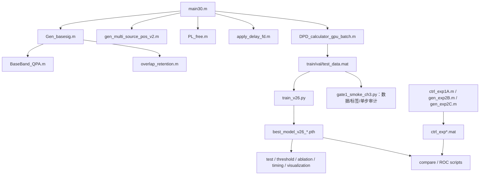
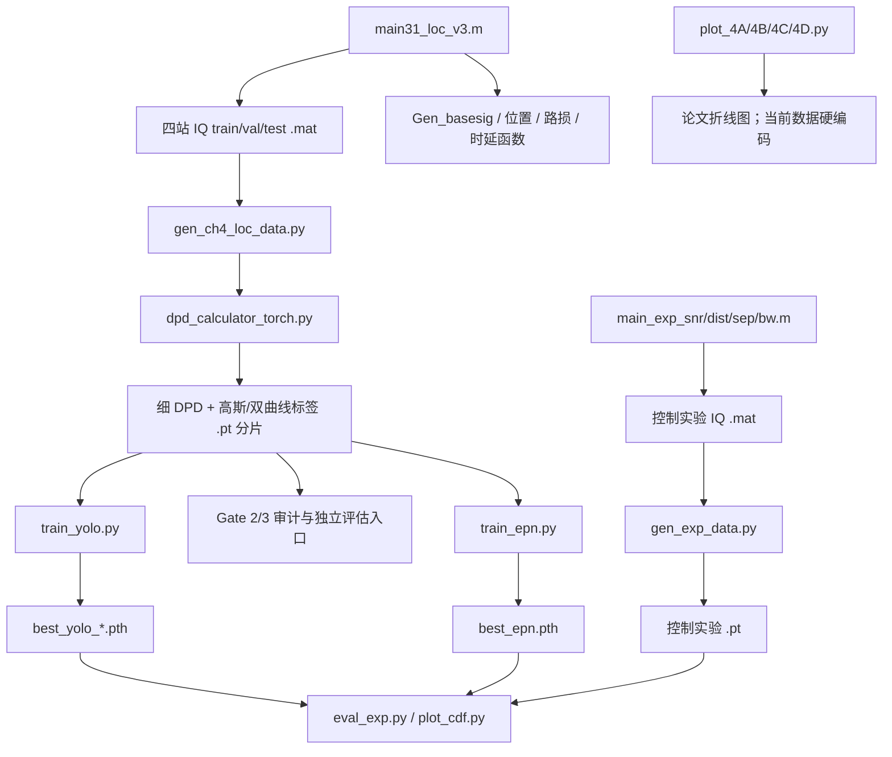

# 第一阶段：论文与第三、第四章代码接管审查

> 首次审查日期：2026-08-20  
> 阶段状态：第一阶段已于 2026-08-21 完成并冻结。已完成完整论文阅读、源码静态审查、Gate 0、Gate 1、Gate 2、Gate 3A 和 Gate 3B；后续阶段内容不再追加到本文。
> 验证边界：第三章尚未完成收敛训练；第四章 Gate 3B 已完成当前 1024/256/256 小规模数据上的完整训练和 oracle-K 评估，但最佳 epoch 为 57，尚不能宣称充分收敛，更不等同于论文全量配置、论文指标或端到端 predicted K 复现。

> 文档职责：本文保留第一阶段的论文与代码详细解读、完整性判断、资源分析、学习路线、历史 Gate 和阶段结论。逐次实验事实与精确指标以 `实验结果记录.md` 为准；当前工作转入 `第二阶段_缩减规模复现与端到端闭环.md`。本文冻结后只接受事实纠错或失效链接修复。

第一阶段完成条件均已满足：论文及第三、第四章代码已完整阅读；方法、入口、调用和数据流已映射；代码主体可继承；Gate 0–3 已建立本机工程与可重复性证据；资源边界、论文/代码差异和后续风险已明确。这里的“完成”只指研究接管审查完成，不指论文结果复现完成。

## 1. 结论先行

本项目研究的是：在分布式多站被动接收场景中，面对多个信号在时间、频率和空间上的混叠，先从一组粗粒度 DPD 空间谱中同时完成频带检测与源数计数，再对检测到的混叠频带生成细粒度 DPD 空间谱，通过热力图与亚像素偏移回归完成多源定位。

第三章和第四章不是两套无关模型，而是一条理论上串联的处理链：


静态审查的总体判断如下。

| 维度 | 第三章 | 第四章 |
|---|---|---|
| 核心方法实现 | 基本完整，与论文主体高度相符 | 基本完整，与论文主体高度相符 |
| 数据生成链 | 完整的 MATLAB 入口和辅助函数 | 完整的 MATLAB IQ 入口与 Python DPD/标签入口 |
| 训练链 | 主模型训练、验证、测试入口存在 | 主模型、EPN 对比模型训练入口存在 |
| 评估链 | 主要实验入口存在；M=100 消融评估缺少现成配置 | 指标计算入口存在，但主要 4A–4D 绘图脚本使用硬编码数组 |
| 端到端联动 | 不适用 | 未真正接入第三章预测；评估直接使用真实源数 |
| 本机运行基础 | Gate 0、Gate 1 已通过；MATLAB→HDF5→模型单步闭环成立 | Gate 0、Gate 2、Gate 3A、Gate 3B 已通过；D8、FP32、batch 8 可稳定训练 |
| 当前可用产物 | 8/4/4 smoke 数据和单步 checkpoint，仅用于工程审计 | 1024/256/256 缩减数据、两次60 epoch训练及冻结 epoch 57 checkpoint |
| 尚存运行障碍 | 尚无收敛权重；正式规模一次预分配和整库载入风险未解决 | 训练上限未确认；全量数据、控制实验存储和图表追溯链未解决 |
| 当前能否声称复现 | 不能；只完成数据契约和单步训练审计 | 不能；已获得缩减数据 oracle-K 证据，但不是论文全量、论文指标或端到端 predicted-K 复现 |

结论不是“代码残缺无法继承”，而是“研究实现主体可继承”。Gate 0–3 已把第四章推进到缩减数据上的完整、严格可重复训练，当前重点已经转为第三章收敛、第四章训练上限、oracle/predicted 接口、结果追溯和正式规模选择。详细实验事实以 `实验结果记录.md` 和第 8 章为准，本节只给出综合判断。

## 2. 如何理解整篇论文

### 2.1 研究对象

论文关注非合作无线信号环境。四个同步接收站位于半径 500 m 的圆周上，观测区域为中心附近 ±2000 m。每个信号到不同接收站的传播时延不同，接收信号包含路径损耗、传播时延和噪声。

传统流程通常先估计 TDOA、频率或信号数，再做定位；在多源同频或近频时，信号分离、参数配对和峰值解析都会变得困难。论文的核心思路是将物理模型生成的 DPD 空间谱作为深度网络输入，让网络学习空间谱的形态与多源结构。

### 2.2 DPD 空间谱是什么

对一个候选位置 $p$，可以根据该位置到各接收站的几何距离计算理论时延。代码对每一对接收站构造互谱，并用候选位置对应的差分时延进行相位补偿，得到一个位置相关的多站相关矩阵；取该矩阵的最大特征值作为 DPD 谱值。

直观上：候选位置正确时，多站信号经时延补偿后更相干，相关矩阵的能量更集中，最大特征值通常更大。于是遍历二维网格便得到空间谱。代码实现位于 `DPD_calculator_gpu_batch.m` 和 `dpd_calculator_torch.py`。

这一步是两章的物理先验桥梁：网络并非直接对原始 IQ 做黑盒映射，而是在 DPD 已编码的几何相干信息上学习。

### 2.3 两章的任务分工

- 第三章回答“有哪些频带被占用、共有几个信号”。它需要较大覆盖范围和较低计算成本，所以使用 50 m 步长的 81×81 粗网格。
- 第四章回答“已知目标混叠频带及其中信号数时，各信号在哪里”。它需要高定位精度，所以使用 10 m 步长的 401×401 细网格，并通过 offset 回归突破 10 m 网格量化限制。

### 2.4 论文各章关系

| 章节 | 作用 | 与代码的关系 |
|---|---|---|
| 第一章 | 问题背景、传统方法与深度学习方法综述 | 定义研究动机，不是主要代码入口 |
| 第二章 | 信号、传播、TDOA/DPD 与深度学习基础 | 为两章数据仿真和网络设计提供理论基础 |
| 第三章 | 基于多子带空间谱的检测与计数 | `第三章代码/` |
| 第四章 | 基于空间谱图像重建的多源定位 | `第四章代码/` |
| 第五章 | 总结与未来工作 | 指出多径/NLOS、布局鲁棒性、轻量化部署等后续方向 |

### 2.5 从发射信号到四站 IQ：论文公式如何落到代码

接收站由 `main30.m` 和 `main31_loc_v3.m` 以半径 500 m 均匀放在圆周上，因此四个二维坐标依次为

$$
\mathbf r_1=(500,0),\quad
\mathbf r_2=(0,500),\quad
\mathbf r_3=(-500,0),\quad
\mathbf r_4=(0,-500)\ \text{m}.
$$

设第 $q$ 个源的位置为 $\mathbf p_q=(x_q,y_q)$，则它到第 $m$ 个接收站的传播距离和传播时延为

$$
d_{qm}=\lVert\mathbf p_q-\mathbf r_m\rVert_2,
\qquad
\tau_{qm}=\frac{d_{qm}}{c},
$$

其中代码使用 $c=299792458\ \text{m/s}$。`PL_free.m` 采用自由空间路径损耗

$$
PL_{qm}=20\log_{10}\frac{4\pi d_{qm}}{\lambda_c}-G_t-G_r,
\qquad \lambda_c=\frac{c}{f_c},
$$

并由发射功率反推出接收功率

$$
P_{r,qm}=P_{t,q}\,10^{-PL_{qm}/10}.
$$

`Gen_basesig.m` 产生单位平均功率的成形 BPSK 基带信号。`main30.m` 先乘
$e^{j2\pi f_q n/f_s}$ 将其搬移到随机中心频偏，再由 `apply_delay_fd.m` 在频域乘

$$
e^{-j2\pi f_k\tau_{qm}}
$$

施加任意小数采样时延。代码实际构造的第 $m$ 站复基带序列可写为

$$
x_m[n]=\sum_{q=1}^{Q}
\sqrt{P_{r,qm}}\,
s_q\!\left(\frac{n}{f_s}-\tau_{qm}\right)
e^{j2\pi f_q(n/f_s-\tau_{qm})}+w_m[n].
$$

这里有三个需要记住的实现事实：

1. 5.8 GHz 载频用于自由空间路径损耗；程序处理和保存的是复基带 IQ，不直接离散 5.8 GHz 射频波形。
2. 四站接收的是同一源信号的不同衰减、不同延迟版本。定位信息主要来自站间差分时延，而不是某一站的绝对到达时刻。
3. 第三章按发射功率和路径损耗形成自然 SNR；第四章则按目标混叠频带的联合带宽 `BW_union` 定义带内噪声功率，再反推各源发射功率。两章 SNR 的生成口径不能混为同一个实验变量。

对应关系如下。

| 物理量 | 数学含义 | 代码变量或函数 | 单位/形状 |
|---|---|---|---|
| 接收站位置 | $\mathbf r_m$ | `rcvPos` | `(4,2)`，m |
| 源位置 | $\mathbf p_q$ | `src_pos` | `(Q,2)`，m |
| 传播距离 | $d_{qm}$ | `norm(src_pos(s,:)-rcvPos(m,:))` | m |
| 传播时延 | $\tau_{qm}$ | `tau_m` | s |
| 路径损耗 | $PL_{qm}$ | `PL_free` / `PL_dB` | dB |
| 中心频偏 | $f_q$ | `fc_off` | Hz |
| 延迟信号 | $s_q(t-\tau_{qm})$ | `apply_delay_fd` | `1×4096` complex |
| 四站叠加 IQ | $x_m[n]$ | `sig_rcv` | `(4,4096)` complex |

### 2.6 DPD 空间谱的推导、矩阵和代码维度

对第 $m$ 站序列做 FFT，记为 $X_m(f_k)$。第 $(m_1,m_2)$ 站对的互谱为

$$
C_{m_1m_2}(f_k)=X_{m_1}(f_k)X_{m_2}^{*}(f_k).
$$

若候选位置为 $\mathbf p$，由几何关系得到该位置相对于这两个站的理论差分时延

$$
\Delta\tau_{m_1m_2}(\mathbf p)
=\tau_{m_1}(\mathbf p)-\tau_{m_2}(\mathbf p).
$$

代码对互谱施加相位补偿并沿频率求和：

$$
R_{m_1m_2}(\mathbf p)
=\sum_k C_{m_1m_2}(f_k)
e^{j2\pi f_k\Delta\tau_{m_1m_2}(\mathbf p)}.
$$

当候选位置等于真实源位置时，互谱中由真实差分时延产生的相位斜率被抵消，各频点趋向同相叠加；候选位置错误时，相位无法充分对齐，频率求和会相互抵消。所有站对组成一个 Hermitian 相关矩阵

$$
\mathbf R(\mathbf p)\in\mathbb C^{4\times4},
$$

对角元素是各站频域能量，非对角元素是上述补偿后的互谱和。程序定义空间谱

$$
P_{\mathrm{DPD}}(\mathbf p)=
\max_i\left|\lambda_i\bigl(\mathbf R(\mathbf p)\bigr)\right|.
$$

正确位置附近的多站相干成分更接近一个占主导地位的低秩结构，因此最大特征值通常抬升。多源、低 SNR、有限带宽和有限观测长度会令峰展宽、偏移或互相融合，这正是后续网络需要学习的空间谱形态。

第三章 `DPD_calculator_gpu_batch.m` 的主要维度为：

| 中间量 | 形状 | 含义 |
|---|---:|---|
| `sig_rcv_batch` | `(19,4,4096)` | 19 个子带、4 站频域信号 |
| `cs_mat` | `(4096,6,19)` | 6 个站对的互谱 |
| `taus` | `(6561,4)` | 81×81 候选点到四站的时延 |
| `phase_mat` | `(6561,4096)` | 某一站对的候选位置相位补偿 |
| `val` | `(6561,19)` | 该站对全部网格、全部子带的补偿互谱和 |
| `R_all` | `(4,4,6561×19)` | 所有位置、子带的相关矩阵页 |
| `mtr_batch` | `(19,81,81)` | 19 幅粗 DPD 谱 |

`pageeig` 在 CPU 上对所有 4×4 矩阵页求特征值。第四章的 PyTorch 版本保持同一数学定义，但只保留目标频带内的 FFT 点，并将 160,801 个候选点分块处理；相关矩阵在 GPU 上构造后仍搬到 CPU 做 `eigvalsh`。

### 2.7 阅读空间谱时最容易混淆的概念

- DPD 谱值不是概率。它是位置相关矩阵的最大特征值，经过 `log(x+1)` 和 z-score 后更不能解释为物理功率或置信概率。
- 网格步长不是实际误差上限。50 m 或 10 m 只规定采样间隔；噪声、几何精度因子、带宽和多源干扰都可能使峰偏离多个网格。
- `lamda` 在两个章节代码中表示“空间搜索网格步长”，不是载波波长。载波波长只在 `PL_free.m` 内由 `c/fc` 计算。
- 每站功率归一化会削弱绝对接收功率差的影响，使谱更偏向表达跨站相干几何；代价是网络不能直接把绝对幅度当作可靠 SNR 线索。
- 粗谱与细谱使用同一种物理量，只是任务和分辨率不同：第三章用 19 幅粗谱判断频带结构，第四章用目标频带的一幅细谱恢复位置。

## 3. 第三章：检测与计数方法

### 3.1 输入如何形成

1. 生成 100 MHz 采样率、4096 点的四站复基带信号。
2. 将全带宽划为 19 个重叠子带：窗宽 10 MHz、步长 5 MHz。
3. 每个接收站、每个子带分别滤波并按子带功率归一化，降低绝对功率和距离衰落对空间谱形态的支配。
4. 对每个子带计算 81×81 DPD 最大特征值空间谱。
5. 对每个样本的 19 幅谱执行 `log(x+1)` 和样本级 z-score，形成形状 `(19, 81, 81)` 的网络输入。

训练样本包含 0、1、2、3 个源，概率分别为 0.20、0.20、0.30、0.30。源位于 0–2000 m 范围内，源间距至少 300 m；BPSK 符号率 10 MHz，按代码滚降扩展后的实际带宽为 13 MHz。

### 3.2 为什么要用“槽位”表示信号

输出不是单个源数分类，而是 `(M, 19)` 的二值占用矩阵：每个槽位代表一个潜在信号，每一列代表一个子带。一个槽位只要存在占用子带，就被视为一个信号；非空槽位数就是计数结果。

多源集合天然没有顺序。如果不规定槽位含义，同一组信号可用多种槽位排列表示，训练会受到排列歧义影响。代码先按中心频偏从小到大排序，再将第 1、2、3 个信号写入相应槽位，从而建立稳定监督顺序。额外空槽位全零。

子带标签分三类：

- 主瓣与子带重叠比例至少 0.3：正样本；
- 只覆盖少量主瓣或滚降区：`ignore_mask=1`，不进入损失；
- 其余：负样本。

### 3.3 网络结构

每个子带共用同一个残差 CNN：

```text
1×81×81
→ Conv(32, 5×5, stride 2) + ResBlock
→ Conv(64, 3×3, stride 2) + ResBlock
→ Conv(128, 3×3, stride 2) + ResBlock
→ Global Average Pooling
→ 128维子带特征
```

19 个子带特征加上可学习位置编码后，通过 1 层、4 头 Transformer Encoder 建模跨子带关系，再沿子带维平均池化，经 256 维全局编码器送入 10 个相互独立的槽位头。每个头输出 19 个 logit。

静态实例化得到论文主模型 `Transformer + M=10` 为 826,142 个参数，即 0.826 M，与论文约 0.83 M 一致。对照模型参数量为：

| 融合方式 | M=3 | M=10 | M=100 |
|---|---:|---:|---:|
| 拼接 | 1,157,273 | 1,281,054 | 2,872,524 |
| Transformer | 702,361 | 826,142 | 2,417,612 |

### 3.4 损失、推理与评价

每个有效槽位—子带元素使用 Focal BCE，`gamma=2`；`ignore_mask` 对应位置不计入平均损失。推理时对 sigmoid 概率阈值化，统计非空槽位数得到源数。

论文和代码包含三类重点实验：

- Exp 1A：单源，SNR 从 -15 dB 到 +15 dB，步长 1 dB，每点 1000 样本；比较检测概率与多种传统检测器。
- Exp 2B：双源，频率间隔从 0 到 4 倍符号率，步长 0.2，每点 500 样本。
- Exp 2C：1/2/3 个同频源，SNR 从 -15 dB 到 +5 dB，每点 500 样本。

`compare_samepfa_exp1A_v4.py` 在验证集零源样本上校准阈值，使“一个样本的 19 个子带中出现任一检测段”的概率不超过 1%。因此这里的 Pfa 是样本级/全频带 family-wise 指标，不是逐子带独立虚警率；论文表述后续应保持这一统计口径。

### 3.5 第三章代码结构与入口



| 类型 | 入口 | 作用 |
|---|---|---|
| 正式数据生成 | `main30.m` | 生成 train/val/test 的粗 DPD 谱和标签 |
| 主模型训练/测试 | `train_v26.py` | 方案 A/B、不同槽位数训练和测试 |
| Gate 1 审计 | `gate1_smoke_ch3.py` | 审计 MAT/HDF5、独立复算标签并完成主模型单步训练与重载；不替代正式训练 |
| 单样本检查 | `test_single_v26.py` | 读取单样本并显示槽位预测 |
| Exp 1A | `ctrl_exp1A.m` → `compare_samepfa_exp1A_v4.py` / `roc_exp1A_L4.py` | 检测概率、ROC、同虚警率比较 |
| Exp 2B | `gen_exp2B.m` → `compare_exp2B.py` | 双源频率分辨能力 |
| Exp 2C | `gen_exp2C.m` → `compare_exp2C.py` | 同频多源计数能力 |
| 消融 | `eval_ablation.py` | 拼接/Transformer、M=3/10 比较 |
| 阈值敏感性 | `eval_threshold_sensitivity.py` | 输出阈值变化 |
| 复杂度 | `eval_inference_time.py` | GPU/CPU 推理时间 |
| 可解释性 | `vis_feature_activation*.py` | 中间特征可视化 |

`DAD_calculator_gpu_batch.m`、`MVDR_calculator_gpu_batch.m`、`wangge30.m` 更像备用或探索脚本，不在论文主链入口中。

### 3.6 第三章论文—代码一致性

| 论文要素 | 代码证据 | 判断 |
|---|---|---|
| 4 个圆周分布接收站、半径 500 m | `main30.m` | 一致 |
| 100 MHz、4096 点、19 个重叠子带 | `main30.m` | 一致 |
| 81×81、50 m 粗网格 | `main30.m` | 一致 |
| 每站每子带功率归一化 | `main30.m` | 一致 |
| DPD 最大特征值谱 | `DPD_calculator_gpu_batch.m` | 一致 |
| log 与样本级 z-score | `train_v26.py` | 一致 |
| 共享残差 CNN + 4 头单层 Transformer | `train_v26.py` | 一致 |
| 10 槽位输出、非空槽位计数 | `train_v26.py` | 一致 |
| 按频率排序解决槽位排列 | `main30.m` | 一致 |
| Focal BCE，gamma=2，忽略边缘带 | `train_v26.py` | 一致 |
| v7.3 MAT 转置、标签互斥、频率排序和空槽位 | `gate1_smoke_ch3.py` | Gate 1 已逐元素实测通过 |
| ignore 不贡献 loss，checkpoint 可保存重载 | `gate1_smoke_ch3.py` | Gate 1 已实测通过；只证明单步工程闭环 |
| 40k/5k/5k，batch 64，100 epoch，5 warmup，patience 25 | `main30.m`、`train_v26.py` | 一致 |
| Adam 优化器 | 代码实际为 AdamW，`weight_decay=5e-4` | 轻微不一致 |
| M=3/10/100 消融 | 训练入口可接受 M=100；现成消融评估只列 M=3/10 | 复现实验链部分缺失 |

### 3.7 手算一次子带标签：彻底理解“正—忽略—负”

100 MHz 观测带宽被 19 个窗覆盖。第 $k$ 个子带的范围为

$$
\mathcal B_k=
\left[-50+5(k-1),\,-40+5(k-1)\right]\ \text{MHz},
\quad k=1,\ldots,19.
$$

对中心频偏为 $f_q$ 的信号，代码把符号率 10 MHz 对应的主瓣定义为

$$
\mathcal M_q=[f_q-5,\ f_q+5]\ \text{MHz},
$$

把含滚降区的实际带宽 13 MHz 定义为

$$
\mathcal A_q=[f_q-6.5,\ f_q+6.5]\ \text{MHz}.
$$

对每个子带先计算主瓣重叠长度

$$
o_{qk}=\max\left(0,
\min(M_q^{\mathrm{hi}},B_k^{\mathrm{hi}})
-\max(M_q^{\mathrm{lo}},B_k^{\mathrm{lo}})
\right),
$$

再计算覆盖率 $c_{qk}=o_{qk}/10\text{ MHz}$。标签规则是：

$$
(y_{qk},g_{qk})=
\begin{cases}
(1,0), & c_{qk}\ge 0.3,\\
(0,1), & c_{qk}>0\ \text{或滚降区仍与子带相交},\\
(0,0), & \text{其余情况},
\end{cases}
$$

其中 $y$ 是 `band_mask`，$g$ 是 `ignore_mask`。

以 $f_q=0$ MHz 为例：

| 子带编号 | 范围（MHz） | 主瓣重叠 | 覆盖率 | 标签 |
|---:|---:|---:|---:|---|
| 8 | `[-15,-5)` | 0 | 0 | 仍碰到滚降区，ignore |
| 9 | `[-10,0)` | 5 MHz | 0.5 | 正 |
| 10 | `[-5,5)` | 10 MHz | 1.0 | 正 |
| 11 | `[0,10)` | 5 MHz | 0.5 | 正 |
| 12 | `[5,15)` | 0 | 0 | 仍碰到滚降区，ignore |
| 其余 | — | 0 | 0 | 负 |

因此这个信号的槽位行并不是 one-hot，而是沿频率连续出现多个 1。ignore 区的作用是避免把滤波窗边缘或滚降尾部强行当成确定正/负样本。

多源样本先按 `fc_off` 从小到大排序。排序后的第一个信号写入 slot 0，第二个写入 slot 1，以此类推。这个确定性规则把无序集合变成有序监督，避免同一组三个信号在训练中随机对应到 3! 种槽位排列。空槽位全部为零。

### 3.8 从 HDF5 到网络输出：逐层跟踪张量

MATLAB 的 `mtr_sub_all` 逻辑形状是 `(N,19,81,81)`。v7.3 MAT 在 h5py 中呈反序维度，`SourceDetectionDataset` 通过 `transpose(3,2,1,0)` 恢复为 Python 的 `(N,19,81,81)`；标签相应由 `(19,3,N)` 转回 `(N,3,19)`。Gate 1 已在 train/val/test 上确认逻辑 shape、dtype、有限性和标签语义，并用 Python 独立复算全部 band/ignore 标签，差异项为 0。

以论文主配置 `B=2、M=10` 为例，前向传播如下：

| 步骤 | 张量形状 | 含义 |
|---|---:|---|
| DataLoader | `(2,19,81,81)` | 2 个样本，每个样本 19 幅空间谱 |
| 合并 batch 与子带 | `(38,1,81,81)` | 让同一个 CNN 独立处理每幅子带谱 |
| 第 1 个 stride-2 卷积 | `(38,32,41,41)` | 初级局部峰形与纹理 |
| 第 2 个 stride-2 卷积 | `(38,64,21,21)` | 更大感受野 |
| 第 3 个 stride-2 卷积 | `(38,128,11,11)` | 高层空间谱形态 |
| 全局平均池化 | `(38,128,1,1)` | 每幅子带压为 128 维描述 |
| 恢复子带轴 | `(2,19,128)` | 19 个频率有序 token |
| 位置编码 + Transformer | `(2,19,128)` | 交换相邻及远距离子带信息 |
| 子带平均 + 全局编码器 | `(2,256)` | 样本级联合表征 |
| 10 个槽位头堆叠 | `(2,10,19)` | 每个槽位对 19 个子带给出 logit |

共享 CNN 解决的是“每个子带空间谱长什么样”；Transformer 解决的是“这些形态怎样沿频率组合成一个或多个信号”。如果直接拼接 19 个特征，也能让全连接层看到全部子带，但参数更多，且没有显式的 token 间注意力结构。

`M=10` 是输出容量，不是已经学会检测 10 个真实源。当前训练数据最多只有 3 源，因此 slot 3–9 只学到空槽位。扩大 $M$ 可以检验模型对冗余空槽位的稳定性，却不能据此声称模型对 4–10 源具有泛化能力。

### 3.9 损失、反向传播和计数为何是同一任务

对 logit $z$ 和二值标签 $y$，代码先计算逐元素 BCE，再乘 Focal 权重：

$$
p=\sigma(z),\qquad
p_t=yp+(1-y)(1-p),
$$

$$
\ell_{qk}=(1-p_t)^\gamma
\operatorname{BCEWithLogits}(z_{qk},y_{qk}),
\qquad \gamma=2.
$$

ignore mask 通过有效性矩阵 $v_{qk}=1-g_{qk}$ 消除对应梯度：

$$
\mathcal L=
\frac{\sum_{q,k}v_{qk}\ell_{qk}}
{\max(1,\sum_{q,k}v_{qk})}.
$$

网络没有独立的源数分类头。推理时将每个槽位的 19 个 sigmoid 概率以 0.5 阈值二值化，只要某槽位至少有一个正子带就算非空：

$$
\widehat Q=
\sum_{q=1}^{M}
\mathbb I\!\left(\sum_{k=1}^{19}
\mathbb I[\sigma(z_{qk})>0.5]>0\right).
$$

所以“频带检测”和“源数计数”不是两个独立优化目标：计数是槽位占用结果的确定性派生量。其优点是输出语义统一；风险是单个子带的孤立误报就可能把空槽位变成一个虚假源。

训练中的空间翻转只改变 DPD 图的 x/y 方向，不改变频率子带标签，因此输入和标签仍一致。添加小幅高斯扰动用于增强谱形态鲁棒性。优化器实际为 AdamW，随后执行 5 epoch 线性 warmup 和余弦退火，并按验证集 band loss 早停及保存最优权重。

Gate 1 已确认输出形状正确、loss/梯度有限、ignore 元素不贡献损失、权重可保存重载。该结果仍只属于单步工程验证；随机初始化模型的 count accuracy 没有研究意义，第三章的收敛曲线、独立测试和论文控制实验仍未运行。

### 3.10 第三章建议阅读顺序与自检题

按下列顺序阅读比从文件第一行顺读更高效：

1. `main30.m` 的参数区、四站布局和 `trials_list`。
2. `main30.m` 的信号叠加、子带滤波、功率归一化与标签区。
3. `DPD_calculator_gpu_batch.m` 的 `cs_mat → phase_mat → R_all → pageeig`。
4. `train_v26.py` 的 `SourceDetectionDataset → SourceDetectionNet → compute_loss → evaluate`。
5. 最后再读 Exp 1A/2B/2C，理解每个实验只改变哪一个自变量。

读完后应能独立回答：

- 为什么 19 个子带需要位置编码，而 81×81 网格不直接进入 Transformer？
- 一个真实信号为什么通常对应多个正子带？
- 为什么频率排序能解决槽位排列，却不能解决超出 3 源训练分布的问题？
- `band_acc`、样本级 Pfa 和 `count_acc` 分别在哪个统计层级上定义？
- 如果删除每站子带功率归一化，网络可能利用哪些“捷径特征”？
- 能否从 Gate 1 审计 JSON 中指出标签独立复算、ignore-loss 和 checkpoint 重载各自证明什么，又没有证明什么？

## 4. 第四章：多源定位方法

### 4.1 输入与第三章的接口

理论流程是：第三章给出目标频带和该频带内的信号数 $K$，第四章对这一频带滤波，计算高分辨率 DPD 谱，再输出前 $K$ 个位置。

训练数据只生成 2 源和 3 源场景，各占 50%；所有源的频率范围保证连通重叠。符号率在 2–20 MHz 内随机，SNR 在 -10–10 dB，源间最大功率差 3 dB，源距中心 100–1000 m，源间距及源到最近接收站距离均至少 150 m。

`gen_ch4_loc_data.py` 虽然实现了按频率重叠关系分组，但 `main31_loc_v3.m` 的训练场景本身保证所有源属于同一重叠组，因此通常每个 IQ 样本生成一个定位任务。

### 4.2 细 DPD 输入

目标频带内的 IQ 信号先进行频域掩码和各站功率归一化，再在 401×401 网格上计算 DPD 最大特征值。网格范围仍是 ±2000 m，但步长由 50 m 缩小为 10 m。随后执行 `log(x+1)`；样本级 z-score 在数据加载时完成。

PyTorch DPD 实现预计算网格到各站的时延与站对差分时延，只在实际频带内计算互谱，并以 40,000 个网格点为一块构造 4×4 复相关矩阵。不过每块矩阵从 GPU 移回 CPU 后执行 `eigvalsh`，造成 CPU/GPU 往返；单样本约需处理数亿到十亿量级的复相位项。Gate 3A 实测 1536 个定位任务预处理共用时 839.130 s，说明全量 50,000 任务仍会是主要耗时环节。

### 4.3 网络与输出

网络由三部分组成：

1. CSPDarknet 风格主干提取五尺度特征；
2. PAN-FPN 融合 P3/P4/P5 的上下文与局部信息；
3. U-Net 式解码器将特征逐级上采样，并与浅层特征跳跃连接，恢复到 401×401。

最终有两个输出头：

- 单通道热力图头：预测所有源的中心峰；
- 两通道 offset 头：在最近整数网格点预测 $(\Delta x,\Delta y)$，将 10 m 网格定位细化到连续坐标。

代码将 401×401 输入补齐到可连续下采样的尺寸，输出后裁回原大小。解码器在 `d4`、`d3`、`d2` 三层使用 Dropout；论文文字称前两层使用 Dropout，属于轻微结构表述差异。

### 4.4 标签、损失与解码

热力图标签是在每个真实位置放置 `sigma=2 px` 的二维高斯，各源标签逐点取最大值。offset 监督只在真实位置最近的整数网格处计算 L1 损失。

论文主损失写作热力图 Focal Loss 与 offset L1 的加权和。接管基线已经固定为 D8 `dualhead_std`、`--dice_weight 0`、FP32/no-AMP；默认 `dice_weight=1.0` 会额外加入 Dice Loss，因此“直接使用默认参数”仍不等于已确认的接管配置。

另一个公式差异是：代码以 `target > 0.5` 的像素数作为 Focal Loss 分母 `n_pos`，论文把所有 `target > 0` 的高斯像素计为正样本数。Gate 2–3 验证的是现有代码口径，没有消除这项公式/实现差异；论文指标复现前仍须明确最终采用口径。

推理时先对热力图做 9×9 NMS，取前 $K$ 个峰，再读取对应位置的 offset 并限制到 [-1,1] 像素，最后换算为物理坐标。

### 4.5 第四章代码结构与入口



| 类型 | 入口 | 作用 |
|---|---|---|
| 正式 IQ 数据生成 | `main31_loc_v3.m` | 40k/5k/5k 四站 IQ、位置、频带和源数元数据 |
| 细 DPD 与标签生成 | `gen_ch4_loc_data.py` | 按重叠频带分组，生成 401×401 谱和多类标签分片 |
| 主模型定义 | `yolo_model.py`、`yolo_config.py` | 主干、PAN、解码器、双头、损失与峰值解码 |
| 主模型训练 | `train_yolo.py` | bbox、热力图、双头及多个消融变体 |
| 受控门禁 | `gate2_smoke_ch4.py`、`gate3_ch4.py`、`gate3b_ch4.py`、`gate3_stage_runner.py` | 数据/坐标审计、资源监控、确定性比较和总门禁 |
| checkpoint 独立评估 | `eval_ch4_checkpoint.py` | 校验配置与 SHA256，在独立进程执行 oracle-K validation/test |
| EPN 对比 | `train_epn.py` | ResNet18 坐标回归与 ROLA 匹配 |
| 控制实验数据 | `main_exp_snr/dist/sep/bw.m` → `gen_exp_data.py` | 4A–4D 数据生成与预处理 |
| 指标评估 | `eval_exp.py` | DPD 峰值、EPN、YOLO/所提模型等指标 |
| CDF 绘图 | `plot_cdf.py` | 从模型和实验数据重新计算误差后绘图 |
| 4A–4D 折线图 | `plot_4A.py`–`plot_4D.py` | 当前直接绘制脚本内硬编码数组 |

### 4.6 第四章论文—代码一致性

| 论文要素 | 代码证据 | 判断 |
|---|---|---|
| 401×401、10 m 细网格 | `yolo_config.py`、`dpd_calculator_torch.py` | 一致 |
| 仅在检测频带内形成细 DPD | `gen_ch4_loc_data.py` | 一致 |
| CSPDarknet + PAN-FPN + U-Net 解码 | `yolo_model.py` | 一致 |
| 单通道高斯热力图 + 双通道 offset | `yolo_model.py`、`train_yolo.py` | 一致 |
| sigma=2 px、9×9 NMS | `gen_ch4_loc_data.py`、`yolo_config.py` | 一致 |
| 40k/5k/5k，2/3 源，2–20 MHz，-10–10 dB，最大功率差 3 dB | `main31_loc_v3.m` | 与执行常量一致；少量头部注释已过时 |
| 200 epoch、patience 30、AdamW、weight decay 0.005 | `train_yolo.py`、`yolo_config.py` | 一致 |
| batch 96 | 默认配置为 192，可由 CLI 覆盖为 96 | 运行溯源缺失，默认不一致 |
| Focal + L1 | 默认实际为 Focal + Dice + L1；需 `--dice_weight 0` | 默认不一致，可显式修正 |
| AMP | 论文写启用；代码默认启用且支持 `--no_amp`；原作者现确认第四章实际训练应关闭 | 论文文字与实际训练口径不一致；缺少原始命令/日志，Gate 2 固定关闭 |
| 主模型分支 | `plot_cdf.py` 把 D8 权重作为 `Proposed Net`；原作者现已确认主模型为 D8 | D8 已定案；代码默认 D5 不能再作为正式复现默认值 |
| D8、FP32、batch 8 | Gate 3A/3B | 当前 1024/256/256 缩减数据上已完成短训练及两次60 epoch严格重复训练 |
| Focal 分母中的正样本定义 | 论文为 `target>0`，代码为 `target>0.5` | 实现/公式不一致 |
| 解码器前两层 Dropout | 代码在前三层 Dropout | 轻微不一致 |
| 第三章源数作为 Top-K | 代码评估从实验标签读取 `n_src`；Gate 3B 明确标记 `oracle-K` | oracle-K 已验证，端到端 predicted-K 链仍缺失 |
| 4A–4D 图由评估结果生成 | 折线图脚本直接硬编码论文数值 | 结果溯源链缺失 |

### 4.7 一个 IQ 样本如何变成一个定位任务

`main31_loc_v3.m` 不直接生成细 DPD，而是保存四站 IQ、源位置、中心频偏、逐源实际带宽和源数。`gen_ch4_loc_data.py` 再完成以下转换：

1. 用每个源的 `[fc-BW/2, fc+BW/2]` 构造频率区间。
2. 将频率区间有重叠的源通过并查集合并为一个连通组。
3. 每个连通组形成一个定位任务，频域掩码覆盖该组最小低端到最大高端。
4. 对滤波后的四站 IQ 计算一幅 401×401 细 DPD。
5. 保存该组内源的位置、源数及多种监督标签。

“连通重叠”允许源 1 与源 2 重叠、源 2 与源 3 重叠，而源 1 与源 3 不直接重叠；只要整个区间图连通，三者仍属于一个需要联合定位的混叠组。当前 `main31_loc_v3.m` 在生成时已强制后续源与已有频率组重叠，因此一个 IQ 样本通常只形成一个 2 源或 3 源任务。

MATLAB 保存的 IQ 逻辑形状为 `(N,4,4096)`，h5py 读取后先转回同样的 Python 语义顺序。源位置由 `(2,3,N)` 转为 `(N,3,2)`；中心频偏和带宽由 `(3,N)` 转为 `(N,3)`。这一转置是 MATLAB 列主序/HDF5 维度呈现差异，不是信号维度发生了物理变化。

### 4.8 细 DPD 的计算流程和真正的资源瓶颈

`DPDGeometry` 一次性预计算：

- 401×401 网格，共 160,801 个候选位置；
- 每个网格点到 4 个接收站的绝对时延；
- 4 站组成的 6 个站对的差分时延；
- 完整 4096 点频率轴；
- 双曲线标签需要的网格—接收站距离。

`compute_fine_dpd` 对每个任务执行：

1. 四站 IQ 做 FFT，并乘目标混叠频带掩码。
2. IFFT 回时域，对每站按平均功率归一化，再重新 FFT。
3. 只抽取掩码内的频点，以 `complex128` 构造 6 个站对互谱。
4. 每次处理最多 40,000 个候选点，在 GPU 上构造 `(chunk,4,4)` Hermitian 矩阵。
5. 将矩阵搬到 CPU，执行 `torch.linalg.eigvalsh`；异常时退化为奇异值分解。
6. 将最大绝对特征值重排为 `(401,401)`，再执行 `log(x+1)`。

模型训练前的数据预处理之所以危险，不是 401×401 图本身特别大，而是每个候选点还要遍历带内频点和 6 个站对。当前实现同时存在 GPU 相位矩阵计算和 CPU 特征值分解，数据往返会降低吞吐。Gate 2 已验证极小链，Gate 3A 又在 1024/256/256 任务上实测完整 DPD 总墙钟 839.130 s；该结果支持分阶段扩大，不支持直接启动 50,000 任务。

### 4.9 高斯热力图和 offset：从米到像素再回到米

物理坐标与像素坐标的映射为

$$
u=\frac{x+2000}{10},\qquad
v=\frac{y+2000}{10},
$$

其中 $u$ 是列坐标 $x$，$v$ 是行坐标 $y$。单通道目标热力图为所有源二维高斯的逐点最大值：

$$
H(i,j)=\max_q
\exp\left[-\frac{(i-v_q)^2+(j-u_q)^2}{2\sigma^2}\right],
\qquad \sigma=2\ \text{px}.
$$

因此高斯标准差对应 20 m。多源取 `max` 而不是求和，可以保持峰值不超过 1，并避免两个相邻高斯简单叠加出大于 1 的标签。

offset 只在真实位置最近的整数网格点监督。令

$$
i_q=\operatorname{round}(v_q),\quad
j_q=\operatorname{round}(u_q),
$$

则真值偏移为

$$
\delta^x_q=u_q-j_q,\qquad
\delta^y_q=v_q-i_q,
$$

通常位于 `[-0.5,0.5]`。例如真实位置 `(123,-456)` m 对应 `(u,v)=(212.3,154.4)`，整数峰为 `(212,154)`，offset 为 `(0.3,0.4)`；解码后

$$
\hat x=(212+0.3)\times10-2000=123\ \text{m},
$$

$$
\hat y=(154+0.4)\times10-2000=-456\ \text{m}.
$$

推理代码把预测 offset 限制到 `[-1,1]`，最多修正一个网格。9×9 NMS 比较每个峰周围 x/y 各 ±4 个像素，即 ±40 m 的局部邻域；若按 9 个采样格计“窗口宽度”可口语化称约 90 m，但两端坐标实际跨度是 80 m，不能把它直接解释成固定的最小可分辨距离。

位置标签在写入 `pos_label` 前按到区域中心的距离排序，但单通道热力图本身是无序集合。评估使用 Hungarian 匹配，因此最终定位误差不依赖预测峰的排列顺序。这与第三章必须按频率固定槽位是两种不同的集合处理策略。

### 4.10 从 401×401 输入走完定位网络

输入先从 401×401 在右侧和下侧补零到 416×416，便于连续 5 次二倍下采样。主模型的关键形状为：

| 模块 | 形状（batch 维略） | 作用 |
|---|---:|---|
| 输入 | `1×401×401` | 单通道 log-DPD |
| padding | `1×416×416` | 对齐 32 倍下采样 |
| `e1` | `32×208×208` | 浅层高分辨率边缘/峰形 |
| `e2` | `64×104×104` | 第二级浅层特征 |
| `p3` | `128×52×52` | stride 8 特征 |
| `p4` | `256×26×26` | stride 16 特征 |
| `p5` | `512×13×13` | stride 32 + SPPF 大感受野 |
| PAN `n3/n4/n5` | `128×52×52` / `256×26×26` / `512×13×13` | 自顶向下与自底向上多尺度融合 |
| decoder `d4` | `256×26×26` | 与 `n4` 跳连 |
| decoder `d3` | `128×52×52` | 与 `n3` 跳连 |
| decoder `d2` | `64×104×104` | 与 `e2` 跳连 |
| decoder `d1` | `32×208×208` | 与 `e1` 跳连 |
| 解码输出 | `1×416×416` + `2×416×416` | 热力图与 x/y offset |
| 裁剪 | `1×401×401` + `2×401×401` | 与原始物理网格对齐 |

Backbone/SPPF 提供识别大尺度、多峰和干扰结构所需的上下文；PAN 让深层语义与不同尺度的局部信息双向融合；U-Net 式跳连把定位所需的高分辨率细节重新送入解码器。只有大感受野而没有浅层跳连，峰中心容易模糊；只有浅层细节而没有深层上下文，又难以区分多源混叠形成的复杂伪峰。

Gate 0 修复依赖后已在 CPU 上静态实例化模型，参数量为：

| 模型分支 | 参数量 |
|---|---:|
| bbox | 11,135,411（11.135 M） |
| 单热力图 | 12,777,025（12.777 M） |
| 热力图 + offset 双头 | 12,786,339（12.786 M） |

双头相对单热力图只增加约 9.3k 参数，说明网络复杂度主要来自 backbone、PAN 和高分辨率解码器，而不是 offset 输出头。

Gate 3B 进一步确认 D8、FP32、batch 8 在当前缩减数据上单次60 epoch只需约11.35–11.38 min，峰值系统总 GPU 已用显存为7388 MiB、峰值进程树 RSS 为3,764,129,792 bytes。该实测只适用于当前数据规模和环境，不能外推为论文 batch 96/192 可行。

### 4.11 损失、Top-K 解码与评价口径

代码中的热力图 Focal Loss 对 soft target $y\in[0,1]$ 计算

$$
\ell^+ =-y(1-p)^\alpha\log p,
\qquad
\ell^- =-(1-y)^\beta p^\alpha\log(1-p),
$$

其中 `alpha=2, beta=4`。总和却用 `target>0.5` 的像素数归一化。这意味着 0–0.5 的高斯尾部仍进入分子，只是不计入分母中的正像素数量；这正是它与论文 `target>0` 口径不一致的具体位置。

双头总损失在论文配置附近应为

$$
\mathcal L=\mathcal L_{\mathrm{focal}}
+\lambda_{\mathrm{off}}\mathcal L_1,
$$

而当前 CLI 默认 `dice_weight=1.0`，实际增加 Dice Loss。复现论文主公式时必须明确传入 `--method dualhead --dice_weight 0`；不能只记录脚本名而遗漏命令行参数。

解码流程是：sigmoid → 9×9 NMS → 取前 $K$ 个峰 → 读取峰位置的 offset → 像素坐标换算为米。当前 `eval_exp.py` 的 $K$ 来自数据标签 `n_src`，所以它回答的是：

> 在真实源数已经已知时，模型把这 $K$ 个源定位得多准？

它没有回答：

> 第三章先预测源数和频带后，整个系统最终定位得多准？

预测点与真实点之间先构造欧氏距离代价矩阵，再用 Hungarian 算法寻找最小总距离匹配。RMSE、平均误差、中位误差和阈值内比例最终基于匹配后的“逐源误差”汇总，而不是先对每个样本算一个标量再平均。论文写作时必须注明统计单位。

Gate 3B 冻结 epoch 57 checkpoint 的 validation/test oracle-K RMSE 分别为150.792/110.566 m，而中位误差分别只有4.695/4.741 m，显示少量大误差对 RMSE 影响显著。后续收敛和正式评估必须保存逐源误差并补充 P90/P95、分场景结果和极端失败样本，不能只比较一个总体 RMSE。

### 4.12 第四章创新主线与实现边界

从论文内部论证看，第四章的主线不是“把 YOLOv8 原样用于定位”，而是：

1. 用细 DPD 把阵列定位物理约束变成二维可学习场；
2. 用多尺度 backbone/PAN 识别多源和伪峰的全局结构；
3. 用高分辨率解码器恢复精确峰形；
4. 用集合热力图避免固定源顺序，用 offset 突破 10 m 网格量化；
5. 理论上接收第三章的频带与源数，形成检测—计数—定位链。

其中第 5 点目前仍只在方法叙述上成立。Gate 3B 已严格验证缩减数据上的 oracle-K 训练与评估，但没有接入第三章 predicted band/K；后续应把 oracle band/K、单独替换 band 或 K、以及两者均预测的端到端结果分开报告。

建议阅读顺序是：`main31_loc_v3.m → gen_ch4_loc_data.py → dpd_calculator_torch.py → yolo_config.py → yolo_model.py → train_yolo.py → eval_exp.py`。读完后应能独立解释：一个 IQ 样本为何可能拆成多个任务、为什么 row 对应 y 而 col 对应 x、热力图与 offset 分别提供什么梯度、以及为何知道真实 $K$ 会使定位评估比真实系统更容易。

## 5. 关键完整性问题清单

### P0：本机运行阻断项及 Gate 0 关闭状态

| 原阻断项 | 当前状态 | 剩余边界 |
|---|---|---|
| 缠绕在脚本中的 `/mnt/data/...` | `CLOSED`：统一到项目配置和可覆盖 CLI | 两章正式数据链仍未运行 |
| 硬编码 `cuda:2` | `CLOSED`：默认并严格校验 `cuda:0` | 第三章正式训练显存仍未知；第四章 batch 8 已实测 |
| 缺少 `h5py`、`ultralytics` | 已关闭：已安装兼容版本 | 版本已记录，正式复现仍需环境快照 |
| Pillow DLL 导致 Matplotlib/torchvision 失败 | 已关闭：Pillow 固定为 11.3.0，组合导入通过 | 不应随意升级 Pillow 而不回归 torchvision |
| MATLAB 入口可能误启 40k/5k/5k | 已关闭：默认 smoke，formal 必须显式设置 | Gate 1 已验证硬超时和资源停止规则；正式运行仍需保留 |
| smoke 可能覆盖正式产物 | 已关闭：数据/输出按模式、章节和入口隔离 | 同一 smoke 入口重复运行仍应使用唯一 run root |
| 仓库没有数据和可用权重 | `PARTIAL`：第三章仍只有 smoke；第四章已有缩减数据和冻结权重 | 第四章权重尚未充分收敛，也不是论文正式权重 |

### P1：会破坏正式复现或结论解释

1. 第四章没有调用第三章模型，评估时用真实 `n_src` 作为 Top-K。现有定位结果是 oracle-count 条件性能，不是端到端性能。
2. `plot_4A.py`–`plot_4D.py` 不读取 `eval_exp.py` 保存的结果，而是硬编码 RMSE 数组。论文图可重画，但数值无法追溯到当前代码、数据和权重。
3. 第四章接管配置已固定为 D8、Focal+offset、no-AMP、batch 8 并完成 Gate 3B；但论文写 AMP、batch 96，代码历史默认又是 Dice、batch 192，仍缺少原始运行命令或 manifest 解释全部差异。
4. Focal Loss 正样本归一化口径与论文公式不同。
5. 第三章论文写 Adam，代码为 AdamW；需以实际训练记录确定最终口径。
6. 第三章 M=100 的训练能力存在，但现成消融评估没有 M=100 配置，表 3.7 无完整一键复现链。
7. 第三章正式数据与训练尚未建立严格确定性方案；第四章该问题已在 Gate 3A/3B 严格模式下关闭，但结论只适用于当前机器、环境、数据和固定配置。
8. Gate 3B best epoch=57，第四章训练上限尚未关闭；validation/test 的 RMSE 与中位误差差距很大，长尾来源尚未分层解释。
9. 当前 Gate 3B 报告记录了关键代码 SHA256，但工作树尚无 Git commit 身份；正式论文实验仍需完整代码版本锚点。

### P2：工程质量和维护风险

1. 第三章 12 个 Python 脚本重复定义同一网络。静态 AST 对比显示当前核心结构语义一致，但后续修改极易产生漂移。
2. MATLAB 脚本头部有过时注释：如第四章带宽、功率差和控制实验样本数与执行常量不一致。
3. 4B、4C、4D 数据生成范围比论文绘图范围更宽：3 源距离额外生成 100 m，间距额外生成 100–140 m，带宽额外生成 2 MHz，造成不必要开销。
4. `eval_exp.py` 可选导入的 `tdoa_twostep.py` 和 `dpd_subspace.py` 不在仓库；论文主要对比链不必依赖它们，但对应可选方法无法运行。
5. Gate 0 已补充最小依赖清单与运行基础说明，Gate 1–3 也产生结构化报告；但面向正式复现的完整 README、统一数据 schema、跨实验 manifest 和权重清单仍缺失。

## 6. 静态验证、运行环境与动态门禁状态

### 6.1 已完成验证

- Word 原文已通过 Word 只读导出逐页检查，共 149 个渲染页；第三章约为渲染页 49–114，第四章约为 115–140。
- Gate 0 后共 29 个 Python 文件通过语法编译，并逐个完成 `--help` 或模块导入，结果为 29/29。
- Gate 0 新增或核心配置文件通过 Ruff F/E9；全库仍有 108 条历史 F 类提示，主要是星号导入、未使用变量和无占位符 f-string，不属于本轮算法错误。
- 9 个修改过的 MATLAB 数据入口及 `gate0_runtime.m` 已由 MATLAB R2025b Code Analyzer 检查；集中配置为 0 条提示，入口脚本共有 21 条历史 warning，主要是全局变量和循环内数组扩容，无语法级 error。
- MATLAB 已确认 13 个核心入口/函数可见，默认模式与输出路径断言为 smoke。
- MATLAB 已确认存在 Communications Toolbox、Signal Processing Toolbox 和 Parallel Computing Toolbox；`comm.RaisedCosineTransmitFilter`、`pskmod`、`fir1`、`resample`、`gpuArray`、`pageeig` 均可定位。
- 本机只检测到 1 张 NVIDIA GeForce RTX 4070 Ti SUPER，统一设备解析结果为 `cuda:0`，显存约 16 GB。
- 第四章三种模型已在 CPU 上完成静态实例化：bbox 11.135 M、单热力图 12.777 M、双头 12.786 M 参数。

动态门禁只证明各自范围内的事实，不能相互越级替代：

| Gate | 已验证内容 | 当前结论 | 不证明什么 |
|---|---|---|---|
| Gate 0 | 入口、依赖、路径、设备和输出隔离 | 运行基础成立 | 算法性能 |
| Gate 1 | 第三章数据契约、标签复算和主模型单步 | 工程闭环成立 | 收敛和论文指标 |
| Gate 2 | 第四章 IQ→细 DPD→坐标/损失→D8 单步 | 坐标与模型接口成立 | 定位性能 |
| Gate 3A | 1536任务、完整 DPD、5 epoch 双重复 | 数据扩大和确定性成立 | 充分收敛 |
| Gate 3B | 两次60 epoch、冻结权重、独立 oracle-K 评估 | 学习和严格重复性成立 | 论文全量、predicted-K和论文指标 |

### 6.2 Python 环境

| 组件 | 状态 |
|---|---|
| Python | 3.10.20 |
| PyTorch | 2.8.0+cu129，可导入 |
| NumPy | 2.2.6，可导入 |
| SciPy | 1.15.2，可导入 |
| scikit-learn | 1.7.2，可导入 |
| h5py | 3.14.0，可导入 |
| ultralytics | 8.3.191，可导入 |
| torchvision | 0.23.0+cu129，可与 Pillow/Matplotlib 组合导入 |
| Matplotlib | 3.10.8，可与 torchvision 组合导入 |
| Pillow | 11.3.0；12.1.1 在当前导入顺序下会触发 `_imaging` DLL 冲突 |

`requirements-gate0.txt` 固定 Gate 0 直接相关版本；现有 cu129 PyTorch/torchvision 不由该文件重装。当前 `pip check` 无冲突。未经组合导入回归，不应单独升级 Pillow、torchvision 或 PyTorch。

### 6.3 Gate 0 后的统一运行约定

- Python 项目配置：`runtime_config.py`。
- MATLAB 项目配置：`gate0_runtime.m`。
- 安全默认：`SOURCECOUNT_RUN_MODE=smoke`；未设置时仍按 smoke 处理。
- 正式数据：`data/chapter3`、`data/chapter4`。
- 正式输出：`outputs/formal/<chapter>/<entry>`。
- smoke 数据和输出：`outputs/smoke/<chapter>/...`；Gate 1 已通过唯一的 `SOURCECOUNT_OUTPUT_ROOT` 隔离具体运行批次。
- Gate 3A 历史证据保留在 `outputs/gate3_ch4/20260821_152344`，不改名；Gate 3B 使用独立的 `outputs/gate3b_ch4/20260821_173526`。
- 所有训练和评估入口默认使用 `cuda:0`；无效 CUDA 编号会明确报错，不静默切换设备。
- `trim_exp_pt.py` 现在只生成精简副本，并拒绝把输出放回输入目录树。

## 7. 本机资源预算

### 7.1 第三章

MATLAB 主空间谱数组单个训练集为：

$$
40000\times19\times81\times81\times4\ \text{bytes}
=19.945\ \text{GB}
$$

加入标签、子带能量和协方差后，未压缩理论大小为：

| split | 估算大小 |
|---|---:|
| train | 20.066 GB / 18.688 GiB |
| val | 2.508 GB / 2.336 GiB |
| test | 2.508 GB / 2.336 GiB |
| 总计 | 25.082 GB / 23.360 GiB |

磁盘容量足够，但 `main30.m` 在 MATLAB 中一次预分配完整训练集，叠加中间复数组和 GPU/CPU 相关矩阵后，32 GB RAM 余量很小。smoke 已跳过主循环未使用的并行池；formal 当前仍保留原并行池行为，正式运行前需要单独评估。

`SourceDetectionDataset` 又把 train 和 val 全部读入 NumPy；`np.log` 赋值过程还可能产生临时副本。常驻数组已约 22.6 GB，峰值可能超过 32 GB，因此正式训练前必须改为 HDF5 懒加载/分片或减小数据集。

主模型仅约 0.826 M 参数，权重约 3.15 MiB（FP32），模型本身不是瓶颈。batch 64 的 19 子带共享 CNN 会产生较多激活，但 16 GB 显存大概率可容纳；需要 smoke 实测确认。

Gate 1 在 8/4/4 smoke 上已确认关闭未使用并行池后资源安全，但没有测量第三章收敛训练或 batch 64；因此上述正式规模内存风险仍未关闭。

### 7.2 第四章训练数据

MATLAB 四站 IQ 数据未压缩理论大小约为：

| split | 估算大小 |
|---|---:|
| train | 5.264 GB / 4.903 GiB |
| val | 0.658 GB / 0.613 GiB |
| test | 0.658 GB / 0.613 GiB |
| 总计 | 6.580 GB / 6.129 GiB |

Python 分片目前每个样本保存 8 张 401×401 float16 图：1 张 DPD、3 张双曲线、1 张单通道高斯、3 张多通道高斯。仅大图部分每样本约 2.573 MB：

| split | 完整分片估算 |
|---|---:|
| train 40k | 102.913 GB / 95.845 GiB |
| val 5k | 12.864 GB / 11.981 GiB |
| test 5k | 12.864 GB / 11.981 GiB |
| 总计 | 128.641 GB / 119.806 GiB |

双头主模型训练实际只需要 DPD 与单通道高斯标签，但 `LocDataset` 会把所需分片全部拼接到内存。train+val 仅这两张图就约 28.944 GB，再加位置、对象开销、DataLoader pinned memory 和训练进程，32 GB RAM 基本没有安全余量。

若仅持久化 DPD，并由位置标签在线生成高斯图，50k 样本的核心谱可降至约 16.080 GB；这说明数据格式优化比单纯缩小模型更优先。

Gate 3A 实际生成的 1024/256/256 定位数据共 3,951,967,293 bytes；Gate 3B 训练峰值进程树 RSS 为3,764,129,792 bytes。当前缩减规模可安全运行，但按样本近似线性扩展仍会使整库载入超过32 GB，因此正式扩大前仍应采用懒加载或精简字段。

### 7.3 第四章控制实验数据

`gen_exp_data.py` 每个样本保存 DPD、3 通道双曲线、单通道双曲线、单通道高斯以及滤波后 IQ。按代码数据类型估算：

| 实验 | 样本数 | 处理后数据估算 |
|---|---:|---:|
| 4A：2/3 源 SNR | 110,000 | 403.565 GB |
| 4B：2/3 源距离 | 40,000 | 146.751 GB |
| 4C：间距 | 32,000 | 117.401 GB |
| 4D：带宽 | 20,000 | 73.375 GB |
| 合计 | 202,000 | 741.092 GB / 690.196 GiB |

这还没有计入原始实验 `.mat`、训练数据、权重和临时文件，明显超过约 500 GB 剩余空间。因此不能按当前格式一次性生成全部控制实验。

### 7.4 细 DPD 计算量

401×401 网格有 160,801 个候选点，4 个接收站产生 6 个站对。若目标频带含 410、819、1638 个 FFT 点，则单样本仅相位矩阵和互谱乘积的规模约为：

| 带内频点 | 单样本复数项 | 50k 样本 |
|---:|---:|---:|
| 410 | 0.396 billion | 19.8 trillion |
| 819 | 0.790 billion | 39.5 trillion |
| 1638 | 1.580 billion | 79.0 trillion |

这不是精确 FLOPs 或墙钟时间，但足以判断：第四章数据预处理比网络训练更可能超过 3 小时目标，且当前 GPU 构矩阵、CPU 求特征值的往返进一步放大耗时。

Gate 3A 的1536个任务实测总墙钟为839.130 s，约0.546 s/任务。若仅按当前训练分布线性外推，50k任务约需7.6 h；该值用于资源安排，不代表控制实验不同带宽条件下的精确耗时。

### 7.5 对本机的判断

- 500 GB 磁盘：可容纳精简后的训练数据，不能容纳当前全套控制实验中间数据。
- 32 GB RAM：不能安全承受第三章和第四章现有“整库加载”实现。
- 16 GB VRAM：第四章 D8、FP32、batch 8 已实测安全，峰值系统总 GPU 已用显存约7.21 GiB；论文 batch 96 和历史默认 batch 192 仍无本机可行性证据。第三章 batch 64 尚未实测收敛训练。
- 3 小时训练目标：第四章1024样本、60 epoch实测约11.35–11.38 min；按当前吞吐线性外推，16k训练样本、60 epoch约177 min，可作为资源档位上限而不是科研样本量结论。若改为120 epoch，约需5.9 h。
- 全量预处理：按当前分布外推50k任务约7.6 h，且原始控制实验中间数据超过可用磁盘，因此正式阶段必须分片、精简字段或流式评估。

## 8. 历史 Gate 0–3 方案与结果（冻结）

本章保留第一阶段各 Gate 的批准方案、失败证据、修复和通过结果，作为研究接管过程的历史记录。精确实验事实以 `实验结果记录.md` 为唯一事实源；本章不再追加第二阶段 Gate。

所有门禁均只提供工程证据，不提供论文性能证据。任何一步失败后都停止在该步分析原因，不自动放大样本、降低验收标准或静默重试。

### 8.1 Gate 0：已完成

Gate 0 已于 2026-08-20 执行并通过。完成内容包括统一路径/设备、依赖修复、MATLAB 默认 smoke、输出隔离和入口静态验收。详细记录见 `修改记录.md` 和 `运行基础说明.md`。

### 8.2 Gate 1：第三章最小闭环（已通过）

> Material Passport  
> Origin Skill: experiment-agent  
> Origin Mode: plan  
> Origin Date: 2026-08-20  
> Verification Status: UNVERIFIED  
> Version Label: gate1_ch3_plan_v1

#### 8.2.1 目标与非目标

Gate 1 只回答四个问题：

1. `main30.m` 能否在本机生成结构正确的极小第三章数据？
2. MATLAB v7.3 数据经 h5py 转置后，物理量、标签和张量语义是否仍一致？
3. 论文主模型 `Transformer + M=10` 能否在 `cuda:0` 上完成一次 forward、loss、backward、optimizer step、验证、保存和重载？
4. 这一最小闭环的墙钟时间、磁盘、RAM 和 VRAM 峰值是多少？

Gate 1 不训练到收敛，不比较论文指标，不调参，不改模型/损失，不运行 Exp 1A/2B/2C，也不据 16 个样本判断方法性能。

#### 8.2.2 审批后计划修改的文件

| 文件 | 计划修改 | 理由 |
|---|---|---|
| `第三章代码/main30.m` | smoke 数量由 `[4,2,2]` 调整为 `[8,4,4]`；仅在 smoke 下固定种子；保存运行模式、种子、滚降和实际带宽元数据 | 让 train 中 0/1/2/3 源各 2 条，val/test 各 1 条，并使标签可独立复算 |
| `第三章代码/gate1_smoke_ch3.py`（新增） | 数据 schema/标签审计；batch 2 的单步训练与验证；checkpoint 重载；JSON 报告 | 不调用 `train_v26.py` 的 100 epoch 主训练入口 |
| `运行基础说明.md` | 增加 Gate 1 命令和输出路径 | 使用户可在 PyCharm/MATLAB 中复跑 |
| 长期状态文档 | 只在 Gate 1 实际完成后记录事实 | 不提前写入未发生的资源数值 |

正式配置 `[40000,5000,5000]`、网络结构、数据物理模型、标签阈值和损失函数保持不变。

#### 8.2.3 输入配置

| 项目 | Gate 1 值 |
|---|---:|
| 运行模式 | `smoke` |
| train / val / test | `8 / 4 / 4` |
| train 源数分布 | 0/1/2/3 源各 2 条 |
| val、test 源数分布 | 0/1/2/3 源各 1 条 |
| MATLAB smoke seed | 计划固定为 `20260820` |
| Python seed | `20260820` |
| Python 模型 | `SourceDetectionNet(mode='transformer', max_src=10)` |
| batch | 2 |
| DataLoader workers | 0，避免 smoke 被多进程干扰 |
| optimizer | 沿用 AdamW；只执行 1 个 step |
| 设备 | 严格 `cuda:0` |

每次运行创建唯一根目录，例如：

```text
outputs/gate1_ch3/20260820_HHMMSS/
└── smoke/chapter3/
    ├── data/
    │   ├── train_data.mat
    │   ├── val_data.mat
    │   └── test_data.mat
    ├── gate1_smoke_ch3/
    │   ├── gate1_report.json
    │   ├── gate1_smoke_checkpoint.pth
    │   └── data_audit.json
    └── gate1_monitor/
        └── resource_samples.csv
```

这样即使重复执行 smoke，也不会覆盖前一次 smoke，更不会接触 `data/chapter3` 或 `outputs/formal`。

#### 8.2.4 计划执行顺序

**G1.0 只读预检**

- 确认 `SOURCECOUNT_RUN_MODE=smoke`，且没有设置为 formal。
- 确认输出根目录是本次唯一 run 目录，剩余磁盘不少于 100 GB。
- 再次检查 CUDA 只有设备 0、依赖组合导入通过、MATLAB 工具箱和核心函数可见。
- 记录 Python/MATLAB/PyTorch/CUDA/GPU 版本和运行前 Git 状态。
- 启动实验进程前连续 60 秒、每 2 秒采样一次系统内存和 GPU 状态，以中位数作为本次运行基线；若系统可用 RAM 中位数低于 14 GB，则不启动 Gate 1，记为 `BLOCKED`，待关闭部分软件后由用户决定是否重新执行。

**G1.1 MATLAB 极小数据生成**

拟在同一 PowerShell 会话中执行：

```powershell
$gate1RunId = Get-Date -Format 'yyyyMMdd_HHmmss'
$gate1Root = "F:\SourceCount_DPD\outputs\gate1_ch3\$gate1RunId"
$env:SOURCECOUNT_RUN_MODE = 'smoke'
$env:SOURCECOUNT_OUTPUT_ROOT = $gate1Root
& 'D:\Software\MATLAB\R2025b\bin\matlab.exe' -batch "run('F:/SourceCount_DPD/第三章代码/main30.m')"
```

从 MATLAB 启动前到 G1.4 回读结束，每 2 秒采样系统已用/可用 RAM、本次启动的 MATLAB/Python 进程树合计工作集、GPU 已用显存和输出目录大小，并写入 `resource_samples.csv`。进程树统计须包含 MATLAB 并行 worker，不把 PyCharm、浏览器等既有进程计入 Gate 1 实验进程工作集。MATLAB 自身的 `tic/toc` 和 Python `perf_counter` 分别作为阶段时间的第二份证据。

**G1.2 MAT 数据与标签审计**

新 smoke 检查脚本逐个读取 train/val/test，并验证：

- h5py 原始形状和转置后逻辑形状；
- `mtr_sub_all` 为有限、非负的 float32，逻辑形状分别为 `(8,19,81,81)`、`(4,19,81,81)`、`(4,19,81,81)`；
- `src_count_all` 的类别数量符合预定分布；
- `band_mask` 与 `ignore_mask` 仅含 0/1，且同一元素不同时为 1；
- 空槽位的 band/ignore 全零；0 源样本所有槽位全零；
- 活跃源的 `fc_offset` 单调递增；
- 根据保存的中心频偏、符号率、实际带宽、子带边界和阈值重新计算标签，与 MATLAB 输出逐元素一致；
- 三个 MAT 文件均位于本次 smoke 根目录，正式目录的时间戳和文件清单没有变化。

DPD 峰与真实位置的距离只作为诊断字段记录，不设置性能阈值，因为随机低 SNR、多源谱和粗网格下全局最大峰不保证等于每个真实源。

**G1.3 Python 单步训练闭环**

计划命令为：

```powershell
& 'D:\Software\anaconda3\envs\PyTorch\python.exe' `
  'F:\SourceCount_DPD\第三章代码\gate1_smoke_ch3.py' `
  --data_dir "$gate1Root\smoke\chapter3\data" `
  --output_dir "$gate1Root\smoke\chapter3\gate1_smoke_ch3" `
  --device cuda:0 --batch_size 2 --seed 20260820
```

脚本不调用正式 `train()`，而是复用现有 `SourceDetectionDataset`、`SourceDetectionNet` 和 `compute_loss`，只完成：

1. 取一个 train batch，确认输入 `(2,19,81,81)`、补零标签 `(2,10,19)`。
2. forward 得到 `(2,10,19)`，检查 logit 和 loss 有限。
3. 人工只扰动 ignore 元素的 logit，验证 loss 在容差 `1e-6` 内不变。
4. backward 后检查所有已有梯度均有限，且至少一个参数梯度范数非零。
5. 执行一个 AdamW step，确认至少一个参数发生有限变化。
6. 对 val batch 做 `eval()` forward/loss，不计算有意义的 accuracy 结论。
7. 保存 checkpoint，加载到新模型，在 `eval()` 下对同一输入比较输出，最大绝对差不超过 `1e-6`。
8. 将时间、RSS、CUDA allocated/reserved 峰值、文件大小、shape 和断言结果写入 JSON。

**G1.4 结果回读与门禁判定**

- 回读 JSON、checkpoint 和资源 CSV，不以控制台“Done”作为唯一证据。
- 核对正式目录未变化。
- 只给出 `PASS / FAIL / BLOCKED` 工程判定；不报告论文准确率或优劣结论。
- 未通过时保留全部日志和本次独立目录，不自动重试。

#### 8.2.5 资源预算与硬停止条件

| 项目 | 预警线 | 中止判定线 |
|---|---:|---:|
| 总墙钟时间 | 30 min | 45 min |
| MATLAB 阶段 | 20 min | 30 min |
| Python 单步阶段 | 5 min | 10 min |
| 系统可用 RAM | 低于 10 GB 预警 | 低于 8 GB 判定越线 |
| 系统 RAM 占用（辅助显示） | 高于约 22 GB 预警 | 高于约 24 GB 判定越线 |
| Gate 1 实验进程工作集 | 高于 6 GB 预警 | 高于 8 GB 判定越线 |
| GPU 显存占用 | 12 GB | 14 GB |
| 本次输出目录 | 500 MB | 1 GB |
| 磁盘剩余空间 | 低于 120 GB 预警 | 低于 100 GB 停止 |

本机当前可见物理 RAM 约 31.84 GB，因此系统可用 RAM 是主判据，约 22/24 GB 的系统占用量只用于辅助显示，避免因系统保留内存和统计口径变化产生假精度。启动前还必须满足 G1.0 的 14 GB 可用 RAM 基线要求；这给当前日常软件和 Windows 至少保留 8 GB，并在 10 GB 处提供 2 GB 的人工处置窗口。Gate 1 仅有 16 个样本，原始主空间谱约 7.6 MiB，因此实验进程工作集达到 6/8 GB 时应优先怀疑并行 worker、数组复制或异常缓存，而不能解释为数据规模的正常需求。

30/45 min 是总运行预警/硬超时，20/30 min 和 5/10 min 分别是 MATLAB 与 Python 阶段预警/硬超时；总硬超时另含预检、数据审计和结果回读的时间余量。这些数值是首次 smoke 的安全护栏，不是预期耗时。Gate 1 完成后应以实测时间为依据，为后续阶段重新制定预算。

此外，出现下列任一情况立即判定本阶段失败并禁止进入下一步：MATLAB/Python 异常退出、NaN/Inf、shape 不一致、标签互斥失败、输出落入 formal 目录、CUDA 不是 0、checkpoint 无法重载。只有总墙钟或阶段墙钟达到硬超时，监控器才允许在通知并保留已有日志后终止本次实验进程树；其他资源越线记录为 `RED_FLAG`，由脚本在安全检查点抛错退出或通知用户处理，外部监控器不擅自强杀进程。任何失败或越线均不自动重试。

#### 8.2.6 Gate 1 通过标准

Gate 1 只有在以下四组条件全部满足时才算通过：

| 维度 | 通过标准 |
|---|---|
| 数据链 | 3 个 MAT 存在且可读；shape、dtype、有限性和源数分布全部正确 |
| 标签链 | 正/ignore 互斥；空槽位正确；频率排序正确；Python 独立复算与 MATLAB 完全一致 |
| 模型链 | forward/loss/backward/step/val/save/reload 全通过；输出 `(2,10,19)`；ignore 不影响 loss |
| 安全与溯源 | `cuda:0`；启动前 60 秒资源基线达标；未触发资源红线；formal 无变化；JSON、checkpoint、资源 CSV 和环境信息齐全 |

Gate 1 通过只允许进入 Gate 2 规划，不能直接证明第三章结果已复现，也不能直接启动 40k/5k/5k。

#### 8.2.7 失败后的分支

- MATLAB 无法完成：停在数据生成层，定位具体函数、工具箱、GPU 或 shape 问题。
- MAT 可生成但标签审计失败：停在 MATLAB→Python 数据契约层，不进入模型。
- 单步训练 OOM：先减 batch 到 1 仅用于定位显存问题；不能把降 batch 后成功偷偷改写成原计划通过。
- 资源超过红线：先做分片/懒加载或 DPD 内存优化，再重新提交 Gate 1 修订方案。
- 全部通过：形成 Gate 1 结果记录，再单独审批第四章 Gate 2。

#### 8.2.8 2026-08-21 首次执行结果

首次运行目录为 `outputs/gate1_ch3/20260821_115546`，门禁结果为 `FAIL`，按方案停在 G1.1，未自动重试，也未进入 MAT 独立审计和 Python 单步训练。

| 项目 | 实测结果 |
|---|---|
| 启动前 60 秒基线 | `PASS`；可用 RAM 中位数 17.782 GB，最低 17.703 GB；磁盘剩余 513.260 GB |
| MATLAB 进程 | 退出码 0；阶段墙钟 25.922 s；完成 `[8,4,4]` 共 16 个样本 |
| MATLAB 控制台分布 | train 的 0/1/2/3 源各 2 条，val/test 各 1 条；尚未由 Python 独立审计 |
| 资源峰值 | 实验进程树 10.174 GB，系统可用 RAM 最低 9.143 GB，GPU 已用显存最高 4.512 GB |
| 触发条件 | `PROCESS_RSS_RED_FLAG`：实验进程工作集超过 8 GB；另触发 6 GB 工作集和 10 GB 可用 RAM 预警 |
| 输出隔离 | 三个 MAT 只写入本次 smoke 目录；formal 前后 manifest 一致 |
| 未执行项目 | MAT shape/dtype/标签独立复算、Transformer M=10 单步闭环、checkpoint 保存与重载 |

资源 CSV 显示进程数由 4 增至 12 时，工作集从 1.162 GB 上升到 8.954 GB，随后达到 10.174 GB。`main30.m` 当前无 `parfor`，但入口无条件创建默认并行池，因此内存红线高度可能由未被主循环使用的 worker 引起。下一步应先审批“smoke 模式不启动该并行池”的最小运行基础修复，再建立新 run 目录重跑 Gate 1；当前结果不能判为 Gate 1 通过。

#### 8.2.9 2026-08-21 修复后重跑结果

用户批准后，`main30.m` 改为仅在 smoke 下跳过未被主循环使用的并行池，formal 行为不变；MATLAB 监控输出按 GBK 代码页 936 解码后以 UTF-8 保存。重跑使用全新目录 `outputs/gate1_ch3/20260821_120635`，不复用首次失败目录，最终门禁结果为 `PASS`。

| 维度 | 重跑证据 |
|---|---|
| 启动前基线 | 60 秒基线 `PASS`；可用 RAM 中位数 17.781 GB、最低 17.672 GB；磁盘剩余 513.253 GB |
| MATLAB 数据链 | 退出码 0，墙钟 10.843 s；生成 `[8,4,4]`；实验进程树峰值 1.643 GB；可用 RAM 最低 18.027 GB；GPU 已用显存最高 4.582 GB；无预警或红线 |
| 数据与标签 | 三个 MAT 的逻辑 shape、float32、有限性、非负性、类别分布、标签互斥、空槽位和频率排序全部通过；band/ignore 独立复算在 train/val/test 均为 0 项不一致 |
| 修复等价性 | 新旧两个 run 的 train/val/test 内全部数值数据集逐元素完全相等，说明跳过未使用并行池未改变本次 smoke 数据 |
| Python 模型链 | Transformer、`M=10`、batch 2、`cuda:0`；输入 `(2,19,81,81)`、标签/输出 `(2,10,19)`；forward/loss/backward/AdamW step/validation/save/reload 全通过 |
| 模型不变量 | ignore 位置修改前后 loss 差值 0；梯度范数 0.084376；参数最大变化 0.00100046；checkpoint 重载输出最大绝对差 0 |
| Python 资源 | 外部阶段墙钟 12.426 s；实验进程树峰值 1.360 GB；可用 RAM 最低 17.368 GB；GPU 已用显存最高 3.762 GB；PyTorch 峰值 allocated/reserved 为 154232832/197132288 bytes；无预警或红线 |
| 输出与隔离 | formal manifest 前后完全一致；总门禁报告生成前的 20 个证据文件共 9904938 bytes；运行结束无遗留 MATLAB/Python 进程 |

Gate 1 由此只证明第三章 `MATLAB → MAT/HDF5 → Dataset → Transformer → loss/梯度/权重` 工程闭环、数据契约和关键不变量在本机成立。随机初始化单步的 loss 数值不代表模型性能，不能据此声称论文结果已复现；正式训练规模、收敛指标和论文图表仍待后续门禁。

### 8.3 Gate 2：第四章最小闭环（最小修复后重跑通过）

> Material Passport
> Origin Skill: experiment-agent + MATLAB/scientific computing
> Origin Mode: plan
> Origin Date: 2026-08-21
> Verification Status: UNVERIFIED
> Version Label: gate2_ch4_plan_v3_d8_final

#### 8.3.1 目标与非目标

Gate 2 只回答以下五个工程问题：

1. `main31_loc_v3.m` 能否在本机生成同时覆盖 2 源、3 源的极小第四章 IQ 数据？
2. 当前 PyTorch 细 DPD 实现能否在 `cuda:0` 上把一个 IQ 样本变成 401×401 定位谱，并在可接受资源内扩展到 8 个 smoke 任务？
3. `MAT v7.3 → 频率重叠分组 → fine DPD/标签分片 → LocDataset` 的 shape、dtype、坐标、源数和标签语义是否一致？
4. 关闭 AMP 后，已确认的 D8（`Focal + offset L1`）能否完成一次 forward、backward、AdamW step、验证、保存和重载？
5. D8 在 batch 1/2/4/8 中哪些只在本机当前环境下被实测证明可以完成一个训练 step，细 DPD 单任务吞吐和正式规模外推是多少？

Gate 2 不训练到收敛，不比较定位 RMSE，不复现论文图 4A–4D，不优化 DPD 算法，不决定正式 batch，不改网络结构、损失公式或数据物理模型，也不把随机初始化 D8 的 loss 或定位误差解释为方法性能。原作者确认解决了主模型分支问题，但不能替代本机工程闭环、资源测量和后续收敛复现证据。

#### 8.3.2 最终方案的五项关键修正与模型判定

| 原概略项 | 静态审查结论 | Gate 2 修正 |
|---|---|---|
| MATLAB smoke 为 `[2,1,1]` | 当 `N=1` 且 2/3 源权重各 0.5 时，舍入后再截断会使 val/test 不能同时覆盖两类 | 改为 `[4,2,2]`：train 的 2/3 源各 2 条，val/test 各 1 条 |
| 只保存 `fine_dpd + pos_label + n_src` | 当前 `LocDataset` 的正式数据契约还包含 `gauss_label`；生成器同时保存 `hyp_mask`、`gauss_multi` 和索引字段 | Gate 2 保留当前完整分片 schema，确保测试的就是现有正式链；8 个任务理论上仅约 19.63 MiB |
| 主模型分支不确定 | 原作者已确认第四章主模型为 D8；论文 Focal+offset 公式和 `plot_cdf.py` 的 `Proposed Net` 映射也支持 D8 | Gate 2 只验证 D8：`method=dualhead`、`dice_weight=0`；D5 与 D3d 均退出本门禁 |
| 沿用默认 AMP 和只减训练 batch | 原作者确认实际训练应关闭 AMP；当前验证集 batch 固定为 `max(train_batch/2,32)`，训练 batch=1 仍可能在验证时 OOM | D8 全程关闭 AMP；增加独立 `val_batch_size`，Gate 2 固定 train/val batch 均为 1 |
| 用第三章预测 K 验证端到端 | Gate 1 checkpoint 只是随机初始化单步权重，且第三、第四章 smoke 样本并未建立同一频带任务映射 | Gate 2 只验证 `K=2/3` 接口契约与 oracle-K 解码；真实 predicted-K 端到端验证推迟到有收敛第三章权重和共享样本映射之后 |

当前模型结论与证据边界如下：

1. **D8 已确认为主模型**：原作者的最新确认与论文二维高斯热力图、`Focal + offset L1` 公式以及 `plot_cdf.py` 将 `best_yolo_dualhead_std.pth` 作为 `Proposed Net` 的代码证据相互一致。
2. **D8 的可执行映射固定**：`YOLOv8Loc(method='dualhead')`、`dice_weight=0`、`grad_alpha=1.0`、无置信度加权、关闭 AMP；Gate 2 不再测试 D5 或 D3d。
3. **仍需保留溯源边界**：原作者确认可以决定模型分支，但仓库仍缺少原始运行命令、训练日志和收敛权重，因此 batch、学习率等其余参数以及论文指标仍要靠后续实验验证。

D5 与 D3d 不再进入 Gate 2 的模型链；双曲线字段仍作为现有分片 schema 的一部分接受完整性审计，但不会用于 D8 forward 或 loss。

同样不能混淆 K 接口：把随机第三章模型输出的 K 传入第四章虽然“代码能调用”，但既不能证明源数正确，也不能证明定位链正确。Gate 2 将通过显式注入 `K=2` 和 `K=3` 验证接口边界；端到端性能证据属于后续阶段。

#### 8.3.3 已批准并实施的文件修改

| 文件 | 计划修改 | 约束 |
|---|---|---|
| `第四章代码/main31_loc_v3.m` | smoke 数量由 `[2,1,1]` 改为 `[4,2,2]`；仅 smoke 固定种子 `20260821`；仅 smoke 跳过主循环未使用的 MATLAB 并行池；保存运行模式和种子元数据 | formal 的 `[40000,5000,5000]`、信号模型、物理参数、源数权重和输出字段不变 |
| `第四章代码/gen_ch4_loc_data.py` | 新增可选 `--max_samples`、`--chunk_size` 和 JSON 计时报告；把 `chunk_size` 透传到 `compute_fine_dpd`；逐任务记录样本号、组号、源数、带内频点、墙钟和 CUDA 峰值 | 默认不限制样本，默认 chunk 仍为 40000；不改 DPD 数学、滤波、标签或正式默认值 |
| `第四章代码/train_yolo.py` | 增加可选 `--val_batch_size`；显式传入时使用该值 | 未传入时保留原有 `max(batch_size // 2, 32)` 行为；不改变历史默认训练配置，Gate 2 显式使用 1 |
| `第四章代码/gate2_smoke_ch4.py`（新增） | MAT/分组/分片独立审计；高斯与 offset 坐标复算；oracle 坐标闭环；D8 no-AMP batch 1 单步；D8 batch 容量探测；checkpoint 重载与 JSON 报告 | 不调用 `train_yolo.py` 的 200 epoch 主训练入口，不输出性能结论 |
| `运行基础说明.md` | 补充 Gate 2 目录、参数与首次失败边界 | 不把失败运行写成已通过，也不提供绕过断言的命令 |
| 长期状态文档 | 实际执行后才写入耗时、资源、PASS/FAIL 和证据目录 | 不把计划值写成实测值，不更新 `实验结果记录.md` 直到产生实验事实 |

#### 8.3.4 固定输入、数据契约与静态规模

| 项目 | Gate 2 值 |
|---|---:|
| 运行模式 | `smoke` |
| train / val / test IQ 样本 | `4 / 2 / 2` |
| 各 split 源数分布 | train：2/3 源各 2 条；val/test：2/3 源各 1 条 |
| MATLAB / Python seed | `20260821` |
| 设备 | 严格 `cuda:0` |
| IQ shape | 每样本 `(4,4096)` complex，由两个 float32 数组保存 |
| 细 DPD 网格 | `edge=2000 m`、`lamda=10 m`、`401×401` |
| DPD chunk | 首次固定 `40000`，不在失败后自动调小 |
| 频率分组 | 按逐源 `fc_offset ± BW_actual/2` 的连通重叠分量 |
| 分片 | smoke 每个 split 一个 shard；保留现有完整字段 |
| D8 模型 | `YOLOv8Loc(method='dualhead', dropout=0.4, grad_alpha=1.0)` |
| D8 loss | `focal_loss_hm + 1.0 × compute_offset_loss`，`dice_weight=0` |
| optimizer / AMP | AdamW、`lr=1e-3`、`weight_decay=5e-3`；固定 `autocast(enabled=False)`、`GradScaler(enabled=False)` |
| 核心 train / val batch | `1 / 1`；2/4/8 只作 D8 独立进程容量探测 |
| DataLoader workers | 0 |

`main31_loc_v3.m` 的构造逻辑保证新增源与已有频率组严格重叠，所以本组固定 seed 下预期每个 IQ 样本只产生一个定位任务，最终共 8 个任务。该预期必须由 Python 独立重建重叠图验证，不能只相信 MATLAB 注释。

当前完整单任务分片含 1 通道 fine DPD、3 通道双曲线、1 通道集合高斯和 3 通道逐源高斯，均为 401×401 float16；加上位置和索引后理论值约 2.454 MiB。8 个任务约 19.63 MiB，双头 `LocDataset` 实际只常驻 fine DPD 与集合高斯，约 0.613 MiB/任务。双头网络已有 12,786,339 个参数，单份 float32 参数约 48.78 MiB；训练峰值将主要来自 401→416 多尺度激活而非权重本身。

细 DPD 才是主要不确定性。`chunk_size=40000` 时，单个 `phase_mat` 为 complex128：410、1638、4096 个带内频点分别约占 0.244、0.976、2.441 GiB；`exp` 和矩阵乘法还可能产生额外临时张量。因此必须先运行一个单任务 pilot，不能直接把 8 个任务一起提交。

#### 8.3.5 独立输出目录

每次执行创建全新根目录，不复用 Gate 1 或任何既有 Gate 2 目录：

```text
outputs/gate2_ch4/YYYYMMDD_HHMMSS/
├── baseline/
├── smoke/chapter4/
│   ├── data/                         # MATLAB 的 4/2/2 IQ MAT
│   ├── pilot_data/                   # 单任务 DPD pilot；不作为全量数据替代品
│   ├── loc_data/                     # 全新生成的 train/val/test 定位分片
│   ├── gate2_smoke_ch4/
│   │   ├── mat_audit.json
│   │   ├── shard_audit.json
│   │   ├── coordinate_contract.json
│   │   ├── batch1_d8_report.json
│   │   └── gate2_d8_checkpoint.pth
│   ├── batch_probe/
│   │   ├── batch_2.json
│   │   ├── batch_4.json
│   │   └── batch_8.json
│   ├── generation_reports/
│   ├── logs/
│   └── monitor/resource_samples.csv
├── formal_manifest_before.json
├── formal_manifest_after.json
└── gate2_gate_report.json
```

pilot 会重复计算 full train 的第一个确定性任务。重复不是正式数据的一部分，而是用于先测资源，并在随后比较两次存储结果；`loc_data` 必须从空目录完整生成，不能把 pilot 拼接成“全量通过”证据。

#### 8.3.6 计划执行顺序

**G2.0 启动前基线与隔离检查**

- 检查环境仍可导入 torch、h5py、ultralytics，MATLAB 核心依赖可见，GPU 为 0 号设备。
- 连续 60 秒采样系统可用 RAM、总 GPU 显存和 F 盘剩余空间；可用 RAM 低于 14 GB 或磁盘低于 120 GB 时不启动。
- 记录正式数据目录和正式输出目录的文件名、大小、修改时间与哈希清单。
- 设置 `SOURCECOUNT_RUN_MODE=smoke`、本次唯一 `SOURCECOUNT_OUTPUT_ROOT` 和 `SOURCECOUNT_DEVICE=cuda:0`。

**G2.1 MATLAB 极小 IQ 生成**

- 运行 `main31_loc_v3.m`，生成 `[4,2,2]` 共 8 个样本。
- smoke 下不启动未被普通 `for` 主循环使用的并行池；formal 行为不变。
- 独立检查三个 MAT 可读，逻辑 shape 分别为 `(4,4,4096)`、`(2,4,4096)`、`(2,4,4096)`，实部/虚部为 float32 且全部有限。
- 验证 train 的 2/3 源各 2 条，val/test 各 1 条；活跃位置、带宽、频偏、功率有限，空槽位为零；逐源频带位于采样 Nyquist 范围内。
- 独立按频率区间构图，确认每个样本恰有一个连通组，组内源数等于 `src_count_all`。

**G2.2 单任务细 DPD pilot**

- 只读取 train 的第一个样本，使用 `chunk_size=40000` 生成一个完整定位任务和 index。
- 记录 `n_band`、频率上下界、每个任务墙钟、PyTorch CUDA allocated/reserved 峰值、外部 GPU 总占用、进程工作集和输出大小。
- 检查 fine DPD 为 `(1,1,401,401)` float16、有限、非负且非恒定；其全局峰到真值距离只记诊断，不设性能阈值。
- pilot 只有在无异常、无资源红线、单任务不超过 20 min、按当前速度外推完整 8 任务仍能落在总硬时限内时，才允许进入 G2.3。
- pilot 失败时保留目录并停止，不自动将 chunk 改成 20000/10000，不自动切 CPU，不直接跳过该样本。

**G2.3 全部 8 个定位任务生成与数据审计**

- 从空的 `loc_data` 目录分别运行 train、val、test，预期得到 4/2/2 个任务和三个 index。
- 每个任务检查以下字段：
  - `fine_dpd`: `(1,401,401)` float16，有限、非负、非恒定；
  - `hyp_mask`: `(3,401,401)` float16，范围 `[0,1]`，空通道全零；
  - `gauss_label`: `(1,401,401)` float16，范围 `[0,1]`；
  - `gauss_multi`: `(3,401,401)` float16，活跃通道峰值接近 1，空通道全零；
  - `pos_label`: `(3,2)` float32，活跃位置归一化到 `[-1,1]`，空槽位全零；
  - `n_src/sample_idx/group_idx` 与 MAT 和独立分组结果一致。
- 将 MAT 物理位置按距原点排序并除以 2000，要求与 `pos_label` 对应；独立复算 `sigma=2 px` 集合高斯，转成 float16 后与保存标签逐元素一致或最大误差不超过 `1e-3`。
- 验证 row 对应 y、col 对应 x；集合高斯每个真值邻域都存在峰，不能把 x/y 对调后仍判通过。
- 比较 pilot 与 full train 第一个任务的 IDs、标签和 fine DPD；float16 输出应逐元素一致，若仅出现可解释的数值非确定性则最大绝对差不得超过 `1e-3`，否则失败。

**G2.4 坐标、offset 与 Top-K 解码契约**

- 对每个真实位置独立计算
  `px=(x+2000)/10`、`py=(y+2000)/10`、四舍五入中心和 `(dx,dy)`。
- 构造只在真实中心有监督值的 oracle offset 图，要求 `compute_offset_loss` 接近 0；选择 `|dx-dy|>1e-3` 的真实位置故意交换 dx/dy，要求 loss 变大；若本次真实位置恰无此样本，则另用一个明确标记的合成非对称 offset 只做方向单元测试。
- 用生成的高斯真值和 oracle offset 执行 9×9 NMS、Top-K、offset 修正和米制反解；在 oracle K 下输出数目恰为 K，坐标经匈牙利匹配后只允许浮点舍入误差。
- 分别显式注入 K=2、K=3，验证解码器返回恰好 K 个有限且位于 `[-2000,2000]²` 的坐标。这一步只证明第三章→第四章的 K 参数接口，不是 predicted-K 端到端性能。

**G2.5 D8 主分支 no-AMP、batch 1 单步闭环**

- 使用真实 `LocDataset(method='dualhead', augment=False)` 读取一个 train batch；输入/目标应为 `(1,1,401,401)`。
- forward 输出 heatmap `(1,1,401,401)` 和 offset `(1,2,401,401)`，检查 logits、offset、Focal、Dice 诊断值、offset L1 和总 loss 全部有限。
- 显式设置 `amp=False`、`dice_weight=0`、train batch 1、val batch 1；optimizer 实际使用 `Focal + offset L1`，Dice 只记录而不进入 D8 总损失。
- backward 后要求全部已有梯度有限且至少一个梯度非零；AdamW step 后至少一个参数发生有限变化。
- 对 val 做一次 `eval()` forward/loss；随机网络按真实 K 解码出的坐标和误差只作接口诊断，不设置 RMSE/命中率门槛。
- 保存仅含必要模型/配置/单步状态的 checkpoint，加载到新模型，在 `eval()` 下对同一输入比较 heatmap 和 offset，最大绝对差均不超过 `1e-6`。

**G2.6 D8 no-AMP batch 2/4/8 容量探测**

- batch 2、4、8 各使用全新 Python 进程、相同 seed、D8 模型、`dice_weight=0`、`amp=False` 和相同 optimizer，并完成一次包含 optimizer state 的训练 step。
- 小数据不足时只为显存测试循环复制真实任务；报告中明确标记 `memory_probe_only=true`，不得解释为有效训练 batch。
- 仅当前一档无警告、外部 GPU 总占用不高于 10 GB、系统可用 RAM 不低于 12 GB、进程工作集不高于 6 GB时，才启动下一档。
- 任一档出现 OOM、资源警告、NaN/Inf 或异常退出，立即停止更高 batch；不在同一进程清缓存后重试。上一档是“本次实测安全上限”，不是正式训练推荐值。
- D8 batch 1 是 Gate 2 必选闭环；batch 2/4/8 是容量子测试。高档 batch 不安全不会抹去 batch 1 的功能证据，但必须如实记录容量边界，且不得宣称已找到硬件理论最大 batch。

**G2.7 结果回读与外推**

- 回读全部 JSON、checkpoint、index、shard、日志和资源 CSV，不以控制台 `Done` 为通过依据。
- 复核 formal manifest 前后完全一致，确认无遗留 MATLAB/Python 进程。
- 分别报告 2 源和 3 源任务的生成时间、`n_band`、峰值资源；用区间而非单一平均数外推 50k 全量预处理时间。
- 分别报告 D8 batch 1 和 batch 2/4/8 的峰值资源；输出 `PASS / FAIL / REVIEW_REQUIRED` 工程判定，不报告论文定位性能，不自动进入 Gate 3。

#### 8.3.7 时间与资源预算

| 阶段 | 预警线 | 硬停止线 |
|---|---:|---:|
| Gate 2 总墙钟 | 70 min | 100 min |
| MATLAB 8 个 IQ | 10 min | 15 min |
| 单任务 DPD pilot | 10 min | 20 min |
| full 8 个 DPD | 35 min | 55 min |
| 审计 + D8 batch 1 + 容量探测 | 10 min | 15 min |

总时限不是各阶段硬停止线的简单相加；任一阶段或总时限先到即停止。删除 D5 分支后，模型审计阶段回落为 10/15 min；总预警/硬停止仍保留 70/100 min，因为第四章首次实测的主要不确定性来自细 DPD，而非多出的模型分支，且 D8 必须在关闭 AMP 后探测激活显存。每个定位任务有 160,801 个候选点、最多 4096 个带内频点和 6 个站对，还在 GPU 构 complex128 矩阵后把 4×4 矩阵移至 CPU 求特征值；这些数值只是首次测量护栏，不是预期耗时，更不是允许长期占用机器的目标。

| 资源项 | 预警线 | 中止判定线 |
|---|---:|---:|
| 系统可用 RAM | 低于 10 GB | 低于 8 GB |
| 系统 RAM 占用（辅助） | 高于约 22 GB | 高于约 24 GB |
| Gate 2 实验进程工作集 | 高于 6 GB | 高于 8 GB |
| GPU 总显存占用 | 12 GB | 14 GB |
| 本次 Gate 2 输出目录 | 250 MB | 500 MB |
| F 盘剩余空间 | 低于 120 GB | 低于 100 GB |

RAM 阈值沿用用户已经批准的保留策略：让 Windows 和其他软件至少保留约 8 GB，并在 10 GB 可用 RAM 处预警。8 个完整任务的静态输出仅约 19.63 MiB，连同 pilot、报告和 checkpoint 也应远低于 250 MB；若达到 250/500 MB，应优先怀疑重复输出、错误分片或意外落入大规模模式，而不能解释为正常波动。

只有阶段或总墙钟达到硬停止线时，外部监控器才允许在保存已有日志后终止本次实验进程树。其他资源越线记为 `RED_FLAG`，由程序在当前任务/当前 batch 的安全边界停止；外部监控器不因瞬时读数擅自强杀 MATLAB 或 CUDA。任何必选步骤失败都不自动重试，任何可选 batch 探测失败都不继续上探。

#### 8.3.8 Gate 2 通过标准

| 维度 | 必须同时满足的标准 |
|---|---|
| IQ 数据链 | 4/2/2 MAT 可读；shape、dtype、有限性、2/3 源分布、频率范围与单连通组全部正确 |
| DPD 分片链 | pilot 和 full 均完成；full 为 4/2/2 共 8 任务；全部字段 schema、有限性、范围、空槽位、索引和 pilot 重复性通过 |
| 标签/坐标链 | 位置排序与归一化一致；高斯可独立复算；x/y 方向正确；oracle offset loss 近零；oracle Top-K 坐标闭环通过 |
| D8 模型链 | no-AMP、train/val batch 1 的 forward/Focal/offset/backward/step/val/save/reload 全通过；输出 shape 正确；梯度与参数变化有限非零 |
| K 接口 | 显式 K=2/3 均返回正确数量的有限边界内坐标；报告明确标记为接口证据而非 predicted-K 性能 |
| 安全与溯源 | `cuda:0`；无硬超时或资源红线；formal 无变化；唯一目录、环境、命令、JSON、checkpoint、index、shard 和资源 CSV 齐全 |

D8 的 batch 2/4/8 不要求全部通过；Gate 2 只要求 D8 batch 1 完成核心工程闭环，并如实给出最高已实测安全档。必选步骤仅触发预警而未越红线时，结果记为 `REVIEW_REQUIRED`，由用户复核后才能决定是否接受；出现红线、数据契约错误或 D8 batch 1 失败则为 `FAIL`。只有全部必选条件满足且无预警/红线时才为 `PASS`。

Gate 2 PASS 仍只允许进入 Gate 3 方案设计，不能直接启动 40k/5k/5k、batch 96/192、重新开启 AMP 或声称论文定位结果已复现。

#### 8.3.9 失败后的固定分支

- MATLAB 失败或分布不对：停在 IQ 生成层，检查工具箱、随机序列和预分配；不进入 DPD。
- 频率分组与预期不符：保留真实组数并分析频带生成逻辑；不为了凑 8 个任务篡改标签。
- pilot 超时/OOM：停在单任务 DPD，基于 `n_band` 和峰值显存另提 chunk/精度/CPU-GPU 数据流优化方案；本轮不自动修改。
- pilot 通过而 full 超时：保留 pilot 和已完成日志，先评估按需缓存、分片恢复或减少 smoke 数量的新方案；不能把部分任务记为 full 通过。
- 分片或标签审计失败：停在 MATLAB→Python/坐标契约层，不进入模型。
- D8 batch 1 OOM/异常：Gate 2 失败，先定位验证 batch、激活和 loss 分支；本轮不重新开启 AMP，也不能偷偷降低网格分辨率后沿用同一 Gate 2 结论。
- batch 2/4/8 首次不安全：停止上探，把上一档记为本次已证明安全档；不影响已独立成立的 batch 1 功能证据。
- 全部必选步骤通过：形成 Gate 2 实测记录，再单独审批 Gate 3 的 D8 小规模可重复训练；predicted-K 仍需收敛第三章权重和共享样本任务映射。

#### 8.3.10 首次受控运行结果（2026-08-21）

本次唯一运行目录为 `outputs/gate2_ch4/20260821_135058`。最终结论为 **FAIL**，停止在 G2.4 坐标契约审计；未自动修复或重试，未进入 D8 模型和 batch 容量阶段。完整机器可读总结见该目录的 `gate2_gate_report.json`。

| 层级 | 结果 | 关键证据 |
|---|---|---|
| 60 秒基线 | PASS | 30 个采样点；可用 RAM 最低 19,060,875,264 bytes；系统总 GPU 已用显存最高 3403 MiB；磁盘可用空间最低 551,028,248,576 bytes |
| G2.1 MATLAB IQ | PASS | `[4,2,2]`、固定 seed 20260821；墙钟 9.735 s；实验进程峰值 1,386,323,968 bytes；2/3 源在三 split 中均平衡；MAT shape、dtype、有限性、频率和单连通组审计通过 |
| G2.2 单任务 DPD pilot | PASS | 外部墙钟 4.842 s，核心任务 2.824 s，`n_band=1358`；CUDA peak allocated/reserved 为 1,771,964,928/1,788,870,656 bytes；细谱有限、非负、非恒定 |
| G2.3 八任务完整 DPD | PASS | 三 split 共 8 个任务，墙钟 14.114 s；进程峰值 947,609,600 bytes；采样到的系统总 GPU 已用显存最高 3698 MiB；无资源预警或红线 |
| G2.4 分片审计 | PASS | train/val/test shape 分别为 `(4,1,401,401)`、`(2,1,401,401)`、`(2,1,401,401)`；schema、高斯复算、索引、空槽位及 pilot/full 首任务逐字段一致性通过 |
| G2.4 坐标契约 | **FAIL** | oracle offset loss 为 `1.22487545e-5`，高于严格阈值 `1e-6`；按规则立即停止 |
| G2.5/G2.6 | NOT RUN | D8 no-AMP batch 1 闭环和 batch 2/4/8 容量均无运行证据 |
| 隔离与输出 | PASS | formal manifest 前后不变；证据目录约 23.122 MiB；结束后无遗留 MATLAB/Python 进程 |

只读诊断复用了已经生成的分片，没有修改源码或重新执行实验。失败断言先用 Python float64 中间量计算物理坐标，再写入 float32 oracle；`compute_offset_loss` 则按 `torch.float32` 顺序执行乘、加、除。两种顺序导致活跃 offset 最大差约 `2.43187e-5`。按生产损失完全相同的 float32 运算顺序构造 oracle 时 loss 为 0，因此当前证据支持“门禁测试实现的浮点运算顺序不一致”，而不是数据生成器或生产损失公式错误。但这只是修复依据，不能覆盖本次 FAIL。

下一步必须另行批准：仅将测试 oracle 改为与 `compute_offset_loss` 相同的 `torch.float32` 运算顺序，保留 `1e-6` 阈值，不改数据、模型和损失；随后使用全新目录从基线开始完整重跑 Gate 2。本次失败目录不得从 G2.4 续跑，也不得转换为通过证据。

#### 8.3.11 最小修复与全新重跑结果（2026-08-21）

用户批准后，只修改 `gate2_smoke_ch4.py` 中测试 oracle 的运算顺序：直接在原始 `torch.float32 pos_label` 上执行与 `compute_offset_loss` 相同的乘、加、除和 round。严格阈值仍为 `1e-6`，生产数据、模型、损失、正式样本规模及首次失败目录均未改变。修复后的唯一运行目录为 `outputs/gate2_ch4/20260821_141215`，从 60 秒基线重新执行全部阶段，最终结论为 **PASS**；机器可读总结见该目录 `gate2_gate_report.json`。

| 层级 | 结果 | 关键证据 |
|---|---|---|
| G2.0 基线与环境 | PASS | Python 依赖、MATLAB 核心入口、`cuda:0` 均通过；30 个基线采样点中可用 RAM 最低 17,679,859,712 bytes，F 盘最低剩余 551,003,799,552 bytes |
| G2.1 MATLAB 与 MAT 审计 | PASS | `[4,2,2]`、seed 20260821；MATLAB 墙钟 7.786 s；shape、dtype、有限性、2/3 源平衡、频率范围和单连通组均通过 |
| G2.2 pilot | PASS | `n_band=1358`，核心 DPD 0.682 s；CUDA peak allocated/reserved 为 1,771,964,928/1,788,870,656 bytes |
| G2.3 full 8 | PASS | train/val/test 为 4/2/2，共 8 个任务；墙钟 15.294 s；进程树峰值 947,965,952 bytes；无资源预警或红线 |
| G2.4 坐标与接口 | PASS | oracle offset loss=0；交换 dx/dy 后 loss=0.020497；显式覆盖 K=2/3；八任务 oracle Top-K 最大匹配误差 `1.72633e-4 m` |
| G2.5 D8 batch 1 | PASS | D8 `dualhead`、`dice_weight=0`、no-AMP；train/val batch 1 完成 forward、Focal+offset、backward、AdamW step、validation、save/reload；重载两路输出最大差均为 0 |
| G2.6 batch 2/4/8 | PASS | 三档均在独立 Python 进程完成含 optimizer state 的单步；最高已测安全档为 8。batch 8 CUDA allocated/reserved 峰值为 2,744,330,240/3,275,751,424 bytes，外部总显存采样峰值 6833 MiB |
| G2.7 回读与隔离 | PASS | 26 个 JSON、8 个 PT 分片/index 和 D8 checkpoint 均可回读；formal manifest 前后相同；无遗留进程；报告生成约 601.46 s，证据约 72.103 MiB |

按真实 8 个 full 任务分组，2 源任务的 `n_band=493–930`、核心 DPD `0.312–0.548 s`；3 源任务的 `n_band=1339–1678`、核心 DPD `0.601–0.794 s`。若只按本次最小任务时间线性外推 50k 定位任务，约为 `4.33–11.02 h`；该区间未包含 MATLAB IQ、I/O 竞争、温度/频率变化、失败恢复和控制实验，因此只能说明“全量预处理不符合单次 3 小时目标”，不能作为正式作业 ETA。

Gate 2 PASS 只证明第四章数据契约、坐标接口和 D8 no-AMP 单步工程闭环。随机初始化模型的 loss 和定位误差没有性能含义；batch 8 只是在当前极小数据上完成一次 step，不是长期训练推荐值或硬件理论上限。Gate 3 必须另行设计和审批。

### 8.4 Gate 3A：第四章中等规模数据与可重复性校准（已通过）

#### 8.4.1 目标与边界

Gate 3 拆为需要分别审批的 3A 与 3B。Gate 3A 不训练到收敛，目标是先回答四个工程问题：中等规模 IQ 与定位数据能否在本机生成并通过语义审计；D8、no-AMP、batch 8 能否稳定完成短训练；同一 seed 的两次运行能否完全复现；完整 DPD 和 60 epoch 训练是否有望满足资源约束。Gate 3B 才负责实际 60 epoch 训练、独立 checkpoint validation/test 和收敛判定。

Gate 3A 固定 MATLAB seed `20260822`、Python seed `42`，数据量为 train/val/test=`1024/256/256`，N=2/3 各半；定位分片大小 128。训练分支固定 D8，即 `method=dualhead`、`dice_weight=0`、no-AMP、batch/val batch=`8/8`，pilot 只运行 5 epoch，重复两次。所有阶段使用唯一目录、结构化 JSON、完整 checkpoint、资源 CSV 和硬超时；失败后不自动重试。

#### 8.4.2 实施范围

- `main31_loc_v3.m`：仅 smoke 接受受控数量和随机种子环境变量，formal `[40000,5000,5000]` 不变。
- `gen_ch4_loc_data.py`：增加期望任务数、空 split 保护、分片大小检查和 JSON 报告。
- `train_yolo.py`：增加确定性配置、非有限值失败、逐 epoch 完整 checkpoint、JSON/JSONL 历史和空输出保护。
- 新增 `gate3_stage_runner.py`、`gate3_ch4.py` 和 `eval_ch4_checkpoint.py`，分别负责资源/超时监控、数据与确定性审计、Gate 3B 独立评估准备。

这些修改不改变 DPD 公式、D8 网络、Focal+offset 生产损失、数据物理模型、评价指标或正式数据规模。

#### 8.4.3 失败证据与最小修复

运行根目录为 `outputs/gate3_ch4/20260821_152344`。第一次确定性比较在 mismatch 列表为空的成功路径仍提前求值 `[0]`，因此 `compare_stage` 记录为 `CRASHED`；只读诊断确认三类 mismatch 实际均为 0。用户批准后，仅把断言改为显式 `if mismatch: raise`，在全新 `compare_stage_after_fix_v3` 中比较通过，没有重跑两次训练。

第一次完整 DPD train 写入 `05_full_loc`，由于子进程按 Windows 代码页输出而包装器按 UTF-8 解码，日志线程遇到不可编码替换字符后退出，子进程疑似被 stdout 管道回压阻塞，在 1500 s 硬上限记录为 `TIMEOUT`，且未生成首个分片。用户批准后，包装器为 Python 子进程显式设置 UTF-8，并对控制台转发做不可编码字符安全替换；码点自检通过后，在全新 `05_full_loc_after_encoding_fix` 从 train 重跑。原 CRASHED/TIMEOUT 目录均保留，未被改写为通过证据。

#### 8.4.4 通过结果

| 检查项 | 结果 | 关键证据 |
|---|---|---|
| Gate 2 全新回归 | PASS | MATLAB、DPD、审计及 D8 batch 1/2/4/8 全部通过 |
| 中等 IQ | PASS | `[1024,256,256]`；N=2/3 各半；1536 个样本哈希唯一且跨 split 无泄漏；MATLAB 墙钟 53.900 s |
| pilot DPD 与审计 | PASS | `[128,32,32]`；坐标、Gaussian 和 N=2/3 覆盖通过 |
| 两次 pilot 训练 | PASS | seed 42、D8、no-AMP、batch 8、5 epoch；两次阶段墙钟 12.098/11.812 s |
| 完全确定性 | PASS | 逐 epoch 指标、模型、优化器、调度器、随机状态及最终验证全部逐值一致，三类 mismatch 均为空 |
| 完整定位数据 | PASS | 1024/256/256 条、8/2/2 分片、共 3,951,967,293 bytes；pilot/full 前缀全部张量和索引最大差为 0 |
| 完整 DPD 墙钟 | PASS | train/val/test=`545.535/145.270/148.325 s`，合计 839.130 s，低于 2700 s 硬上限 |
| 资源 | PASS | 25 个纳入判定的监控阶段无 warning/red flag；最低系统可用内存 13,033,127,936 bytes，峰值进程树 RSS 2,665,586,688 bytes，峰值系统总 GPU 已用显存 6957 MiB |
| 60 epoch 时间预算 | PASS | pilot 稳态 epoch 中位数最大 1.45815 s；按 8 倍样本量线性外推约 699.912 s，即 11.665 min；未实跑 60 epoch |
| 输出与隔离 | PASS | 总报告前 Gate 3A 输出 5,017,944,906 bytes，低于 8 GiB 红线；`data/chapter4` 和 `outputs/formal/chapter4` 均不存在 |

总门禁报告为 `outputs/gate3_ch4/20260821_152344/gate3a_gate_report.json`，结论 `PASS`。Gate 3A 当时只证明第四章中等规模数据链、D8 短训练完全可重复性和资源可行性，不证明 60 epoch 实际耗时、模型收敛、定位性能、论文图表、论文指标或端到端 predicted K；其后 Gate 3B 已按独立方案执行，结果见第 8.5.9 节。

### 8.5 Gate 3B：D8 小规模完整训练与严格重复性验证（已完成，建议延长训练）

> Material Passport
>
> Origin Skill: experiment-agent、scientific-toolkit-skill
>
> Origin Mode: plan → run/validate
>
> Origin Date: 2026-08-21
>
> Verification Status: VERIFIED
>
> Version Label: gate3b_result_v1

#### 8.5.1 目标、输入与非目标

Gate 3B 直接复用 Gate 3A 已审计的 `outputs/gate3_ch4/20260821_152344/05_full_loc_after_encoding_fix/data`，不重新生成或复制数据。该目录包含 train/val/test=`1024/256/256` 个定位任务、8/2/2 个分片，总计 3,951,967,293 bytes；1536 个 IQ 样本哈希唯一，三个 split 无交叉泄漏，pilot/full 前缀逐张量一致。

本门禁的目标是以固定 D8 配置完成两次相互独立的 60 epoch 训练，验证长于 5 epoch pilot 的完整调度周期仍然严格可重复；随后只依据 validation 冻结唯一 best checkpoint，再通过独立进程重复评估 validation 和 test。两次完整训练是必要证据：Gate 3A 只验证了前 5 epoch 完全一致，不能排除完整余弦周期、best checkpoint 选择或后段训练引入新的非确定性。

Gate 3B 仍属于小规模可重复训练，不以论文正式指标为通过阈值，不证明全量数据性能、论文图表复现、当前创新性或端到端 predicted K。现有 `evaluate()` 根据真实 `n_src` 选择 Top-K，因此本阶段全部定位指标必须标记为 `oracle-K`。

#### 8.5.2 固定训练配置

| 项目 | 固定值 |
|---|---:|
| 模型与任务 | D8，`method=dualhead` |
| 数值精度 | FP32，关闭 AMP |
| train/validation batch | `8/8` |
| epoch / patience | `60/60` |
| optimizer | AdamW |
| 初始/最低学习率 | `1e-3 / 1e-6` |
| scheduler | `CosineAnnealingLR`，完成 60 epoch 周期 |
| weight decay / dropout | `5e-3 / 0.4` |
| offset / Dice / grad alpha | `1 / 0 / 1` |
| seed | `42` |
| 确定性与异常保护 | 开启 deterministic；非有限值立即失败 |
| GPU | `cuda:0` |
| checkpoint 选择 | 只按 validation RMSE；test 禁止参与选择 |

`patience=60` 用于避免提前停止破坏完整余弦退火周期，不改变 Gate 3A 前 5 epoch 的优化配置。best checkpoint 仍按现有规则从第 6 epoch 起参与选择，必须出现在第 6–60 epoch。

#### 8.5.3 审批后实施的最小审计补强

以下修改只增加审计与防误用能力，不改变 DPD 公式、D8 网络、Focal+offset 损失、数据物理模型、optimizer 或评价指标：

1. `train_yolo.py` 增加 Gate 3B 严格模式，核验本节固定配置；在第一次 optimizer step 前保存 `initial_validation.json`。初始验证前后保存并恢复 Python、NumPy、PyTorch、CUDA 和 DataLoader generator 随机状态，保证新增观测不改变训练轨迹。
2. 训练摘要补充初始验证、最佳 epoch、最佳 validation RMSE、最终 epoch 指标和最终学习率；继续每 epoch 覆盖式保存 `last`，不生成 60 份大权重；输出目录必须为空。
3. `eval_ch4_checkpoint.py` 增加输出目录防覆盖、checkpoint SHA256、Gate 3B 配置一致性和权重有限性检查，并在报告中显式写入 `oracle-K`。
4. 新增或扩展 Gate 3B 审计入口，比较 A/B 的完整 60 epoch 历史、`best` 与 `last` checkpoint、初始/最终 validation、最佳 epoch 和随机状态，生成结构化总报告。
5. 继续复用已修复 UTF-8 子进程日志转发的 `gate3_stage_runner.py`；所有运行使用全新目录，失败后不自动重试或复用失败目录。

#### 8.5.4 输出隔离结构

方案要求使用唯一根目录 `outputs/gate3b_ch4/<timestamp>/`，实际落地为 `outputs/gate3b_ch4/20260821_173526`：

```text
00_preflight/
01_train_a/
02_train_b/
03_reproducibility_compare/
04_val_eval_a/
05_val_eval_b/
06_test_eval_a/
07_test_eval_b/
data_manifest_before.json
data_manifest_after.json
gate3b_gate_report.json
```

输入数据只读使用，不复制到 Gate 3B 输出。`data/chapter4` 和 `outputs/formal/chapter4` 在门禁前后均不得被创建或修改。

#### 8.5.5 计划执行顺序

1. **G3B.0 预检**：确认 Gate 3A 总报告为 PASS；计算 12 个数据分片及 3 个 index 的大小和 SHA256；完成本轮涉及 Python 文件的语法、Ruff、导入与参数解析检查；确认 `cuda:0`、全新输出目录、formal 隔离及 60 s 空载资源基线。任一项失败即停止。
2. **G3B.1 完整训练 A**：使用第 8.5.2 节配置实跑 60 epoch。要求实际完成 60 epoch、每 epoch 128 个训练 batch、所有数值有限、最终学习率约为 `1e-6`，并产生可重载的 best 和 last checkpoint。
3. **G3B.2 训练 A 审计**：回读历史、摘要、权重和资源记录。只有无失败且无待审资源异常时才进入 B，不自动连续推进以掩盖 A 的问题。
4. **G3B.3 完整训练 B**：在全新目录中以完全相同的数据、代码、配置和 seed 从随机初始化重新训练，禁止复用 A 的权重、optimizer、缓存输出或 RNG 状态。
5. **G3B.4 严格重复性比较**：排除墙钟和资源字段后，逐值比较 60 epoch 历史；逐项比较 best/last 中的模型、optimizer、scheduler、scaler 和 RNG；初始/最终 validation、最佳 epoch 和最佳 RMSE 也必须完全一致。同机、同环境、同 seed、确定性模式下采用零容差，任一科研数值或状态不一致即 `NOT_REPRODUCIBLE`。
6. **G3B.5 冻结唯一 checkpoint**：A/B 完全一致后，仅冻结 `01_train_a` 中 validation RMSE 最低的 best checkpoint，记录 SHA256、epoch、训练配置、数据清单和代码状态。test 在此之前不得运行。
7. **G3B.6 独立 validation 评估**：使用同一冻结 SHA256 启动两个独立 Python 进程。两次指标必须完全一致，任务数必须为 256，N=2/3 分布必须符合 index，独立 RMSE 必须与训练摘要中的 best validation 一致。
8. **G3B.7 独立 test 评估**：冻结后才以两个独立进程评估 test；输出 overall 及 N2/N3 的 RMSE、mean、median、within 10/30/50 和有效误差数。禁止比较多个 epoch 或多个 checkpoint 的 test 表现。
9. **G3B.8 结束审计**：复算全部输入 SHA256，确认与训练前一致；检查无残留 MATLAB/Python 进程、formal 隔离成立、输出与资源未越线，最终生成 `gate3b_gate_report.json`。

#### 8.5.6 时间与资源门槛

Gate 3A 外推单次 60 epoch 约 11.665 min，因此两次训练加独立评估和审计预计共 30–40 min；该值只是安排依据，不是实测结论。

| 项目 | 提醒线 | 红线/硬停止线 |
|---|---:|---:|
| 单次 60 epoch 训练 | 30 min | 180 min |
| 单次独立评估 | 5 min | 15 min |
| 比较与汇总 | 5 min | 10 min |
| 系统可用 RAM | `<10 GiB` | `<8 GiB` |
| Python 进程树 RSS | `>6 GiB` | `>8 GiB` |
| 系统总 GPU 已用显存 | `>12 GiB` | `>14 GiB` |
| 磁盘剩余空间 | `<120 GiB` | `<100 GiB` |
| Gate 3B 新增输出 | `>2 GiB` | `>4 GiB` |

时间提醒和资源 warning 只触发人工关注，不自动杀死当前阶段；只有硬超时或红线允许停止当前阶段。出现 warning 后不自动进入下一阶段。预计两次训练各保留 best 和 last，新增输出约 0.6–0.8 GB，2 GiB 提醒线留有余量。

#### 8.5.7 科学判定与总门禁

Gate 3B 不预设任意绝对 RMSE 门槛，因为 1024 条训练数据没有与论文完全匹配的对照基线。模型选择的唯一主指标为 validation RMSE；test RMSE 是冻结模型的 held-out 描述性结果，不能用于回选模型或事后改变阈值。

分别给出四个子状态：

- `Engineering`：运行链路、文件、资源、隔离和数据哈希是否正常。
- `Reproducibility`：A/B 完整训练及独立评估是否逐值一致。
- `Learning`：best validation RMSE 和 validation loss 是否均严格优于初始未训练模型；否则即使链路运行正常也判为 `NOT_LEARNING`。
- `Trend`：若 best epoch 位于 56–60，标记 `STILL_IMPROVING_AT_LIMIT`；否则报告末段趋势和 best-to-last 退化，但不凭单一启发式阈值宣称已充分收敛。

总状态规则如下：

- `PASS`：工程通过、A/B 完全一致、独立评估一致、确认有效学习、数据未变化且无未处置资源问题。
- `PASS_WITH_MORE_EPOCHS_RECOMMENDED`：满足 PASS 的全部条件，但 best 位于第 56–60 epoch，说明达到本次上限时可能仍在改善。
- `FAIL`：数据哈希漂移、非有限值、崩溃或硬超时、A/B 不一致、无有效 best、训练后未同时改善 validation RMSE 与 loss，或 formal 隔离失败。
- `REVIEW_REQUIRED`：出现资源 warning、证据不完整或趋势异常，需要人工审查后才能决定是否继续。

#### 8.5.8 失败分支与验证边界

任一步失败都停在当前层，保留失败目录、日志、资源 CSV 和 JSON，不自动重试、不改参数、不继续 test。若需要修复，只允许先定位单一根因、提出最小修改并重新审批；修复后必须使用全新目录从受影响的最早阶段重跑，不能把失败运行改写为通过证据。

Gate 3B 通过只证明 D8 在本机可用 FP32 完成当前小规模 60 epoch 训练、过程严格可重复、模型相对随机初始化发生有效学习且冻结 checkpoint 可独立评估。它不证明论文指标、论文图表、全量泛化、端到端计数定位或面向当前投稿的创新性。上述内容必须在后续 Gate 中分别验证。

#### 8.5.9 2026-08-21 实际执行结果

运行根目录为 `outputs/gate3b_ch4/20260821_173526`，总报告为 `gate3b_gate_report.json`。既有 `outputs/gate3_ch4/20260821_152344` 保留为 Gate 3A 历史证据根目录，没有改名、移动或复制；这样避免破坏 Gate 3A 报告、完整定位数据、哈希和长期文档引用。Gate 3B 只读复用其中 `05_full_loc_after_encoding_fix/data`，并在独立根目录产生训练和评估证据。

| 检查项 | 结果 | 关键证据 |
|---|---|---|
| 训练前后数据完整性 | PASS | 12 个定位分片和 3 个 index 共 3,951,967,293 bytes；训练前后逐文件大小与 SHA256 完全一致 |
| 训练 A | PASS | D8、FP32、batch/val batch 8、seed 42、60/60 epoch；墙钟 681.222 s，无 early stop、warning 或 red flag |
| 训练 B | PASS | 与 A 相同配置从随机初始化独立运行；墙钟 683.018 s，无 early stop、warning 或 red flag |
| 长周期严格重复性 | PASS | 60 epoch 科研字段、初始/最终 validation、summary 关键字段、best/last 的模型、optimizer、scheduler、scaler 与 RNG 状态全部零差异 |
| 有效学习 | PASS | validation loss 从 7.011946 降至 1.016160，oracle-K RMSE 从 1075.637 m 降至 150.792 m；A/B 均为 `LEARNING_CONFIRMED` |
| checkpoint 冻结 | PASS | 仅依据 validation 选择 epoch 57；SHA256=`8cf7f9541b3269539b7b16580d7a13dd2b9a9770afa1b0032b3ec491844f0153`；test 未参与选择 |
| 独立 validation | PASS | 两个全新进程结果逐值一致，且与训练 best validation 完全一致；RMSE 150.792 m、median 4.695 m、10/30/50 m 内比例 68.594%/87.812%/93.125% |
| 独立 test | PASS | 两个全新进程结果逐值一致；oracle-K RMSE 110.566 m、mean 26.121 m、median 4.741 m、10/30/50 m 内比例 71.719%/89.531%/93.125% |
| 分源数 test | PASS | N=2：RMSE 81.614 m；N=3：RMSE 126.231 m；任务 N=2/3 各 128，误差样本数 256/384 |
| 资源与隔离 | PASS | 14 个监控报告无 warning/red flag；最低系统可用 RAM 14,255,198,208 bytes，峰值进程树 RSS 3,764,129,792 bytes，峰值系统总 GPU 已用显存 7388 MiB；输出 615,897,001 bytes；formal 目录不存在，无残留实验进程 |

训练A/B相对 Gate 3A 的单次 11.665 min 外推误差很小，实际分别为 11.354/11.384 min，说明当前机器可以在远低于 3 h 的约束内完成这一小规模配置。最佳 epoch 为 57，落在预先规定的最后 5 epoch 窗口，因此总门禁按既定规则为 `PASS_WITH_MORE_EPOCHS_RECOMMENDED`，趋势状态为 `STILL_IMPROVING_AT_LIMIT`。这不是失败：工程、重复性和学习门禁均已通过；它表示后续若继续研究第四章训练上限，应先审批延长 epoch 的验证方案，而不能把 60 epoch 描述为充分收敛。

全部 evaluation 指标均为 `oracle-K_ground_truth_source_count`。原始评估函数把当前 split 的 loss 统一命名为 `val_loss`；总报告已把 test 情况明确映射为 `test_loss=0.999282`，不改变原始数值。以上结果是当前缩减数据集上的重要可重复性证据，不是论文正式配置或论文指标复现。

## 9. 手把手掌握研究的学习路线

你已有相关基础，无需等待逐轮对话讲授。第 2–4 节已经把六讲所需的核心解释写成正文，可以按下表独立学习。每一讲都遵循“先用公式明确物理量，再沿张量追代码，最后用自检题确认掌握”的顺序。

| 讲次 | 先读本文 | 对照代码 | 应形成的个人产物 |
|---|---|---|---|
| 1. 四站信号与 DPD | 2.5–2.7 | `main30.m`、`PL_free.m`、`apply_delay_fd.m`、`DPD_calculator_gpu_batch.m` | 手写一页从 $x_m[n]$ 到 $R(\mathbf p)$ 和最大特征值的推导 |
| 2. 第三章标签与槽位 | 3.1–3.2、3.7 | `main30.m` 标签区 | 自选两个中心频偏，手算 19 子带正/ignore/负标签和槽位顺序 |
| 3. 第三章网络与训练 | 3.3–3.4、3.8–3.9 | `train_v26.py` | 独立画出 `(B,19,81,81)→(B,M,19)` 形状图并写出 loss |
| 4. 细 DPD、热力图与 offset | 4.1–4.2、4.7–4.9 | `gen_ch4_loc_data.py`、`dpd_calculator_torch.py` | 任取一个物理坐标，手算像素、整数中心、offset 和反解坐标 |
| 5. 定位网络 | 4.3、4.10–4.11 | `yolo_model.py`、`train_yolo.py` | 画出 416→13→416→401 的多尺度形状与梯度路径 |
| 6. 实验可信度 | 3.4–3.6、4.5–4.6、4.11–4.12、5 节 | 所有评估/绘图入口 | 为任一论文图列出数据、配置、权重、评估结果和绘图输入五级证据链 |

建议每讲结束后，不看本文回答对应章节末尾的自检问题。不能回答时回到公式或代码变量，不需要先运行正式实验。Gate 1 的数据审计 JSON 和单步张量记录可作为第 1–3 讲的实物证据；Gate 2 的坐标/张量审计和 Gate 3B 的冻结 checkpoint、独立评估报告可作为第 4–6 讲的实物证据。

完成六讲后，应能独立说明：Gate 1 的标签复算为何能验证数据契约；Gate 2 的 float32 oracle 修复为何没有改变算法；Gate 3A 的前缀逐值一致证明了什么；Gate 3B 为何只能依据 validation 冻结权重；为何中位误差约4.7 m而 RMSE 超过100 m；以及 oracle band/K、predicted band/K 四种评估口径的区别。

## 10. 第一阶段后的推荐决策

本章是第二阶段路线摘要，详细阶段边界和 Gate 状态见 `第二阶段_缩减规模复现与端到端闭环.md`；每个 Gate 的执行方案将在进入该 Gate 时另行编制和审批。

### 10.1 当前决策状态

- 已确定：第四章接管主模型为 D8，使用 Focal+offset、FP32/no-AMP；batch 8 和当前缩减数据可安全训练。
- 尚未确定：第三章可用 checkpoint、第四章充分训练上限、正式数据规模、端到端指标和投稿主张。
- 当前不执行：直接生成40k/5k/5k、一次性生成全部4A–4D控制数据，或把 Gate 3B 指标作为论文结果。

推荐顺序为：证据基线封存 → 第三章小规模收敛 → 第四章延长训练诊断 → 共享 IQ 上的计数—定位接口 → 4A–4D 结果追溯 → 当前文献与创新边界核验 → 数据规模学习曲线 → 正式实验与英文论文。每一步均须另行提交详细方案并审批。

### 10.2 决策 A：封存当前可重复基线

固定 Gate 3A 数据 manifest、Gate 3B checkpoint SHA256 和当前环境/代码身份，不移动历史目录。通过条件是任一结果都能由代码版本、数据、命令和权重唯一追溯。

### 10.3 决策 B：第三章小规模收敛

建议从 train/val/test=`2048/512/512` 开始，按论文0/1/2/3源概率分层，使用 Transformer、M=10、实际 AdamW 口径、100 epoch、warmup 5、patience 25，并做两次确定性训练。只依据 validation 冻结权重，test 最后运行；失败时先查数据、槽位、阈值和增强，不直接扩大数据。

### 10.4 决策 C：第四章延长训练诊断

建议在相同数据、D8、FP32、batch 8下全新训练120 epoch，并同步调整余弦周期，不直接从60 epoch最低学习率续训。首轮只看 validation；若 best 仍落在最后10%，最多再审批一次180 epoch。最终配置确定后再做第二次严格重复训练、冻结权重并运行 test，同时保存逐源误差分析 P90/P95 和极端失败样本。

### 10.5 决策 D：建立 oracle/predicted 双轨接口

先在现有细 DPD 上运行 `oracle band + predicted K`，隔离计数误差；再用预测频带重新生成细 DPD，形成 `predicted band + predicted K` 端到端链。最终同时报告 oracle/oracle、oracle/predicted、predicted/oracle、predicted/predicted 四条轨道，并为漏检、多检和 `K=0` 增加计数混淆、定位召回/误报及带基数惩罚的集合指标。

### 10.6 决策 E：修复 4A–4D 追溯链

让 `eval_exp.py` 输出包含条件、seed、数据 manifest、checkpoint SHA 和指标的 JSON/CSV，绘图脚本只读取结果文件，不再默认使用硬编码数组。先对每类实验运行一个条件的 pilot；控制数据优先只保存 DPD、位置、源数和必要元数据，避免741 GB中间文件。

### 10.7 决策 F：正式规模与投稿路线

训练规模建议按1k→4k→8k→16k形成学习曲线，固定 validation/test，以性能增益、长尾、置信区间和资源共同决定是否扩大；16k/60 epoch仅作为约3小时训练档的资源参考。端到端 pilot 和结果追溯建立后、昂贵正式实验前，应检索当前文献并冻结论文创新边界、主线、对比方法和消融设计。

### 10.8 总停止规则

任一阶段失败不自动扩大数据或改变模型；test 不参与模型、epoch、阈值或规模选择；predicted-K失败不能由 oracle-K替代；无法追溯的数据和结果不进入论文图表；资源越界时先做懒加载、字段精简和流式评估，不先改变物理网格或研究算法。

## 11. 证据边界

- “与论文一致”表示源码结构、常量或公式在静态层面可对应，不表示论文数值已经复现。
- 第三章与第四章主要模型参数量均已通过本机静态实例化核验；独立推理时间仍未系统实测。
- 资源数字是根据代码 shape 和 dtype 计算的未压缩理论值；实际 `.mat`/`.pt` 大小可能受容器开销或压缩影响。
- 第四章当前缩减规模的墙钟和资源已经实测；第三章收敛训练及两章正式规模仍须分别实测，线性外推只用于安排资源。
- Gate 0 修改的是路径、设备、依赖、入口保护和输出隔离，没有修改研究算法；Gate 1 补充了 smoke 数量、随机种子、标签复算元数据和独立检查入口，也未改变模型、损失或数据物理模型。
- 本项目已生成并独立审计一组隔离的 8/4/4 smoke MAT，并生成仅用于 save/reload 验证的随机初始化单步 checkpoint；第三章尚未获得收敛权重或论文性能结果。第 8.2.8 节记录首次失败，第 8.2.9 节记录修复后通过，两组资源数字不能混用。
- Gate 3A 已生成并审计第四章 1024/256/256 中等规模 IQ 与定位数据，并完成两次 5 epoch D8 pilot 的完全确定性比较；这些 checkpoint 尚未训练到收敛，其 RMSE 不得用作定位性能或论文结果。
- Gate 3A 的 11.665 min 是 pilot 吞吐外推，现已由 Gate 3B 单次约11.35–11.38 min的60 epoch实测校验；更大数据规模仍不能只靠该外推确认。
- Gate 3B 已实跑两次 60 epoch，单次墙钟约 11.35–11.38 min；该实测替代 Gate 3A 的时间外推，但只适用于当前 1024/256/256 数据和固定 D8 配置。
- Gate 3B 的 validation/test 指标都使用真实 `n_src` 决定 Top-K，是 oracle-K 结果；未经第三章 predicted-K 接入，不得表述为端到端定位性能。
- Gate 3B best epoch=57，仅能确认模型相对随机初始化有效学习且60 epoch内的最优点靠近上限；不能据此声称充分收敛或论文指标复现。
- Gate 3B 的严格重复性仅适用于当前机器、软件环境、1024/256/256数据和固定配置；更换数据规模、epoch、依赖或设备后必须重新验证。
- validation/test 的中位误差与 RMSE 差距显示明显长尾，但当前证据不能确定长尾来自数据难度、样本分布、模型或损失；分层分析前不得给出原因性结论。
- 当前文献中的创新性尚未重新检索；学位论文只能证明当时的方法设计与论证，不能替代面向新投稿的检索。
