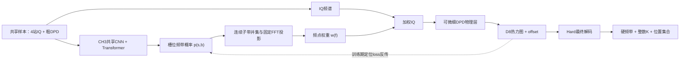

# 统一端到端模型研究

> 建立日期：2026-08-31  
> 文档状态：`E2E-G0-R1` 已按分段混合精度合同通过全部门禁，G1 已解锁至“准确训练方案待审批”。  
> 阶段边界：本文暂不宣布原研究主线进入“第三阶段”。在用户明确确认阶段切换前，使用工作树内临时编号 `E2E-G0...E2E-G3`；若后续确认第三阶段，再统一映射为 `S3-G*`。  
> 证据边界：本文基于原项目冻结证据、文献研究、`E2E-G0-20260831`、`E2E-G0D-20260901`和`E2E-G0-R1-20260901` validation工程审计；均未训练、未读取test，不产生性能优越性结论。  
> 路径边界：原项目 `F:\SourceCount_DPD\outputs` 只读；本文对应的全部新数据、缓存、权重和结果只能写入 `F:\SourceCount_DPD_E2E\outputs_e2e`。

## 1. 结论先行

本研究线的目标不是把第三章和第四章的两个推理脚本放进同一个入口，而是建立一个**可由最终定位目标反向约束频带与源数判断的统一模型**。最低成立条件是：定位损失能够沿“细 DPD—频率权重—CH3 频带头”形成有限、非零且可复核的梯度；最终推理不再需要真实频带或真实源数。

现有系统已经提供了较强的模块化基线：CH3 负责 19 子带上的槽位频带检测与计数，CH4-D8 负责细 DPD 热力图和 offset 定位，R5-A 又通过冻结模型的候选 K 与空间证据降低了计数路径损失。但该系统仍有硬阈值、硬频带掩码、Top-K 和候选 K 后处理，两个模型也未被最终定位损失联合优化，因此不能改名为端到端模型。

首要研究路线采用“Soft内部训练＋Soft内部推理＋Hard最终解码”。G0 已证明连续桥的二值边界、边界稳定性、Hard 最终解码、完整分辨率资源和非零反向梯度均可实现，但其 FP32 整链有限差分与 autograd 方向相反。G0D 进一步证明 checkpoint 和最大特征值 DPD 反传都不是阻塞源；异常来自用 FP32 对“高量级原始 DPD＋D8＋任务 loss”整链做微小有限差分时，标量变化落入量化分辨率并混入 ReLU 分段边界。G0-R1已按下列合同重验并判定`G0_PASS`：

1. 物理桥、DPD 与归一化应使用 FP64 计算，再把归一化结果转为 FP32 送入常规 D8；训练用 D8 与 loss 不需要整体改成 FP64。
2. 梯度门应分层验证：物理链使用 FP64 有限差分，完整网络以 full-double 诊断抽查，不再用整条 FP32 网络的微小 loss 差作为否决证据。
3. G0-R1 已按上述合同通过；G1 的 `Soft-SG(detach)` 与 `Soft-E2E` 成对训练现可进入准确方案审批，但尚未获准训练。
4. G2 再进行多 seed、嵌套规模、长尾与必要消融；空间计数头仍不进入基础模型。
5. G3 在所有选择冻结后一次性读取 test；当前仍未读取 test。

当前路线优先级已经确认：

1. **首要路线（G0-R1通过，G1方案待审批）**：连续频带桥连接 CH3、在线细 DPD 和 CH4；分段混合精度图的数值、梯度、资源和冻结前向门已通过。
2. **次要路线（保留备选）**：`19×81×81` 粗 DPD 与单张 `401×401` 固定全频细 DPD 双编码器，利用逐源中期融合连接频带和位置；G0D 后不再把它写成已自动触发的切换对象。
3. **暂时搁置的理想路线**：`19×401×401` 频率分辨细 DPD，以完整频率—空间分辨率换取最直接的联合建模，但当前资源代价过高。

首要路线第一版不增加 CH4 空间计数头。空间计数头只在定位梯度已经证明有效、但 K 仍是稳定瓶颈时作为后续消融可选项，不进入基础模型、`E2E-G0` 或首轮因果比较。

## 2. 研究目标与非目标

### 2.1 总目标

在保留 DPD 物理先验、CH3 频带语义和 CH4 细网格定位能力的前提下，研究并验证一个从共享输入到变长源位置集合的统一可训练模型，使定位目标能够反向影响频带表示和源存在性判断。

### 2.2 可检验的子目标

- 建立概率频带到 FFT 频点权重的连续映射，并验证其与现有 Hard-19-Actual 二值接口在边界条件下等价。
- 消除训练和推理内部前向图对预测 K 硬分支、硬频带阈值和不可微 Top-K 的依赖；真实 K 只用于构造监督目标，Hard 操作只保留在最终解码层。
- 将 K 从外部控制量改为模型输出的源存在性或集合基数，使 K=0/1/2/3 使用同一输出契约。
- 使统一训练能够继承已验证的 CH3、D8 checkpoint，而不是从随机初始化同时重学全部物理与视觉表征。
- 同时保留 CH3 的频带/源数输出和 CH4 的 Heatmap、offset 与位置输出，不把统一模型缩减为只报告最终位置。
- 用系统级集合指标、章级辅助指标、梯度证据和资源证据共同判断路线，而不是只优化一个平均 RMSE。

### 2.3 非目标

- 不把现有模块化级联、四轨诊断或 R5-A 后处理重新命名为端到端模型。
- 不在可微桥接尚未通过前直接运行大规模联合训练。
- 不因“端到端”标签而删除 DPD 物理层、Hard-19 基线、D8 热力图监督或现有章级评价。
- 不用 test 选择架构、loss 权重、阈值、查询数、训练轮数或数据规模。
- 不预设联合训练一定优于模块化级联；若收益不稳定或代价过高，负结果同样有效。
- 不在本初始化版中批准直接 IQ 网络、正式规模、冻结 test 或投稿结论。
- 不在首要路线基础模型中加入 CH4 空间计数头；该模块只保留为后续条件消融。

## 3. 当前证据基线

### 3.1 原项目可继承证据

| 基线事实 | 对本研究的意义 | 证据入口 |
|---|---|---|
| CH3 使用 19 幅 81×81 粗 DPD，经共享 CNN、Transformer 和频率有序槽位输出频带 | 可继承为粗粒度频带编码器；现有计数由非空槽位硬阈值得到，不可直接参与端到端梯度 | `第一阶段_论文与代码接管审查.md`、`CH3-S2G5-R4-20260828` |
| CH4-D8 使用 401×401 细 DPD、热力图和 offset 定位 | 可继承定位主干和密集监督；训练 loss 本身可微，但当前细 DPD 由离线硬频带生成 | `第一阶段_论文与代码接管审查.md`、`CH4-S2G2-20260822` |
| Hard-19-Actual 在 4k/8k oracle 适配中逼近 Exact，Soft-19 没有稳定额外收益 | Hard-19 是必须保留的物理与性能对照；“连续权重可微”不能被直接解释为“Soft 一定更好” | `SYS-S2G4-R2/R3/R4` |
| 四轨诊断显示完整级联退化主要来自 K 路径，而非频带路径 | 统一输出必须把基数误差作为主问题，而不能只微调频带概率 | `SYS-S2G5-R3-20260828` |
| 16k CH3 提高频带 F1，但没有自然消除 K 路径损失 | 单纯扩大 CH3 数据不是统一模型的替代方案 | `CH3-S2G5-R4-20260828` |
| R5-A 将 K=2/3 计数准确率从 87.30% 提高到 95.51%，但跨 seed 严格门仅 1/3 通过 | D8 空间证据对 K 有互补性，但冻结后处理仍不是联合训练，稳定性仍需解决 | `SYS-S2G5-R5A/R6A` |
| K=1 定位接口尚未实现；低 SNR 和 K=3 距离长尾尚未对齐 | 新模型必须单独验证 K=1 和长尾，不能只在 K=2/3 平均指标上通过 | `SYS-S2G5-R1`、`CH4-S2G5-R6B0-20260830` |

精确路径、指标、SHA256 和资源事实继续以 `实验结果记录.md` 为唯一事实源。本文只保留会影响统一模型设计的综合结论。

### 3.2 可微物理层的动态审计结论

G0 已在不修改历史第四章算子的前提下新增固定支持、可微分块实现，并完成动态审计：

- 固定 4096 频点支持避免了 `w_f>0` 动态裁剪计算图；K=0、近零、单带、重叠带、全一及普通连续输入均保持有限。
- K=0/1/2/3 的 401×401 反向梯度全部有限且非零，计算资源远低于预设停止线，说明图能够连接且工程资源不是当前阻塞点。
- 算子级有限差分通过，但冻结 D8 定位损失的完整系统有限差分与 autograd 方向相反；“能反传”不等于“梯度可信”。
- G0D 后续确认：checkpoint 模式不改变梯度，FP64 物理链 15/15 通过；首次 FP32 不可判定位置进入 D8 Heatmap logits，full-double 完整 D8/loss 链 7/7 通过。
- 当前正式数据将细 DPD 预计算后保存，定位 loss 无法穿过离线文件回到 CH3。

因此 G0 的历史判定仍是 `STOP_GRADIENT`，G0D 将路线级解释修正为 `IMPLEMENTATION_FIX`，随后G0-R1已完成修复重验并通过。该结果只解锁G1方案审批，不等于已经证明端到端训练有效。

## 4. “统一端到端模型”的定义

### 4.1 本项目采用的最低定义

若模型参数记为 $\theta_3$（CH3 频带编码器）和 $\theta_4$（CH4 定位网络），最终集合定位损失记为 $L_{set}$，则最低成立条件为：

$$
\left\|\frac{\partial L_{set}}{\partial \theta_3}\right\| > 0,
\qquad
\frac{\partial L_{set}}{\partial \theta_3}\ \text{有限且可由有限差分方向复核。}
$$

这里不要求固定的 DPD 几何算子具有可学习参数，但要求定位损失能穿过频率权重与细 DPD 物理层，到达决定频带/源存在性的参数。

### 4.2 分级定义

| 级别 | 定义 | 本项目判定 |
|---|---|---|
| `E2E-L0` | 两个模型在同一脚本顺序运行，接口含硬阈值/真实 K，分别训练 | 仅为级联，不是端到端 |
| `E2E-L1` | 定位 loss 穿过连续频带桥，能够更新 CH3 接口参数 | 本研究最低目标 |
| `E2E-L2` | 单一训练图同时输出 CH3 频带/源数和 CH4 Heatmap/offset/位置，训练不依赖预测 K 硬分流 | 期望目标 |
| `E2E-L3` | 从原始同步 IQ 进入全部物理与神经模块，只输出最终源集合 | 远期目标；不是初始化阶段的强制条件 |

### 4.3 不满足定义的情形

- 用 CH3 硬阈值生成掩码，再离线预计算细 DPD 训练 D8。
- 用真实 K 决定 D8 Top-K，只在报告中替换成 predicted K。
- 冻结两个模型，仅训练候选 K 后处理器或校准器。
- 多个 loss 写在同一优化器里，但定位 loss 对 CH3 梯度为零或被 `detach/no_grad/numpy` 截断。

## 5. 当前必须解决的问题

### 5.1 硬频带选择与细 DPD 之间不可微

CH3 目前通过 0.5 阈值把概率变成 19 子带二值掩码，随后再映射到 FFT 频点。阈值、布尔支持集合和离线细 DPD 都阻断定位梯度。首要任务是定义连续而具有物理意义的频点权重，不是直接引入复杂离散松弛。

### 5.2 源数 K 同时控制计算和评价

现有 K 由非空槽位数推断，又控制 D8 的 Top-K 解码。错误 K 会同时造成漏检/多检和位置集合大小错误。R3/R4 已证明这是当前主要级联瓶颈，因此训练和推理的内部图都不依据预测 K 跳过细 DPD 或 D8；整数 K 只在最终解码时决定位置集合大小。

### 5.3 多源输出是变长且无序的集合

固定槽位需要人为规定顺序；Hungarian/PIT 则允许无序匹配。师弟论文按频偏排序槽位，DPV 按到原点距离排序位置，而 DETR、Deep Sets 和 Multi-ACCDOA 提供集合或置换不变路线[4-9]。本项目中频率相近、同频混叠和对称位置会使固定排序出现边界不连续，必须通过对照实验决定，而不能直接照搬某一种顺序。

### 5.4 Soft-19 的历史负证据不能被忽略

S2-G4-R2/R3 已显示，既有 Soft-19 覆盖权重没有稳定优于同定义 Hard-19。新软桥的目的首先是传递梯度，不是声称软表示更准确；二值边界等价是 G0 硬门，冻结 D8 上的 Soft 前向差距必须登记。只要没有非有限或表示塌缩，是否能恢复该差距由 G1 的 `Soft-SG` 直接检验；若在同预算适配后仍不能恢复，首要路线停止。

### 5.5 多任务 loss 可能尺度失衡或梯度冲突

频带 Focal BCE、存在性/基数、热力图 Focal、offset 和集合位置误差具有不同尺度。文献表明多任务结果对权重敏感，GradNorm 等方法可从梯度尺度调整权重[12-13]；但本项目应先记录各任务的梯度范数与夹角，再决定是否引入自适应方法，不做盲目权重搜索。

### 5.6 401×401 细 DPD 的训练成本可能不可承受

每个样本需要对 160,801 个网格点进行多频点互谱积累和 4×4 Hermitian 特征值计算。现有实现以离线预计算和 CPU eigvalsh 控制资源，但真正端到端会把中间量纳入反向图。资源可行性必须先于正式架构选择。

### 5.7 K=0 与近零频带权重需要独立契约

如果频带权重接近零后再做单位功率归一化，纯噪声可能被重新放大。K=0 样本仍走完整 Soft 内部链：训练时保留全零 Heatmap 监督、offset loss 为零；推理时先得到 D8 dense 输出，再由最终整数 K 解码为空位置集合。任何 K=0 提前跳过只能作为后续部署加速，并须证明与完整 Soft 前向的最终输出等价。

### 5.8 数据与论文条件的长尾仍未闭合

R6-B0 的低 SNR 与 K=3 距离长尾尚未对齐。联合训练可能改善平均指标，也可能加剧尾部错误；因此长尾必须成为预注册分层，而不是在平均 GOSPA 改善后再补充观察。

## 6. 研究问题与可检验假设

### 6.1 研究问题

| 编号 | 研究问题 |
|---|---|
| `RQ1` | 连续 19 子带—FFT 权重—细 DPD 物理桥能否在保持 Hard-19 语义的同时，向 CH3 提供稳定定位梯度？ |
| `RQ2` | 定位监督能否在相同数据和计算预算下，降低当前由 K/频带接口造成的系统 GOSPA，而不牺牲 CH3 与 D8 的章级能力？ |
| `RQ3` | 固定频率有序槽位、活动—位置耦合槽位和 Hungarian 查询集合，哪一种最适合 K=0/1/2/3 与同/近频多源？ |
| `RQ4` | 联合模型的收益能否跨训练 seed，并在低 SNR、K=3 长尾、不同距离和带宽条件下保持？ |
| `RQ5` | 端到端收益是否足以抵偿细 DPD 在线反传带来的训练时间、显存和工程复杂度？ |

### 6.2 初始假设

- `H1`：在固定物理频带定义下，连续频点权重可构造为 Hard-19 的连续扩展；二值输入时与现有接口数值等价，连续输入时定位 loss 对 CH3 频带 logits 具有有限非零梯度。
- `H2`：若冻结模块级能力并只开放接口参数，定位监督应优先改善 K/频带边界样本，而不是通过破坏 CH3 检测能力换取平均定位指标。
- `H3`：对同频或近频多源，置换不变集合匹配会比单一排序规则更稳健；但在频率分离清楚时，频率有序槽位可能以更低成本达到相当结果。
- `H4`：联合收益若只在单 seed 或中等 SNR 出现，则不能作为统一模型成立证据。
- `H5`：若完整 401×401 可微 DPD 的资源成本不可承受，低分辨率可微桥或教师蒸馏只能作为训练近似；最终 401×401 冻结评价仍须保留，且近似路线必须单独证明不改变方法结论。

## 7. 文献与方法证据地图

### 7.1 与本项目最接近的证据

| 文献路线 | 可借鉴内容 | 不能直接外推的部分 |
|---|---|---|
| 经典 DPD[1] | 从多站观测直接构造位置代价/空间谱，支持保留固定物理层 | 不解决神经网络可微接口、未知 K 或变长输出 |
| 模块化神经 DPD[2] | 明确指出多源排列与未知源数会使单阶段固定输出难以训练，并用检测—过滤—定位分解 | 区域划分、多 MLP/RBF 与本项目 DPD 图像网络不同；不能作为端到端优越证据 |
| 未知源数 DPD[3] | 从空间谱同时估计源数与位置，证明 K 不必永远作为先验输入 | 属于解析/谱峰路线，不提供 CH3—D8 联合训练方法 |
| DPV 变长端到端被动定位[4] | Zero Padding、存在置信度、Sort Invariant Training；本地全文的 III-C/III-F/V-G 给出排序、联合位置+BCE loss 和消融 | LEO TDOA/FDOA、时频图输入、公里级场景与本项目不同；按原点距离排序在对称位置下可能不稳定 |
| DETR 与 Deep Sets[5-6] | 固定查询 + no-object、二分图匹配、置换不变集合函数，为 K=0/1/2/3 统一输出提供通用框架 | 视觉检测结果不等同于 DPD 定位收益；需要本项目自己的位置/band 匹配代价 |
| CenterNet[7] | 中心点热力图与属性回归支持保留 D8 的密集定位支路 | 推理 Top-K 仍不可作为训练期 K 门控 |
| ACCDOA / Multi-ACCDOA[8-9] | 将活动与位置耦合；ADPIT 处理同类重叠，为“存在性+位置”联合目标提供跨领域近邻 | 声学 DOA 类别轨道与无线频带槽位不同，只能作为结构类比 |
| Gumbel-Softmax / NeuralSort[10-11] | 为离散选择和排序提供连续松弛 | 会引入温度、偏差和训练/推理差异；不应先于简单连续频带桥使用 |
| 不确定性加权 / GradNorm[12-13] | 为多任务 loss 尺度与学习速度失衡提供可检验工具 | 不能替代任务归一化、梯度诊断和公平对照 |
| GOSPA[14] | 同时分解定位、漏检和虚警，适合变长源集合的系统主指标 | 需要同时报告分量与章级指标，不能只报总分 |

### 7.2 文献间的条件差异

- DPV 的 SIT 与 DETR 的 Hungarian 匹配不是简单的相互否定：SIT 用稳定几何顺序降低匹配成本，Hungarian 则不要求全局固定顺序。本项目需要用频率接近度和位置对称性分层比较二者。
- ACCDOA 通过单一活动向量减少检测/定位双 loss 的平衡问题，但本项目还需要保留 19 子带的可解释频带监督，因此不宜在首轮就删除独立 band loss。
- Gumbel-Softmax 和 NeuralSort 证明离散运算可以松弛，但现有 Soft-19 的负证据提醒：可微性与定位信息保真是两个独立 Gate。

## 8. 候选统一架构

### 8.1 首要路线：Soft内部训练＋Soft内部推理＋Hard最终解码

**当前状态：`E2E-G0-R1=G0_PASS`，G1准确方案待审批。** 下述结构是已通过工程与梯度预检的首要路线定义；平滑特征值或替代DPD目标没有证据必要性，若未来提出仍属于新算法方案。

设 CH3 输出第 $s$ 个槽位、第 $b$ 个子带的 logit 为 $z_{s,b}$：

$$
p_{s,b}=\sigma(z_{s,b}),\qquad
u_b=1-\prod_s(1-p_{s,b}).
$$

$u_b$ 表示任一源占用子带 $b$ 的连续并集概率。再用固定的子带—FFT 覆盖矩阵 $A_{f,b}\in[0,1]$ 映射到频点：

$$
w_f=1-\prod_b(1-A_{f,b}u_b),\qquad
X_m'(f)=\sqrt{w_f}\,X_m(f).
$$

其中 $A$ 只编码已经冻结的 Hard-19-Actual 几何关系，不学习新的物理带宽。二值 $p$ 时必须退化到现有子带并集；连续 $p$ 时保留梯度。细 DPD 继续由多站互谱、几何相位补偿和最大特征值形成，D8 继续输出热力图与 offset。

训练与推理共用的内部图如下：



训练阶段不依据预测 K 跳过 CH4，也不使用预测 K 控制 D8 dense 前向。D8 仍只接收由连续频率权重生成的细 DPD；真实 K 只用于构造 Heatmap/offset 监督。总损失初始写为：

$$
L_{total}=L_{band}+\lambda_eL_{exist}+\lambda_hL_{heatmap}+\lambda_oL_{offset}.
$$

各项先按有效监督元素归一化，再通过梯度尺度诊断决定是否需要调整权重；不能仅因总 loss 下降就判定联合训练收敛。

推理阶段复用完全相同的 Soft 内部图，不把阈值后的频带或整数 K 反馈给频带桥：

```text
粗DPD → CH3 logits/probabilities → 连续频带并集与频点权重
                                      ↓
原始IQ ───────────────────────→ 加权IQ → 连续细DPD → D8 Heatmap/offset
                                                           ↓
最终解码：band threshold + argmax P(K) + NMS/Top-K + offset
                                                           ↓
                  硬频带、整数K、确定长度的位置集合
```

因此，CH3 对外报告的硬频带和整数 K 与内部使用的连续概率明确分离：前者是最终结果，后者是 DPD 条件。K=0 也先运行 Soft 内部链，再由最终解码器返回空位置集合；提前跳过只是后续可验证的部署优化，不属于基础模型。

该路线的优势是最大限度继承两章模型、消除训练/推理内部图不一致，并让定位信息始终作用于频带概率；主要风险转为细 DPD 反向图成本、近零权重归一化、连续频带过宽造成的 D8 输入分布偏移，以及定位监督对 K 的反馈弱于对频带的反馈。历史 Hard/Hard 级联继续作为强基线与消融，不再作为目标部署图。

### 8.2 源存在性与基数的连续定义

对每个槽位可定义连续存在概率：

$$
q_s=1-\prod_b(1-p_{s,b}).
$$

首要路线使用 **Poisson-binomial 基数**：由 $q_s$ 的 Bernoulli 和递推得到 $P(K=k)$，直接对真实 K 做交叉熵，无需 0.5 阈值，并保持“计数来自非空槽位”的原始语义。

第一版不增加 CH4 空间计数头，也不把 D8 Heatmap 峰数转成训练期硬伪标签。因此定位 loss 对频带选择的反馈是首要因果问题，K 的改善主要依赖 $L_{exist}$ 与共享的 CH3 槽位表示。只有首要路线通过且 K 仍是独立瓶颈时，才允许在后续消融中增加 D8 特征空间计数头与 CH3—CH4 基数一致性 loss；该消融不得与基础模型同时上线后共同归因。

### 8.3 次要路线：双编码器与逐源中期融合

输入为 `19×81×81` 粗 DPD 与一张不依赖真值/预测频带的 `401×401` 固定全频细 DPD。CH3 分支输出频带与存在性，并由频带概率加权粗 DPD 形成逐源粗空间先验；D8 分支提取单张细 DPD 的高分辨率特征，再以粗先验和源槽位特征进行中期融合，输出逐源 Heatmap/offset。

该路线不要求定位梯度穿过 IQ、滤波和特征值分解，资源与自动微分风险较低，但单张全频细 DPD 已聚合频率维，频带—位置对应只能通过粗空间先验间接建立。G0D 已撤销“物理梯度阻塞”这一启用依据，因此当前仅保留备选；出现下列条件时仍需提交结构、对照和资源方案审批：

- 修复后的首要路线在 `E2E-G0` 仍因资源或可信梯度问题停止；
- 首要路线通过工程门但 `E2E-G2` 没有可归因收益，需要验证显式特征融合是否更合适。

### 8.4 暂时搁置的理想路线：频率分辨细 DPD

输入为 `19×401×401` 频率分辨细 DPD，每个固定子带都保留细空间谱。它能够在高分辨率特征上直接进行逐源频带加权和定位，理论连接最清楚，但输入元素约为“粗 DPD + 单张细 DPD”的 10.7 倍，DPD 生成、存储与训练激活成本均显著增加。

本路线当前不分配 Gate、不生成数据、不实现代码。只有首要和次要路线均因可定位的信息损失而失败，且资源预估表明可执行时，才另行提出解冻方案。

### 8.5 条件升级：查询集合解码

若软桥通过但 K/Top-K 仍是主要瓶颈，则在共享粗/细 DPD 特征上增加 $Q=3$ 个源查询。每个查询输出：

- 存在概率 $e_j$；
- 二维位置 $(x_j,y_j)$；
- 可选的 19 子带属性 $b_j$。

训练时用 Hungarian 匹配最小化“存在性 + 归一化位置 + 频带属性”代价；未匹配查询监督为 no-object。推理时由存在概率直接得到集合，不提前向 D8 传入 K。D8 热力图与 offset 在过渡期保留为辅助支路，只有消融证明查询解码足以替代后才允许删除。

### 8.6 必须保留的对照

| 对照 | 用途 |
|---|---|
| 冻结模块化 Hard/Hard 级联 + R5-A | 当前可部署强基线，判断 Soft 内部统一模型是否有新增价值 |
| Hard-19-Actual oracle-band/oracle-K | 隔离物理表示上限，不作为端到端结果 |
| predicted-band/oracle-K | 隔离频带桥影响 |
| oracle-band/predicted-K | 隔离基数影响 |
| 软桥前向但在桥前 `detach` | 与完整反传保持相同前向，隔离定位梯度进入 CH3 的因果作用 |
| 相同架构仅用章级 loss | 区分共享参数量与最终定位监督的作用 |

### 8.7 暂缓路线

- 直接用 Gumbel/straight-through 生成硬频带：仅当连续内部表示本身失败、但 Hard 表示仍有明显上限时再单独审批。
- 直接用 NeuralSort 排序源：仅当固定频率顺序有价值、普通排序边界导致训练不稳时再启用。
- DPV 式原始 IQ 直出位置：改变输入表征和两章创新边界过大，且需要新的大规模数据与公平基线，暂不作为首轮方案。
- 完全删除细 DPD：只有在统一模型已通过且消融证明物理层不再提供独立价值时才可讨论。
- CH4 空间计数头：不进入首要路线基础模型或 G0/G1；仅当基础模型通过但 K 仍稳定限制系统性能时，作为 `E2E-G2` 条件消融。

## 9. 数据、输出与训练契约

### 9.1 输入契约

- 样本身份以统一 IQ manifest 为主键；粗 DPD、标签和已有参考产物必须能回指同一 sample ID。
- 首要路线输入预计算 `19×81×81` 粗 DPD 与原始同步 IQ。粗 DPD 是固定确定性特征，不要求对其反传；IQ 只用于连续频带加权和在线细 DPD。
- 次要路线所需单张固定全频细 DPD 不属于首要路线输入，不在首要路线数据构造中顺带生成。
- 训练、validation、test 维持严格分离；test 在 `E2E-G3` 前不构建下游可读评价结果。
- 原 `outputs` 中的权重和数据只能经 `统一模型代码/reference_artifacts.py` 注册后只读加载。

### 9.2 输出契约

统一输出必须同时保留两章结果：

- `band_logits`、`band_probabilities` 与 `band_mask_hard`：CH3 槽位×19 子带的内部连续量和最终硬频带结果；
- `existence`、`cardinality_distribution` 与最终整数 `predicted_K`：CH3 源数结果；
- `frequency_weights`：实际送入细 DPD 的连续频点权重，必须与硬频带结果分开保存；
- `dense_heatmap/offset`：CH4 原生网络输出；
- `position_set`：由最终 `predicted_K` 对 dense 输出执行 NMS/Top-K 和 offset 后得到的二维位置集合及置信度；
- `bridge_diagnostics`: 频点权重范围、有效带宽、梯度范数和非有限计数。

K=0 样本的真实位置集合为空；训练期 Heatmap 使用全零目标，offset loss 为零，存在性 loss 保留。训练和基础推理都必须执行 Soft 内部链，最终解码才输出空集合。若近零频带权重无法生成物理上稳定的细 DPD，`E2E-G0` 必须规定连续背景输入或拒绝策略，不能伪造零坐标源，也不能依据预测 K 静默跳过样本。

### 9.3 训练顺序

1. 加载冻结 CH3/D8，复核 checkpoint 身份、输入归一化和独立指标。
2. 不训练模型，完成连续桥的二值等价、自动微分、有限差分、K=0 和资源审计。
3. 冻结 CH3/D8，在同一 G0 中用 Hard/Continuous 前向轨确认连续表示兼容边界，并完成完整 401×401 资源预检。
4. G1 建立成对训练：`Soft-SG` 在桥前 `detach`，`Soft-E2E` 允许同一 `loss_ch4` 更新 CH3；两组的内部训练/推理图、可训练层、初始化、数据顺序和预算必须相同。
5. G1 因果门通过后，G2 才扩大 seed/规模并进行长尾和条件消融；每次只改变一个核心因素。
6. 所有选择冻结后，G3 一次性读取 test。

任一步出现章级能力不可解释退化，先回到最近冻结点，不继续全模型解冻。

### 9.4 计划模块与文件边界

以下为后续代码实施的建议边界，本轮只记录方案，不创建文件：

| 计划路径 | 单一职责 | 禁止混入 |
|---|---|---|
| `统一模型代码/models/unified_cascade.py` | 组织 CH3、连续桥、在线细 DPD 与 D8 前向；显式支持 `detach_bridge` | 数据生成、模型选择和评价统计 |
| `统一模型代码/physics/band_bridge.py` | 槽位概率→子带并集→FFT 权重，提供 Hard 等价模式 | 可学习 DPD 几何与经验阈值调参 |
| `统一模型代码/physics/fine_dpd_autograd.py` | 纯 PyTorch 可微细 DPD 原型与分块策略 | 修改历史 `第四章代码` 的证据语义 |
| `统一模型代码/models/final_decoder.py` | Hard频带、整数K与NMS/Top-K位置集合的最终确定性解码 | 把Hard结果反馈给内部DPD/D8 |
| `统一模型代码/losses/unified_loss.py` | 分项归一化的 `loss_ch3/loss_ch4` 与诊断字段 | 空间计数头和自适应权重的默认启用 |
| `统一模型代码/audits/gradient_audit.py` | autograd、有限差分、梯度范数/夹角与非有限检查 | 训练循环 |
| `统一模型代码/audits/e2e_g0.py` | 编排G0身份、数值、梯度、冻结前向、解码与资源报告 | 模型训练和test评价 |
| `统一模型代码/train_unified.py` | 成对训练、冻结/解冻阶段和可恢复状态 | test 读取与事后更改 Gate 阈值 |
| `统一模型代码/evaluate_unified.py` | CH3、CH4和完整级联的同源评价 | checkpoint 选择逻辑 |
| `统一模型代码/configs/` | 数据、桥、loss、资源与Gate配置 | 原 `outputs` 写路径 |

所有新产物只写 `outputs_e2e`；正式实现优先包装并复用现有底层模型，不批量修改历史 Gate 脚本。

## 10. Gate 总路线

| Gate | 当前状态 | 只回答什么问题 | 允许进入下一步的必要条件 |
|---|---|---|---|
| `E2E-G0` | `STOP_GRADIENT` | Soft 连续桥在完整分辨率下是否数值正确、可反传、前向不退化且资源可行 | 未满足：完整系统梯度方向不一致 |
| `E2E-G0D` | `IMPLEMENTATION_FIX` | 完整系统梯度为何与有限差分异号，属于工程实现、局部非光滑还是物理层阻塞 | 已排除checkpoint与物理层阻塞；实施精度/审计修复并完整重跑G0 |
| `E2E-G0-R1` | `G0_PASS` | 分段混合精度图是否满足完整G0数值、梯度、资源和冻结前向门 | 已满足；解锁G1准确方案审批 |
| `E2E-G1` | 方案待审批 | 定位梯度进入 CH3 后是否产生可归因的早期收益 | 比较 `Soft-E2E` 与 `Soft-SG(detach)`，当前不得训练 |
| `E2E-G2` | 锁定 | 收益能否跨 seed/规模成立，并解释长尾与必要消融 | 至少三个 training seed 方向一致，关键长尾不过界，方法主张有直接消融支持 |
| `E2E-G3` | 锁定 | 冻结候选能否形成独立 test 证据 | 所有选择冻结后一次性 test，输出、统计和资源证据完整 |

主验证路线仍为G0—G3；G0D是由G0失败触发、插入G0与G1之间的一次性根因诊断Gate，不是新增训练阶段。每个Gate仍须单独审批；失败不自动更换架构、扩大数据或增加空间计数头。

## 11. E2E-G0：连续桥可行性与冻结前向预检

### 11.1 计划状态与唯一问题

执行状态为 `STOP_GRADIENT / E2E-G0-20260831`。G0 未训练模型、未读取 test，回答是：能够构造二值边界一致、边界稳定、资源可承受并可产生非零梯度的连续内部图，但尚不能证明冻结 D8 定位 loss 对 CH3 band logits 的梯度方向可信。

G0 未通过，G1 不解锁；本结果不构成“端到端有效”或“Soft 优于 Hard”的性能结论。

### 11.2 固定输入、模型与样本

| 项目 | G0 固定方案 |
|---|---|
| 参考模型 | 只读核对 `reference_artifacts.py` 中 `ch3_seed42` 与 `d8_seed42` 的路径、大小和 SHA256；仅作工程探针，不在 G0 选模型 |
| 数据分区 | 只用冻结 validation；不生成或读取 test 下游评价结果 |
| 样本清单 | 按元数据预先选 16 条，K=0/1/2/3 各 4 条；非零 K 覆盖窄/宽带、低/中/高 SNR、频带边界/重叠和不同源间距 |
| 反向子集 | 从上述清单固定 K=0/1/2/3 各 1 条；资源主样本取预计支持最宽、图最大的 K=3 样本 |
| 算子边界例 | 额外构造全零、近零、单子带、相邻重叠子带、全一和普通连续概率，不携带性能标签 |
| 当前设备基线 | RTX 4070 Ti SUPER 16 GiB、系统 RAM 31.84 GiB、PyTorch 2.8.0+cu129；执行时重新记录可用资源 |

样本 ID 只能依据元数据选择，并在运行任何模型结果前写入 manifest。若某分层在 validation 不存在，只报告缺口，不从 test 补样本。

### 11.3 G0 允许实施的代码边界

G0 获批后只允许新增或最小包装以下职责：

- `physics/band_bridge.py`：计算 $p_{s,b}$、连续并集 $u_b$ 和固定映射 $w_f$；二值测试输入必须退化为 Hard-19-Actual 并集。
- `physics/fine_dpd_autograd.py`：复现现有 FFT、互谱、几何相位补偿和最大特征值语义，移除会截断反向图的 NumPy/落盘边界；允许固定频率支持和网格分块，不允许按可学习的 `w_f>0` 动态裁剪计算图。
- `models/final_decoder.py`：只在网络末端执行 band threshold、$\arg\max P(K)$、NMS/Top-K 和 offset；不得把硬结果反馈给细 DPD 或 D8。
- `audits/gradient_audit.py` 与 `audits/e2e_g0.py`：编排身份、等价、梯度、稳定性、冻结前向、解码和资源检查；不包含训练循环。

G0 不创建 `unified_loss.py` 或 `train_unified.py` 的正式实现，不改历史 `第三章代码`、`第四章代码` 和原 `outputs`。必要复用通过包装完成。

### 11.4 Soft 内部与 Hard 最终解码契约

基础内部图固定为：

$$
p=\sigma(z),\quad
u_b=1-\prod_s(1-p_{s,b}),\quad
w_f=1-\prod_b(1-A_{f,b}u_b),\quad
X_m'(f)=\sqrt{w_f}X_m(f).
$$

- 第一版不把 $q_s$、整数 K 或硬 band mask 乘入 $w_f$，避免错误 K 重新切断定位梯度。
- 频率支持域只由冻结矩阵 $A$ 决定；支持域内的连续权重全部保留，不使用经验阈值剪枝。
- 沿用当前 DPD 的站间功率归一化与 D8 sample z-score 语义，但所有除法显式加 $\varepsilon$。精确全零权重采用显式 null 契约：跳过单位功率归一化，只保留固定对角加载形成的常数背景，经 D8 z-score 后必须为全零有限输入；近零权重仍走连续算子并单独审计。
- Hard 最终解码固定保存 `band_mask_hard`、`predicted_K` 和 `position_set`。若硬 band mask 的非空槽位数与 $\arg\max P(K)$ 不一致，只记录 `hard_count_mismatch`，G0 不做隐藏修复；位置集合长度必须严格等于 `predicted_K`，K=0 时为空。
- 同时保存 Soft 内部量和 Hard 最终量，防止把“对外硬输出”误写成“内部硬推理”。

### 11.5 七项执行检查

1. **身份与只读门**：解析双根路径，核对两份冻结 checkpoint、validation 数据和 manifest 身份；确认输出根为空或不存在，执行配置和代码中不存在写入原 `outputs` 的目标路径。
2. **参考噪声与二值等价**：先在相同 dtype/device 上重复旧算子，登记数值噪声；再比较旧 `freq_mask`、旧 binary `freq_weights` 与新桥二值模式的频点权重、原始细 DPD、D8 标准化输入和 dense 输出。
3. **连续边界稳定性**：运行全零、近零、单带、重叠带、全一及普通连续概率；检查 $u,w$ 范围、有效支持、DPD 动态范围以及所有中间量/输出/梯度的 NaN/Inf。
4. **双层梯度审计**：先用固定加权 DPD 标量做算子级 autograd；再用冻结 D8 的 `L_heatmap+L_offset` 做系统级 backward，确认梯度到达 CH3 band logits。两层都用预先固定方向做中心有限差分；普通光滑点要求符号一致且相对误差达标，近重特征值点单独标记为非光滑诊断。
5. **冻结前向兼容诊断**：16 条样本均运行 `Hard-reference` 与 `Soft-predicted`；报告相关性、GOSPA/RMSE、Heatmap/offset 和 K 分层，但除非出现非有限、常数塌缩或解码不完整，性能差距只作为 G1 初始化风险，不单独否决路线。历史 Soft-19 负结果不能由此改写。
6. **Hard 最终解码审计**：覆盖 K=0/1/2/3、并列峰和边界峰，复核确定性 tie-break、坐标/网格/offset、`len(position_set)=predicted_K` 及全部输出字段。
7. **完整资源与重复门**：在 `401×401`、batch 1、真实频率支持、冻结 D8 loss 下完成至少两次完整 forward+backward；缩小网格只允许定位瓶颈，不计入通过证据。

### 11.6 预注册容差与资源停止线

| 检查 | 通过/停止线 |
|---|---|
| 二值等价 | DPD 保持 `atol=max(1e-6, 5×旧算子重复绝对差)`、`rtol=max(1e-5, 5×旧算子重复相对差)`；因固定支持与旧动态支持存在浮点求和顺序差异，经用户批准，下游判据为 Hard 峰值索引完全一致且坐标差 `≤0.01 m`，dense logits 差异仅诊断 |
| 梯度 | 普通光滑点 autograd 与中心差分同号，方向导数相对误差 `≤5%`；四个 K 代表样本梯度均有限，K=1、2、3 三个有源样本均非零 |
| K=0 | 全零和近零案例无 NaN/Inf；全零权重经固定背景和z-score后为零；最终位置集合严格为空 |
| 确定性 | 固定输入/seed 的硬输出逐字段一致；连续张量和梯度差异不超过上方数值容差 |
| GPU | 峰值 allocated/reserved 均 `≤14.0 GiB`；超过即 `STOP_RESOURCE`，不靠 OOM 作为监控方式 |
| RAM | 进程峰值 working set `≤28.0 GiB`；超过即 `STOP_RESOURCE`，避免 Windows pagefile 掩盖不可行性 |
| 墙钟 | 单条完整 forward+backward 在预热后 `≤300 s`；两次均须完成。该线是工程淘汰线，G1 前仍需按实测吞吐估算 pilot 总预算 |

若有限差分步长扫描显示仅近重特征值点不稳定，而普通点通过，则结果记为 `PASS_WITH_EIGEN_RISK`，G1 必须继续监控；若普通点也不一致，则为 `STOP_GRADIENT`。任何改变最大特征值定义的平滑代理都属于算法变化，需另行审批，不能在 G0 自动替换。

### 11.7 输出目录与报告

所有结果写入不覆盖目录 `outputs_e2e/smoke/unified/e2e_g0/<timestamp>/`：

- `manifest.json`：代码状态、环境、冻结产物、样本 ID、随机方向和容差；
- `operator_equivalence.json`：Hard 二值边界和各层差异；
- `gradient_audit.json`：autograd、有限差分、梯度范数与非光滑标记；
- `stability_cases.json`：K=0 和算子边界例；
- `frozen_forward.json`：Hard-reference/Soft-predicted 诊断；
- `decoder_audit.json`：Soft/Hard 输出字段与解码不变量；
- `resource_report.json`：RAM、VRAM、墙钟和 DPD/D8 分项；
- `final_report.json`：唯一 Gate 状态、失败原因和是否解锁 G1。

G0 不产生训练 checkpoint。首次失败目录完整保留；只有低风险工程错误可在全新目录最小修复后重跑，算法、数据、模型、loss 或门限变化必须重新审批。

### 11.8 G0 总判定

- 七项全部满足：`G0_PASS`，允许提交 G1 的准确配置审批。
- 二值等价或普通点梯度失败：`STOP_NUMERIC` / `STOP_GRADIENT`，首要路线停止。
- 完整资源越线：`STOP_RESOURCE`，首要路线停止；是否转向“双编码器＋逐源中期融合”另行审批。
- K=0 只能靠硬跳过才能稳定：`REVISE_K0_CONTRACT`，不得用最终 K=0 空集合掩盖内部图失败。
- 冻结 Soft 前向性能下降但数值、梯度和资源均通过：仍可进入 G1，但须把该差距登记为 D8 适配风险；G1 的 `Soft-SG` 将直接检验它是否可学习恢复。

### 11.9 执行结果与结论

正式证据目录为 `outputs_e2e/smoke/unified/e2e_g0/20260831_235442`，精确身份、数值和资源见 `实验结果记录.md` 中 `E2E-G0-20260831`。结果分解如下：

- 二值等价、连续边界、算子级有限差分、Hard 最终解码、完整资源和确定性检查通过。
- K=0/1/2/3 的完整 401×401 定位 loss 梯度均有限，190/190 个 band-logit 元素非零；这证明反向链连接，但不证明方向正确。
- K=2 普通完整系统点的两个中心有限差分步长均与 autograd 异号，相对误差远高于 5%，触发 `STOP_GRADIENT`。
- 执行按预注册顺序停止，因此 16 样本冻结前向诊断未运行；不得把缺失报告解释为通过或性能失败。
- 按当时预注册规则，G1 不解锁；G0D 已将该异常解释为可修复的数值审计问题，后续状态见第12章。

## 12. E2E-G0D：完整系统梯度根因诊断

### 12.1 状态与唯一问题

状态为`COMPLETED / IMPLEMENTATION_FIX / E2E-G0D-20260901`。G0D只回答：原G0中K=2完整`CH3 logits→Soft bridge→401×401 DPD→z-score→冻结D8→定位loss`的autograd与有限差分为何异号，当前首要路线能否在不改变算法定义的条件下获得可信梯度？

G0D不训练、不读取test、不调loss权重、不替换最大特征值，也不以诊断结果自动修改算法。所有输入、权重、失败样本、方向seed和基础阈值继承`E2E-G0-20260831`。

### 12.2 三步最短诊断链

1. **D0故障复现与工程排除**：在K=2 local index `227`上复现原异号；比较`checkpoint=off/reentrant/nonreentrant`的前向、梯度和有限差分，排除反向重计算差异。
2. **D1逐层目标阶梯**：依次检查频点权重线性投影、原始DPD线性投影、z-score后线性投影、D8 Heatmap线性投影、D8 offset线性投影、Focal、offset及二者总和。每次只增加一个复合层，定位首次方向不一致的位置。
3. **D2必要确认**：只围绕首个故障层运行五个固定方向和K=1/2/3代表样本；仅当原始DPD层失败时记录最大/次大特征值相对间隔及loss梯度对近重根的暴露度。

### 12.3 导数与判据

每个标量目标同时计算autograd方向导数、中心差分和左右单边差分：

$$
D_c(h)=\frac{L(z+hd)-L(z-hd)}{2h},\quad
D_+(h)=\frac{L(z+hd)-L(z)}h,\quad
D_-(h)=\frac{L(z)-L(z-hd)}h.
$$

固定步长为`3e-2/1e-2/3e-3/1e-3`；只有loss变化明显高于FP32分辨率的步长计入判定。普通光滑点至少两个有效步长与autograd同号且相对误差`≤5%`。若左右导数稳定分离、autograd与一侧一致，则记为`NONSMOOTH_LOCAL_POINT`，不得误判为稳定错误梯度。

checkpoint模式的前向差须满足既有数值容差；梯度余弦相似度要求`≥0.9999`，相对L2差`≤1e-3`。多方向确认至少4/5方向具有有效证据，两个及以上方向跨步长稳定异号即不得判定通过。

### 12.4 判定分支

| 状态 | 证据含义 | 后续 |
|---|---|---|
| `IMPLEMENTATION_FIX` | checkpoint、设备、dtype或审计实现使前向/反向证据不一致或不可判定 | 提交最小修复并完整重跑G0；不直接进入G1 |
| `FEASIBLE_WITH_LOCAL_REDESIGN` | 原始DPD梯度可信，首次失败在z-score、D8或任务loss | 针对首个故障层另提局部改造方案并重跑G0 |
| `PASS_WITH_NONSMOOTH_RISK` | 失败来自局部拐点，autograd与有效单边导数一致，多方向无稳定反向 | 新G0增加稳定性监控后再决定G1 |
| `PHYSICS_GRADIENT_BLOCKED` | 原始401×401 DPD在排除工程因素后仍跨方向/样本稳定异号，并与近重根暴露相关 | 当前最大特征值DPD直接反传路线停止，再审批平滑物理层或次要路线 |
| `INCONCLUSIVE_NUMERIC` | FP32分辨率、高曲率和非光滑效应无法区分 | 只允许追加FP64或更精确局部诊断，不训练 |

### 12.5 文件、输出与停止线

允许新增`audits/e2e_g0d.py`、`audits/directional_ladder.py`、`audits/eigen_gap_probe.py`，并为可微DPD增加默认关闭的checkpoint模式和特征值诊断接口；默认G0行为必须不变。结果写入`outputs_e2e/smoke/unified/e2e_g0d/<timestamp>/`，至少保存manifest、故障复现、checkpoint对照、逐层阶梯、多方向/跨样本和final报告。

若D0已定位明确工程问题，停止后续扩展并报告；若D1表明原始DPD通过，则不运行特征值间隔分支；任何需要改变归一化、最大特征值、D8或loss定义的处理均停止并另行审批。

### 12.6 执行结果

结论为`IMPLEMENTATION_FIX`，不是`PHYSICS_GRADIENT_BLOCKED`。首要路线在数学上仍可反传，但G1不因此自动解锁。

| 诊断层次 | 结果 | 含义 |
|---|---|---|
| 原G0复现 | K=2异号可复现 | 诊断确实覆盖原失败，不是换样本后回避问题 |
| checkpoint对照 | off/reentrant/nonreentrant前向与梯度一致 | 排除反向重计算差异 |
| FP32逐层阶梯 | 频率权重层通过；原始DPD起即受数值分辨率限制 | 约`1e7`量级DPD的微小变化在FP32中被量化，不能据此判定物理梯度错误 |
| FP64物理链 | K=1/2/3共15个样本方向组合全部通过 | 最大特征值DPD反传在所测普通点可由有限差分复核；不触发特征值间隔分支 |
| FP64物理链→FP32 D8阶梯 | z-score输出通过，首次不可判定层为D8 Heatmap logits | 剩余异常进入FP32 D8后出现，而非桥、DPD或z-score造成 |
| full-double D8与同公式loss | K=1/2/3共7个方向全部通过 | autograd公式正确；原G0异号来自FP32整链有限差分分辨率和分段激活共同作用 |

四个证据目录依次为`outputs_e2e/smoke/unified/e2e_g0d/20260901_112416`、`20260901_113322`、`20260901_114150`和`20260901_115115`；精确误差与运行事实见`实验结果记录.md`中的`E2E-G0D-20260901`。

下一步只提交最小修复版G0：物理桥、DPD、`log1p`与z-score保持FP64，归一化后转FP32进入D8；梯度审计改为“FP64物理链多方向＋full-double完整链抽查”。该改动不更换最大特征值、不改D8结构、不改loss公式或权重。修复版G0完整通过前，不启动G1训练、不读取test。

### 12.7 E2E-G0-R1：分段混合精度重验方案

状态为`COMPLETED / G0_PASS / E2E-G0-R1-20260901`。本次只验证G0D给出的第一版精度合同，不训练、不读取test，不改变最大特征值、D8结构、loss公式、权重、样本或停止阈值。

精度合同固定为：CH3及其sigmoid概率保持FP32；概率在进入频带—FFT映射后转为FP64；在线FFT、功率归一化、互谱、相位补偿、最大特征值DPD、`log1p`和z-score使用FP64/complex128；归一化细DPD转回FP32后送入冻结D8，Heatmap、offset、Focal、offset loss和总loss均保持FP32。full-double D8只用于梯度抽查，不进入候选生产前向。

重验沿用G0的冻结输入、16样本清单、CH3/D8权重、随机方向和资源停止线，并要求同时满足：

1. 二值等价、连续边界、K=0稳定性和Hard最终解码继续通过；
2. 生产混合精度图的K=0—3梯度全部有限，K=1—3均非零，两次K=3运行确定一致；
3. FP64物理链在K=1/2/3各五个方向中至少12/15为`PASS_SMOOTH`且无稳定不一致；
4. full-double完整D8/loss链在K=2五方向及K=1/K=3各一方向中至少6/7为`PASS_SMOOTH`且无稳定不一致；
5. 单样本资源不越过既有14 GiB allocated、28 GiB reserved/RAM与300 s停止线；
6. 16样本冻结Soft前向全部有限且非零源样本不塌缩。

全部满足才记为`G0_PASS`并允许提交G1准确训练配置审批；任一梯度审计出现稳定不一致仍停止，资源越线则单独判定`STOP_RESOURCE`。本次通过也只证明首要路线的数值、梯度和工程入口可行，不证明端到端训练有收益。

正式有效目录为`outputs_e2e/smoke/unified/e2e_g0r1/20260901_130737`。二值等价、连续边界、算子梯度、Hard解码、完整资源、分层系统梯度和16样本冻结前向七项全部通过；生产混合图K=0—3梯度均有限且190/190非零，FP64物理链15/15通过，full-double完整链7/7通过。冻结前向16/16有限、无非零源塌缩；其中Soft与Hard前向仍存在初始化差距，只登记为G1适配风险，不作性能结论。精确数值见`实验结果记录.md`中的`E2E-G0-R1-20260901`。

首次目录`outputs_e2e/smoke/unified/e2e_g0r1/20260901_125329`在前六项通过后暴露冻结前向把19维硬子带掩码直接传给4096维FFT接口的形状错误。该失败目录保留；最小修复仅通过冻结覆盖矩阵展开支持域，未改变算法或Gate，随后从全新目录完整重跑。

结论：第一版分段混合精度合同可作为G1基础实现；G1现只解锁到“准确配置方案审批”，尚未训练、未读取test，也不能声称Soft-E2E优于现有级联。

## 13. E2E-G1：Soft 因果训练可行性门（摘要）

G1 用一个 seed 和冻结的小规模 train/validation pilot 尽快回答首要路线是否值得继续。固定三条轨：

| 轨道 | 内部训练/推理 | 作用 |
|---|---|---|
| `Hard/Hard-frozen` | 历史硬级联，不训练 | 当前强基线与误差参照 |
| `Soft-SG` | Soft 内部；桥前 `detach` | D8 可适配 Soft 输入，但定位 loss 不进入 CH3 |
| `Soft-E2E` | 与 `Soft-SG` 完全相同，仅取消 `detach` | 隔离定位梯度进入 CH3 的因果贡献 |

`Soft-SG` 与 `Soft-E2E` 使用同一初始化、样本顺序、可训练层、loss 数值、优化器和预算；基础比较只开放 CH3 band heads 与 D8 decoder，不加空间计数头，不全模型解冻。validation 时二者都保持 Soft 内部推理，并使用同一个 Hard 最终解码器。主判定为 `Soft-E2E` 相对 `Soft-SG` 改善 predicted-K 系统 GOSPA/Recall，同时 CH3 band/count 和 D8 oracle 能力不越过运行前登记的退化边界。若定位梯度无收益或只降低章级指标，首要路线在 G1 停止；单 seed 通过只表示“可继续”，不是科学结论。

## 14. E2E-G2：多 seed、长尾与条件消融（摘要）

G2 仅在 G1 通过后执行：

1. 在严格嵌套规模上至少运行三个 training seed，报告逐 seed 方向和配对 bootstrap，不用 sample bootstrap 代替 seed 方差。
2. 同时报告 K=0/1/2/3、低 SNR、K=3 距离长尾、源间距、`BW_actual`、频带边界/重叠、同频/近频和位置边界。
3. 先用按有效元素归一化的固定 loss；只有记录到持续梯度尺度/方向冲突后，才单独比较 uncertainty weighting 或 GradNorm。
4. 必做消融包括去除 localization→CH3 梯度、冻结/开放 D8 decoder、只开放 band heads/继续开放 CH3 后段以及 Hard/Hard 基线。
5. **空间计数头仍不是基础模型**。只有 G1/G2 主路线已证明频带反馈有效而 K 仍稳定受限时，才作为单独获批消融；不得与双编码器、集合查询或自适应 loss 同轮共同引入。

通过要求是系统收益至少三个 seed 方向一致、关键长尾不过界且核心主张有直接消融支持。失败后是否转入“双编码器＋逐源中期融合”另行审批；`19×401×401` 继续搁置。

## 15. E2E-G3：冻结 test 与论文证据（摘要）

首次读取 test 前冻结架构、Soft 内部图、Hard 最终解码、loss/权重、checkpoint 选择、阈值、主次指标、分层、置信区间、失败边界、三个 seed 和 SHA256。test 只运行一次正式评价，不因结果不理想回到 validation 调方案；最终同时报告模块化 Hard/Hard 基线、统一模型、oracle 上限、资源开销和失败场景。

## 16. 指标、模型选择与统计规则

### 16.1 指标层级

| 层级 | 必报指标 |
|---|---|
| 系统主指标 | GOSPA 总分及 localization/missed/false 分量；exact cardinality；集合 Recall/Precision |
| 定位指标 | 匹配 RMSE、median、P90、P95；按 K/SNR/距离分层 |
| CH3 辅助指标 | band macro-F1、Precision、Recall、Exact Match；balanced count accuracy 与混淆矩阵 |
| CH4 辅助指标 | oracle-band/oracle-K 热力图+offset 定位指标；峰值/offset 诊断 |
| 优化指标 | 每任务梯度范数、梯度夹角、bridge 非零梯度率、NaN/Inf、学习速度 |
| 资源指标 | 训练/推理墙钟、峰值 RAM/VRAM、DPD 前向/反向占比、checkpoint 大小 |

### 16.2 模型选择

validation 采用词典序而非事后加权总分：

1. 数据、身份、有限性和输出完整性门；
2. 系统 GOSPA；
3. exact cardinality 与漏检/虚警；
4. P90/P95 长尾；
5. CH3/CH4 不退化门；
6. 资源边界。

所有非劣/改善边界在对应 Gate 运行前，依据冻结基线的 seed 方差、sample bootstrap 和工程容差登记；不使用看到新结果后的整数阈值。

### 16.3 统计边界

- 同一 validation 样本使用配对 bootstrap；跨训练 seed 单独报告，不合并成样本 bootstrap。
- 报告点估计、区间和逐 seed 方向；不只报告“最好 seed”。
- oracle 结果只表示上限或误差隔离，不能替代 predicted 结果。
- K 正确条件下的 RMSE 不能替代完整集合指标。

## 17. 风险、反例与总停止规则

### 17.1 主要风险

| 风险 | 影响 | 首选应对 |
|---|---|---|
| 可微 DPD 资源不可承受 | 无法完整联合训练 | 先量化瓶颈；审批低分辨率桥/教师方案，正式 401×401 评价不变 |
| 软权重分布偏移 | D8 输入失配 | G0登记冻结差距，G1由Soft-SG与Soft-E2E共同适配并做因果比较 |
| Soft权重过于弥散 | 细DPD混入过多频率，定位峰退化 | G0报告有效带宽，G1保持band loss并比较同前向detach对照 |
| 内部按预测K硬分支 | K错误时细DPD/D8信息链消失 | 训练和基础推理都保持Soft内部图，K只用于最终位置集合解码 |
| 最大特征值梯度不稳 | NaN、方向错误 | 重根 pilot、有限差分、平滑代理对照 |
| 定位 loss 压制 band loss | 章级能力下降 | 先梯度诊断，再考虑 uncertainty/GradNorm |
| 固定排序在同频下失效 | 槽位交换、训练不稳 | 分层比较 Hungarian/ADPIT 类路线 |
| 查询集合提高复杂度但无收益 | 创新与工程成本失衡 | 保留简单槽位路线，按 seed 区间停止 |
| K=0 归一化放大噪声 | 虚警和无意义 DPD | G0固定背景/近零策略；全零Heatmap保留、offset为零 |
| 联合收益仅 validation 偶然 | test 失败和结论夸大 | 多 seed、冻结 test、停止规则 |

### 17.2 总停止规则

- G0 不通过，不进入任何联合训练。
- G1 中定位梯度不能带来相对同前向 `Soft-SG` 的收益，停止首要路线，不进入多 seed。
- G2 收益不能跨 training seed 保持方向，或关键长尾实质恶化，不进入冻结 test。
- 新路线只改善平均值但实质恶化 K=1、低 SNR 或 K=3 长尾，不判为整体通过。
- 自适应 loss、Gumbel、NeuralSort 或集合解码一次只引入一种核心变化。
- G1通过前不增加CH4空间计数头；即使在G2增加，也只作为单独消融，不能覆盖基础路线失败。
- 连续两级扩大数据都不改变结论时，不继续盲目扩规模。
- 资源超界时先改工程实现；若必须改变网格、DPD 定义、模型或数据分布，重新审批并建立新基线。
- 无法追溯到 sample、代码、checkpoint 和结构化输出的图表或指标不进入论文证据包。

## 18. 文档与证据职责

| 内容 | 主责位置 |
|---|---|
| 当前唯一任务、审批和下一入口 | `当前任务.md` |
| 统一模型研究问题、候选架构、Gate 与停止规则 | 本文 |
| 精确路径、配置、指标、资源、SHA 与实验 ID | `实验结果记录.md` |
| 已完成代码/文档修改 | `修改记录.md` |
| 稳定研究认识与创新边界 | `研究总结.md` |
| 环境、双根路径和复用命令 | `运行基础说明.md` |

本文的路线优先级已经确认，但候选架构尚无实验结论。后续每个 Gate 先写方案卡并审批，执行后只回填简明结论；精确结果仍写入 `实验结果记录.md`，避免重复。

## 19. 初始文献检索与证据边界

### 19.1 检索来源

- 项目内：`第一阶段_论文与代码接管审查.md`、`第二阶段_缩减规模复现与端到端闭环.md`、长期文档、CH3/CH4 关键源码。
- 师弟论文：`23011210426-刘同振-基于深度学习的时频混叠多信号检测计数与被动定位方法研究-信息与通信工程-李赞-答辩后意见修改.docx`，抽取其 65 条参考文献，重点筛选 DPD、深度多发射机定位、Transformer、Focal Loss、FPN/PAN/U-Net 和 CenterNet。
- Zotero 本地库：只读检索 `直接定位`、`Learning-估计&定位`、`TDOA&时延估计与定位` 等集合；标题/摘要关键词初筛得到 DPD/定位相关 68 条、joint/end-to-end/count/cardinality 相关 14 条，集合/可微选择/多任务缺口再由公开检索补齐。
- 公开来源：IEEE Xplore、期刊官网、arXiv、PMLR 和 CVF Open Access 的原始论文或作者版本。

### 19.2 检索式与纳入规则

初始关键词包括：`direct position determination`、`multiple transmitter/source localization`、`unknown source number`、`end-to-end passive positioning`、`variable number`、`set prediction`、`permutation invariant`、`ACCDOA`、`differentiable selection`、`Gumbel-Softmax`、`NeuralSort`、`multi-task loss balancing`。

纳入标准：直接回答本项目的 DPD、未知 K、变长集合、可微离散接口或多任务优化问题；优先原始论文和正式发表版本。排除标准：只做单源两步定位、只有二手综述且无新增方法、无法核验题名/作者/出处、与本项目输入输出无可解释映射。

Zotero 检索使用 2026-08-31 当日本地主数据库的只读快照；由于活动 WAL 未合并，可能遗漏同日尚未 checkpoint 的最新条目，因此本文不是系统综述，也不声称穷尽全部相近工作。正式创新性核验需在路线冻结前另做一次扩展检索。

## 20. 参考文献

[1] Weiss, A. J. “Direct Position Determination of Narrowband Radio Frequency Transmitters.” *IEEE Signal Processing Letters*, 11(5), 513-516, 2004. https://doi.org/10.1109/LSP.2004.826501

[2] Chen, X., Wang, D., Yin, J., & Wu, Y. “A Direct Position-Determination Approach for Multiple Sources Based on Neural Network Computation.” *Sensors*, 18(6), 1925, 2018. https://doi.org/10.3390/s18061925

[3] Liu, Q., Xie, J., Zhang, Z., Sun, Y., & Wang, L. “Direct Position Determination for Multiple Signals Without Prior Knowledge of Source Number.” *IEEE Wireless Communications Letters*, 14(8), 2591-2595, 2025. https://doi.org/10.1109/LWC.2025.3576170

[4] Xia, R., Wang, J., Zhang, T., Xue, C., Du, Y., & Deng, B. “An End-to-End Deep Neural Network for Passive Positioning of Emitters and Receivers With Variable Numbers.” *IEEE Transactions on Cognitive Communications and Networking*, 12, 759-771, 2026. https://doi.org/10.1109/TCCN.2025.3564488

[5] Carion, N., Massa, F., Synnaeve, G., Usunier, N., Kirillov, A., & Zagoruyko, S. “End-to-End Object Detection with Transformers.” *ECCV 2020*, 213-229. https://arxiv.org/abs/2005.12872

[6] Zaheer, M., Kottur, S., Ravanbakhsh, S., Poczos, B., Salakhutdinov, R., & Smola, A. “Deep Sets.” *NeurIPS 2017*. https://arxiv.org/abs/1703.06114

[7] Zhou, X., Wang, D., & Krähenbühl, P. “Objects as Points.” 2019. https://arxiv.org/abs/1904.07850

[8] Shimada, K., Koyama, Y., Takahashi, N., Takahashi, S., & Mitsufuji, Y. “ACCDOA: Activity-Coupled Cartesian Direction of Arrival Representation for Sound Event Localization and Detection.” 2020. https://arxiv.org/abs/2010.15306

[9] Shimada, K., Koyama, Y., Takahashi, S., Takahashi, N., Tsunoo, E., & Mitsufuji, Y. “Multi-ACCDOA: Localizing and Detecting Overlapping Sounds from the Same Class with Auxiliary Duplicating Permutation Invariant Training.” 2021. https://arxiv.org/abs/2110.07124

[10] Jang, E., Gu, S., & Poole, B. “Categorical Reparameterization with Gumbel-Softmax.” *ICLR 2017*. https://arxiv.org/abs/1611.01144

[11] Grover, A., Wang, E., Zweig, A., & Ermon, S. “Stochastic Optimization of Sorting Networks via Continuous Relaxations.” *ICLR 2019*. https://arxiv.org/abs/1903.08850

[12] Kendall, A., Gal, Y., & Cipolla, R. “Multi-Task Learning Using Uncertainty to Weigh Losses for Scene Geometry and Semantics.” *CVPR 2018*, 7482-7491. https://openaccess.thecvf.com/content_cvpr_2018/html/Kendall_Multi-Task_Learning_Using_CVPR_2018_paper.html

[13] Chen, Z., Badrinarayanan, V., Lee, C.-Y., & Rabinovich, A. “GradNorm: Gradient Normalization for Adaptive Loss Balancing in Deep Multitask Networks.” *ICML 2018*, PMLR 80, 794-803. https://proceedings.mlr.press/v80/chen18a.html

[14] Rahmathullah, A. S., García-Fernández, Á. F., & Svensson, L. “Generalized Optimal Sub-Pattern Assignment Metric.” *IEEE Transactions on Aerospace and Electronic Systems*, 53(3), 1317-1328, 2017. https://arxiv.org/abs/1601.05585

## 21. 当前审批与执行入口

用户已确认：

1. 统一模型同时输出 CH3 频带/源数和 CH4 Heatmap/offset/位置；
2. 首要路线为Soft内部训练、Soft内部推理、Hard最终解码；
3. 双编码器＋逐源中期融合作为次要路线；
4. `19×401×401`频率分辨细DPD暂时搁置；
5. CH4空间计数头不进入基础模型，只保留为后续条件消融。

`E2E-G0D`已完成根因定位，`E2E-G0-R1`已按第一版分段混合精度合同判定`G0_PASS`。G1现解锁至准确训练方案审批；G2—G3仍锁定。本轮不自动训练、不读取test、不增加空间计数头，也不切换次要路线。
