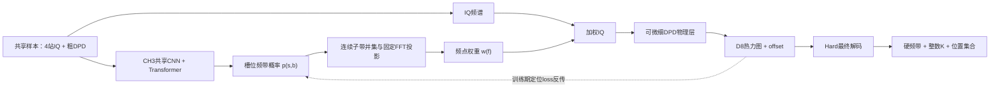

# 统一端到端模型研究

> 建立日期：2026-08-31  
> 文档状态（2026-09-22）：G5-R2及评分开关诊断完成。首版关联评分扰乱候选排序，是当前退化的主要直接来源；下一步优先修正身份评分学习方式，见17.13.9。额外反馈收益仍未解决，test继续冻结，执行状态以`当前任务.md`为准。
> 阶段边界：本文暂不宣布原研究主线进入“第三阶段”。在用户明确确认阶段切换前，使用工作树内临时编号 `E2E-G0...E2E-G5`；若后续确认第三阶段，再统一映射为 `S3-G*`。
> 证据边界：E2E-G0至G2-R2为单seed、小规模实验；G3跨seed确认收益方向，G5进一步完成扩大数据的三对SG/E2E。sample bootstrap仍不能替代独立训练重复或冻结test证据；17.11的四例探针不能外推为全开发集修复。全文未读取test，不产生论文最终性能结论。
> 路径边界：原项目 `F:\SourceCount_DPD\outputs` 只读；本文对应的全部新数据、缓存、权重和结果只能写入 `F:\SourceCount_DPD_E2E\outputs_e2e`。

## 1. 结论先行

本研究线的目标不是把第三章和第四章的两个推理脚本放进同一个入口，而是建立一个**同时输出源数、逐源频带和逐源位置，并能让定位误差反向修正前级逐源表示的统一模型**。最终推理不再需要真实频带或真实源数，Hard操作只保留在最后的结果解码中。

现有系统已经提供了较强的模块化基线：CH3 负责 19 子带上的槽位频带检测与计数，CH4-D8 负责细 DPD 热力图和 offset 定位，R5-A 又通过冻结模型的候选 K 与空间证据降低了计数路径损失。但该系统仍有硬阈值、硬频带掩码、Top-K 和候选 K 后处理，两个模型也未被最终定位损失联合优化，因此不能改名为端到端模型。

E2E-G0/G0D/G0-R1首先证明，旧“在线Soft细DPD物理桥”在分段混合精度下能够可信反传。E2E-G1/G1-R1随后证明，梯度虽然存在，却没有带来相对同前向stop-gradient对照的validation收益。问题已经从“能不能反传”转为“定位反馈是否具有明确的逐源和空间语义”。

E2E-G2验证的第一版结构为：

$$
\boxed{\text{CH3逐源查询}+\text{频率—空间潜在拆分}+\text{固定细DPD单次D8编码}+\text{逐源Heatmap/Offset}}
$$

它仍遵循“Soft内部训练＋Soft内部推理＋Hard最终解码”，但定位梯度不再穿过在线FFT、特征值分解和细DPD生成，而是通过逐源融合短路径返回CH3的频带logits、source query和粗空间特征。执行确认原固定配置未通过32样本强过拟合门；事后审查又发现固定全频输入存在精定位退化、正式梯度审计只覆盖K=0背景抑制，且loss与原D8训练不一致，因此尚不能把失败唯一归因于逐源空间表示。

G0—G4的研究结论按时间顺序为（历史操作判定不追溯修改）：

1. 物理桥、DPD 与归一化应使用 FP64 计算，再把归一化结果转为 FP32 送入常规 D8；训练用 D8 与 loss 不需要整体改成 FP64。
2. 梯度门应分层验证：物理链使用 FP64 有限差分，完整网络以 full-double 诊断抽查，不再用整条 FP32 网络的微小 loss 差作为否决证据。
3. G0-R1已按上述合同通过；G1判定`G1_NO_GO`，G1-D1隔离出第一版Soft计数语义失配；G1-R1修复计数语义后仍未获得定位反馈收益。
4. G1-R1的`NO_GO`只否定旧在线物理反馈接口，不否定其他端到端结构；因此G2改为验证逐源频率—空间潜在融合，而不是扩seed或调旧路线loss。
5. 空间计数头仍不进入基础模型；test继续冻结。
6. G2原P2未通过并保留`G2_NO_GO_REPRESENTATION`；G2-R1修正训练与证据合同后证明当前结构能完成30 m尺度逐源分离，95% Recall@10m不再作为路线准入门。
7. G2-R2在相同前向配对下使GOSPA改善`3.0239 m`，95%区间不跨0，Recall@100m提高`3.5156 pp`；但band F1/IoU分别下降`1.1273/1.3622 pp`，超过1个百分点护栏，因此定位反馈主张获得支持，当时的多任务训练合同未完整通过；随后D1/G3把频带轻降归为实质影响未定的监控项，并已进入G4。

当前路线优先级更新为：

1. **当前首要路线（G4选择A2，G5/G5-R1已完成）**：保留短反馈联合模型；原解码下G5支持反馈收益，G5-R1则表明联合解码能修复大量重复定位，并使SG追平和略优于E2E。下一步优先研究频带—位置绑定，以SG＋联合解码为强配对对照重新验证额外反馈收益，见17.12.7；不自动加轮、全解冻或增加空间计数头。
2. **G0—G1旧在线物理接口（`G1_R1_NO_GO`，停止）**：连续频带桥能够运行，但定位梯度没有形成可选择收益；不再扩seed或调权重。
3. **暂时搁置的理想路线**：`19×401×401` 频率分辨细 DPD，以完整频率—空间分辨率换取最直接的联合建模，但当前资源代价过高。

E2E-G2第一版不增加CH4空间计数头，也不同时启用DSNT坐标loss、粗空间对齐loss或梯度手术。它们只在核心短反馈链已经证明有效、且对应问题确实出现时逐项消融。

## 2. 研究目标与非目标

### 2.1 总目标

在保留 DPD 物理先验、CH3 频带语义和 CH4 细网格定位能力的前提下，研究并验证一个从共享输入到变长源位置集合的统一可训练模型，使定位目标能够反向影响频带表示和源存在性判断。

### 2.2 可检验的子目标

- 从CH3全局池化前保留每个子带的空间特征，并形成三个逐源query。
- 用频率概率和粗空间注意力共同构造逐源粗特征，使同频多源仍可能靠空间结构区分。
- 用一张与真值/预测频带无关的固定细DPD完成一次D8编码，再按query形成逐源Heatmap/offset。
- 消除训练和推理内部对预测K硬分流的依赖；真实K只用于监督和匹配，Hard操作只保留在最终解码层。
- 将 K 从外部控制量改为模型输出的源存在性或集合基数，使 K=0/1/2/3 使用同一输出契约。
- 使统一训练能够继承已验证的 CH3、D8 checkpoint，而不是从随机初始化同时重学全部物理与视觉表征。
- 同时保留 CH3 的频带/源数输出和 CH4 的 Heatmap、offset 与位置输出，不把统一模型缩减为只报告最终位置。
- 用系统级集合指标、章级辅助指标、梯度证据和资源证据共同判断路线，而不是只优化一个平均 RMSE。

### 2.3 非目标

- 不把现有模块化级联、四轨诊断或 R5-A 后处理重新命名为端到端模型。
- 不把工程梯度、32样本过拟合或单seed改善当作最终泛化证明；这些先导检查已经完成。
- 不因“端到端”标签而删除 DPD 物理层、Hard-19 基线、D8 热力图监督或现有章级评价。
- 不用 test 选择架构、loss 权重、阈值、查询数、训练轮数或数据规模。
- 不预设联合训练一定优于模块化级联；若收益不稳定或代价过高，负结果同样有效。
- G5仍需单独审批；不自动扩大到直接IQ网络、全解冻或读取test。
- 不在首要路线基础模型中加入 CH4 空间计数头；该模块只保留为后续条件消融。

## 3. 当前证据基线

### 3.1 原项目可继承证据

| 基线事实 | 对本研究的意义 | 证据入口 |
|---|---|---|
| CH3 使用 19 幅 81×81 粗 DPD，经共享 CNN、Transformer 和频率有序槽位输出频带 | 可继承为粗粒度频带编码器；现有计数由非空槽位硬阈值得到，不可直接参与端到端梯度 | `第一阶段_论文与代码接管审查.md`、`CH3-S2G5-R4-20260828` |
| CH4-D8 使用 401×401 细 DPD、热力图和 offset 定位 | 可继承定位主干和密集监督；训练 loss 本身可微，但当前细 DPD 由离线硬频带生成 | `第一阶段_论文与代码接管审查.md`、`CH4-S2G2-20260822` |
| Hard-19-Actual 在 4k/8k oracle 适配中逼近 Exact，Soft-19 没有稳定额外收益 | Hard-19 是必须保留的物理与性能对照；“连续权重可微”不能被直接解释为“Soft 一定更好” | `SYS-S2G4-R2/R3/R4` |
| 四轨诊断显示完整级联退化主要来自 K 路径，而非频带路径 | 统一输出必须把基数误差作为主问题，而不能只微调频带概率 | `SYS-S2G5-R3-20260828` |
| 16k CH3 提高频带 F1，但没有自然消除 K 路径损失 | 单纯扩大 CH3 数据不是统一模型的替代方案 | `CH3-S2G5-R4-20260828` |
| R5-A 将 K=2/3 计数准确率从 87.30% 提高到 95.51%，但跨 seed 严格门仅 1/3 通过 | D8 空间证据对 K 有互补性，但冻结后处理仍不是联合训练，稳定性仍需解决 | `SYS-S2G5-R5A/R6A` |
| 原研究线当时K=1定位接口尚未实现；低 SNR 和 K=3 距离长尾尚未对齐 | 新模型必须单独验证 K=1 和长尾，不能只在 K=2/3 平均指标上通过 | `SYS-S2G5-R1`、`CH4-S2G5-R6B0-20260830` |

精确路径、指标、SHA256 和资源事实继续以 `实验结果记录.md` 为唯一事实源。本文只保留会影响统一模型设计的综合结论。

### 3.2 可微物理层的动态审计结论

G0 已在不修改历史第四章算子的前提下新增固定支持、可微分块实现，并完成动态审计：

- 固定 4096 频点支持避免了 `w_f>0` 动态裁剪计算图；K=0、近零、单带、重叠带、全一及普通连续输入均保持有限。
- K=0/1/2/3 的 401×401 反向梯度全部有限且非零，计算资源远低于预设停止线，说明图能够连接且工程资源不是当前阻塞点。
- 算子级有限差分通过，但冻结 D8 定位损失的完整系统有限差分与 autograd 方向相反；“能反传”不等于“梯度可信”。
- G0D 后续确认：checkpoint 模式不改变梯度，FP64 物理链 15/15 通过；首次 FP32 不可判定位置进入 D8 Heatmap logits，full-double 完整 D8/loss 链 7/7 通过。
- 当前正式数据将细 DPD 预计算后保存，定位 loss 无法穿过离线文件回到 CH3。

因此 G0 的历史判定仍是 `STOP_GRADIENT`，G0D 将路线级解释修正为 `IMPLEMENTATION_FIX`，随后G0-R1已完成修复重验并通过。该结果只解锁G1方案审批，不等于已经证明端到端训练有效。

## 4. “统一端到端模型”的定义

### 4.1 本项目采用的最低定义

若模型参数记为$\theta_3$（CH3逐源表示与频带部分）和$\theta_4$（CH4定位部分），最终集合定位损失记为$L_{set}$，则最低成立条件为：

$$
\left\|\frac{\partial L_{set}}{\partial \theta_3}\right\| > 0,
\qquad
\frac{\partial L_{set}}{\partial \theta_3}\ \text{有限且可由有限差分方向复核。}
$$

这里不要求定位梯度必须穿过FFT、特征值分解或细DPD生成。E2E-G2要求定位损失沿逐源频率—空间拆分和特征融合短路径，到达决定频带、存在性和source query的CH3参数；梯度非零只是工程条件，最终还必须相对相同前向的stop-gradient对照产生可选择收益。

### 4.2 分级定义

| 级别 | 定义 | 本项目判定 |
|---|---|---|
| `E2E-L0` | 两个模型在同一脚本顺序运行，接口含硬阈值/真实 K，分别训练 | 仅为级联，不是端到端 |
| `E2E-L1` | 定位loss经明确的可微接口更新CH3逐源/频带参数 | 已在当前短反馈结构实现，泛化边界仍需检验 |
| `E2E-L2` | 单一训练图同时输出 CH3 频带/源数和 CH4 Heatmap/offset/位置，训练不依赖预测 K 硬分流 | 当前结构已达到此训练图定义，不等于论文性能验收 |
| `E2E-L3` | 从原始同步 IQ 进入全部物理与神经模块，只输出最终源集合 | 远期目标；不是初始化阶段的强制条件 |

### 4.3 不满足定义的情形

- 用 CH3 硬阈值生成掩码，再离线预计算细 DPD 训练 D8。
- 用真实 K 决定 D8 Top-K，只在报告中替换成 predicted K。
- 冻结两个模型，仅训练候选 K 后处理器或校准器。
- 多个 loss 写在同一优化器里，但定位 loss 对 CH3 梯度为零或被 `detach/no_grad/numpy` 截断。

## 5. 当前必须解决的问题

### 5.1 旧物理桥可微，但反馈路径过长且语义间接

G0—G1已经解决硬频带选择不可微的问题，也证明在线细DPD物理链可以可信反传。但定位误差必须穿过D8、401×401特征值空间谱、FFT权重和频带并集，最后才到达CH3 band logits。G1-R1表明这种梯度虽非零，却与CH3任务梯度近似正交且没有形成可选择收益。G3已支持短反馈路径的小规模跨seed收益；当前问题是该收益在A2部分解冻、更大数据和充分预算下能否保持。

### 5.2 源数 K 同时控制计算和评价

现有 K 由非空槽位数推断，又控制 D8 的 Top-K 解码。错误 K 会同时造成漏检/多检和位置集合大小错误。R3/R4 已证明这是当前主要级联瓶颈，因此训练和推理的内部图都不依据预测 K 跳过细 DPD 或 D8；整数 K 只在最终解码时决定位置集合大小。

### 5.3 多源输出是变长且无序的集合

固定槽位需要人为规定顺序；Hungarian/PIT 则允许无序匹配。师弟论文按频偏排序槽位，DPV 按到原点距离排序位置，而 DETR、Deep Sets 和 Multi-ACCDOA 提供集合或置换不变路线[4-9]。本项目中频率相近、同频混叠和对称位置会使固定排序出现边界不连续，必须通过对照实验决定，而不能直接照搬某一种顺序。

### 5.4 固定全频细DPD与现有D8存在输入分布差异

现有D8使用按真实频率重叠组生成的细DPD训练；E2E-G2改为每个样本一张固定全频细DPD。这样可以取消在线细DPD反传，但也可能使D8看到未训练过的频率混合和干扰结构。G2-R1已发现这种输入差异并恢复了粗分离能力，G4又选择解冻D8末端适配；目前仍不能把定位长尾全部归因于输入差异，也不再以95%@10m作为路线否决线。

### 5.5 原CH3有序head与当前逐源query的区别

原CH3先把每个子带池化成向量，再把19个Transformer token取均值得到一个全局特征，最后由多个独立band head输出有序槽位。现有head隐藏激活可以作为query的输入锚点，但它们本身不是可以通过集合匹配自由交换的source query。当前统一实现已经增加query构造和集合匹配；零初始化残差只保证新建模块时保留原频带输出，不表示训练后仍不变。

### 5.6 逐源空间拆分可能发生query坍缩

如果两个query产生近似相同的频带概率和空间注意力，它们会输出同一位置，尤其会破坏同频多源定位。第一版先实现建议文档中的独立空间softmax，并固定记录query间注意力重叠；只有观测到坍缩后，才单独增加slot竞争和background，不与核心结构同时上线。

### 5.7 多任务loss和可选辅助监督必须分阶段

第一版只使用存在性、频带、Heatmap和offset四项已知监督。DSNT坐标loss会改变Heatmap优化目标，粗空间对齐loss会直接把真实位置监督注入CH3，GradNorm/CAGrad会改变多任务更新方向；三者都可能有效，但同时加入会失去因果归因。它们只在核心短反馈链通过或暴露出对应故障后逐项启用。

### 5.8 数据与论文条件的长尾仍未闭合

R6-B0 的低 SNR 与 K=3 距离长尾尚未对齐。联合训练可能改善平均指标，也可能加剧尾部错误；因此长尾必须成为预注册分层，而不是在平均 GOSPA 改善后再补充观察。

## 6. 研究问题与可检验假设

### 6.1 研究问题

| 编号 | 研究问题 |
|---|---|
| `RQ1` | 逐源频率—空间潜在拆分能否建立比在线细DPD物理链更直接、更有效的定位反馈？ |
| `RQ2` | 在前向完全相同的条件下，允许定位loss更新CH3/query是否比stop-gradient对照降低系统GOSPA？ |
| `RQ3` | source query与空间注意力能否在频带相同或接近时，仍把多个源拆成不同的空间表示？ |
| `RQ4` | 联合模型的收益能否跨训练 seed，并在低 SNR、K=3 长尾、不同距离和带宽条件下保持？ |
| `RQ5` | 固定全频细DPD和单次D8编码能否把E2E-G2因果验证控制在可接受时间内？ |

### 6.2 初始假设

- `H1`：定位loss经逐源Heatmap/offset、融合层、频率—空间mask到band logits的短路径，能比旧物理桥形成更具有任务语义的梯度。
- `H2`：在冻结两章encoder、只训练接口和轻量逐源head时，`FS-E2E`应优于完全相同前向的`FS-SG`，且不以破坏CH3计数/频带能力换取平均定位收益。
- `H3`：对同频或近频多源，频率gate可能相同，但source-specific空间注意力应形成不同的粗空间表示；若注意力持续高度重叠，则当前拆分机制不成立。
- `H4`：联合收益若只在单 seed 或中等 SNR 出现，则不能作为统一模型成立证据。
- `H5`：固定细DPD只生成一次、D8只编码一次且不反传物理层后，训练成本应明显低于G1-R1；两小时是当时G2先导预算，不是后续扩大数据的统一时限；G5按第17章重新预注册总成本。

## 7. 文献与方法证据地图

扩展文献综述、来源链接和完整结构推导由`端到端多源定位框架_文献综述与结构建议.md`负责；本文只保留已经进入实施方案的证据映射。当前E2E-G2新增采用的关键共识是：多源任务需要在网络中间形成source-specific representation，变源数输出适合query/existence与集合匹配，训练内部保持Soft而Hard决策只留在最终解码。

### 7.1 与本项目最接近的证据

| 文献路线 | 可借鉴内容 | 不能直接外推的部分 |
|---|---|---|
| 经典 DPD[1] | 从多站观测直接构造位置代价/空间谱，支持保留固定物理层 | 不解决神经网络可微接口、未知 K 或变长输出 |
| 模块化神经 DPD[2] | 明确指出多源排列与未知源数会使单阶段固定输出难以训练，并用检测—过滤—定位分解 | 区域划分、多 MLP/RBF 与本项目 DPD 图像网络不同；不能作为端到端优越证据 |
| 未知源数 DPD[3] | 从空间谱同时估计源数与位置，证明 K 不必永远作为先验输入 | 属于解析/谱峰路线，不提供 CH3—D8 联合训练方法 |
| DPV 变长端到端被动定位[4] | Zero Padding、存在置信度、Sort Invariant Training；本地全文的 III-C/III-F/V-G 给出排序、联合位置+BCE loss 和消融 | LEO TDOA/FDOA、时频图输入、公里级场景与本项目不同；按原点距离排序在对称位置下可能不稳定 |
| E2E-MSL | Soft内部选择、可微定位模块、Hungarian和分阶段训练，说明最终定位误差应返回具有空间语义的中间表示 | Local radio map与DPD的旁瓣/伪峰结构不同，不能直接照搬其连通域假设 |
| Source Splitting | 在共享latent feature中显式生成逐源表示，支持frequency-spatial splitter | 声学时频mask不能直接替代无线DPD的频率—空间归属，需要本项目验证 |
| DETR 与 Deep Sets[5-6] | 固定查询 + no-object、二分图匹配、置换不变集合函数，为 K=0/1/2/3 统一输出提供通用框架 | 视觉检测结果不等同于 DPD 定位收益；需要本项目自己的位置/band 匹配代价 |
| CenterNet[7] | 中心点热力图与属性回归支持保留 D8 的密集定位支路 | 推理 Top-K 仍不可作为训练期 K 门控 |
| ACCDOA / Multi-ACCDOA[8-9] | 将活动与位置耦合；ADPIT 处理同类重叠，为“存在性+位置”联合目标提供跨领域近邻 | 声学 DOA 类别轨道与无线频带槽位不同，只能作为结构类比 |
| Gumbel-Softmax / NeuralSort[10-11] | 为离散选择和排序提供连续松弛 | 会引入温度、偏差和训练/推理差异；不应先于简单连续频带桥使用 |
| 不确定性加权 / GradNorm[12-13] | 为多任务 loss 尺度与学习速度失衡提供可检验工具 | 不能替代任务归一化、梯度诊断和公平对照 |
| GOSPA[14] | 同时分解定位、漏检和虚警，适合变长源集合的系统主指标 | 需要同时报告分量与章级指标，不能只报总分 |

### 7.2 文献间的条件差异

- DPV 的 SIT 与 DETR 的 Hungarian 匹配不是简单的相互否定：SIT 用稳定几何顺序降低匹配成本，Hungarian 则不要求全局固定顺序。本项目需要用频率接近度和位置对称性分层比较二者。
- ACCDOA 通过单一活动向量减少检测/定位双 loss 的平衡问题，但本项目还需要保留 19 子带的可解释频带监督，因此不宜在首轮就删除独立 band loss。
- Gumbel-Softmax 和 NeuralSort 证明离散运算可以松弛，但现有 Soft-19 的负证据提醒：可微性与定位信息保真是两个独立 Gate。

## 8. 当前统一架构

### 8.1 G0—G1已验证并停止的在线Soft物理接口

**当前状态：`E2E-G1-R1=G1_R1_NO_GO`。** 下述结构已经完成工程、梯度、第一版G1和语义修正版G1-R1的单seed因果训练验证；G1-R1消除了Soft计数绝对崩溃，但没有获得定位反馈收益。E2E-G2不继续训练该接口，而是更换为逐源潜在融合。

设 CH3 输出第 $s$ 个槽位、第 $b$ 个子带的 logit 为 $z_{s,b}$：

$$
p_{s,b}=\sigma(z_{s,b}),\qquad
u_b=1-\prod_s(1-p_{s,b}).
$$

$u_b$ 表示任一源占用子带 $b$ 的连续并集概率。再用固定的子带—FFT 覆盖矩阵 $A_{f,b}\in[0,1]$ 映射到频点：

$$
w_f=1-\prod_b(1-A_{f,b}u_b),\qquad
X_m'(f)=\sqrt{w_f}\,X_m(f).
$$

其中 $A$ 只编码已经冻结的 Hard-19-Actual 几何关系，不学习新的物理带宽。二值 $p$ 时必须退化到现有子带并集；连续 $p$ 时保留梯度。细 DPD 继续由多站互谱、几何相位补偿和最大特征值形成，D8 继续输出热力图与 offset。

训练与推理共用的内部图如下：



训练阶段不依据预测 K 跳过 CH4，也不使用预测 K 控制 D8 dense 前向。D8 仍只接收由连续频率权重生成的细 DPD；真实 K 只用于构造 Heatmap/offset 监督。总损失初始写为：

$$
L_{total}=L_{band}+\lambda_eL_{exist}+\lambda_hL_{heatmap}+\lambda_oL_{offset}.
$$

各项先按有效监督元素归一化，再通过梯度尺度诊断决定是否需要调整权重；不能仅因总 loss 下降就判定联合训练收敛。

推理阶段复用完全相同的 Soft 内部图，不把阈值后的频带或整数 K 反馈给频带桥：

```text
粗DPD → CH3 logits/probabilities → 连续频带并集与频点权重
                                      ↓
原始IQ ───────────────────────→ 加权IQ → 连续细DPD → D8 Heatmap/offset
                                                           ↓
最终解码：band threshold + 槽位计数（G1-R1修正后）+ NMS/Top-K + offset
                                                           ↓
                  硬频带、整数K、确定长度的位置集合
```

因此，CH3 对外报告的硬频带和整数 K 与内部使用的连续概率明确分离：前者是最终结果，后者是 DPD 条件。K=0 也先运行 Soft 内部链，再由最终解码器返回空位置集合；提前跳过只是后续可验证的部署优化，不属于基础模型。

该路线的优势是最大限度继承两章模型、消除训练/推理内部图不一致，并让定位信息始终作用于频带概率；主要风险转为细 DPD 反向图成本、近零权重归一化、连续频带过宽造成的 D8 输入分布偏移，以及定位监督对 K 的反馈弱于对频带的反馈。历史 Hard/Hard 级联继续作为强基线与消融，不再作为目标部署图。

### 8.2 G1已确认的源存在性与基数修正

G1第一版曾把任一子带占用的并集当作槽位存在概率（下式已停用）：

$$
q_s=1-\prod_b(1-p_{s,b}).
$$

G1第一版使用 **Poisson-binomial 基数**，后经G1-D1和G1-R1确认存在语义失配。修正版改为max-logit槽位存在、直接槽位BCE和Hard最终K，已使Soft-SG恢复到Hard同量级。该修正继续由E2E-G2继承，但没有使G1旧定位反馈链产生收益。

当前使用$e_s=\sigma(\max_b z_{s,b})$及槽位BCE，最终按冻结阈值判定各槽位是否存在并计数。它等价于检查是否存在过阈值子带，不使用上式的概率并集，不增加CH4空间计数头。

### 8.3 E2E-G2当前首要路线：逐源频率—空间潜在融合

输入为`19×81×81`粗DPD和一张不依赖真值/预测频带的固定`401×401`全频细DPD。模型同时输出CH3的逐源频带与源数，以及CH4的逐源Heatmap、offset和位置。

原CH3没有现成的exchangeable source query，而是由多个独立band head读取同一个全局特征。E2E-G2从现有head隐藏激活构造query锚点：

$$
q_i=\operatorname{CrossAttn}(W_a[h_i;g],T,T),\qquad i=1,2,3,
$$

其中$h_i$是前三个band head的64维隐藏激活，$g$是256维全局特征，拼接后投影成128维query；$T$是19个Transformer子带token。当前代码不含另加的learned slot embedding。频带logits采用零初始化残差：

$$
z_i=z_i^{legacy}+\Delta z(q_i),
$$

使模型初始化时保留原CH3输出，后续又允许定位loss更新band logits和query。

从CH3全局池化前保留每个子带的空间特征$F_b^c\in\mathbb R^{128\times11\times11}$。每个query同时产生频率gate和空间attention：

$$
p_{ib}=\sigma(z_{ib}),\qquad \bar F_i(x,y)=\frac{\sum_b p_{ib}F_b^c(x,y)}{\max(\sum_b p_{ib},10^{-6})},
$$

$$
a_i=\operatorname{softmax}_{x,y}\!\left(\frac{\langle W_q q_i,\bar F_i(x,y)\rangle}{\sqrt{128}}\right),\qquad
\tilde F_i^c=V(\bar F_i)\odot(1+a_i).
$$

代码先对19个子带做归一化Soft加权，再在混合后的11×11粗图上做逐源空间attention；并非为每个子带分别生成空间mask。残差因子$1+a_i$保留粗图信息，即使两个源同频，仍可通过query形成不同的空间调制。

固定细DPD只生成一次。D8 backbone、PAN和decoder trunk也只运行一次，暴露共享高分辨率特征$d_0\in\mathbb R^{32\times401\times401}$。逐源融合采用：

$$
F_i^f=(1+\gamma(q_i))\odot d_0+\beta(q_i),
$$

$$
U_i=\operatorname{Fuse}\left(F_i^f,\operatorname{Up}(\tilde F_i^c)\right),\qquad U_i\rightarrow(H_i,O_i).
$$

D8主干只编码一次，后面三个轻量共享head分别给三个源输出Heatmap和offset。定位loss可沿`Heatmap/offset→融合层→频率—空间mask→band logits/query`的短路径返回CH3，不再反传在线FFT、特征值分解和细DPD生成。

### 8.4 暂时搁置的理想路线：频率分辨细 DPD

输入为 `19×401×401` 频率分辨细 DPD，每个固定子带都保留细空间谱。它能够在高分辨率特征上直接进行逐源频带加权和定位，理论连接最清楚，但输入元素约为“粗 DPD + 单张细 DPD”的 10.7 倍，DPD 生成、存储与训练激活成本均显著增加。

本路线当前不分配Gate、不生成数据、不实现代码。只有后续证据明确指向固定全频输入的信息瓶颈、且资源可承受时，才另行提出并审批方案。

### 8.5 E2E-G2集合输出与Hard最终解码

E2E-G2固定$Q=3$个source query，每个query输出：

- 存在概率 $e_j$；
- 二维位置 $(x_j,y_j)$；
- 必须保留的19子带频带属性 $b_j$。

训练用频带BCE与真值位置处Heatmap响应组成匹配代价；Q=3时枚举排列求精确最小代价，与二分图最优匹配目标一致。匹配后计算存在性、频带、Heatmap和offset四项loss，未匹配query监督为空源。存在性loss不是当前匹配代价中的独立项。训练和内部推理不根据预测K跳过query或D8，最终才根据存在性阈值输出Hard频带、整数K和确定长度的位置集合。Heatmap+offset是正式定位输出，不是临时辅助支路。

### 8.6 对照的职责

| 对照 | 用途及边界 |
|---|---|
| 同前向SG/E2E配对 | 核心因果对照；SG仍训练定位头，只阻断定位loss返回CH3/query的路径 |
| 冻结模块化Hard/Hard级联 | 系统性能参考；保持原预训练和后处理身份，不能作为等训练预算的因果对照 |
| oracle-band/oracle-K等条件对照 | 按具体问题审批，用于误差隔离；不替代真实预测结果，不默认运行全部组合 |

不采用“不给新定位头定位监督”的对照证明反馈有效；那会同时改变定位头学习条件。

### 8.7 暂缓路线

- DSNT/Soft坐标loss：只有Heatmap已经学习、但Hard峰值解码与集合指标明显不一致时才单独加入。
- 粗空间对齐loss：只有空间attention长期弥散或错位时才单独加入；它会直接用位置监督CH3，不能与核心G2同时归因。
- source/background竞争注意力：只有query空间重叠诊断确认坍缩时才启用。
- GradNorm/CAGrad/PCGrad：只有新表示能够学习且记录到稳定梯度冲突后才考虑。
- 直接用 Gumbel/straight-through 生成硬频带：仅当连续内部表示本身失败、但 Hard 表示仍有明显上限时再单独审批。
- 直接用 NeuralSort 排序源：仅当固定频率顺序有价值、普通排序边界导致训练不稳时再启用。
- DPV 式原始 IQ 直出位置：改变输入表征和两章创新边界过大，且需要新的大规模数据与公平基线，暂不作为首轮方案。
- 完全删除细 DPD：只有在统一模型已通过且消融证明物理层不再提供独立价值时才可讨论。
- CH4空间计数头：不进入E2E-G2；仅当核心路线已证明定位反馈有效而K仍稳定受限时，作为后续单独消融。

## 9. 数据、输出与训练契约

### 9.1 输入契约

- 样本身份以统一 IQ manifest 为主键；粗 DPD、标签和已有参考产物必须能回指同一 sample ID。
- E2E-G2输入预计算`19×81×81`粗DPD和单张固定`401×401`全频细DPD；固定细DPD的FFT支持对所有样本相同，不依赖真实频带、预测频带或真实位置。
- 原D8预训练使用分组细DPD；统一模型使用固定全频细DPD。G2/G2-R1已做兼容性检查，G4选择A2部分解冻适配，不能将两种输入称为相同。
- 固定细DPD先在小样本上测速和核验，只有完整Gate成本投影满足停止线后才扩展缓存；不再在线反传FFT/EVD。
- 训练、validation、test维持严格分离；E2E-G2不读取test。
- 原 `outputs` 中的权重和数据只能经 `统一模型代码/common/reference_artifacts.py` 注册后只读加载。

### 9.2 输出契约

统一输出必须同时保留两章结果：

- `legacy_band_logits`：原CH3十个有序head的诊断输出，用于确认checkpoint能力没有被静默破坏；
- `query_band_logits/probabilities/mask_hard`：三个source query的逐源频带结果；
- `existence`与最终整数`predicted_K`：三个query的存在性和源数结果；
- `source_attention`与`source_coarse_features`：逐源空间归属和频率—空间融合后的粗特征；
- `source_heatmap/offset`：三个query各自的CH4定位输出；
- `position_set`：Hard最终解码得到的二维位置集合及置信度；
- `fusion_diagnostics`：定位到band logits/query/spatial attention的梯度、attention entropy、query间重叠和非有限计数。

K=0样本的真实位置集合为空；三个query继续完成Soft前向，训练期Heatmap使用全零目标、offset loss为零、存在性loss保留，最终Hard解码才返回空位置集合。不得伪造零坐标源，也不得依据预测K静默跳过样本。

### 9.3 当前训练顺序

G0—G1旧物理反馈链已停止；G2-R1恢复学习合同，G2-R2/G3完成小规模反馈验证，G4选择A2。加载器优化结果见第16.7节。当前按已批准的第17章执行G5，不再重复32样本能力门或继续逐层拆分解冻Gate。

冻结前缀可缓存；A2中可训练的CH3 cross_attn和D8 decoder.c1/up0必须在线运行，不能缓存其输出而切断梯度。G5不改变loss、解码、splitter或解冻范围。

### 9.4 当前代码边界

| 路径 | 职责 |
|---|---|
| `统一模型代码/models/e2e_latent_fusion.py` | CH3/D8特征接口、SourceQueryBuilder、FrequencySpatialSplitter和SourceLocalizationHead |
| `统一模型代码/models/final_decoder.py` | 旧G0/G1解码器，含历史基数分布接口；当前逐源解码以R1/G4评价路径为准，不能混用 |
| `统一模型代码/gates/g2/e2e_g2_latent_fusion.py`及R1/R2入口 | 固定输入、集合匹配、修订loss与历史配对训练 |
| `统一模型代码/gates/g4/e2e_g4.py` | A0/A1/A2模型上下文、冻结前缀特征、训练与评价 |
| `统一模型代码/common/verified_feature_loader.py` | 同字节SHA校验、有界LRU和按batch合并分片读取 |
| `统一模型代码/common/diagnostics/optimize_feature_loader.py` | 分片筛选及训练更新等价验证，不执行G5 |
| `统一模型代码/configs/` | 各Gate配置；G5配置已新增，正式训练前登记冻结身份 |

旧文档中的独立source_query、frequency_spatial_splitter和unified_loss文件仅是早期拆文件设想，当前没有这些独立实现。所有新产物只写`outputs_e2e`，历史Gate保持原证据语义。

## 10. Gate 总路线

| Gate | 当前状态 | 只回答什么问题 | 允许进入下一步的必要条件 |
|---|---|---|---|
| `E2E-G0` | `STOP_GRADIENT` | Soft 连续桥在完整分辨率下是否数值正确、可反传、前向不退化且资源可行 | 未满足：完整系统梯度方向不一致 |
| `E2E-G0D` | `IMPLEMENTATION_FIX` | 完整系统梯度为何与有限差分异号，属于工程实现、局部非光滑还是物理层阻塞 | 已排除checkpoint与物理层阻塞；实施精度/审计修复并完整重跑G0 |
| `E2E-G0-R1` | `G0_PASS` | 分段混合精度图是否满足完整G0数值、梯度、资源和冻结前向门 | 已满足；随后G1已完成 |
| `E2E-G1` | `G1_NO_GO` | 定位梯度进入 CH3 后是否产生可归因的早期收益 | 未满足：`Soft-E2E`的GOSPA相对同前向detach对照略差 |
| `E2E-G1-D1` | `SOFT_COUNT_FAILURE_CONFIRMED` | 第一版Soft绝对退化是否主要来自Poisson-binomial最终K | 已确认；硬槽位K恢复Hard同量级，但不改写G1或解锁当时预写的多seed计划 |
| `E2E-G1-R1` | `G1_R1_NO_GO` | 修正计数语义后，旧定位反馈是否产生可选择收益 | 未满足：两轨均选择epoch 0；旧接口停止 |
| `E2E-G2` | `G2_NO_GO_REPRESENTATION` | P0/P1通过，但原固定配置未通过P2强过拟合门；事后因果解释仍有混杂 | 不执行P3；先进入G2-R1定位故障层 |
| `E2E-G2-R1` | `G2_R1_SPLIT_PASS_FINE_FAIL` | 修正训练与证据合同后，判断原G2结构能否在32条样本上完成粗分离和10 m精定位 | 30 m粗分离已通过、10 m达到既有D8同量级；不再由未校准的95%门阻止因果验证 |
| `E2E-G2-R2` | `G2_R2_AUX_REGRESSION` | 相同前向下，定位loss进入CH3/query是否比stop-gradient改善独立validation集合定位 | 定位收益明确；经D1及后续审批已进入并完成G3 |
| `E2E-G2-R2-D1` | `TRUE_BAND_REGRESSION / MATERIALITY_UNCERTAIN` | 辅助下降来自匹配、阈值、真实Hard判决变化还是普遍梯度冲突 | 匹配与简单校准已排除；普遍梯度冲突未确认 |
| `E2E-G3` | `G3_FEEDBACK_STABLE_PASS / AUX_UNCERTAIN` | 定位反馈收益及Hard频带代价能否跨独立training seed复现 | 两个新seed定位均改善；频带下降重复但实质越界未确认，训练预算仍未解析 |
| `E2E-G4` | `G4_PARTIAL_UNFREEZE_SELECTED` | 扩大数据后选择多大的解冻范围 | 已选择A2；不能替代A2上的SG/E2E对照 |
| 加载器工程项 | `CORRECT_BUT_SPEED_TARGET_UNMET` | 有界同字节校验能否保持更新一致且开销可接受 | 更新一致；已获准用于G5，扩大规模后的性能问题见17.9节 |
| `E2E-G5` | `DIRECTIONAL_BUT_INCONCLUSIVE / TRAINING_BUDGET_UNRESOLVED` | A2较大规模反馈收益及正式证据准备 | 六轨、比较及审计完成；开发集反馈三seed同向，槽位重复选峰与联合关联为当前重点，见17.10—17.12；test继续冻结 |

当前主验证路线已完成G0—G4：G0解决旧物理链数值与梯度可信性，G1检验旧接口的因果收益，G2改用逐源频率—空间潜在融合检验新的反馈接口，G3确认其总体定位收益可跨seed复现，G4扩大数据并选择A2部分解冻范围。原先在G1运行前预写的“多seed G2”和“冻结test G3”从未解锁，现合并保留在第18章作为已作废历史计划，不再占用当前编号。

## 11. E2E-G0：连续桥可行性与冻结前向预检

> 第11—16章保留各Gate当时的配置、审批和操作判定；其中“下一步”“尚未解锁”等属于历史语境，不覆盖第17章及第24章的当前入口。后续修正用明确说明追加，不把历史失败改写成通过。

### 11.1 计划状态与唯一问题

执行状态为 `STOP_GRADIENT / E2E-G0-20260831`。G0 未训练模型、未读取 test，回答是：能够构造二值边界一致、边界稳定、资源可承受并可产生非零梯度的连续内部图，但尚不能证明冻结 D8 定位 loss 对 CH3 band logits 的梯度方向可信。

G0 未通过，G1 不解锁；本结果不构成“端到端有效”或“Soft 优于 Hard”的性能结论。

### 11.2 固定输入、模型与样本

| 项目 | G0 固定方案 |
|---|---|
| 参考模型 | 只读核对 `reference_artifacts.py` 中 `ch3_seed42` 与 `d8_seed42` 的路径、大小和 SHA256；仅作工程探针，不在 G0 选模型 |
| 数据分区 | 只用冻结 validation；不生成或读取 test 下游评价结果 |
| 样本清单 | 按元数据预先选 16 条，K=0/1/2/3 各 4 条；非零 K 覆盖窄/宽带、低/中/高 SNR、频带边界/重叠和不同源间距 |
| 反向子集 | 从上述清单固定 K=0/1/2/3 各 1 条；资源主样本取预计支持最宽、图最大的 K=3 样本 |
| 算子边界例 | 额外构造全零、近零、单子带、相邻重叠子带、全一和普通连续概率，不携带性能标签 |
| 当前设备基线 | RTX 4070 Ti SUPER 16 GiB、系统 RAM 31.84 GiB、PyTorch 2.8.0+cu129；执行时重新记录可用资源 |

样本 ID 只能依据元数据选择，并在运行任何模型结果前写入 manifest。若某分层在 validation 不存在，只报告缺口，不从 test 补样本。

### 11.3 G0 允许实施的代码边界

G0 获批后只允许新增或最小包装以下职责：

- `physics/band_bridge.py`：计算 $p_{s,b}$、连续并集 $u_b$ 和固定映射 $w_f$；二值测试输入必须退化为 Hard-19-Actual 并集。
- `physics/fine_dpd_autograd.py`：复现现有 FFT、互谱、几何相位补偿和最大特征值语义，移除会截断反向图的 NumPy/落盘边界；允许固定频率支持和网格分块，不允许按可学习的 `w_f>0` 动态裁剪计算图。
- `models/final_decoder.py`：只在网络末端执行 band threshold、$\arg\max P(K)$、NMS/Top-K 和 offset；不得把硬结果反馈给细 DPD 或 D8。
- `audits/gradient_audit.py` 与 `audits/e2e_g0.py`：编排身份、等价、梯度、稳定性、冻结前向、解码和资源检查；不包含训练循环。

G0 不创建 `unified_loss.py` 或 `train_unified.py` 的正式实现，不改历史 `第三章代码`、`第四章代码` 和原 `outputs`。必要复用通过包装完成。

### 11.4 Soft 内部与 Hard 最终解码契约

基础内部图固定为：

$$
p=\sigma(z),\quad
u_b=1-\prod_s(1-p_{s,b}),\quad
w_f=1-\prod_b(1-A_{f,b}u_b),\quad
X_m'(f)=\sqrt{w_f}X_m(f).
$$

- 第一版不把 $q_s$、整数 K 或硬 band mask 乘入 $w_f$，避免错误 K 重新切断定位梯度。
- 频率支持域只由冻结矩阵 $A$ 决定；支持域内的连续权重全部保留，不使用经验阈值剪枝。
- 沿用当前 DPD 的站间功率归一化与 D8 sample z-score 语义，但所有除法显式加 $\varepsilon$。精确全零权重采用显式 null 契约：跳过单位功率归一化，只保留固定对角加载形成的常数背景，经 D8 z-score 后必须为全零有限输入；近零权重仍走连续算子并单独审计。
- Hard 最终解码固定保存 `band_mask_hard`、`predicted_K` 和 `position_set`。若硬 band mask 的非空槽位数与 $\arg\max P(K)$ 不一致，只记录 `hard_count_mismatch`，G0 不做隐藏修复；位置集合长度必须严格等于 `predicted_K`，K=0 时为空。
- 同时保存 Soft 内部量和 Hard 最终量，防止把“对外硬输出”误写成“内部硬推理”。

### 11.5 七项执行检查

1. **身份与只读门**：解析双根路径，核对两份冻结 checkpoint、validation 数据和 manifest 身份；确认输出根为空或不存在，执行配置和代码中不存在写入原 `outputs` 的目标路径。
2. **参考噪声与二值等价**：先在相同 dtype/device 上重复旧算子，登记数值噪声；再比较旧 `freq_mask`、旧 binary `freq_weights` 与新桥二值模式的频点权重、原始细 DPD、D8 标准化输入和 dense 输出。
3. **连续边界稳定性**：运行全零、近零、单带、重叠带、全一及普通连续概率；检查 $u,w$ 范围、有效支持、DPD 动态范围以及所有中间量/输出/梯度的 NaN/Inf。
4. **双层梯度审计**：先用固定加权 DPD 标量做算子级 autograd；再用冻结 D8 的 `L_heatmap+L_offset` 做系统级 backward，确认梯度到达 CH3 band logits。两层都用预先固定方向做中心有限差分；普通光滑点要求符号一致且相对误差达标，近重特征值点单独标记为非光滑诊断。
5. **冻结前向兼容诊断**：16 条样本均运行 `Hard-reference` 与 `Soft-predicted`；报告相关性、GOSPA/RMSE、Heatmap/offset 和 K 分层，但除非出现非有限、常数塌缩或解码不完整，性能差距只作为 G1 初始化风险，不单独否决路线。历史 Soft-19 负结果不能由此改写。
6. **Hard 最终解码审计**：覆盖 K=0/1/2/3、并列峰和边界峰，复核确定性 tie-break、坐标/网格/offset、`len(position_set)=predicted_K` 及全部输出字段。
7. **完整资源与重复门**：在 `401×401`、batch 1、真实频率支持、冻结 D8 loss 下完成至少两次完整 forward+backward；缩小网格只允许定位瓶颈，不计入通过证据。

### 11.6 预注册容差与资源停止线

| 检查 | 通过/停止线 |
|---|---|
| 二值等价 | DPD 保持 `atol=max(1e-6, 5×旧算子重复绝对差)`、`rtol=max(1e-5, 5×旧算子重复相对差)`；因固定支持与旧动态支持存在浮点求和顺序差异，经用户批准，下游判据为 Hard 峰值索引完全一致且坐标差 `≤0.01 m`，dense logits 差异仅诊断 |
| 梯度 | 普通光滑点 autograd 与中心差分同号，方向导数相对误差 `≤5%`；四个 K 代表样本梯度均有限，K=1、2、3 三个有源样本均非零 |
| K=0 | 全零和近零案例无 NaN/Inf；全零权重经固定背景和z-score后为零；最终位置集合严格为空 |
| 确定性 | 固定输入/seed 的硬输出逐字段一致；连续张量和梯度差异不超过上方数值容差 |
| GPU | 峰值 allocated/reserved 均 `≤14.0 GiB`；超过即 `STOP_RESOURCE`，不靠 OOM 作为监控方式 |
| RAM | 进程峰值 working set `≤28.0 GiB`；超过即 `STOP_RESOURCE`，避免 Windows pagefile 掩盖不可行性 |
| 墙钟 | 单条完整 forward+backward 在预热后 `≤300 s`；两次均须完成。该线是工程淘汰线，G1 前仍需按实测吞吐估算 pilot 总预算 |

若有限差分步长扫描显示仅近重特征值点不稳定，而普通点通过，则结果记为 `PASS_WITH_EIGEN_RISK`，G1 必须继续监控；若普通点也不一致，则为 `STOP_GRADIENT`。任何改变最大特征值定义的平滑代理都属于算法变化，需另行审批，不能在 G0 自动替换。

### 11.7 输出目录与报告

所有结果写入不覆盖目录 `outputs_e2e/smoke/unified/e2e_g0/<timestamp>/`：

- `manifest.json`：代码状态、环境、冻结产物、样本 ID、随机方向和容差；
- `operator_equivalence.json`：Hard 二值边界和各层差异；
- `gradient_audit.json`：autograd、有限差分、梯度范数与非光滑标记；
- `stability_cases.json`：K=0 和算子边界例；
- `frozen_forward.json`：Hard-reference/Soft-predicted 诊断；
- `decoder_audit.json`：Soft/Hard 输出字段与解码不变量；
- `resource_report.json`：RAM、VRAM、墙钟和 DPD/D8 分项；
- `final_report.json`：唯一 Gate 状态、失败原因和是否解锁 G1。

G0 不产生训练 checkpoint。首次失败目录完整保留；只有低风险工程错误可在全新目录最小修复后重跑，算法、数据、模型、loss 或门限变化必须重新审批。

### 11.8 G0 总判定

- 七项全部满足：`G0_PASS`，允许提交 G1 的准确配置审批。
- 二值等价或普通点梯度失败：`STOP_NUMERIC` / `STOP_GRADIENT`，首要路线停止。
- 完整资源越线：`STOP_RESOURCE`，首要路线停止；是否转向“双编码器＋逐源中期融合”另行审批。
- K=0 只能靠硬跳过才能稳定：`REVISE_K0_CONTRACT`，不得用最终 K=0 空集合掩盖内部图失败。
- 冻结 Soft 前向性能下降但数值、梯度和资源均通过：仍可进入 G1，但须把该差距登记为 D8 适配风险；G1 的 `Soft-SG` 将直接检验它是否可学习恢复。

### 11.9 执行结果与结论

正式证据目录为 `outputs_e2e/smoke/unified/e2e_g0/20260831_235442`，精确身份、数值和资源见 `实验结果记录.md` 中 `E2E-G0-20260831`。结果分解如下：

- 二值等价、连续边界、算子级有限差分、Hard 最终解码、完整资源和确定性检查通过。
- K=0/1/2/3 的完整 401×401 定位 loss 梯度均有限，190/190 个 band-logit 元素非零；这证明反向链连接，但不证明方向正确。
- K=2 普通完整系统点的两个中心有限差分步长均与 autograd 异号，相对误差远高于 5%，触发 `STOP_GRADIENT`。
- 执行按预注册顺序停止，因此 16 样本冻结前向诊断未运行；不得把缺失报告解释为通过或性能失败。
- 按当时预注册规则，G1 不解锁；G0D 已将该异常解释为可修复的数值审计问题，后续状态见第12章。

## 12. E2E-G0D：完整系统梯度根因诊断

### 12.1 状态与唯一问题

状态为`COMPLETED / IMPLEMENTATION_FIX / E2E-G0D-20260901`。G0D只回答：原G0中K=2完整`CH3 logits→Soft bridge→401×401 DPD→z-score→冻结D8→定位loss`的autograd与有限差分为何异号，当前首要路线能否在不改变算法定义的条件下获得可信梯度？

G0D不训练、不读取test、不调loss权重、不替换最大特征值，也不以诊断结果自动修改算法。所有输入、权重、失败样本、方向seed和基础阈值继承`E2E-G0-20260831`。

### 12.2 三步最短诊断链

1. **D0故障复现与工程排除**：在K=2 local index `227`上复现原异号；比较`checkpoint=off/reentrant/nonreentrant`的前向、梯度和有限差分，排除反向重计算差异。
2. **D1逐层目标阶梯**：依次检查频点权重线性投影、原始DPD线性投影、z-score后线性投影、D8 Heatmap线性投影、D8 offset线性投影、Focal、offset及二者总和。每次只增加一个复合层，定位首次方向不一致的位置。
3. **D2必要确认**：只围绕首个故障层运行五个固定方向和K=1/2/3代表样本；仅当原始DPD层失败时记录最大/次大特征值相对间隔及loss梯度对近重根的暴露度。

### 12.3 导数与判据

每个标量目标同时计算autograd方向导数、中心差分和左右单边差分：

$$
D_c(h)=\frac{L(z+hd)-L(z-hd)}{2h},\quad
D_+(h)=\frac{L(z+hd)-L(z)}h,\quad
D_-(h)=\frac{L(z)-L(z-hd)}h.
$$

固定步长为`3e-2/1e-2/3e-3/1e-3`；只有loss变化明显高于FP32分辨率的步长计入判定。普通光滑点至少两个有效步长与autograd同号且相对误差`≤5%`。若左右导数稳定分离、autograd与一侧一致，则记为`NONSMOOTH_LOCAL_POINT`，不得误判为稳定错误梯度。

checkpoint模式的前向差须满足既有数值容差；梯度余弦相似度要求`≥0.9999`，相对L2差`≤1e-3`。多方向确认至少4/5方向具有有效证据，两个及以上方向跨步长稳定异号即不得判定通过。

### 12.4 判定分支

| 状态 | 证据含义 | 后续 |
|---|---|---|
| `IMPLEMENTATION_FIX` | checkpoint、设备、dtype或审计实现使前向/反向证据不一致或不可判定 | 提交最小修复并完整重跑G0；不直接进入G1 |
| `FEASIBLE_WITH_LOCAL_REDESIGN` | 原始DPD梯度可信，首次失败在z-score、D8或任务loss | 针对首个故障层另提局部改造方案并重跑G0 |
| `PASS_WITH_NONSMOOTH_RISK` | 失败来自局部拐点，autograd与有效单边导数一致，多方向无稳定反向 | 新G0增加稳定性监控后再决定G1 |
| `PHYSICS_GRADIENT_BLOCKED` | 原始401×401 DPD在排除工程因素后仍跨方向/样本稳定异号，并与近重根暴露相关 | 当前最大特征值DPD直接反传路线停止，再审批平滑物理层或次要路线 |
| `INCONCLUSIVE_NUMERIC` | FP32分辨率、高曲率和非光滑效应无法区分 | 只允许追加FP64或更精确局部诊断，不训练 |

### 12.5 文件、输出与停止线

允许新增`audits/e2e_g0d.py`、`audits/directional_ladder.py`、`audits/eigen_gap_probe.py`，并为可微DPD增加默认关闭的checkpoint模式和特征值诊断接口；默认G0行为必须不变。结果写入`outputs_e2e/smoke/unified/e2e_g0d/<timestamp>/`，至少保存manifest、故障复现、checkpoint对照、逐层阶梯、多方向/跨样本和final报告。

若D0已定位明确工程问题，停止后续扩展并报告；若D1表明原始DPD通过，则不运行特征值间隔分支；任何需要改变归一化、最大特征值、D8或loss定义的处理均停止并另行审批。

### 12.6 执行结果

结论为`IMPLEMENTATION_FIX`，不是`PHYSICS_GRADIENT_BLOCKED`。首要路线在数学上仍可反传，但G1不因此自动解锁。

| 诊断层次 | 结果 | 含义 |
|---|---|---|
| 原G0复现 | K=2异号可复现 | 诊断确实覆盖原失败，不是换样本后回避问题 |
| checkpoint对照 | off/reentrant/nonreentrant前向与梯度一致 | 排除反向重计算差异 |
| FP32逐层阶梯 | 频率权重层通过；原始DPD起即受数值分辨率限制 | 约`1e7`量级DPD的微小变化在FP32中被量化，不能据此判定物理梯度错误 |
| FP64物理链 | K=1/2/3共15个样本方向组合全部通过 | 最大特征值DPD反传在所测普通点可由有限差分复核；不触发特征值间隔分支 |
| FP64物理链→FP32 D8阶梯 | z-score输出通过，首次不可判定层为D8 Heatmap logits | 剩余异常进入FP32 D8后出现，而非桥、DPD或z-score造成 |
| full-double D8与同公式loss | K=1/2/3共7个方向全部通过 | autograd公式正确；原G0异号来自FP32整链有限差分分辨率和分段激活共同作用 |

四个证据目录依次为`outputs_e2e/smoke/unified/e2e_g0d/20260901_112416`、`20260901_113322`、`20260901_114150`和`20260901_115115`；精确误差与运行事实见`实验结果记录.md`中的`E2E-G0D-20260901`。

下一步只提交最小修复版G0：物理桥、DPD、`log1p`与z-score保持FP64，归一化后转FP32进入D8；梯度审计改为“FP64物理链多方向＋full-double完整链抽查”。该改动不更换最大特征值、不改D8结构、不改loss公式或权重。修复版G0完整通过前，不启动G1训练、不读取test。

### 12.7 E2E-G0-R1：分段混合精度重验方案

状态为`COMPLETED / G0_PASS / E2E-G0-R1-20260901`。本次只验证G0D给出的第一版精度合同，不训练、不读取test，不改变最大特征值、D8结构、loss公式、权重、样本或停止阈值。

精度合同固定为：CH3及其sigmoid概率保持FP32；概率在进入频带—FFT映射后转为FP64；在线FFT、功率归一化、互谱、相位补偿、最大特征值DPD、`log1p`和z-score使用FP64/complex128；归一化细DPD转回FP32后送入冻结D8，Heatmap、offset、Focal、offset loss和总loss均保持FP32。full-double D8只用于梯度抽查，不进入候选生产前向。

重验沿用G0的冻结输入、16样本清单、CH3/D8权重、随机方向和资源停止线，并要求同时满足：

1. 二值等价、连续边界、K=0稳定性和Hard最终解码继续通过；
2. 生产混合精度图的K=0—3梯度全部有限，K=1—3均非零，两次K=3运行确定一致；
3. FP64物理链在K=1/2/3各五个方向中至少12/15为`PASS_SMOOTH`且无稳定不一致；
4. full-double完整D8/loss链在K=2五方向及K=1/K=3各一方向中至少6/7为`PASS_SMOOTH`且无稳定不一致；
5. 单样本资源不越过既有14 GiB allocated、28 GiB reserved/RAM与300 s停止线；
6. 16样本冻结Soft前向全部有限且非零源样本不塌缩。

全部满足才记为`G0_PASS`并允许提交G1准确训练配置审批；任一梯度审计出现稳定不一致仍停止，资源越线则单独判定`STOP_RESOURCE`。本次通过也只证明首要路线的数值、梯度和工程入口可行，不证明端到端训练有收益。

正式有效目录为`outputs_e2e/smoke/unified/e2e_g0r1/20260901_130737`。二值等价、连续边界、算子梯度、Hard解码、完整资源、分层系统梯度和16样本冻结前向七项全部通过；生产混合图K=0—3梯度均有限且190/190非零，FP64物理链15/15通过，full-double完整链7/7通过。冻结前向16/16有限、无非零源塌缩；其中Soft与Hard前向仍存在初始化差距，只登记为G1适配风险，不作性能结论。精确数值见`实验结果记录.md`中的`E2E-G0-R1-20260901`。

首次目录`outputs_e2e/smoke/unified/e2e_g0r1/20260901_125329`在前六项通过后暴露冻结前向把19维硬子带掩码直接传给4096维FFT接口的形状错误。该失败目录保留；最小修复仅通过冻结覆盖矩阵展开支持域，未改变算法或Gate，随后从全新目录完整重跑。

结论：第一版分段混合精度合同已作为G1基础实现；它只证明反传可行，后续G1没有证明Soft-E2E优于同前向detach对照。全程未读取test。

## 13. E2E-G1：Soft 因果训练可行性门

> 本章保留G1运行时的原始Gate名称、判定字段和“G2锁定”表述。其中“G2”指当时预写但从未执行的多seed扩展计划，现已合并至第18章并作废；不指第14章当前重新定义的逐源潜在融合E2E-G2。

状态为`COMPLETED / G1_NO_GO`。G1只回答：在完全相同的Soft前向、初始化、数据、训练层、loss数值和预算下，允许定位loss进入CH3是否比阻断该梯度更好。结果未支持该因果收益，因此当时预写的多seed扩展计划保持锁定；当前第14章G2是后来重新定义的新反馈接口。

### 13.1 因果对照与参数边界

固定三条轨：

| 轨道 | 内部训练/推理 | 作用 |
|---|---|---|
| `Hard/Hard-frozen` | 历史硬级联，不训练 | 当前强基线与误差参照 |
| `Soft-SG` | Soft 内部；仅定位分支使用`logits.detach()` | D8 可适配 Soft 输入，但定位 loss 不进入 CH3 |
| `Soft-E2E` | 与 `Soft-SG` 完全相同，仅取消 `detach` | 隔离定位梯度进入 CH3 的因果贡献 |

两条训练轨只开放CH3的10个`band_heads`和D8整个`decoder`；CH3共享CNN、位置编码、Transformer、`global_encoder`及D8 backbone/PAN全部冻结并保持`eval()`。不增加空间计数头，不使用AMP，不全模型解冻。

### 13.2 数据、精度与训练预算

- 训练pilot固定256条，K=0/1/2/3各64条，并在旧8k与新增8k间等量；`val_select_pilot=128`，每K 32条；互斥的`val_compare_pilot=512`，每K 128条。
- 只读解析16k粗DPD及其三段原始IQ；全部manifest、checkpoint和结果写入`outputs_e2e/unified/e2e_g1/<timestamp>/`。不读取test。
- 两轨均使用seed `20260901`、batch 1、梯度累积4、4 epoch、每轨1024次样本呈现和256次optimizer step；AdamW固定LR=`1e-4`，不早停、不调度。
- CH3与D8沿用各自weight decay=`5e-4/5e-3`和梯度裁剪=`1/10`。训练继续使用G0-R1分段精度合同：物理链FP64/complex128，归一化后转FP32进入D8。

### 13.3 损失与Hard输出

$$
L_{total}=L_{band}+L_{exist}+L_{heatmap}+L_{offset}.
$$

四项按有效监督归一化后固定单位权重。`L_band`沿用CH3 Focal BCE；`L_exist`由槽位存在概率和Poisson-binomial `P(K)`计算，不增加计数头；Heatmap与offset沿用D8原loss。K=0使用全零Heatmap且offset loss为零。Soft内部训练和推理均不按K分流，末端才以`argmax P(K)`、NMS/Top-K和offset生成硬频带、整数K与位置集合。

### 13.4 执行与选择

G1内部连续执行三段而不拆成新Gate：P0核对双根、输入/checkpoint SHA、子集、两轨初始化、四个K的前向/反向、重载和资源投影；P1以相同样本顺序和预算依次训练`Soft-SG`与`Soft-E2E`；P2独立重载各轨checkpoint，在冻结`val_compare`上评价，并补充`Hard/Hard-frozen`和oracle-band/oracle-K诊断。

checkpoint只由`val_select`选择。候选须满足CH3 band macro-F1和balanced count accuracy相对epoch 0均不下降超过1个百分点，再按系统GOSPA、exact cardinality、漏检/虚警、P90和更早epoch的词典序选择。

### 13.5 统计判定与停止线

主因果量为`Soft-E2E - Soft-SG`的逐样本GOSPA差，在相同512条样本上按K分层进行2000次配对bootstrap。`G1_PASS_TO_G2`要求：GOSPA点估计改善且95%区间上界小于0；Recall点估计提高且区间下界不低于-1个百分点；exact cardinality、CH3 band/count不下降超过1个百分点；D8 oracle GOSPA不劣于Soft-SG的1.05倍。区间跨0记`G1_INCONCLUSIVE`，点估计无益或章级能力越界记`G1_NO_GO`，均不进入G2。

任何输入身份、冻结参数、非有限、重载或资源门失败单独记`STOP_ENGINEERING/STOP_RESOURCE`；不据此临场调整loss、阈值、网格或模型。执行实现为`统一模型代码/gates/g1/e2e_g1.py`，冻结配置为`统一模型代码/configs/e2e_g1.json`；精确结果将在完成后写入`实验结果记录.md`并在本节追加综合结论。

### 13.6 执行结论与完整性恢复

两轨均按原方案完成全部epoch和optimizer step，三轨冻结评价及配对bootstrap完整；定位梯度隔离成立，但`Soft-E2E`相对同前向`Soft-SG`没有定位收益，故唯一判定为`G1_NO_GO`、`g2_unlocked=false`。G1本身是预注册的小规模因果Gate，但恢复过程没有缩减其训练、评价或统计范围，也未读取test。精确指标见`实验结果记录.md`中的`E2E-G1-20260901`。

结束门禁曾因普通读取SHA漂移和HDF5 gzip解码失败而停止。恢复审计没有重跑训练：全部冻结输入的无缓冲副本匹配原登记SHA，既有checkpoint、梯度日志和三轨评价也完整，因此可恢复原方案的完整G1结论。当前只确认读取路径曾不一致，具体软件环节尚未定位；G1直接只读原目录并在各阶段反复计算整文件SHA是流程防护不足，但没有证据表明训练代码改写数据或造成科学误判。后续以本地快照为唯一训练输入，并采用“文件字节身份＋异常时HDF5逻辑身份”的分级门禁。

### 13.7 G1-D1：原CH3硬计数最终解码诊断

#### 13.7.1 目的与执行合同

G1失败后批准一项不重训的定向诊断：保持Soft-SG/Soft-E2E的checkpoint、Soft频带、在线细DPD、D8热力图和offset全部不变，只把最终K从Poisson-binomial `argmax P(K)`改回原CH3硬槽位计数。G1逐样本文件已经保存按分数稳定排序的位置Top-K及`hard_count`；两轨512条均满足`hard_count≤原Soft K`，因此截取已保存Top-K前缀与重新执行相同热力图的Top-`hard_count`严格等价，不需要重新生成细DPD或再次运行D8。

诊断只读取G1本地快照中的`val_compare`真值位置，阶段前后复核7个数据文件和2个checkpoint身份；不训练、不做新模型推理、不读取test、不改变原G1 Gate阈值。输出写入`outputs_e2e/unified/e2e_g1_hard_count_decode/20260902_143158`。

#### 13.7.2 结果

| 轨道 | 第一版Soft K GOSPA | 硬槽位K GOSPA | GOSPA变化 | exact cardinality变化 | 相对Hard基线差距移除比例 |
|---|---:|---:|---:|---:|---:|
| Soft-SG | 43.031741 m | 18.343600 m | −24.688141 m，95% CI [−26.499691, −22.745981] | 56.25%→89.65% | 101.76% |
| Soft-E2E | 43.053900 m | 18.373396 m | −24.680504 m，95% CI [−26.485171, −22.746054] | 56.25%→89.65% | 101.64% |

硬计数两轨与Hard-frozen 18.771545 m处于同一量级：差值分别为−0.427946 m和−0.398150 m，但95%配对区间均跨0，因此不能宣称优于Hard。改善并非各K一致：Soft-SG在K=0/1/2分别改善69.83/11.77/21.01 m，K=3反而增加3.87 m；硬计数是已确认的主要故障隔离结果和候选最终解码，不是无需后续验证的最终方案。

更换K后`Soft-E2E−Soft-SG`仍为+0.029796 m，95% CI `[+0.000032,+0.088273] m`，Recall@100 m和exact cardinality差仍为0。由此得到两条相互独立的结论：

1. 第一版Poisson-binomial Soft计数是Soft系统相对Hard绝对性能崩溃的主因；原CH3硬槽位计数可在不重训下恢复全部平均GOSPA差距。
2. 原G1关于“定位loss进入CH3没有带来相对detach收益”的因果结论不变，`G1_NO_GO`和`g2_unlocked=false`不得改写。

本诊断属于看到G1结果后的固定validation失败归因，不能当作预注册性能Gate或test证据。其提出的语义修复随后已由G1-R1完成正式小规模配对验证；结果见13.8节。空间计数头仍未加入，当时预写的多seed扩展计划继续锁定。

### 13.8 G1-R1：语义正确槽位存在修正版Gate

#### 13.8.1 目的与状态

状态为`COMPLETED / G1_R1_NO_GO`。G1-R1不改写原`G1_NO_GO`，只检验修正计数语义后，Soft-SG能否恢复到Hard基线量级，以及定位loss进入CH3是否首次产生相对detach对照的配对收益。前者通过，后者未通过，因此旧在线物理接口停止；当前G2更换反馈结构，不是继续扩展该失败实现。

#### 13.8.2 唯一算法改动

对第$s$个频率有序槽位，以19个band logits的最大值定义连续存在分数：

$$h_s=\max_b z_{s,b},\qquad q_s=\sigma(h_s),\qquad y_s^{exist}=\mathbb I[\exists b:y_{s,b}^{band}=1].$$

训练中的`L_exist`改为直接槽位BCE；有源样本中正、负槽位损失各占一半，K=0只计算负槽位均值。最终源数固定为$K_{hard}=\min(3,\sum_s\mathbb I[h_s\ge0])$。Poisson-binomial仅保留为软概率诊断，不参与主loss和最终K。19维Soft频带并集、在线细DPD和D8输入保持原G1定义，因此CH4定位梯度仍可经Soft物理链返回CH3。

#### 13.8.3 冻结对照与数据

- 使用原G1相同256条训练样本、初始化checkpoint、样本顺序、seed、四epoch、开放层、优化器、单位loss权重和分段精度合同。
- `Soft-SG`只在定位桥对CH3 logits执行detach；`Soft-E2E`取消detach，其余前向严格相同。
- 训练和评价只读G1已固化且SHA匹配的本地参考快照，不重新直接读取原`outputs`。
- 新`repair_select`从旧val-select粗DPD中排除原128条后取128条；新`repair_compare`从旧val-compare粗DPD中排除原512条后取剩余512条，均按K平衡。正式比较集在checkpoint选择完成前不用于判定。

#### 13.8.4 单Gate三阶段与停止规则

1. P0以合成logits和真实标签检查max-logit二值边界、频带排列不变性、低尾值不累积、Soft细DPD权重不变、槽位标签数等于真实K及有限梯度。
2. P1使用K=0/1/2/3各4条样本完成两轨全链路前向/反向、初始化等价、D8梯度、资源投影与数值检查；任一失败不启动长训练。
3. P2完成两轨正式训练、`repair_select`选模、三轨`repair_compare`评价和2000次按K分层配对bootstrap，不读取test。

通过首先要求Soft-SG相对Hard-frozen的GOSPA不超过1.05倍且exact count非劣1个百分点；随后要求`Soft-E2E−Soft-SG`的GOSPA点估计小于0且95%区间上界小于0，Recall点估计提高且区间下界不低于−1个百分点，章级band/count、D8 oracle及K=3非劣门全部满足。全部通过才记`G1_R1_PASS_TO_G2`；点估计改善但区间跨0记`G1_R1_INCONCLUSIVE`；否则记`G1_R1_NO_GO`。精确配置见`统一模型代码/configs/e2e_g1_r1.json`，执行入口为`统一模型代码/gates/g1/e2e_g1_r1.py`。

#### 13.8.5 执行结论

有效目录为`outputs_e2e/unified/e2e_g1_r1/20260902_153159`。P0的低尾值不累积、二值边界、排列不变、频率桥不变、有限梯度等7项语义合同全部通过；P1完成K=0/1/2/3各4条、两轨共32次完整前向/反向，初始化、loss、D8梯度和资源投影均通过。两轨随后各完成4 epoch、1024次样本呈现和256次optimizer step，三轨在新`repair_compare`上完成正式评价，未读取test。

| 轨道 | 选择epoch | GOSPA | exact count | Recall@100 m | band macro-F1 |
|---|---:|---:|---:|---:|---:|
| Hard-frozen | 冻结 | 17.143584 m | 89.2578% | 93.3594% | 0.920059 |
| Corrected-Soft-SG | 0 | 17.384145 m | 89.2578% | 93.4896% | 0.920059 |
| Corrected-Soft-E2E | 0 | 17.384145 m | 89.2578% | 93.4896% | 0.920059 |

Soft-SG/Hard-frozen GOSPA比为1.0140，低于1.05上限，exact count完全相同，说明`max-logit＋直接槽位BCE＋Hard最终K`已经消除第一版Poisson-binomial最终计数造成的绝对崩溃。K=0/1/2/3的Soft-SG GOSPA分别为1.6573/22.3546/22.6472/22.8775 m，K=3不再出现G1-D1硬重解码相对Soft计数的单独判定冲突。

但是两轨所有训练epoch的选择集GOSPA均差于共同初始化，故均按预注册规则选择epoch 0。两条正式样本文件逐字节SHA相同；`Soft-E2E−Soft-SG`的GOSPA、Recall和exact count差均为0，2000次配对bootstrap区间也均为`[0,0]`。E2E训练的定位梯度256/256步非零，中位范数0.09077、P95为2.53475、最大5.67277；与章节梯度余弦均值0.00217、负方向比例49.61%，CH3裁剪率10.94%。这证明梯度链有效但呈近正交、重尾且没有转化为可选择的validation收益。

因此唯一判定为`G1_R1_NO_GO`、`g2_unlocked=false`：语义修复本身成功，旧“只开放CH3 band heads与D8 decoder、四项单位权重、在线Soft细DPD”的实现未证明定位反馈价值。按停止规则没有扩seed、进入当时预写的多seed计划、增加空间计数头、调权重或继续解冻；当前第14章G2改用逐源潜在融合，不改写本历史判定。精确指标、checkpoint SHA、混淆矩阵和墙钟见`实验结果记录.md`中的`E2E-G1-R1-20260902`。

## 14. E2E-G2：逐源频率—空间潜在融合可行性门

### 14.1 状态与唯一科学问题

状态为`G2_NO_GO_REPRESENTATION`。G2原计划回答：在前向完全相同的条件下，允许定位loss沿逐源频率—空间融合短路径更新CH3/query，是否比阻断该梯度得到更好的集合定位结果，同时保持源数和频带能力不退化？实际在P2能力门停止，因此尚未进入P3，不能回答两轨实际收益问题。

G2是一个Gate，内部使用P0—P3四个顺序步骤。前一步失败立即停止，后一步不执行；这些步骤不再分别编号为新Gate。

### 14.2 P0：张量接口与旧模型等价

P0不训练，只完成模型接口改造和旁路检查：

1. 从CH3提取`F_band: B×19×128×11×11`、`T: B×19×128`、全局特征、前三个head隐藏激活及原始logits。
2. 从D8 decoder暴露共享`d0: B×32×401×401`，D8 backbone、PAN和decoder trunk仍只执行一次。
3. 关闭query、拆分和融合模块时，重新得到原CH3 logits及D8 Heatmap/offset。
4. 覆盖K=0/1/2/3、batch大于1、非有限值和最终输出字段。

通过要求：旧新旁路输出的FP32最大绝对误差不超过`1e-6`，所有shape与数值正确，冻结checkpoint和原代码未被改写。失败只修复接口，不进入P1。

### 14.3 P1：固定全频细DPD兼容性与速度

先固定K=0/1/2/3各8条，共32条validation样本。每条只生成一张固定全频细DPD：FFT支持对所有样本完全一致，不读取真实/预测频带，也不使用真实位置。缓存写入`outputs_e2e`并登记sample ID、配置、dtype、shape和SHA。

P1完成三项检查：

1. 比较同一样本的原分组细DPD与固定全频细DPD，确认后者不是常数、NaN或异常噪声图。
2. 用冻结D8比较两种输入的GOSPA和Recall，判断现有D8特征能否直接复用。
3. 用8条样本实测DPD生成、D8单次前向和磁盘读取时间，并投影32条过拟合及完整896条两轨实验成本。

若固定全频输入相对原分组输入同时满足“GOSPA超过`1.5×`且Recall下降超过15个百分点”，判为`G2_NO_GO_INPUT`，不实现长训练；这表示D8输入分布不兼容，不等于频率—空间潜在拆分理论失败。若完整两轨投影超过2小时，先处理缓存、batch或重复编码，不启动P3。

### 14.4 P2：32样本强过拟合与梯度验收

32条样本保持K平衡，K=2/3必须包含同频和近频案例。第一版只训练：

- source query投影与Cross-Attention；
- 零初始化频带残差`Δz`；
- frequency-spatial splitter；
- FiLM/fusion；
- 共享逐源Heatmap/offset head；
- CH3前三个band head。

CH3 CNN/Transformer及D8 backbone/PAN/decoder trunk冻结。第一版loss固定为：

$$
L=L_{exist}+L_{band}+L_{heatmap}+L_{offset}.
$$

四项按有效监督数量归一化后使用单位权重；不加入DSNT、粗空间对齐loss、梯度手术或空间计数头。Hungarian负责把三个预测query与真实源配对，K=0时三个query都监督为空源和全零Heatmap，offset loss为零。

P2通过要求：

- 定位loss到band logits、query和spatial attention的梯度有限且非零；stop-gradient模式下对应梯度严格为零；
- exact count至少`31/32`；
- active-band macro-F1至少`0.98`；
- 匹配后Recall@10 m至少`95%`；
- K≥2时不同query不能持续输出同一位置；同频样本必须出现可区分的空间attention；
- 运行不超过30分钟，否则先优化工程路径。

P2只证明模型具有表达、优化和拆源能力，不形成性能结论，也不读取test。

### 14.5 P3：256样本两轨因果训练

只有P0—P2全部通过才执行P3。数据规模沿用G1-R1的可比规模：训练256条、选模128条、独立比较512条；三者互不重叠并按K平衡，test不读取。固定全频细DPD只生成一次，两轨共享同一只读缓存。

只设置两个训练轨道：

| 轨道 | 前向 | 定位梯度能否更新CH3/query |
|---|---|---:|
| `FS-SG` | 完整频率—空间拆分、融合和逐源输出 | 否，在逐源接口stop-gradient |
| `FS-E2E` | 与`FS-SG`逐值相同的前向 | 是 |

两轨必须使用相同初始化、数据顺序、batch、优化器、loss、训练步数和选模规则。采用batch 4或8，不在线生成细DPD，不反传FFT/EVD；梯度诊断间隔采样，不在每一步重复高成本计算。

主因果量仍为512条相同样本上的`FS-E2E−FS-SG`逐样本GOSPA差，并按K分层做2000次paired bootstrap。通过要求：

1. GOSPA差点估计小于0且95%区间上界小于0；
2. Recall差点估计提高，95%区间下界不低于−1个百分点；
3. exact count、band macro-F1/IoU相对SG下降不超过1个百分点；
4. E2E必须选择训练后的checkpoint，不能再次选择初始化状态；
5. 同频子集点估计不劣，query空间重叠随训练下降；
6. 梯度有限，无持续爆炸、极端重尾或高比例裁剪。

### 14.6 判定与后续触发

| 判定 | 含义 | 后续 |
|---|---|---|
| `G2_PASS_CORE` | E2E显著优于相同前向SG，章级能力不退化 | 再审批多seed与单因素增强 |
| `G2_GENERAL_PASS_COFREQ_WEAK` | 总体反馈有效，但同频拆分证据不足 | 只增加source/background竞争attention |
| `G2_NO_GO_FEEDBACK` | 两轨都能学习，但E2E不优于SG | 停止“定位反馈改善CH3”主张，不调权重续跑 |
| `G2_NO_GO_INPUT` | 固定全频细DPD与D8严重失配 | 先单独研究D8全频输入适配 |
| `G2_NO_GO_REPRESENTATION` | 32样本不能过拟合或query坍缩 | 修正source splitting，不执行256样本训练 |
| `G2_STOP_RESOURCE` | 实测成本超过停止线 | 只优化缓存、batch和重复编码；算法变化重新审批 |

只有`G2_PASS_CORE`后才允许逐项考虑DSNT坐标loss、粗空间对齐loss、解冻CH3 Transformer末层或D8后段。只有空间attention实测坍缩才启用竞争attention；只有稳定负梯度冲突才考虑GradNorm/CAGrad/PCGrad。任何增强一次只改变一个因素。

### 14.7 执行结果与结论

有效证据目录为`outputs_e2e/unified/e2e_g2_latent_fusion/20260903_153441`，精确配置、指标、耗时、文件身份和只读诊断统一见`实验结果记录.md`中的`E2E-G2-20260903`及该目录的`final_report.json`。审计字段补齐前的`20260903_153008`只作为先导目录保留，不参与正式判定。

- **P0通过**：K=0/1/2/3和batch大于1均覆盖；CH3与D8新旧旁路逐值一致，所需中间张量和逐源输出字段shape、有限值全部正确。
- **P1通过**：固定全频细DPD不是常数或非有限图；冻结D8相对原分组输入仅出现有限退化，未触发输入分布止损；896张缓存投影低于2小时。
- **P2不通过**：32条K平衡样本中，计数与频带可以完全记忆，但Recall@10m最高只有约64.6%，仍有残余query重合，未达到95%的强过拟合门。正式梯度审计取到的四条样本均为K=0，因此只证明背景Heatmap抑制梯度和stop-gradient边界工作正常，不能证明真实源Heatmap、offset或多源匹配后的定位梯度已经验收。
- **P3未执行**：这是顺序Gate的预注册停止动作，不是任务遗漏。当前没有`FS-E2E−FS-SG`的256/128/512因果比较结果，也不能声称定位反馈有益或无益。

冻结D8原始头在P2相同固定全频输入和真实K下的Recall@10m约66.7%，与新增逐源头的最高值接近。这说明新增头不是完全失效，但也没有证明它能够在当前输入、loss和优化条件下完成逐源精定位。原预注册规则产生的操作判定仍保留为`G2_NO_GO_REPRESENTATION`；事后因果解释为`G2_P2_FAIL_CONFOUNDED`，即失败根因尚未唯一确定。

上述混杂随后由G2-R1处理。R1已确认多源30 m粗分离通过，因而不触发只面向“多源仍无法分开”的K=1条件分支，也不进入source splitting重构；不得直接扩到P3、一次加入多个辅助模块或读取test。

### 14.8 E2E-G2-R1：混杂消解与能力恢复门

#### 14.8.1 状态与核心问题

状态为`COMPLETED / G2_R1_SPLIT_PASS_FINE_FAIL`。G2-R1不是新路线，也不改写G2既有操作判定，只回答两个连续问题：

1. 修正已确认的loss、正源梯度审计和checkpoint记录问题后，原G2网络能否记住同一批32条样本？
2. 若仍不能，故障已经存在于K=1单源定位，还是只在K=2/3多源拆分时出现？

G2-R1采用顺序停止。前一步已经回答问题时，不执行后续条件分支。

#### 14.8.2 R1-P0：证据与训练合同修正

P0不训练，完成以下工作：

1. 在原P2同一32条样本、同一冻结D8和真实K下，正式复算固定全频单图与原频率分组DPD，归档manifest、代码、checkpoint和输出身份，并报告Recall@10/30/50/100m、GOSPA、分K结果及K=2/3频率分组拓扑。暂不增加CH3 Soft输入轨；oracle频带并集只允许在后续K=1全频失败时生成。
2. Heatmap loss从跨batch/query的全局HNM恢复为原D8使用的全图`focal_loss_hm`；offset loss公式保持不变。配置中的四项`loss_weights`必须真正参与总loss，当前仍固定为1，不做调权重实验。
3. 梯度审计将K=0背景batch与正源batch分开。正源batch必须覆盖K=1、K=2和K=3，并分别反传Heatmap、offset及二者之和；记录band logits、query、spatial attention、splitter和source head的梯度。SG侧band logits/query仍须严格为零。
4. 每次评价保存真实最佳checkpoint及完整历史；失败时不得再用最后epoch冒充`best`。

P0只验证证据和工程合同。梯度有限非零只说明通路存在，不证明梯度方向有利。任一合同失败则不启动P1。

#### 14.8.3 R1-P1：原结构32样本直接恢复

P1保持原P2的32条样本、固定全频DPD缓存、CH3/D8 checkpoint、seed、冻结范围、query、splitter、FiLM、逐源头和Hungarian不变，不增加残差头、高分辨率mask或其他模块。

训练分为一个连续运行的两段：

- epoch 1—120保持原学习率`1e-3`，主要观察恢复原D8 Heatmap loss后的变化；
- 若未通过，继续训练至最多epoch 300，并在epoch 121和201将学习率依次降为`3e-4`和`1e-4`，关闭常数学习率下优化不足的疑问。

达到门禁立即停止，训练硬上限15分钟。除原指标外，新增Recall@30/50/100m、分K结果、Heatmap不加offset时的误差、加offset后的误差、真实目标峰排名、重复峰数量和Hungarian assignment flip rate。

| 判定 | 条件 | 含义与后续 |
|---|---|---|
| `G2_R1_CAPACITY_PASS` | exact count至少31/32、band macro-F1至少0.98、Recall@10m至少95%、无多源坍缩 | 原结构具有小样本表达与优化能力；停止R1并另行审批P3两轨因果训练 |
| `G2_R1_SPLIT_PASS_FINE_FAIL` | Recall@30m至少95%，但Recall@10m不足 | 多源粗拆分基本可行；先与既有D8校准10 m能力，再决定进入反馈验证还是共同精定位诊断 |
| `G2_R1_AUX_REGRESSION` | count或band能力退化 | 停止并修复辅助任务回归 |
| `G2_R1_MULTISOURCE_UNRESOLVED` | Recall@30m仍不足或存在重复峰 | 进入R1-P2的K=1条件诊断 |

#### 14.8.4 R1-P2：只在需要时执行K=1条件诊断

P2-A只使用原清单中的8条K=1样本和固定全频DPD。训练、监督和评价仅使用query 0，直接对应唯一真实源，不使用Hungarian、多源竞争或坍缩判定；其余网络和loss沿用P1。通过要求为8/8样本的真实目标Heatmap峰排名第一，且8/8最终位置误差不超过10m，offset不得把正确网格峰推到10m外。

若P2-A通过，说明全频DPD、冻结D8特征和新定位头能够完成单源精定位，P1失败收敛到多源splitter或匹配。若P2-A失败，才执行P2-B：保持所有设置不变，仅将细DPD改为真实占用频带并集生成的单张oracle DPD。oracle输入只用于诊断，不是最终模型输入。

| K=1全频 | K=1 oracle并集 | 结论 |
|---|---|---|
| 通过 | 不执行 | 全频输入不是当前单源能力瓶颈；多源拆分或匹配是下一修改对象 |
| 失败 | 通过 | 固定全频输入与冻结D8组合是主要瓶颈；先处理输入或D8域适配，不改splitter |
| 失败 | 失败 | 新定位头、融合接口或优化仍有问题；不能把失败归因于多源拆分 |

负面能力结论才追加第二个初始化seed确认；不在本Gate做全面三seed训练。

#### 14.8.5 输出、资源与停止线

计划新增独立入口和配置，所有产物写入不覆盖目录`outputs_e2e/unified/e2e_g2_r1/<timestamp>/`，不修改或覆盖原G2目录。训练复用固定DPD和冻结D8特征缓存，不在每个epoch生成细DPD。P0和P1预计为分钟级；P1训练硬上限15分钟，包含条件分支的整个Gate目标控制在30分钟左右。任何test读取、原`outputs`写入、输入身份异常或资源越线均立即停止。

#### 14.8.6 本Gate明确不实施

G2-R1不加入D8基础输出残差、高分辨率query mask、竞争attention、Cross-Attention残差、DSNT、粗空间辅助loss、空间计数头、梯度手术或更多层解冻，也不执行P3。只有R1定位出故障层后，才另行审批一个对应的结构改动。

#### 14.8.7 执行结果与结论

有效证据目录为`outputs_e2e/unified/e2e_g2_r1/20260903_183506`，精确配置、指标、耗时、SHA和分K结果以`实验结果记录.md`中的`E2E-G2-R1-20260903`及该目录`final_report.json`为准。

- **P0通过**：同一32条样本的原分组DPD与固定全频DPD正式对照已归档；恢复原D8 Focal Heatmap loss、实际loss权重和真实best保存。K=1/2/3正源的Heatmap、offset与组合定位梯度均能到达开放的E2E路径，SG阻断符合合同。
- **P1命中“粗分离通过、精定位失败”分支**：完成300 epoch后，计数与频带门通过，多源样本无坍缩；30 m召回达到100%，10 m召回约79.2%，因此没有达到完整能力门。
- **Heatmap与offset的作用已经分开**：仅按Heatmap网格中心的10 m召回为62.5%，加入offset后提高到约79.2%，且没有把原本正确的网格结果推坏。offset有正向作用，但Heatmap峰和亚网格细化仍未达到10 m要求。
- **条件P2不执行**：P2只用于“30 m仍无法分开多源”的情况；P1已经证明粗分离成立，所以继续跑K=1全频/oracle不能回答当前首要问题。

因此，原G2失败不能再被概括为“source splitting无效”。当前结构已经显示出小样本多源粗分离能力，并达到既有D8同量级；未校准的95%@10m不再阻止核心因果验证。该判断随后由第14.9节R2配对执行：两轨没有共同暴露定位上限，定位反馈反而明确受益，当前问题转为频带辅助任务轻微退化。

### 14.9 E2E-G2-R2：定位反馈配对因果门

#### 14.9.1 状态、编号与唯一问题

状态为`COMPLETED / G2_R2_AUX_REGRESSION`。R2仍属于G2，因为它回答G2尚未完成的核心问题：在前向完全相同的条件下，允许定位loss更新CH3频带表示和source query，是否比阻断该反馈得到更好的独立validation集合定位结果。结果证明本次单seed配对中的定位反馈有效，但章级频带护栏未完整通过，这是当时的停止结论；随后经D1及用户审批已完成第15章G3，不能把这句历史记录当作当前禁令。

R1的95% Recall@10m是严格的小样本记忆门，并非由既有D8或硬级联性能校准。当前模型在同一32条样本上已经达到原分组DPD＋冻结D8同量级，且30 m全召回、无多源坍缩，因此R2改用**基线相对能力**作为准入依据；Recall@10/30/50m继续报告，但不再以95%@10m一票否决。

#### 14.9.2 两条训练轨与因果隔离

| 轨道 | 前向 | 定位loss能否更新CH3/query |
|---|---|---:|
| `FS-SG` | 完整逐源频率—空间拆分、固定全频D8融合、Heatmap/offset和Hard最终解码 | 否，在逐源接口stop-gradient |
| `FS-E2E` | 与`FS-SG`相同 | 是 |

两轨使用相同CH3/D8 checkpoint、接口随机初始化、数据顺序、batch、loss、优化器、训练步数和选模规则。R1 best只证明结构具有学习能力，不作为R2起点，避免SG继承已经接受过定位反馈的参数。训练开始前必须确认两轨逐值前向一致；SG的定位梯度到band logits/query严格为0，E2E对应梯度有限非零，而两轨的splitter和逐源定位头都正常接收定位梯度。

#### 14.9.3 数据规模及选取原则

| 数据角色 | 数量 | 每种K | 唯一用途 |
|---|---:|---:|---|
| `train` | 256 | 64 | 训练两轨 |
| `val_select` | 128 | 32 | 各轨独立选择checkpoint |
| `val_compare` | 512 | 128 | 冻结checkpoint后的最终配对比较 |
| `test` | 0 | 0 | 继续冻结 |

这里不是最终模型的数据比例，而是一个低成本因果Gate。样本量按三个原则确定：

1. **训练集只需支持早期方向判断**：256条比R1的32条增加八倍，并保持K平衡；目标不是训练最终模型，而是让两轨在相同预算下产生可比较的更新。
2. **选模集只负责选epoch**：128条提供每种K各32条，不能与最终比较集混用，避免用最终结果反向选checkpoint。
3. **比较集优先保证差值精度**：512条不是第二个训练集，而是为逐样本配对差和按K bootstrap提供每层128条。因果Gate关心的是两轨差值能否稳定判断，所以最终比较样本可以多于训练样本。

`val_select`与`val_compare`不能合并后称为“640条validation训练资源”。它们互不重叠、用途不同且都不参与参数更新。若SG和E2E都不能在`val_select`上优于epoch 0，判为共同欠训练，不得把结果解释为反馈无效；后续是否把train从256扩大到512须另行审批，而不能临场追加。

三部分必须互斥并保持K=0/1/2/3均衡；同频、近频和频率重叠样本单独登记。固定全频细DPD每条只生成一次，两轨共享只读缓存；身份完全一致时可复用，否则重新写入`outputs_e2e/unified/e2e_g2_r2/<timestamp>/`。不在epoch内重复生成DPD，不反传FFT/EVD，不读取test。

#### 14.9.4 冻结范围、原因与解冻路线

R2继续冻结CH3 CNN、CH3 Transformer主体、D8 backbone、D8 PAN和D8 decoder trunk；只训练CH3前三个band head、source query投影、频带残差、frequency-spatial splitter、FiLM/fusion及共享逐源Heatmap/offset head。

当前冻结并不是认定这些模块永远不需要联合训练，而是为了：

1. 只改变“定位梯度是否进入CH3/query”一个因素，避免大网络自由适配后无法判断收益来自反馈还是额外容量；
2. 保留已验证的CH3频带和D8定位能力，防止小数据上灾难性遗忘；
3. 把显存、时间和优化方差控制在能够快速否决错误路线的范围；
4. 避免SG/E2E因大量参数走向不同而弱化因果可比性。

“端到端”要求最终任务loss能够沿设计路径影响前级表示，不等于从第一轮起所有参数都必须更新，也不要求无参数的DPD物理运算被“解冻”。可学习模块按证据逐级开放：

以下为R2时的历史解冻设想；G4已用一次分组筛选选定A2，当前G5不继续逐块解冻，按第17章执行。

- R2未通过反馈门：不靠全解冻挽救当前主张；先判定是共同欠训练、共同定位上限还是反馈本身无益。
- R2通过：进入G3，先用多seed确认收益方向；随后一次只开放一组，如D8 decoder trunk或CH3 Transformer最后一层，分别回答全频域适配与前级表示适配。
- 局部解冻稳定优于冻结基线且无章级退化：再向前逐块解冻D8 PAN/backbone或CH3更早层，并使用更低学习率。
- 只有扩大数据、资源预检和逐级消融都支持继续开放时，才允许训练全部可学习模块。一次性全解冻不作为默认路线；最终模型也可能采用“冻结通用encoder＋联合训练接口/后段”的合理形态。

#### 14.9.5 loss、训练预算与选模

沿用R1修正后的四项单位权重loss：

$$
L=L_{exist}+L_{band}+L_{heatmap}+L_{offset},
$$

其中Heatmap使用原D8 `focal_loss_hm`，offset定义不变，四项按有效监督数归一化。R2不加入DSNT、坐标loss、空间对齐loss、竞争attention、D8残差、空间计数头、梯度手术、更多解冻或权重搜索。

建议batch size 4，每epoch 64个optimizer step，最多38 epoch，约2432步：epoch 1—15使用`1e-3`，16—25使用`3e-4`，26—38使用`1e-4`；每2 epoch在`val_select`评价。两轨训练预算完全相同，不因一轨暂时领先而单独早停。每轨从epoch 0和所有评价点中按`val_select`的GOSPA、Recall@100m、较早epoch顺序选择best，严禁使用`val_compare`选模。

#### 14.9.6 指标、参考与判定

主因果量是512条相同`val_compare`样本上的逐样本`FS-E2E−FS-SG` GOSPA差，按K分层进行2000次paired bootstrap。Recall@100m作为集合召回保护指标；exact count、balanced count accuracy、band macro-F1/IoU相对SG下降均不得超过1个百分点。Recall@10/30/50m、匹配RMSE、median/P90/P95、Heatmap-only与offset结果、同频子集、query重叠和梯度统计作为机制诊断。

原分组DPD＋冻结D8＋真实K和既有Hard级联只作绝对参考，不参与核心因果判定；语义或样本身份不一致时必须分开报告，不能强行合并。

| 判定 | 条件 | 后续 |
|---|---|---|
| `G2_R2_FEEDBACK_PASS` | GOSPA差点估计<0且95%区间上界<0；Recall@100m区间下界不低于−1个百分点；章级指标不退化；E2E选择训练后checkpoint | 进入新的E2E-G3多seed与规模验证 |
| `G2_R2_FEEDBACK_PROMISING` | GOSPA点估计改善但区间跨0，章级指标不退化且E2E确实学习 | 只追加独立seed或扩大比较证据，不改结构 |
| `G2_R2_FEEDBACK_NO_BENEFIT` | 两轨都正常学习，但E2E没有相对SG收益 | 停止当前反馈主张，不以调权或全解冻续跑 |
| `G2_R2_SHARED_LOCALIZATION_LIMIT` | 两轨都不能优于epoch 0或都明显低于可比冻结参考 | 此时才优先诊断Heatmap/offset或共同训练不足，不归因反馈 |
| `G2_R2_AUX_REGRESSION` | E2E以破坏计数或频带换取定位变化 | 停止并检查任务冲突 |
| `STOP_ENGINEERING/STOP_RESOURCE` | 身份、前向等价、梯度、有限性或2小时资源线失败 | 不形成科学结论 |

#### 14.9.7 执行顺序与资源线

R2内部使用四个步骤而非新增多个Gate：P0核对样本互斥、初始化与前向等价；P1生成/复用缓存并完成单batch梯度和成本检查；P2完成256条两轨训练与128条选模；P3冻结best后评价512条并完成bootstrap。实际896张固定全频DPD生成约51.7分钟；一次梯度审计调用签名错误发生在缓存完成后，保留失败目录并复制已核验缓存到新目录恢复，没有重算DPD或开始失败训练。两轨均完成2432步，完整执行约80分钟，未触发2小时资源线。

#### 14.9.8 执行结果与结论

有效证据目录为`outputs_e2e/unified/e2e_g2_r2/20260904_163951`；缓存生成后工程失败目录`20260904_154608`仅保留故障与缓存来源证据，不参与科学判定。精确配置、SHA、资源和指标以`实验结果记录.md`中的`E2E-G2-R2-20260904`及有效目录`final_report.json`为准。

后续无重训RMSE补评使用冻结的逐样本Hard最终位置和同一`val_compare`真值。SG/E2E的matched RMSE为`568.7738/543.5034 m`，差`-25.2704 m`，整样本按K分层bootstrap区间`[-56.5230,3.3237] m`；matched median为`22.8242/14.7009 m`，P90为`1068.6702/1019.2227 m`，真实源coverage为`95.7031/95.3125%`。点估计支持E2E减小已匹配位置误差，但RMSE差区间跨0且coverage微降，不扩大原GOSPA通过结论。

P0/P1均通过：两轨初始前向五组张量最大绝对差均为0；E2E定位loss到band logits/query梯度有限非零，SG对应梯度严格为0，而两轨splitter和定位头梯度相同。SG/E2E分别选择epoch 28/36，说明两轨都完成了训练后选模，不属于共同选择epoch 0的欠训练分支。

冻结best后的512条配对比较为：

| 指标 | `FS-SG` | `FS-E2E` | `E2E-SG` |
|---|---:|---:|---:|
| GOSPA | 62.2412 m | 59.2172 m | -3.0239 m，95%区间[-5.1404,-0.8608] |
| Recall@100m | 52.6042% | 56.1198% | +3.5156 pp，95%区间[1.3021,5.7292] |
| exact count | 89.4531% | 88.8672% | -0.5859 pp |
| band macro-F1 | 87.3215% | 86.1942% | -1.1273 pp |
| band macro-IoU | 82.1252% | 80.7630% | -1.3622 pp |

GOSPA在K=0/1/2/3上的平均差均为负，多源K=2/3改善更大，没有出现总体改善而分层反转。定位主指标和Recall护栏通过，证明短反馈链在本次配对中确实把定位误差转化为有效的前级更新；但F1/IoU超过预注册的1个百分点退化容限，故必须保持`G2_R2_AUX_REGRESSION`，不能改写为完整PASS。

稀疏梯度记录显示，E2E轨定位/辅助梯度范数比中位数约3.57，余弦均值约-0.065，10个记录点中80%为负，且梯度裁剪率由SG的8.39%升至E2E的11.47%。这与任务竞争相容，但记录点少且只有一个training seed，只能作为下一步诊断线索。当前band F1/IoU又使用“band代价＋目标位置Heatmap代价”的联合Hungarian匹配，护栏越界也可能部分来自两轨匹配关系变化，不能未经拆分就认定band logits本身退化。下一步按第14.10节先区分纯频带表示退化与匹配变化，定位其K/频率重叠/训练阶段分布，并验证梯度竞争是否可重复；未获新审批前不调权、不加梯度手术、不解冻更多模块、不读取test。

### 14.10 E2E-G2-R2-D1：辅助退化来源诊断

状态为`COMPLETED / TRUE_BAND_REGRESSION`，同时标注`MATERIALITY_UNCERTAIN`。D1未重训模型，也不改变R2原判定；只使用有效R2的SG/E2E best、固定缓存和既有train/validation角色回答约1.1—1.4个百分点band指标下降的来源。

执行顺序如下：

1. **D1-P1匹配解耦**：在512条`val_compare`上同时计算联合、band-only和position-only三种Hungarian匹配下的band F1/IoU、匹配变化率及K/频率重叠分层。
2. **D1-P2配对不确定性**：对exact count及每样本band F1/IoU执行按K分层2000次paired bootstrap；点估计与区间分开报告，不以当前单点越界直接宣称实质损害。
3. **D1-P3校准诊断**：比较band BCE、正负logit分布和固定0阈值结果；任何诊断阈值只能由`val_select`选择，再冻结应用于`val_compare`，不得反向选模或覆盖R2结果。
4. **D1-P4条件梯度审计**：只有P1—P3仍指向band logits真实退化时，才在train固定64条K平衡样本上，对重建epoch 0、SG best和E2E best计算band head、query anchor、cross-attention、band residual和splitter的辅助/定位梯度范数、余弦、负方向率及频率重叠分层；只反向计算，不执行optimizer step。

D1输出使用`MATCHING_ARTIFACT`、`CALIBRATION_SHIFT`、`TRUE_BAND_REGRESSION`、`GRADIENT_CONFLICT_CANDIDATE`、`SAMPLING_UNCERTAIN`或`MATERIAL_AUX_HARM`描述主要证据。若多个机制同时成立应并列报告，不强行单因归类。无论结果如何，D1不自动解锁G3、调loss、启用梯度手术、增加空间计数头、解冻更多模块或读取test。

#### 14.10.1 执行结果与判定

有效证据目录为`outputs_e2e/unified/e2e_g2_r2_d1/20260904_180714`。入口没有optimizer、没有权重更新，复核R2 manifest、P3、final、两个best和缓存清单身份不变；未读取test。

匹配解耦结果表明，联合匹配与band-only匹配的F1下降分别为`1.1273/1.1214 pp`，IoU下降分别为`1.3622/1.3703 pp`，几乎相同；joint与band-only的匹配差异率在SG/E2E中也只有`3.65%/5.21%`。因此原护栏越界不是主要由联合Hungarian改变造成。

在`val_select`分别选择阈值后，SG/E2E阈值为`-0.35/-1.05`；固定应用于`val_compare`后F1为`87.5250%/86.1715%`，差距没有消失，故不是单一全局阈值偏移。band-only下降主要来自K=2/3及frequency-overlap样本：K=1 F1仅下降`0.1192 pp`，K=2/3分别下降`1.4567/1.2320 pp`，重叠样本下降`1.3218 pp`。

另一方面，band-only BCE由SG的`0.16651`降至E2E的`0.14403`，配对差`-0.02248`且95%区间`[-0.03513,-0.00945]`。这说明E2E并非所有频带概率质量都更差，而是固定Hard判决下F1/IoU略降，必须区分概率loss改善与离散输出退化。

配对bootstrap给出band-only F1差95%区间`[-2.2398,-0.1037] pp`、IoU差`[-2.7540,-0.0740] pp`：下降方向在本512样本上成立，但两个区间都跨越`-1 pp`容限。因此现有证据既不能证明辅助能力满足1个百分点非劣，也不能证明实际损害稳定超过1个百分点。exact count差为`-0.5859 pp`，区间`[-2.1484,0.9766] pp`，没有稳定差异。

条件梯度审计在64条train、16个batch上执行。E2E best的上游定位/辅助梯度比中位数为`4.81`，但余弦均值为`+0.0852`、负方向率只有`31.25%`；band head、query anchor与cross-attention的平均余弦也均为正。K=3上游负方向率为`75%`，但K=2只有`25%`，而K=2恰是F1下降最大的分层。故普遍梯度冲突不能认定为根本原因，K=3局部冲突仅保留为候选机制。

D1主判定为`TRUE_BAND_REGRESSION / MATERIALITY_UNCERTAIN`：Hard频带指标的轻微下降真实存在于本次固定模型和样本，但是否稳定超过可接受容限仍需独立training seed；不应因为点估计刚超过1个百分点就修改网络，也不能把原R2事后改写为完整PASS。上述建议已获审批并完成第15章G3；不再另开频带根因诊断。

## 15. E2E-G3：反馈收益跨seed稳定性门

状态为`COMPLETED / G3_FEEDBACK_STABLE_PASS / AUX_UNCERTAIN`，同时保留`TRAINING_BUDGET_UNRESOLVED`限定。G3不是继续寻找频带下降根因，而是在保持R2前向结构、数据和训练合同不变时，验证定位反馈收益能否跨独立training seed复现，并判断约1个百分点Hard频带下降是单次训练现象还是稳定任务权衡。

G3固定复用R2的256条train、128条`val_select`、512条`val_compare`及896张全频细DPD缓存；现有seed `20260904`只作历史支持证据，不重训。新增确认seed预先固定为`20260905`和`20260906`，每个seed各训练一条`FS-SG`和一条`FS-E2E`。同一seed内两轨初始化、样本顺序、batch、loss、优化器、训练步数和选模规则相同，唯一差异仍是定位loss是否回传CH3 band head与source query。冻结和开放模块、batch size 4、四项等权loss、学习率阶梯及每2 epoch在`val_select`选模均与R2一致；不读取test，不调loss，不改结构，不全解冻。

G3只设三个内部步骤：

1. **P0输入与公平性检查**：锁定R2样本manifest、R1证据、全频缓存manifest及代码身份；缓存只读复用，不重新生成或复制。逐seed核对两轨初始状态和前向逐值相同，SG上游定位梯度为0、E2E有限非零；输出目标必须为空或不存在。
2. **P1配对训练**：两个新seed分别完成SG/E2E训练。38 epoch是与R2严格可比的固定观察窗口，不是最终收敛上限。若某个seed任一轨的best epoch为36或38，则标记`TRAINING_BUDGET_LIMIT_CANDIDATE`，从epoch 38的完整模型、optimizer与随机状态将该seed两轨成对延长到60 epoch；不能只延长一轨。若60 epoch后best仍为58或60，标记`TRAINING_BUDGET_UNRESOLVED`并停止，不继续追逐更长预算。38 epoch和最终允许窗口结果均单独保留。
3. **P2冻结比较与判定**：每个新seed冻结各自best后，只在相同512条`val_compare`上评价一次；报告GOSPA及分量、Recall@10/30/50/100m、RMSE与长尾、exact/balanced count、band-only F1/IoU、band BCE及K/频率重叠分层。每个seed独立进行按K分层的2000次paired bootstrap，不把不同seed预测简单堆叠成更多独立样本。

主判定以两个未见结果的新seed为准，已有R2 seed只作描述性支持：

| 判定 | 条件 | 后续 |
|---|---|---|
| `G3_FEEDBACK_STABLE_PASS` | 两个新seed的E2E−SG GOSPA点估计均<0、均值<0，结合历史seed形成3/3同向；Recall@100m无稳定明显退化，E2E均选择训练后checkpoint | 进入扩大数据和逐步解冻方案 |
| `G3_FEEDBACK_UNSTABLE` | 两个新seed仅一个改善，但新seed均值仍改善，且无明确辅助实质损害 | 不诊断单seed频带波动，先扩大训练样本验证稳定性 |
| `G3_FEEDBACK_NO_BENEFIT` | 两个新seed均无改善，或三个seed总体不再显示定位收益，或多数E2E只能选择epoch 0 | 暂停当前反馈结构的规模化 |

辅助指标不再由一次略超1个百分点的点估计一票否决。两个新seed未重复越界记为`AUX_ACCEPTABLE`；只有一个越界或方向不一致记为`AUX_UNCERTAIN`并作为黄色监控项；只有同一核心指标在两个新seed都下降超过1个百分点、且各自不确定性均支持损害超过容限时，才记为`MATERIAL_AUX_HARM`并触发最小频带保护设计。原`G2_R2_AUX_REGRESSION`历史判定保持不变。

工程输出写入`outputs_e2e/unified/e2e_g3/<run_id>/`。预计不触发延长时约35—45分钟，两个seed均触发时约50—65分钟；正常预算60分钟，硬停止线90分钟。精确配置、墙钟、checkpoint和结果只回填`实验结果记录.md`，本节保留方案、综合判定和后续分流。

### 15.1 执行结果与判定

有效证据目录为`outputs_e2e/unified/e2e_g3/20260905_135720`。P0复核896张只读缓存、R2/D1源身份、两个新seed的配对初始状态、相同前向和梯度开关合同均通过；训练结束后缓存与源证据再次一致，未读取test。

seed `20260905`的SG/E2E best为epoch `12/24`，不触发延长；冻结比较GOSPA为`64.6991/61.0342 m`，E2E−SG为`-3.6650 m`，95%区间`[-5.6419,-1.7080] m`，Recall@100m提高`5.0781 pp`，区间`[3.1250,7.0313] pp`。seed `20260906`在38 epoch时best为`20/36`，按合同成对延长至60；最终两轨best均为60，GOSPA为`61.5841/58.8134 m`，差`-2.7707 m`，区间`[-5.0124,-0.5608] m`，Recall@100m提高`2.9948 pp`，区间`[0.7813,5.4688] pp`。两个新seed的GOSPA差均值为`-3.2178 m`，连同历史R2构成3/3 seed总体定位同向改善，故主判定为`G3_FEEDBACK_STABLE_PASS`。

该通过结论有两项必须保留的限定。第一，两个新seed的总体收益均来自K=2/3：seed `20260905`的K=0/1/2/3 GOSPA差为`+1.1049/+0.6471/-7.0542/-9.3577 m`，seed `20260906`为`+0.5524/+1.3983/-7.9316/-5.1019 m`。历史seed在四个K上都改善，因此K=0/1小幅变差尚不是稳定机制，但后续不得只报告总体均值。第二，seed `20260906`延长后SG/E2E best均落在epoch 60；E2E相对36继续明显改善，SG只微幅刷新best。按预注册规则停止在60并标记`TRAINING_BUDGET_UNRESOLVED`，不能把G3写成充分收敛证明。

Hard频带下降没有随换seed消失。两个新seed的band-only F1分别下降`1.3528/1.4318 pp`，IoU下降`1.9209/1.8874 pp`；但F1区间分别为`[-2.1759,-0.5877]/[-2.3290,-0.5132] pp`，IoU区间为`[-2.9545,-0.9341]/[-3.1176,-0.6584] pp`，均跨越`-1 pp`实质损害边界。exact count差为`+0.5859/-0.3906 pp`，BCE方向也不一致。故按预注册规则记为`AUX_UNCERTAIN`而非`MATERIAL_AUX_HARM`：该风险应继续监控，但当前不启动专门根因诊断或频带保护改造。

后续无重训RMSE补评显示，seed `20260905`的SG/E2E matched RMSE为`584.5354/542.7991 m`，差`-41.7363 m`且区间`[-68.3606,-18.0873] m`；median为`31.4235/15.4763 m`。seed `20260906`为`571.2086/548.8344 m`，差`-22.3742 m`、区间`[-45.6645,1.1033] m`；median为`18.1845/15.3563 m`。两个seed RMSE点估计均改善，但只有前者区间排除0；coverage分别保持`95.5729%`和下降`0.3906 pp`。该结果与GOSPA收益同向，同时暴露出P90仍约1 km的严重长尾，故G4必须继续联合报告GOSPA、coverage、RMSE和分位数。

延长首次恢复曾在任何optimizer step前因CPU RNG状态被错误映射到GPU而停止。最小工程修复只将续训状态先加载到CPU，并用修复收据绑定前后代码身份；完整38 epoch证据保留，失败延长更新未复用。整个有效运行从manifest至final约67.8分钟，低于90分钟硬线。精确checkpoint、区间、哈希和11/11统计谬误扫描见`实验结果记录.md`的`E2E-G3-20260905`及结果目录`validation_report.md`。

G3因此解锁下一步“扩大数据和逐步解冻”的方案设计，但不是直接授权正式规模训练。下一Gate必须把更充分的训练预算、K分层表现和Hard频带黄色风险作为预注册监控项；暂不调loss、不加梯度手术、不增加空间计数头、不读取test。

## 16. E2E-G4：扩大数据与分组解冻选择门

状态为`COMPLETED / G4_PARTIAL_UNFREEZE_SELECTED`。G4没有把每一层解冻拆成独立Gate，也没有一次全解冻；它在一个Gate中完成了“扩大数据后的冻结基准、两个嵌套解冻组合、独立seed确认”。本Gate只选择进入正式规模训练的结构，未读取test，不是论文最终性能结论。

### 16.1 数据来源与划分

G4不重新仿真一套原始IQ数据。训练样本从原项目已冻结的16k母训练集及其对应粗DPD中重新抽取：`train=1024`，K=0/1/2/3各256条，并严格包含G2/G3原256条train。原数据只读；所选样本的manifest、粗DPD快照及新生成的固定全频401×401细DPD缓存写入`outputs_e2e/unified/e2e_g4/<run_id>/`。

`val_select=256`、`val_compare=512`从原2048条冻结validation母集中选择未进入G2/G3既有`val_select/val_compare`的样本，二者互斥且按K平衡。只读盘点已确认原两个1024条验证池分别剩余896条和512条，且各K严格均衡，数量足够。这样不需要重新生成原始数据，又避免围绕已经多次查看的验证样本继续选结构。test继续为0。若实施预检发现索引或原始IQ/粗DPD无法一一对应，则停止并重新审批，不临场复用test或改变样本角色。

细DPD采用固定全频图：已有256条train缓存仅在样本身份、生成配置和数组逻辑身份全部一致时复用；其余样本只离线生成一次。训练epoch内只读取`outputs_e2e`快照，不在线重算DPD，也不写原`outputs`。

### 16.2 三个嵌套训练方案

| 方案 | 可训练模块 | 要回答的问题 |
|---|---|---|
| `A0-LARGE-FROZEN` | G3已有的前三个CH3 band head、source query、频带残差、splitter、FiLM/fusion和逐源Heatmap/offset head | 只扩大数据、不增加解冻，能够获得多少收益 |
| `A1-D8-TAIL` | A0全部模块，加`D8 decoder.c1`和`decoder.up0` | 让最靠近逐源定位输出的细空间特征适应全频细DPD和新融合接口是否有效 |
| `A2-JOINT-TAIL` | A1全部模块，加CH3 `cross_attn`最后一层；当前模型中即唯一Transformer encoder层 | 让定位反馈进一步更新CH3逐源语义是否带来额外收益 |

CH3 CNN、`global_encoder`以及D8 backbone、PAN、`decoder.c2/c3/c4`继续冻结；D8原`head/offset_head`不作为本路线逐源输出头，暂不解冻。A1−A0用于隔离D8末端适配作用，A2−A1用于隔离CH3语义适配的增量作用；当前不增加CH3-only第四轨，也不加入空间计数头、DSNT、梯度手术或新loss。

### 16.3 训练组织与预算

G4-P0先完成数据角色、读写根、快照、缓存、参数组、初始前向、梯度边界、显存和短程吞吐预检。若预计五条训练轨总墙钟明显超过4小时，应先实现冻结前缀特征缓存或等价的无语义性能优化，再启动正式训练；不得通过减少已批准样本、降低数值精度或改变loss来绕过预算。

G4-P1在第一个预注册seed上由同一G3 E2E checkpoint出发，并列训练A0/A1/A2，只用`val_select`选择候选。G4-P2在第二个预注册seed上只训练A0和P1候选；同一seed内起点、数据顺序、batch、loss、解码和选模规则一致。总计五条轨道，不把P1未选方案扩到第二seed。

数据量扩大后不机械保持epoch数，而以optimizer step作初始预算换算：batch size仍为4时，1024条的15 epoch约等于原256条的60 epoch步数。正式规则为先训练16 epoch；P1选出候选后，相关A0与候选成对继续到24 epoch。每2 epoch评价一次；若24 epoch时任一轨最佳点仍位于最后两个评价点且近期GOSPA总体改善，则同seed配对轨同时延长到32 epoch，禁止只延长一轨，32 epoch后不再自动追加。

“optimizer step相同”只控制参数更新次数，不等于训练成本或收敛状态完全等效。扩大数据会降低同一样本的重复次数、改变梯度噪声和一个epoch内的数据多样性；解冻还会增加反向计算、显存和每步墙钟。因此G4同时记录实际样本曝光数、optimizer step、每步墙钟、峰值显存、梯度裁剪率和validation曲线，并以预注册的收敛规则决定是否延长。已有模块、D8新解冻末端和CH3新解冻层采用分组学习率，初始建议分别为`1e-4/2e-5/1e-5`，最终数值须在实施前由短程稳定性预检冻结。

### 16.4 RMSE与完整评价合同

从G4开始，正式定位报告必须包含GOSPA总分及localization/missed/false分量、Recall@10/30/50/100m，以及使用同一集合匹配得到的`matched RMSE/mean/median/P90/P95/max`、matched pair count和真实源coverage。RMSE按K=1/2/3及频率重叠/非重叠分层报告；K=0不定义RMSE，报告虚警率和GOSPA。G2-R2和G3现有checkpoint可在不重训的情况下按同一口径补评历史RMSE。

RMSE不能单独选模或否决：只计算匹配成功的源会掩盖漏检和虚警。GOSPA仍是主指标，Recall和coverage保护集合完整性，RMSE及分位数用于判断已匹配位置的精度和长尾。

### 16.5 选择与停止规则

P1按`val_select`从A0/A1/A2中选择候选，优先最小GOSPA；若差异很小，优先参数更少、解冻范围更小的方案。候选不得出现Recall@100m或matched coverage明显下降，matched RMSE若恶化超过A0的5%则不得仅凭计数改善入选。exact/balanced count和Hard band F1/IoU继续监控；只有跨seed稳定下降约3个百分点或以上才升级为当前阶段的实质风险，较小波动不单独触发频带诊断。

P2以两个seed的候选−A0配对差作最终判定：两个seed GOSPA方向一致改善、定位长尾与coverage无实质恶化，记为`G4_PARTIAL_UNFREEZE_SELECTED`；A0最好或解冻收益不能重复，记为`G4_KEEP_FROZEN`并保留更简单结构；定位收益不稳定且训练曲线仍右截断，记为`G4_SCALE_UNRESOLVED`并停止进入正式规模；任一方案出现非有限、明显塌缩或章级输出实质损害，记为`G4_STOP`。

G4选择A0同样是有效结论。端到端要求定位loss能够更新前级接口，不要求所有预训练骨干全部解冻。G4结束后原则上不再逐层增加小Gate：若A0/A1/A2之一获得稳定选择，下一步直接制定E2E-G5正式规模、多seed、最终对照、一次冻结test和论文证据封存方案。

### 16.6 执行结果与结论

G4按预注册方案完成。数据从冻结母集抽取而非重新仿真：`train/val_select/val_compare=1024/256/512`，各K严格均衡，train完整包含G2/G3原256条；1792张固定全频细DPD只离线生成或复用一次，test为0。首seed 16 epoch筛选时，A0/A1/A2 GOSPA为`60.8131/60.5174/58.7538 m`；A1的Recall@100m相对A0下降约`1.04 pp`，未通过`-1 pp`非劣边界，只有A0/A2合格。A2相对A0改善`2.0593 m`，超过`0.5 m`复杂度优先边界，因此A2进入确认。

两个seed均因候选在24 epoch触顶而将A0/A2成对延长到32 epoch。首seed `val_compare` GOSPA为`59.4027/57.6310 m`，A2−A0=`-1.7717 m`，95%区间`[-3.9070,0.4324] m`；matched RMSE为`564.8142/539.2759 m`，差`-25.5384 m`，区间`[-48.6009,-1.9221] m`。第二seed GOSPA为`60.7614/59.4786 m`，差`-1.2828 m`，区间`[-3.0925,0.6303] m`；RMSE为`546.6638/538.8480 m`，差`-7.8158 m`，区间`[-31.3055,15.5015] m`。两个seed的GOSPA和RMSE点估计均同向改善，Recall@100m分别提高`2.4740/1.1719 pp`，coverage均提高`0.5208 pp`；GOSPA区间仍跨0，所以这里支持的是预注册的跨seed方向一致和非劣护栏，不是每个seed单独显著。

最终判定为`G4_PARTIAL_UNFREEZE_SELECTED`：后续采用A2，即继续训练A0的CH3三个band head、source query、频带残差、splitter、fusion与逐源Heatmap/offset head，并额外解冻D8 `decoder.c1/up0`和CH3 `cross_attn`。CH3 CNN、`global_encoder`以及D8 backbone、PAN、`decoder.c2/c3/c4`仍冻结；不增加空间计数头。首seed A2 best位于32 epoch边界，故G5必须预注册更充分预算，不能宣称已充分收敛。

执行中出现大型HDF5逻辑读取失败及磁盘特征身份不匹配，所有依赖磁盘特征的`training/`、`training_v2/`和`training_v3/`均保留但作废。最终有效`training_v4/`采用经核验输入重建的RAM特征，独立终局审计通过；修复不改变科研配置，精确证据见`实验结果记录.md`的`E2E-G4-20260905`。后续静态三路径检查及真实训练操作下的两种懒加载比较均未复现历史异常；有界分片校验LRU与mmap的输入及参数更新一致，但存在明显重读开销，扩大规模前应优化吞吐，而不外推全量RAM恢复方案。具体根因仍待定位，PID级写入跟踪因权限不足未取得，旧失效训练不恢复使用。诊断事实见同文件`E2E-CACHE-READ-20260906`和`E2E-CACHE-TRAIN-20260906`。

### 16.7 G5前置加载器优化：已执行，速度目标未完全达到

本工程项不改变模型、样本顺序或优化器。方案是按batch合并同分片读取，比较16条/4条分片和有界缓存，并用真实A2前向、反向及checkpoint保存验证。新增加载器读取一次bytes，对该bytes校验SHA后直接建立只读数组视图；训练从同一数组取数，不另开文件读取“实际训练内容”。

512条样本的筛选选择“4条分片＋共享2 GiB LRU”。两轨各256步输入、loss、梯度范数和四次模型/优化器状态完全一致，参考分片身份未变；但训练耗时为mmap的1.36倍，未达原1.3倍目标，保留判定`CORRECT_BUT_SPEED_TARGET_UNMET`。完整指标、峰值和运行目录见[实验结果记录.md](实验结果记录.md)的`E2E-LOADER-OPT-20260919`。

本结果只支持将其作为有界懒加载候选，不证明历史异常根因已解决或长时间运行绝对安全，也不恢复G4失效磁盘训练。用户已随第17章批准接受这一已知开销，并按G5真实吞吐核验预算；不再为追求1.30而新增一串工程Gate，也不把原速度目标改记通过。

## 17. E2E-G5：A2扩大规模配对、执行结论与重复定位诊断

### 17.1 一句话目标与边界

**保持A2结构不变，把训练扩大到4096条，做三个seed的SG/E2E配对，判断部分解冻后定位反馈是否仍有用，并把定位长尾与频带代价一起报告。** 不再逐层解冻，不同时调整loss或增加新模块。G5包含准备、六轨训练、统一评价三个执行步骤，不拆成新研究Gate。

本章17.2—17.7保留获批科学方案；17.8—17.9记录工程修订和曾经的暂停。此后用户已执行完整六轨，2026-09-20完成收尾审计和本章分析，最新结论见17.10—17.12，不再处于首个SG暂停态。test仍须另行确认；本次分析不自动授权新训练或部署解码修改。

### 17.2 数据：沿用已有母集，不重新生成IQ

| 数据角色 | 拟用数量 | 选取与用途 |
|---|---:|---|
| train | 4096 | 包含G4全部1024条，再从同一train母集按K均衡补齐；每K 1024条 |
| val_select | 512 | 仅从原val_select池选取，包含G4的256条；每K 128条，逐轮选checkpoint |
| val_compare | 1024 | 原val_compare池，固定为开发比较集；每K 256条，各轨选模完成后评价一次 |
| test | 0 | 本次执行不读取、不生成下游结果、不参与任何选择 |

选择随机种子固定为20260920，只依赖元数据，不按模型误差挑样本。运行前通过实际manifest核对池大小和sample ID：三个角色互斥、train嵌套、K分布正确，并核对原CH3/D8预训练与历史热启动数据没有跨入评价角色。若身份或数量条件不满足，停止准备并提交差异，不擅自缩小样本或挪用test。统计SNR、带宽、重叠/同频、间距分布；不为了让结果好看额外平衡困难样本。

G2/G3/G4已经反复用过validation，因此这1024条只能称为**开发集比较**，不能称全新的盲评。最终泛化主张留给后续冻结test。

粗DPD与IQ优先复用登记快照；细DPD按相同固定全频定义复用已有逐样本缓存，只补未生成项。冻结前缀特征按4条/分片生成，登记源样本、权重、预处理和代码身份，临时文件写完并核验后再发布manifest；新写入只在outputs_e2e。不能把历史漂移且失效的缓存直接当可信来源。

### 17.3 对照和训练范围：只改变“定位反馈是否接通”

| 轨道 | 前向结构和监督 | 唯一差异 |
|---|---|---|
| A2-SG | A2；存在性、band、Heatmap、offset四项loss全部训练 | 在定位分支使用detach后的query/logits/粗空间输入，定位loss不回传CH3/query |
| A2-E2E | 与SG相同 | 定位loss可回传CH3/query，包括已解冻的CH3 cross_attn |

SG必须同时切断splitter入口和query直达FiLM的路径；不能只切band logits。SG中的splitter、FiLM、定位头和D8末端仍由定位loss训练，CH3/query仍由章级loss训练。运行前验证两轨前向逐值相同，以及定位loss对上游参数在SG为零、E2E非零；不通过就不启动长训。

两轨均训练：CH3前三个band head、query构造与频带残差、splitter、fusion、逐源Heatmap/offset、D8 decoder.c1/up0、CH3 cross_attn。其余CH3 CNN/global_encoder、D8 backbone/PAN/更深decoder冻结；冻结参数不代表可以对其计算一律no_grad，仍需保留通过冻结global_encoder到cross_attn的梯度。

training seed固定为20260921、20260922、20260923。每对使用完全相同初始化、样本顺序、batch、评价时刻和解码；不同seed改变新增模块初始化与训练随机性。共用登记的原CH3/D8 seed42预训练权重，新增模块按R1/R2初始化约定创建，不选择历史SG或E2E最优checkpoint热启动。这样六轨估计的是共同预训练条件下的定位反馈作用，而不是三套独立预训练的泛化。G4曾从G3热启动，故不能把G4到G5的绝对变化只归因于样本增加。

### 17.4 固定训练配置和轮次不足处理

| 项目 | 预注册值 |
|---|---|
| 优化器 | AdamW；batch=4；weight decay=1e-4；gradient clip=10 |
| 学习率 | 接口及逐源头1e-4；D8末端2e-5；CH3 cross_attn 1e-5；固定学习率，不临场换scheduler |
| loss | 沿用G4实际调用的R1四项loss与匹配合同，权重均为1；不启用空间计数头、DSNT、额外空间监督或梯度手术 |
| 基本预算 | 每轨48 epoch；每2 epoch评估val_select；epoch 0也保存；不因暂时指标差而提前停训 |
| 条件延长 | 第48轮时，任一轨best≥44，且44/46/48轮GOSPA的线性趋势斜率为负、44至48净改善≥0.5 m，则该seed两轨一起延长到64轮；仅延长一次 |
| 仍触顶 | 64轮仍符合相同末端规则（60/62/64），记录TRAINING_BUDGET_UNRESOLVED，不宣称充分收敛、不自动加轮 |
| 选模 | 各轨独立用val_select最低GOSPA选best；严格相同则取更早epoch；不使用val_compare或test选模 |

4096条、batch4意味着每epoch 1024步：48轮49152步/轨，64轮65536步/轨。三对基础总计294912步，全部延长上限393216步。步数相同不等于成本相同；缓存命中、在线解冻模块、验证、DPD准备和I/O都计入实测墙钟。

### 17.5 指标和解释：不再只报GOSPA

- 主指标：GOSPA总分及定位/漏检/虚警分量；Recall与Precision@10/30/50/100m。
- RMSE：按现有G4匹配定义计算matched RMSE，同时报告median/P90/P95、有效匹配数、总真源数和coverage；不截断远距离错误，不只筛选K正确样本。RMSE改善但coverage下降不能单独称定位改善。
- CH3：exact/balanced count、混淆矩阵、K=0虚警率、Hard频带macro-F1/IoU。频带主报告沿用既有匹配规则，同时保留band-only口径排查匹配依赖；不临场校准阈值。
- 分层：K=0/1/2/3必报；按母集原有SNR、频带重叠与间距分层。某层少于30条时仅描述，不据其不稳定均值做一票否决。每层同时列样本数和coverage。
- 资源：每epoch训练/验证墙钟、DPD一次性成本、加载/校验时间、缓存命中率、进程RAM与GPU峰值、checkpoint和预测文件身份。

每seed报告E2E−SG配对差及2000次按K分层的样本bootstrap区间；再报告三个seed的均值、标准差及方向。汇总GOSPA可先对每个样本的三个seed差值取平均，再bootstrap样本；该区间仅描述这三个固定seed下的样本不确定性，不把3×1024当独立样本，也不声称三seed已精确估计训练随机性。

### 17.6 事先写清的结论分支

1. **FEEDBACK_SUPPORTED_ON_DEV**：至少2/3 seed GOSPA改善、三seed平均差<0且上述汇总95%区间上界<0；同时未触发下述实质损害线。它支持开发集反馈收益，不等于test已通过。
2. **DIRECTIONAL_BUT_INCONCLUSIVE**：方向有利但区间跨0、seed不一致、训练预算未解析或损害证据不充分；保留全部结果，不直接改判路线失败，也不临场补seed求显著。
3. **TRADEOFF_OR_REGRESSION**：定位收益伴随稳定实质代价，或GOSPA在至少2/3 seed变差且汇总区间下界>0。只有此时再提出针对性最小修改，不预先部署梯度手术。

实质损害线沿用G4的工程容限：Recall@100m和coverage下降1 pp、matched RMSE升高5%、计数或Hard band F1/IoU下降3 pp。**至少2/3 seed的95%区间完全越过不利容限**才称稳定实质损害；只有点估计越线、区间不能排除无害时记黄色风险。整体与各K分别查看；低SNR/间距等其他分层作为解释性结果，不事后从大量分层中挑一个显著项否决。绝对P90仍严重偏大时必须如实报告，反馈有效不等于当前定位精度已足以应用或投稿。

### 17.7 最终参考、消融与test边界

SG本身就是“去掉定位反馈”的核心消融，三seed六轨是本Gate全部新增训练；不再附带多组loss/结构搜索。历史G4回答解冻范围选择，不能替代当前SG消融，也不能据此声称splitter每个部件都不可缺少。

在同一val_compare上补冻结Hard/Hard级联作为绝对参考，使用已登记权重和固定后处理，不重训。运行前核对K=1接口、坐标和评价定义；若历史级联只覆盖K=2/3，只报告共同K=2/3子集并明确缺口，不伪造全K基线、不借用真值K补齐。参考预训练数据量与两轨不同，不能把它包装为等预算因果对照。若完整基线需新的算法或昂贵数据重建，先列明缺口及预算请求，不在六轨训练中隐式扩项。

开发实验完成后冻结代码、数据、loss、阈值、选模规则及全部checkpoint。提交一次test审批：优先复用身份、角色和分布一致的现有冻结test，建议2048条、各K均衡；若现有test不能满足，提出补生成方案而不是挪用validation。test计划对三对已选checkpoint统一评价，不按test结果挑seed；单个展示模型可预先按val_select选E2E三seed的中位名次。读取后不再调参并重报同一test。G5开发结果不自动等同于完整论文证据包，最新文献对照及必要的结构消融另按实际论文主张确定。

### 17.8 工程接入、资源线与交付

**历史暂停记录（2026-09-19，已被后续完整执行接续）：** 当时首个seed的SG基础48轮完成后暂停，其他轨道未训练，不能在该时点判断反馈增益。精确事实见[实验结果记录.md](实验结果记录.md)的`E2E-G5-SG48-PAUSE-20260919`；原36小时试跑STOP_RESOURCE及随后48小时修订均保留。当前完整执行结论见17.10，授权以[当前任务.md](当前任务.md)为准。

**随后获批的唯一修订：** 用户批准总墙钟上限从36小时提高到48小时，以下原36小时条款作为历史审批记录保留；实际执行以本修订为准。原开始时间不变，不重新计时；所有科学配置及磁盘、RAM、GPU限制不变。复用试跑实测量重新计算预算准入，保留原STOP_RESOURCE报告和冻结合同，登记新合同并重新核对输入后接续正式训练，不复用试跑权重。

G5入口及配置已新增，复用G4模型上下文和R1 loss，并接入本轮VerifiedCache/VerifiedShardedArray；不修改历史Gate入口。默认4条分片、全特征共享2 GiB缓存、单进程读取、无额外worker各自复制缓存；保持随机样本顺序，不为命中率改成按分片训练。仅缓存CH3 spatial及D8冻结边界e1/d2，A2可训练末端在线执行。

**审批包含接受1.36倍的现有短测开销，不把原1.3倍目标改记通过。** G5准备阶段在新4096条manifest上用相同batch序列做128步工程试跑和一次验证计时，试跑不进入科研结果，正式训练重新初始化。按实测投影六轨最长64轮、全验证及数据准备：总墙钟上限36小时，新增磁盘预算100 GiB、始终保留50 GiB可用空间、可用系统RAM不少于8 GiB、GPU峰值目标不超过14 GiB。超预算先停止并报告，不自动增加资源或把样本改小。短测仅是估算，不能保证长训练耗时。

训练不再每batch重读整份大文件做SHA；只对实际换入的分片字节校验。命中缓存使用同一已校验不可写数组。阶段前后核对输入与manifest。按2026-09-19用户新增授权：首次读取异常保留异常字节、文件身份和日志后，仅重读一次；第二次匹配原登记身份时使用第二次字节继续，并保留RECOVERED_ONCE标记；再次失败则停止。IO异常未能返回字节时记录此事实，不伪造异常内容。禁止使用首次未通过校验的内容训练，也不得无限重试。该设计弥合“另行校验与实际消费不同字节”的证据缺口，不能保证操作系统、存储或内存永不出错。

完整G5已按seed成对完成。入口仅支持已保存epoch边界恢复，须恢复优化器与随机状态，未完成epoch从其起点重做；不声称支持任意batch游标恢复。历史失败尝试独立保留。manifest、冻结配置、六轨曲线与best、逐样本预测、配对统计及审计均已形成，无需再次点击训练入口。历史手动入口及回读清单见[运行入口/E2E/G5/G5手动运行说明.md](运行入口/E2E/G5/G5手动运行说明.md)。

### 17.9 首个SG后的耗时判断与最小加速验证

**2026-09-20完成状态：** 用户已完成全部六轨训练及比较；Hard参考的FP32坐标舍入误判已修复，参考与最终审计PASS，未重训、未重复比较。整体分析与典型样本诊断已回填17.10—17.12；正式科研状态仍为DIRECTIONAL_BUT_INCONCLUSIVE。事实见实验结果记录`E2E-G5-HARD-RECOVERY-20260920`及`E2E-G5-ANALYSIS-20260920`。下文按样本读取、预取、暂停与待运行均为历史工程过程，不触发新任务。

**实时监控补充：** 一键入口已支持PyCharm控制台实时显示文件日志、批次进度与本轮剩余时间；启动时区分新配置的规划耗时和旧保守预算门禁，未放宽预算。日志v3合同链接训练v2，事实与估算边界见实验结果记录`E2E-G5-LIVELOG-20260919`。

**历史交付记录：** 推荐配置接入时，真实SG48/E2E短窗口更新、checkpoint重放和下一epoch顺序验证通过，交付了`运行入口/E2E/G5/G5一键继续.py`。科学配置不变，RAM85%预警停止继续分配，原48小时预算不重置。该交付时点尚未完成六轨，后来已完成；不把本段当作当前待运行指令。精确事实见实验结果记录`E2E-G5-INTEGRATION-20260919`。

**历史工程筛选结论：** 同batch预取对照更新一致，选择按样本读取＋单batch预取＋batch4，batch8额外收益较小；batch16触及资源门槛、batch32未运行。短测不是收敛证据。用户接受必要时重跑SG，候选后来已完成接入、合同登记、恢复验证和正式运行。事实见实验结果记录`E2E-G5-PREFETCH-BATCH-20260919`；下文“暂不预取/待批准筛选”均为先前计划。

**新增批准的工程筛选：** 按样本读取基础上比较单batch预取开关和batch=4/8/16/32，SG/E2E均测试；相同初始化与样本顺序，预热后按相同样本数比较吞吐，反转顺序重复两次。同batch检查预取前后的消费字节、loss、最终参数和优化器等价，不要求不同batch更新等价。RAM预警为整机占用85%，探针达到预警停止；替代本次探针的旧8 GiB空闲门槛，不追改历史合同。用户接受更优配置下重跑SG；短测不证明收敛，不自动修改正式六轨配置。该新增授权优先于下文原“暂不预取、不改变batch”边界。

**首步执行结论（2026-09-19）：** 用户已批准并完成独立按样本范围读取候选。SG/E2E各256步的新旧加载对照数据、梯度、最终更新及断点恢复完全一致，短测读取量和训练耗时均降低，支持优先采用该候选；精确事实见实验结果记录`E2E-G5-RANGE-20260919`。暂不增加后台预取，原G5入口仍使用原加载器并保持暂停；正式接入、范围索引覆盖和新工程合同尚待审批，不将短测当长期安全保证。

当前已证明的工程问题是：有限缓存面对更大的随机访问特征集，整片校验产生重复读取，而且加载与GPU计算串行。不是每epoch在线生成细DPD；也不能把所有空闲都归因于硬盘或模型。精确计时、短窗口资源采样与六轨时间外推统一见实验结果记录，不把短试跑E2E较快当长期保证。

**推荐先做一次有限的等价加速验证，不新增科研Gate，不直接改正在冻结的训练实现：**

1. 首选按样本范围读取及登记对应SHA。先从已通过整片校验的字节生成每样本范围/身份索引，训练只读取需要的样本字节，校验的就是实际消费的字节；无需复制全部特征或拆成海量小文件。保持dtype、数组顺序、batch顺序及原始登记不变，范围索引新增独立身份。预期减少读取放大，实际提速须测量。
2. 单样本读取通过后，只在仍存在明显等待时加入单生产者、1个batch的有界预取。缓存与队列合计计入内存预算，主线程保持原更新顺序；后台异常必须传递并保留首次异常字节，第二次失败仍停止。不先扩大worker数量或把全量数据放入RAM。
3. 使用相同初始化与256个batch，比较原加载和候选的数据、loss、梯度、最终参数/优化器状态及保存恢复后的下一步；另记录读取/SHA/复制/传输/前向/反向分段耗时。保持随机状态，CUDA计时需同步或事件，不能把异步提交时间当GPU执行时间。限定工程测试不查看val_compare/test，不重新挑模型；未获用户实施批准前不运行。
4. 通过等价和速度验证后再审批接入及冻结新工程合同，保留SG48证据，不覆盖旧合同。是否直接沿用SG48并继续其他轨道须有更新等价证据支撑；不为加速改变batch、精度、loss或训练轮次。不承诺具体倍数，也不要求用户重新生成原始数据。

**执行方式调整：** 逐分钟由模型读状态、思考、汇报并自动续轮会消耗大量token，当前对话已经出现这一模式；没有同条件5.6对照或输入/缓存/推理细分，不能归因为GPT-6不可避免的特性。后续推荐用户在PyCharm点击运行，程序自行检查资源、保存日志和处理一次重读；完成或报错后Codex集中回读。模型不再承担高频心跳轮询。原48小时预算不因暂停自动重置，恢复前由入口核对，不足时再申请授权。

### 17.10 G5执行结论：反馈有效，但完整系统尚未追上硬级联

**G5完整执行和审计已完成，不需要重跑来补齐结果。** 三对同前向SG/E2E均显示定位反馈有利，GOSPA的配对区间不跨0，频带轻微下降没有触发预注册稳定实质损害；但部分轨道训练末端仍改善，因此正式判定保留`DIRECTIONAL_BUT_INCONCLUSIVE / TRAINING_BUDGET_UNRESOLVED`，不改写为充分收敛的PASS。精确配置、指标、选模轮次及同样本硬参考以[实验结果记录.md](实验结果记录.md)的`E2E-G5-ANALYSIS-20260920`为准。

这两个结论并不矛盾：**“反馈比不反馈好”回答新架构内部的问题；“是否超过原硬级联”回答完整系统的竞争力问题。** 目前新系统在相同二/三源开发样本上仍明显落后。两者虽共享预训练权重，但新系统新增逐源接口/定位头、采用全频输入并部分冻结，不是等训练预算比较。现有证据不能把差距全部归为轮次不足，也不能宣称充分训练的端到端方向已经失败。

论文主张应与证据匹配：反馈有效由SG消融支持；整体系统优势仍需与原hard_base/R5a、条件兼容的传统及学习式基线比较。若主张精度优势，应追上或超过强硬级联；若主张精度—效率优势，需接近的精度及含DPD预处理的实测成本，不能仅凭“端到端”掩盖当前差距。test继续冻结。

### 17.11 多源重复定位的原因分析与改进方向

#### 17.11.1 主要现象：源数正确，位置重复

G5的严重定位错误主要表现为：模型正确判断了信源数量，却将多个位置输出集中在同一个真实信源附近。例如，场景中存在A、B、C三个源，模型输出的位置却是“A、B、B”，导致C被遗漏。

当前模型用三个槽位分别表示三个候选信源，每个槽位独立选择其定位热图中的最高峰。训练时的Hungarian匹配为各槽位分配监督目标，推理时则由各槽位自行选峰。因此，当多个热图都偏向同一个强峰时，就会出现重复定位。


图17-1汇总了三个seed的预测结果。随着源数增加，严重长尾错误明显增多，其中大部分伴随位置重复。低信噪比会加重这一现象，但高信噪比下也存在失败，说明问题涉及模型对多个信源的空间区分能力。

#### 17.11.2 典型样本与可视化方法

选取四组典型样本：A为高信噪比重复定位，B为低信噪比重复定位，C为与A信噪比接近的成功样本，D为SG失败而E2E定位改善的样本。通过失败与成功对照，观察空间信息如何从输入传递到最终输出。样本编号、选取规则和精确指标见[实验结果记录.md](实验结果记录.md)的`E2E-G5-ANALYSIS-20260920`。

可视化参照原论文第3.5.2节及图3.12的子带排列与空间激活展示方式，依次呈现真实位置、接收频谱、粗细DPD、空间特征和定位热图。图中符号及数值含义如下：

- T1—T3表示真实信源，Q1—Q3表示输出槽位；两组编号分别独立，槽位与信源的对应关系由预测决定。
- 粗DPD为19张81×81子带图，显示log1p及整体标准化后的输入；细DPD为401×401全频图。空间面板放大显示中心区域。
- 频谱为四站接收混合信号的平均FFT功率谱，包含噪声；频带面板按频带匹配排列，灰色表示忽略评价的位置。
- 11×11特征图采用网格索引，通道RMS表示特征强度，attention表示空间权重，定位热图显示sigmoid输出。同类面板使用统一色标。

#### 17.11.3 高信噪比失败样本：候选峰存在，但槽位分工不足


样本A包含三个真实信源，预测却集中在其中两个位置。其两个信源具有相同的离散频带标签，模型需要进一步利用空间信息区分它们。全频细DPD和共享特征同时包含多个源的响应，逐源定位模块的任务正是从这些混合响应中为各槽位分配不同目标。


图17-3前三行为E2E，最后一行为SG。E2E各槽位经频带加权后的粗空间特征较为相似。虽然空间attention有所不同，Q1和Q3最终仍同时选择T2。被遗漏的T3附近保留了次峰，但响应低于T2。这表明样本A的关键问题是槽位未能合理分配已有候选峰。

完整子带分布见[图17-4：A样本W1—W19粗DPD](outputs_e2e/unified/e2e_g5_diagnosis/20260920_slot_analysis_v2/figures/A_coarse_19_subbands.png)，可用于比较信号所在子带与噪声子带的空间响应。

#### 17.11.4 成功与失败对照：关键在于空间选择和源身份关联


低信噪比样本B中，Q2和Q3同样选择了同一个真实源，形成与A类似的重复定位。其[B逐层图](outputs_e2e/unified/e2e_g5_diagnosis/20260920_slot_analysis_v2/figures/B_low_snr_duplicate_flow.png)显示，噪声较强时，模型仍需解决多个槽位之间的目标分配问题。


样本C成功找到三个位置，其[输入与频谱](outputs_e2e/unified/e2e_g5_diagnosis/20260920_slot_analysis_v2/figures/C_high_snr_success_inputs.png)与A形成高信噪比对照。C的部分热图也较为相似，但各自的最高峰落在不同信源附近。相比特征之间是否相似，最终能否形成正确的空间分工更加关键。


样本D体现了定位反馈的作用：SG出现重复定位，E2E则恢复了三个源的位置，相关[输入与频谱](outputs_e2e/unified/e2e_g5_diagnosis/20260920_slot_analysis_v2/figures/D_feedback_rescue_inputs.png)见附图。进一步核对发现，其中一个位置仍关联了错误频带。这提示后续优化应同时关注空间分离与源身份关联，使每个输出位置都对应正确的频带。

#### 17.11.5 对照诊断：保留空间信息，改进候选峰分配


首先检查输入信息是否足以定位。图17-8上排将相同全频细DPD的冻结特征交给原D8解码器和定位头，A、B均成功找到三个源。这说明两例的输入仍保留了可利用的多源空间信息，研究重点应转向新模型如何利用这些信息。

随后保持E2E权重和热图不变，将独立选峰改为候选峰联合分配：每个槽位提供若干候选，再根据热图得分共同选择位置，避免重复占用同一邻域。该过程仅使用模型预测，A、B均恢复三个源的100 m范围内命中，C、D的位置保持不变。结果表明，改进候选分配能够直接缓解这两例的重复定位。


图17-9进一步展示各槽位对不同真实源的响应：每行对应一个槽位，每列对应一个真实源。A、B的多个槽位偏向同一列，同时保留了其他源的次峰；C、D则能为不同源选择不同位置。该对比将重复定位问题具体定位到“候选存在，但选择冲突”。

联合选峰后，部分频带—位置对应关系仍存在错误。因此，完整的改进目标应是**将每个槽位分配给不同的真实信源，并同时给出该信源的位置和频带**。后续评价需要在同一源匹配关系下联合检查这两项输出。

#### 17.11.6 原因排序与改进方向

结合结构分析和样本对照，建议按以下顺序开展改进。

| 优先级 | 主要原因或待验证因素 | 改进方向 |
|---|---|---|
| 1 | 独立选峰缺少槽位间协调，多个输出重复选择同一强峰 | 优先验证候选峰联合分配，同时检查近距离信源和频带—位置关联 |
| 2 | 频带加权后仍混合多个源；空间attention采用`1+attention`增强，缺少对非目标区域的直接抑制 | 引入槽位间空间竞争，使每个槽位集中表示一个源，并联合监督其频带和位置 |
| 3 | query注意力直接替换原始槽位表示，可能削弱槽位之间的身份差异 | 单独验证保留原始槽位表示的残差连接 |
| 4 | 新定位头需要重新学习多峰分离；部分冻结和训练预算可能限制适配。现有匹配代价也未直接约束最终选峰位置 | 分别检查原D8多峰能力的继承、联合匹配监督及训练轮次；需要延长时保持SG/E2E成对 |
| 5 | 全频DPD增加带外噪声，并改变了原D8的输入分布 | 对剩余失败样本开展同权重的全频与带限输入对照 |

当前最值得优先解决的是**多源空间分工及频带—位置关联**。offset承担选峰后的局部精修，应放在候选峰选择正确之后优化。

本节以三个seed的开发集预测和四个典型样本为依据。图17-1按样本×seed描述，采用500 m长尾阈值和30 m重复半径；原因排序是后续验证的优先顺序。候选联合分配已在上述样本中展现修复作用，其整体收益和近源适用性留待下一步配对验证，具体安排见17.12。

### 17.12 E2E-G5-R1：冻结模型下的联合选峰与频带—位置关联验证

#### 17.12.1 目标与编号

本轮检验：正确候选是否已经存在，联合选峰能否改善整体定位，以及选中的位置是否仍对应正确频带。采用G5-R1编号，因为沿用G5模型与数据，只验证输出解码；需要改变网络并重新训练时再制定G6。用户已批准本方案及一键入口实现，完整评价由用户在PyCharm运行。

保留E2E定位反馈，补充多源输出协调。本轮不重训、不改loss、不解冻、不重新选择checkpoint，也不读取test。已检查过的开发数据用于研究决策，不作为独立test证据。

#### 17.12.2 唯一改动：联合分配候选峰

同一个模型前向输出同时交给原解码与联合解码。原解码由每个有效槽位独立取最高峰；联合解码先从每张热图提取候选，再为各槽位共同选择位置。沿用四例探针的主要规则：7×7局部极大值、每槽位最多8个正响应候选、原Offset修正后的位置间距至少30 m，以峰值对数概率之和最大为选择依据。同分按固定网格索引与候选顺序处理；候选不足不补零峰，无可行组合则回退原解码并记录。K=0/1保持原输出。

有效槽位、源数、频带预测及其阈值不变，频带始终随原槽位输出。真值不得参与解码或事后交换频带。30 m是本次待检验参数，不假定真实源必然满足该间距，不根据比较结果搜索新半径。

#### 17.12.3 数据与执行顺序

先从G5 val_select按K各取8条，共32条，核对边界行为、数据流与耗时；既有四个典型案例另作工程回放。小样本阶段不选参数，按实测速度估计全量耗时，预计超预算即停止。

随后用G5原val_compare 1024条，对三个seed的SG/E2E共六个固定最佳checkpoint各推理一次。每次前向立即完成两种解码并保存候选，得到SG原解码、SG联合解码、E2E原解码、E2E联合解码四组配对结果。逐条复核原解码与历史预测、logits和GOSPA，再接受新解码结果。硬级联与R5a只引用已有共同样本参考，保留其512条K=2/3范围。

精确配置和输入身份以[登记合同](outputs_e2e/unified/e2e_g5_r1/20260920_approved/contract.json)为准。复用按样本范围校验读取、单batch预取和有界缓存；不生成新DPD，不保存全体完整热图。所有报告及异常写入独立G5-R1目录，原G5证据保持只读。

#### 17.12.4 指标与失败分类

继续报告GOSPA及分量、Recall/Precision@10/30/50/100 m、匹配RMSE、median/P90/P95、匹配覆盖率、源数、重复定位和严重长尾。Hard频带本身保持不变，保留历史band-only结果用于核对。

新增联合Recall/Precision：位置误差不超过100 m且该槽位频带F1不低于0.8时才允许命中，在满足条件的边之间求一对一最大匹配。另报告按最小距离匹配后的连续频带F1及以全部真实源为分母的版本，防止漏源或匹配覆盖变化掩盖关联问题。频带评价沿用原有效子带与ignore规则。

重点记录“重复被修复”“位置改善但联合命中下降”“原来正确而改后变差”。按K、SNR及真实最小源间距小于30 m、30—100 m、不小于100 m分层，显式报告组内数量。仅在分析中用真值检查：候选并集是否覆盖真实源、保留槽位及30 m约束的候选组合最多能实现多少位置命中和联合命中。由此区分候选缺失、分配失误和频带绑定问题；候选上限不作为模型实际性能。

#### 17.12.5 结果判读与G6分流

分别比较SG/E2E的解码收益，以及同种解码下E2E相对SG的反馈收益。逐seed报告，并用同一场景索引同步重采样三个seed，给出2000次配对bootstrap区间；汇总量为各seed指标差的算术平均，不把三个seed视为三倍独立样本。

- GOSPA与联合命中率稳定改善、近源没有明显损害：优先保留联合解码候选，另行设计正式方法验证。
- 位置改善而联合命中不改善：G6优先解决源身份与频带—位置绑定。
- 正确候选存在但仍选错：G6优先研究槽位空间竞争或候选分配。
- 正确候选经常缺失：G6优先改进逐源空间表示或原D8多峰能力继承。
- 收益较弱或seed方向不一致：不部署改动，依据失败分类只选一个结构变量。

不以10 m精度作一票否决，不自动把弱证据归为路线失败。此次完整性PASS与科研收益判读分开；G5训练预算未解析的历史结论保留。

#### 17.12.6 运行、预算与回读

入口：[运行入口/E2E/G5_R1/G5_R1一键运行.py](运行入口/E2E/G5_R1/G5_R1一键运行.py)，在项目PyCharm解释器下直接运行，无需参数。运行日志实时显示当前轨道、样本进度、耗时及RAM；`--check-only`仅检查入口。计算与收尾总预算4小时，RAM达到85%停止；原batch和精度不变。已有运行或失败现场禁止再次点击覆盖，暂停后先回读原因，不自动重置预算。

固定输出根为`outputs_e2e/unified/e2e_g5_r1/20260920_approved/`。完整评价写入`evaluation/`，完成后回读`运行摘要.md`、`comparison_report.json`、`final_audit_report.json`；需要追溯时再读各轨`samples.jsonl`及`figures/`。失败时回读根目录`exit_receipt.json`、`evaluation/failure_report.json`（若已生成）和`evaluation/run.log`。

入口的静态检查、单元测试和四例工程回放已完成，随后用户完成了完整开发集评价；当前无需再次点击。工程过程见[修改记录.md](修改记录.md)的“G5-R1一键入口与批准方案登记”，正式事实见[实验结果记录.md](实验结果记录.md)的`E2E-G5-R1-20260920`。

#### 17.12.7 执行结论：选峰冲突得到缓解，源身份关联成为下一重点

G5-R1完整运行与结果复核通过。固定权重后，仅将独立选峰改为联合选峰，就同时改善了SG和E2E的GOSPA、Recall与匹配RMSE，三个seed方向一致。大量严重长尾随之消失，说明原模型已经保留了许多正确候选，最终位置分配是此前性能损失的重要来源。

这次比较也修正了对反馈收益的理解。原解码下E2E优于SG的结果仍可复现；两者采用同一联合解码后，SG的GOSPA反而在三个seed上均略优，E2E的联合命中率仅有未确定的平均优势。合理解释是：定位反馈改善了当前热图与独立最高峰选择之间的适配，但现有证据尚未显示它提供了联合解码无法替代的稳定收益。后续不能再只用“E2E＋新解码”对比“SG＋旧解码”。

位置集合与逐源关联仍存在明显差距。E2E联合解码后的定位命中率明显高于位置和频带同时正确的联合命中率；部分样本虽然找到了更多位置，却给这些位置绑定了错误频带。固定候选集合中仍存在更多能够同时满足位置和频带要求的组合，说明下一步更值得改进槽位身份与候选位置的关联，而不是立即扩大数据或全解冻。候选缺失也仍存在，应在关联改进后继续观察。

按共同K=2/3样本比较，联合解码明显缩小了与硬级联的差距，但尚未超过硬级联。原G5训练预算未解析的问题继续保留。本批没有100 m以内近源，30 m排斥规则在近源场景下的适用性尚未得到评价；统计区间仍是固定三个seed条件下的开发场景不确定性。

此处曾建议将后续命名为G6；2026-09-21按用户指定改为G5-R2，具体方案见17.13。精确指标、区间、失败分类及资源记录统一见[实验结果记录.md](实验结果记录.md)的`E2E-G5-R1-20260920`。原G5-R1方案中的G6分流仅保留当时规划含义，不另启任务。

### 17.13 E2E-G5-R2：可学习的槽位—空间候选关联（已完成，首版未获得收益）

#### 17.13.1 目标与原因分析

本轮目标是：**通过可学习的槽位—空间候选关联，修复频带与位置的身份错配，并在相同联合解码下重新检验端到端反馈的额外收益。** “关联模块是否有用”和“反馈是否提供额外收益”分别判读，不能以E2E自身改善替代SG/E2E公平比较。

对G5-R1保存预测的进一步只读分析固定位置集合和频带数值，仅允许用真值寻找最佳频带排列。多数定位命中与联合命中的差距能够由重新配对恢复，说明身份错配是当前主要误差来源之一，而非全部源自频带预测不准。该诊断只界定修复空间，不是可部署算法；精确计数见[实验结果记录.md](实验结果记录.md)的`E2E-G5-R2-DIAG-20260921`。

代码中的频带和位置已经使用同一组一对一匹配进行监督，不能归因为“没有联合监督”。核心薄弱点在于：Soft频带加权后的粗空间表示仍混合多个源，三个槽位共享细空间特征，而最终联合解码只比较槽位热图概率、排除位置冲突，没有明确评价候选位置的逐子带特征与槽位频带是否相容。训练时真实位置响应较高，也不保证正确整组配对在推理时得分最高。query注意力覆盖原槽位表示可能加重身份混合，但尚不是已经独立确认的根因，不与本轮模块同时修改。

#### 17.13.2 唯一主要改动：身份匹配评分器

保留现有CH3、D8、逐源热图、Offset与G5-R1候选提取。每个有效槽位仍最多提供8个候选，不合并候选池或更改30 m排斥规则。新增一个共享小网络，对每个“槽位q—候选位置p”给出关联分数A(q,p)。

30 m沿用G5-R1的开发期去重参数，三组保持一致，用于隔离关联模块的作用；它不是物理分辨率或已确认的数据最小源间距。本轮不扫描半径、候选数或局部峰窗口。论文定型时再按目标适用范围评价近源表现，据此决定是否调整冲突约束。

输入由三部分组成：当前槽位query、当前Soft频带概率，以及候选位置处的19组粗空间特征。空间特征在频带加权合并之前提取，保留19子带身份；按候选连续坐标在11×11特征图上进行中心双线性采样（grid_sample），不再做3×3邻域平均，以减少额外平滑对位置差异的削弱。每个子带的128通道共享投影为16通道，拼接为304维，再与128维query及19维Soft频带拼接，经451→128→1的MLP输出关联logit。隐藏层使用ReLU，不增加dropout或上下文分支；末层零初始化，使初始联合解码与G5-R1一致。空间采样坐标由原81×81输入到11×11特征的实际步幅、填充和中心位置推导，通过合成坐标场验证，不将11×11索引直接当物理坐标。中心采样保留现有特征中的位置差异，是否足以支持身份关联由本轮训练检验。

候选提取与候选坐标停止梯度；采样到的特征、query、Soft频带和评分器保留可微路径。推理组合得分为各槽位的`log(heat_probability)+log_softmax(A)`之和，再沿用原联合枚举与回退。关联项系数固定1，softmax在该槽位候选内计算；初始均匀关联概率只增加槽位内常数，不改变候选组合排序。频带随槽位输出，不在推理中使用真值重新排列。

#### 17.13.3 训练监督与反馈边界

沿用原G5的同一组频带—位置匹配和exist/band/heatmap/offset损失，新增候选关联损失。对每个已匹配槽位，自身候选同时满足“距目标源不超过100 m”和“该目标源是最近真实源”时才属于正例集合，避免相邻源的100 m邻域重叠造成身份标签冲突。最近源距离并列的候选从该槽位关联损失的正例集合和softmax分母中排除；其余非正例候选作为负例，包括更接近其他真实源的候选。关联损失为正例集合softmax概率之和的负对数，允许同一源附近有多个正确候选。没有正例候选的槽位不计算关联损失，记录按上述规则得到的正例覆盖率，仍正常计算原定位损失；不把真实位置强行注入候选池。K=0只使用原监督。训练时为三个槽位提取候选，不因当前Hard存在判定漏掉应受监督的真实槽位；推理仍只输出有效槽位。

100 m定义关联训练中的正确源邻域，最近源归属仅用于训练标签。精细坐标继续由Heatmap与Offset学习；正式评价保持原有一对一匹配和距离阈值，不套用训练标签的最近源规则。

每个batch按有正例的匹配槽位平均关联损失；没有有效槽位时取可微零。总损失为原G5加权损失加`0.2×关联损失`，首版固定，不按val_compare调权。有效正负数、关联损失及梯度范数只作监控。检查SG的定位/关联损失不回传CH3/query，而E2E在具有正负候选的多源batch上能回传；不要求冻结CNN产生梯度。

SG与E2E的评分器均参与训练。SG在定位与关联路径上detach query、Soft频带及前级空间特征；E2E不detach。两者保留相同辅助频带训练路径，原A2可训练范围不变，不全解冻、不增加空间计数头，不加入query残差或第二种竞争模块。

#### 17.13.4 三组同起点对照，而非沿用不同历史终点直接相减

每个重复从对应seed的**G5 SG最佳checkpoint**建立共同起点，复制到下列三组。这样初始CH3、query、D8和定位头完全一致，不让历史SG/E2E权重差异混入本轮反馈效应。新模块在有模块的两组使用相同初始化；优化器重置，样本顺序与预算配对。原G5 E2E＋联合解码继续作为历史绝对参考，不作为本轮同起点因果对照。

| 组别 | 本轮训练 | 最终解码 | 回答的问题 |
|---|---|---|---|
| C0：SG继续训练 | 原G5 SG损失与A2范围 | G5-R1联合解码 | 多训练一段本身带来多少变化 |
| C1：SG＋关联模块 | 原损失＋关联损失，前级定位/关联反馈切断 | 加入关联评分的联合解码 | 相比C0，新模块与其监督是否有用 |
| C2：E2E＋关联模块 | 与C1相同，但开放前级反馈 | 与C1完全相同 | 相比C1，端到端反馈是否有额外价值 |

做两个配对重复，seed为20260921和20260922，新关联模块初始化seed分别为对应seed加1000。每组同时保存初始化评价，确认C0/C1/C2的起点预测一致。首版不添加第四组，不将C0与C2的差异单独解释为反馈贡献。

#### 17.13.5 数据、选模、预算与停止规则

沿用G5的train 4096、val_select 512、val_compare 1024，不生成新数据或细DPD，不读取test。训练候选来自当前模型，在训练前向中重新提取，不用历史开发预测生成训练标签。val_compare只在六条轨道完成并冻结选模后统一评价一次；它已被历史诊断使用，继续定位为开发集而非新独立检验集。

训练batch4、FP32、原A2开放模块保持不变。优化器AdamW，既有模块采用原G5各参数组的最终阶段学习率，新增评分器学习率1e−4；weight decay及梯度裁剪沿用G5。实施时从当前配置与训练记录读取实际数值登记，禁止手填猜测旧值。各组使用相同常数学习率安排，不新增调度搜索。

每轨基础20 epoch，每2 epoch及epoch0评价val_select。按联合Recall最大选checkpoint，平局按GOSPA更低、再按更早epoch选择；三组规则一致。若任一轨道best在epoch18或20，且epoch16、18、20的联合Recall净改善并至少一次严格上升，则该seed三组统一延长到24 epoch，沿用相同学习率；不单独延长某组，24仍触边则标记预算未解析，不自动继续。

只设“工程准备＋配对训练与评价”两步。准备阶段完成形状/坐标/初始化等价、K=0/1与缺正例边界、SG/E2E梯度检查，并以每组32个真实训练batch及验证小批次估算全量成本；这些试运行更新丢弃，正式训练从登记共同起点重建。六轨及可能延长、评价和收尾总计算预算上限12小时。准备时按全部延长到24 epoch的情形保守估算，超限即暂停申请调整，不暗中缩样本或seed。RAM达到85%停止；沿用现有按样本校验和单batch预取，不借此改batch或精度。

采样与标签检查并入上述准备阶段：用合成坐标场排除不同坐标误取同一特征的索引错误，覆盖100 m邻域重叠和最近源并列情形，并记录真实batch的正例覆盖率。梯度检查允许零初始化末层更新后再检查上游通路。无需另设描述子可分性P0，也不以余弦相似度或线性分类成绩决定是否训练。

#### 17.13.6 判定与后续方向

主指标为位置≤100 m且频带F1≥0.8的联合Recall/Precision，同时报告GOSPA、Recall@10/30/50/100 m、RMSE与覆盖率、band-only F1/IoU、count、长尾、候选覆盖和可行上限。近源分组即使为空也保留数量；候选排斥带来的重复率降低不能单独作为成功依据。

主要比较C1−C0和C2−C1，逐seed及按场景同步配对bootstrap报告，不把两seed当双倍独立场景。候选支持条件为：联合Recall在两个seed同向改善、合并差值95%区间下界大于0，同时GOSPA增量区间上界不超过+1 m、Recall@100m差值区间下界不低于−1 pp。未达到支持条件时区分“证据不足”“定位—关联权衡”和“无改善”，不把小样本区间跨界直接认定结构无效。

频带F1和计数作为辅助能力监控，IoU一并报告。下降1 pp作为关注提示，不新增三个独立否决门槛，也不据此中途停止训练。结合逐seed方向、差值区间和下降幅度判断；若联合指标改善而辅助能力在两个seed中持续受损，则明确报告任务权衡，再决定是否需要保护措施，不因一次轻微下降增设诊断Gate。

- C1改善、C2进一步改善：关联模块与额外反馈均值得继续验证。
- C1改善、C2不优于C1：保留模块收益，明确反馈增益尚未成立，不为追求E2E结论继续堆模块。
- C1/C2均无改善：优先检查逐子带局部特征能否支持身份判断、正例候选覆盖与评分排序，不同时修改多个模块。
- 定位或辅助能力出现明确损害：报告具体权衡，不直接升级为最终配置，不临场调权掩盖。

#### 17.13.7 实施位置、交付与审批状态

遵循整理后的目录：Gate实现放`统一模型代码/gates/g5/r2/`，本轮专用评分器及测试分别放该目录与其`tests/`；一键入口放`运行入口/E2E/`，新结果放`outputs_e2e/unified/e2e_g5_r2/`的独立登记运行目录，公共稳定逻辑按需复用`统一模型代码/common/`。不因文件搬迁重复验证旧内容，不回写G5/G5-R1历史产物；未来正式运行只对实际依赖按项目规则登记当前路径及输入身份。

用户已批准代码实现与短时测试，并明确六轨长训练及后续比较分析由用户手动启动。现已交付[一键入口](运行入口/E2E/G5_R2/G5_R2一键运行.py)与[运行说明](运行入口/E2E/G5_R2/G5_R2运行说明.md)，专用实现集中于`统一模型代码/gates/g5/r2/`。结果包含三组配对汇总、逐样本位置—频带联合输出、候选关联分数、耗时/内存与典型修复和失败图。

工程测试覆盖三组初始预测一致、梯度反馈边界、保存恢复精确复现，以及候选提取与R1等价。训练仅提取候选，不重复执行loss不需要的联合枚举。进度条最多每20秒刷新，逐epoch保留耗时与best信息；完整epoch保存恢复点，重启不重置预算。检查事实与准备报告位置见[修改记录.md](修改记录.md)的“G5-R2实现与手动运行交付”。

用户批准将原12轮提高到20轮，保留24轮条件上限及12小时总预算。正式六轨训练、val_compare比较和结果回读现已完成，未触发条件延长；原始报告和历史证据保持不变。

#### 17.13.8 执行结论与下一步

首版关联评分器没有产生优于起点的模型。四条C1/C2轨道均选择训练前的epoch0，而C0继续训练获得了更好的可选checkpoint。因此，最终C1与C2完全相同，是因为选中了共同起点，不代表训练后的SG和E2E效果相同，也不能据此否定定位反馈。

训练确实发生：评分器参数更新、关联loss下降，但四轨训练后的验证联合命中率均低于初始值，末期仍明显落后。当前最优先的问题不是增加轮数，而是让训练学到的身份分数真正改善最终候选排序。C1在没有反馈的条件下同样退化，说明问题不只来自E2E任务竞争。

优先检查训练目标与推理排序是否一致：当前关联loss单独监督身份分数，推理却将其与热图对数分数按固定权重相加，前者变好不一定让相加后的排序变好。其次检查局部特征能否分辨候选的频带身份。这些是待验证原因，当前证据已确定的是“训练目标下降、验证收益未出现”。

随后经用户批准，已用已有训练后checkpoint完成val_select评分开关诊断，结果见17.13.9；不直接追加轮数或扩大模型。

精确指标、选模轮次、训练曲线、耗时与审计事实见[实验结果记录.md](实验结果记录.md)的`E2E-G5-R2-20260922`。

#### 17.13.9 评分开关诊断：身份评分正在扰乱原有排序

保持模型权重、候选和其他解码规则不变，两个seed的C1/C2在早期与末期检查点均表现为：关闭关联评分更好，打开评分更差。关闭后整体接近训练起点，说明首要问题不是基础模型普遍训练坏了，而是新增评分改变了正确的候选组合。少量训练漂移仍存在，且依seed变化。

进一步查看候选发现，关联评分本身区分正确与错误身份的能力不足；它与热图相加后，原来正确的排序反而被打乱。典型样本中，两个位置仍被找到，但评分使两个槽位交换位置，导致频带绑定由全对变为全错。这与本轮要修复的身份错配恰好相反。

因此，下一步应优先修正“评分器学什么、如何影响最终组合”，让监督对准最终使用的联合排序，并保留原热图已有的定位能力。单纯减小评分权重可能减轻损害，却不解决身份判断不可靠的问题。暂不加轮、全解冻或重新启动六轨训练；具体修复方案另行审批。精确配置、开关指标、分数与案例见[实验结果记录.md](实验结果记录.md)的`E2E-G5-R2-SCORE-TOGGLE-20260922`。

## 18. 已作废的旧后续Gate计划

本章保留G1运行前曾预写的后续方案，仅用于说明历史规划。它们从未获得执行资格，当前不再占用E2E-G2/G3编号，也不能自动触发。

### 18.1 原“多seed、长尾与条件消融”计划

原计划要求在旧G1通过后运行至少三个training seed，报告K=0/1/2/3、低SNR、K=3距离长尾、源间距、频带边界/重叠、同频/近频和位置边界，并比较不同解冻范围及梯度平衡方法。由于旧G1/G1-R1均未证明定位反馈收益，该计划已作废；其中多seed和长尾原则已在新路线经审批复用，但这些旧计划本身不恢复执行。

### 18.2 原“冻结test与论文证据”计划

原计划要求在架构、内部图、Hard解码、loss、选模规则、阈值、指标、分层、置信区间、seed和SHA全部冻结后一次性读取test。该证据纪律继续有效，但原G3方案本身未解锁且已作废；当前test继续冻结，正式证据计划见第17章G5，不复用旧G3编号。

## 19. 指标、模型选择与统计规则

### 19.1 指标层级

| 层级 | 必报指标 |
|---|---|
| 系统主指标 | GOSPA 总分及 localization/missed/false 分量；exact cardinality；集合 Recall/Precision |
| 定位指标 | 匹配 RMSE、median、P90、P95；按 K/SNR/距离分层 |
| CH3 辅助指标 | band macro-F1、Precision、Recall、Exact Match；balanced count accuracy 与混淆矩阵 |
| CH4 辅助指标 | oracle-band/oracle-K 热力图+offset 定位指标；峰值/offset 诊断 |
| 优化指标 | 每任务梯度范数、梯度夹角、bridge 非零梯度率、NaN/Inf、学习速度 |
| 资源指标 | 训练/推理墙钟、峰值 RAM/VRAM、DPD 前向/反向占比、checkpoint 大小 |

### 19.2 模型选择

以下是结果审查顺序，不是所有Gate通用的checkpoint选模排序。实际选模服从各Gate已冻结合同，G5只用val_select GOSPA及更早epoch平局规则，不事后加权总分：

1. 数据、身份、有限性和输出完整性门；
2. 系统 GOSPA；
3. exact cardinality 与漏检/虚警；
4. P90/P95 长尾；
5. CH3/CH4 不退化门；
6. 资源边界。

所有非劣/改善边界在对应 Gate 运行前，依据冻结基线的 seed 方差、sample bootstrap 和工程容差登记；不使用看到新结果后的整数阈值。

### 19.3 统计边界

- 同一 validation 样本使用配对 bootstrap；跨训练 seed 单独报告，不合并成样本 bootstrap。
- 报告点估计、区间和逐 seed 方向；不只报告“最好 seed”。
- oracle 结果只表示上限或误差隔离，不能替代 predicted 结果。
- K 正确条件下的 RMSE 不能替代完整集合指标。

## 20. 风险、反例与总停止规则

### 20.1 主要风险

| 风险 | 影响 | 首选应对 |
|---|---|---|
| 固定全频细DPD输入分布偏移 | 冻结D8精定位特征退化 | G2-R1已量化其退化，但30 m粗分离仍通过；G3支持反馈收益、G4已选择A2；下一步扩大验证并报告长尾，不单开10 m接口修复Gate |
| query空间注意力坍缩 | 多个query输出同一源，尤其破坏同频多源 | G2-P2强过拟合和重叠诊断；确认后才增加竞争attention |
| 逐源401×401融合仍过慢 | 取消物理反传后训练成本仍高 | D8只编码一次并batch化；先实测投影，必要时缓存冻结特征 |
| 内部按预测K硬分支 | K错误时细DPD/D8信息链消失 | 训练和基础推理都保持Soft内部图，K只用于最终位置集合解码 |
| 定位loss压制band/existence loss | 章级能力下降 | 先用SG因果对照和梯度诊断，再考虑GradNorm/CAGrad |
| 现有有序head不等于exchangeable query | 标签错配、槽位交换 | head隐藏特征只作query锚点；统一使用Hungarian集合匹配 |
| 查询集合提高复杂度但无收益 | 创新与工程成本失衡 | 保留简单槽位路线，按 seed 区间停止 |
| K=0产生虚警 | 输出多余位置 | 三个query继续Soft前向；存在性和全零Heatmap监督，最终Hard解码为空集 |
| 联合收益仅 validation 偶然 | test 失败和结论夸大 | 多 seed、冻结 test、停止规则 |

### 20.2 总停止规则

- G0/G1历史判定保持不变：旧在线物理反馈接口停止，不扩seed或调权重。
- 历史Gate状态不追溯改写；95%@10m不再作为准入条件。当前以第17章预注册判据判断，不重新执行已完成的R2准入检查。
- G3已支持当前小规模反馈主张；若G5收益不稳定或区间不足，先记为证据不足，区分预算限制与明确退化，不临场调loss或扩seed求通过。
- G2通过后的多seed收益若不能保持方向，或关键长尾实质恶化，不进入冻结test。
- 新路线只改善平均值但实质恶化 K=1、低 SNR 或 K=3 长尾，不判为整体通过。
- 自适应 loss、Gumbel、NeuralSort 或集合解码一次只引入一种核心变化。
- G2通过前不增加CH4空间计数头、DSNT、粗空间对齐loss或梯度手术；后续也只能作为单独消融，不能覆盖基础路线失败。
- 连续两级扩大数据都不改变结论时，不继续盲目扩规模。
- 资源超界时先改缓存、batch和重复编码；若必须改变网格、DPD定义、模型或数据分布，重新审批并建立新基线。
- 无法追溯到 sample、代码、checkpoint 和结构化输出的图表或指标不进入论文证据包。

## 21. 文档与证据职责

| 内容 | 主责位置 |
|---|---|
| 当前唯一任务、审批和下一入口 | `当前任务.md` |
| 统一模型研究问题、候选架构、Gate 与停止规则 | 本文 |
| 精确路径、配置、指标、资源、SHA 与实验 ID | `实验结果记录.md` |
| 已完成代码/文档修改 | `修改记录.md` |
| 稳定研究认识与创新边界 | `研究总结.md` |
| 环境、双根路径和复用命令 | `运行基础说明.md` |

本文维护G0—G4历史综合结论及第17章已批准G5；精确实验事实以`实验结果记录.md`和原始报告为准，历史方案中的“下一步”只表示当时决策。

## 22. 初始文献检索与证据边界

### 22.1 检索来源

- 项目内：`第一阶段_论文与代码接管审查.md`、`第二阶段_缩减规模复现与端到端闭环.md`、长期文档、CH3/CH4 关键源码。
- 师弟论文：`23011210426-刘同振-基于深度学习的时频混叠多信号检测计数与被动定位方法研究-信息与通信工程-李赞-答辩后意见修改.docx`，抽取其 65 条参考文献，重点筛选 DPD、深度多发射机定位、Transformer、Focal Loss、FPN/PAN/U-Net 和 CenterNet。
- Zotero 本地库：只读检索 `直接定位`、`Learning-估计&定位`、`TDOA&时延估计与定位` 等集合；标题/摘要关键词初筛得到 DPD/定位相关 68 条、joint/end-to-end/count/cardinality 相关 14 条，集合/可微选择/多任务缺口再由公开检索补齐。
- 公开来源：IEEE Xplore、期刊官网、arXiv、PMLR 和 CVF Open Access 的原始论文或作者版本。

### 22.2 检索式与纳入规则

初始关键词包括：`direct position determination`、`multiple transmitter/source localization`、`unknown source number`、`end-to-end passive positioning`、`variable number`、`set prediction`、`permutation invariant`、`ACCDOA`、`differentiable selection`、`Gumbel-Softmax`、`NeuralSort`、`multi-task loss balancing`。

纳入标准：直接回答本项目的 DPD、未知 K、变长集合、可微离散接口或多任务优化问题；优先原始论文和正式发表版本。排除标准：只做单源两步定位、只有二手综述且无新增方法、无法核验题名/作者/出处、与本项目输入输出无可解释映射。

Zotero 检索使用 2026-08-31 当日本地主数据库的只读快照；由于活动 WAL 未合并，可能遗漏同日尚未 checkpoint 的最新条目，因此本文不是系统综述，也不声称穷尽全部相近工作。正式创新性核验需在路线冻结前另做一次扩展检索。

## 23. 参考文献

[1] Weiss, A. J. “Direct Position Determination of Narrowband Radio Frequency Transmitters.” *IEEE Signal Processing Letters*, 11(5), 513-516, 2004. https://doi.org/10.1109/LSP.2004.826501

[2] Chen, X., Wang, D., Yin, J., & Wu, Y. “A Direct Position-Determination Approach for Multiple Sources Based on Neural Network Computation.” *Sensors*, 18(6), 1925, 2018. https://doi.org/10.3390/s18061925

[3] Liu, Q., Xie, J., Zhang, Z., Sun, Y., & Wang, L. “Direct Position Determination for Multiple Signals Without Prior Knowledge of Source Number.” *IEEE Wireless Communications Letters*, 14(8), 2591-2595, 2025. https://doi.org/10.1109/LWC.2025.3576170

[4] Xia, R., Wang, J., Zhang, T., Xue, C., Du, Y., & Deng, B. “An End-to-End Deep Neural Network for Passive Positioning of Emitters and Receivers With Variable Numbers.” *IEEE Transactions on Cognitive Communications and Networking*, 12, 759-771, 2026. https://doi.org/10.1109/TCCN.2025.3564488

[5] Carion, N., Massa, F., Synnaeve, G., Usunier, N., Kirillov, A., & Zagoruyko, S. “End-to-End Object Detection with Transformers.” *ECCV 2020*, 213-229. https://arxiv.org/abs/2005.12872

[6] Zaheer, M., Kottur, S., Ravanbakhsh, S., Poczos, B., Salakhutdinov, R., & Smola, A. “Deep Sets.” *NeurIPS 2017*. https://arxiv.org/abs/1703.06114

[7] Zhou, X., Wang, D., & Krähenbühl, P. “Objects as Points.” 2019. https://arxiv.org/abs/1904.07850

[8] Shimada, K., Koyama, Y., Takahashi, N., Takahashi, S., & Mitsufuji, Y. “ACCDOA: Activity-Coupled Cartesian Direction of Arrival Representation for Sound Event Localization and Detection.” 2020. https://arxiv.org/abs/2010.15306

[9] Shimada, K., Koyama, Y., Takahashi, S., Takahashi, N., Tsunoo, E., & Mitsufuji, Y. “Multi-ACCDOA: Localizing and Detecting Overlapping Sounds from the Same Class with Auxiliary Duplicating Permutation Invariant Training.” 2021. https://arxiv.org/abs/2110.07124

[10] Jang, E., Gu, S., & Poole, B. “Categorical Reparameterization with Gumbel-Softmax.” *ICLR 2017*. https://arxiv.org/abs/1611.01144

[11] Grover, A., Wang, E., Zweig, A., & Ermon, S. “Stochastic Optimization of Sorting Networks via Continuous Relaxations.” *ICLR 2019*. https://arxiv.org/abs/1903.08850

[12] Kendall, A., Gal, Y., & Cipolla, R. “Multi-Task Learning Using Uncertainty to Weigh Losses for Scene Geometry and Semantics.” *CVPR 2018*, 7482-7491. https://openaccess.thecvf.com/content_cvpr_2018/html/Kendall_Multi-Task_Learning_Using_CVPR_2018_paper.html

[13] Chen, Z., Badrinarayanan, V., Lee, C.-Y., & Rabinovich, A. “GradNorm: Gradient Normalization for Adaptive Loss Balancing in Deep Multitask Networks.” *ICML 2018*, PMLR 80, 794-803. https://proceedings.mlr.press/v80/chen18a.html

[14] Rahmathullah, A. S., García-Fernández, Á. F., & Svensson, L. “Generalized Optimal Sub-Pattern Assignment Metric.” *IEEE Transactions on Aerospace and Electronic Systems*, 53(3), 1317-1328, 2017. https://arxiv.org/abs/1601.05585

## 24. 当前审批与执行入口

用户已确认：

1. 统一模型同时输出 CH3 频带/源数和 CH4 Heatmap/offset/位置；
2. 首要路线为Soft内部训练、Soft内部推理、Hard最终解码；
3. E2E-G0/G1及其历史实验身份保持不变；G1-R1停止旧在线物理接口后，E2E-G2改为逐源频率—空间潜在融合；
4. `19×401×401`频率分辨细DPD暂时搁置；
5. CH4空间计数头不进入基础模型，只保留为后续条件消融。

第17章G5、G5-R1、G5-R2及评分开关诊断均已完成，最新结论见17.13.9。下一步优先设计身份评分学习方式的最小修复，另行审批；不另启G6，不重跑已完成入口。test继续封存，状态以`当前任务.md`为准。历史路线摘要如下。

`E2E-G0D/G0-R1`已证明连续物理链可反传；`E2E-G1/G1-R1`未证明旧接口的定位反馈收益。G1-R1已消除第一版Poisson-binomial Soft计数故障，但两轨均选择初始化checkpoint，判定`G1_R1_NO_GO`。

`E2E-G2：逐源频率—空间潜在融合可行性门`的原操作判定保留为`G2_NO_GO_REPRESENTATION`，随后G2-R1排除了关键训练合同混杂。第14.9节R2确认单seed定位反馈改善，第14.10节D1排除联合匹配、简单阈值和普遍梯度冲突解释。第15章G3的两个新seed均复现总体GOSPA与Recall@100m收益，连同历史seed形成3/3同向，判定`G3_FEEDBACK_STABLE_PASS`；但新seed收益集中于K=2/3，Hard频带下降重复且一条seed在60 epoch仍触顶，因此同时保留`AUX_UNCERTAIN / TRAINING_BUDGET_UNRESOLVED`。第16章G4扩大至1024条train并完成A0/A1/A2筛选与双seed确认，A2相对A0在两个seed均改善GOSPA并通过定位非劣护栏，判定`G4_PARTIAL_UNFREEZE_SELECTED`；后续以A2进入正式规模证据设计，不临场调loss、不增加空间计数头、不读取test。
