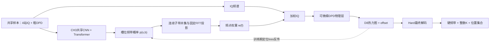

# 统一端到端模型研究

> 建立日期：2026-08-31  
> 文档状态：`E2E-G2`已执行至P2并判定`G2_NO_GO_REPRESENTATION`；P0张量接口与P1固定全频输入通过，P2逐源空间强过拟合未通过，按计划不执行P3。
> 阶段边界：本文暂不宣布原研究主线进入“第三阶段”。在用户明确确认阶段切换前，使用工作树内临时编号 `E2E-G0...E2E-G3`；若后续确认第三阶段，再统一映射为 `S3-G*`。  
> 证据边界：E2E-G0至G2-P2已有单seed、小规模validation/train能力门证据；G2未进入P3因果两轨，全文未读取test，不产生论文性能优越性结论。
> 路径边界：原项目 `F:\SourceCount_DPD\outputs` 只读；本文对应的全部新数据、缓存、权重和结果只能写入 `F:\SourceCount_DPD_E2E\outputs_e2e`。

## 1. 结论先行

本研究线的目标不是把第三章和第四章的两个推理脚本放进同一个入口，而是建立一个**同时输出源数、逐源频带和逐源位置，并能让定位误差反向修正前级逐源表示的统一模型**。最终推理不再需要真实频带或真实源数，Hard操作只保留在最后的结果解码中。

现有系统已经提供了较强的模块化基线：CH3 负责 19 子带上的槽位频带检测与计数，CH4-D8 负责细 DPD 热力图和 offset 定位，R5-A 又通过冻结模型的候选 K 与空间证据降低了计数路径损失。但该系统仍有硬阈值、硬频带掩码、Top-K 和候选 K 后处理，两个模型也未被最终定位损失联合优化，因此不能改名为端到端模型。

E2E-G0/G0D/G0-R1首先证明，旧“在线Soft细DPD物理桥”在分段混合精度下能够可信反传。E2E-G1/G1-R1随后证明，梯度虽然存在，却没有带来相对同前向stop-gradient对照的validation收益。问题已经从“能不能反传”转为“定位反馈是否具有明确的逐源和空间语义”。

E2E-G2验证的第一版结构为：

$$
\boxed{\text{CH3逐源查询}+\text{频率—空间潜在拆分}+\text{固定细DPD单次D8编码}+\text{逐源Heatmap/Offset}}
$$

它仍遵循“Soft内部训练＋Soft内部推理＋Hard最终解码”，但定位梯度不再穿过在线FFT、特征值分解和细DPD生成，而是通过逐源融合短路径返回CH3的频带logits、source query和粗空间特征。执行表明该短路径梯度有效、固定全频输入也可复用，但第一版逐源空间表示未通过32样本强过拟合门。

G0—G1已经确认的稳定结论为：

1. 物理桥、DPD 与归一化应使用 FP64 计算，再把归一化结果转为 FP32 送入常规 D8；训练用 D8 与 loss 不需要整体改成 FP64。
2. 梯度门应分层验证：物理链使用 FP64 有限差分，完整网络以 full-double 诊断抽查，不再用整条 FP32 网络的微小 loss 差作为否决证据。
3. G0-R1已按上述合同通过；G1判定`G1_NO_GO`，G1-D1隔离出第一版Soft计数语义失配；G1-R1修复计数语义后仍未获得定位反馈收益。
4. G1-R1的`NO_GO`只否定旧在线物理反馈接口，不否定其他端到端结构；因此G2改为验证逐源频率—空间潜在融合，而不是扩seed或调旧路线loss。
5. 空间计数头仍不进入基础模型；test继续冻结。
6. G2-P0/P1已经通过；P2能够记住源数和频带，且定位梯度能到达CH3/query，但Recall@10m未达到预注册门并存在残余query重合，因此第一版source splitting判为`NO_GO`，P3未执行。

当前路线优先级更新为：

1. **当前首要路线第一版（`E2E-G2=G2_NO_GO_REPRESENTATION`，停止扩规模）**：固定全频输入和梯度短路径可行，但现有query＋Soft频带加权粗空间拆分不能充分形成逐源细空间表示；下一步只能先审批单因素source splitting修正并重做P2。
2. **G0—G1旧在线物理接口（`G1_R1_NO_GO`，停止）**：连续频带桥能够运行，但定位梯度没有形成可选择收益；不再扩seed或调权重。
3. **暂时搁置的理想路线**：`19×401×401` 频率分辨细 DPD，以完整频率—空间分辨率换取最直接的联合建模，但当前资源代价过高。

E2E-G2第一版不增加CH4空间计数头，也不同时启用DSNT坐标loss、粗空间对齐loss或梯度手术。它们只在核心短反馈链已经证明有效、且对应问题确实出现时逐项消融。

## 2. 研究目标与非目标

### 2.1 总目标

在保留 DPD 物理先验、CH3 频带语义和 CH4 细网格定位能力的前提下，研究并验证一个从共享输入到变长源位置集合的统一可训练模型，使定位目标能够反向影响频带表示和源存在性判断。

### 2.2 可检验的子目标

- 从CH3全局池化前保留每个子带的空间特征，并形成三个逐源query。
- 用频率概率和粗空间注意力共同构造逐源粗特征，使同频多源仍可能靠空间结构区分。
- 用一张与真值/预测频带无关的固定细DPD完成一次D8编码，再按query形成逐源Heatmap/offset。
- 消除训练和推理内部对预测K硬分流的依赖；真实K只用于监督和匹配，Hard操作只保留在最终解码层。
- 将 K 从外部控制量改为模型输出的源存在性或集合基数，使 K=0/1/2/3 使用同一输出契约。
- 使统一训练能够继承已验证的 CH3、D8 checkpoint，而不是从随机初始化同时重学全部物理与视觉表征。
- 同时保留 CH3 的频带/源数输出和 CH4 的 Heatmap、offset 与位置输出，不把统一模型缩减为只报告最终位置。
- 用系统级集合指标、章级辅助指标、梯度证据和资源证据共同判断路线，而不是只优化一个平均 RMSE。

### 2.3 非目标

- 不把现有模块化级联、四轨诊断或 R5-A 后处理重新命名为端到端模型。
- 不在张量接口、固定细DPD兼容性和32样本强过拟合通过前运行256样本因果训练。
- 不因“端到端”标签而删除 DPD 物理层、Hard-19 基线、D8 热力图监督或现有章级评价。
- 不用 test 选择架构、loss 权重、阈值、查询数、训练轮数或数据规模。
- 不预设联合训练一定优于模块化级联；若收益不稳定或代价过高，负结果同样有效。
- 不在E2E-G2中批准直接IQ网络、正式规模、冻结test或投稿结论。
- 不在首要路线基础模型中加入 CH4 空间计数头；该模块只保留为后续条件消融。

## 3. 当前证据基线

### 3.1 原项目可继承证据

| 基线事实 | 对本研究的意义 | 证据入口 |
|---|---|---|
| CH3 使用 19 幅 81×81 粗 DPD，经共享 CNN、Transformer 和频率有序槽位输出频带 | 可继承为粗粒度频带编码器；现有计数由非空槽位硬阈值得到，不可直接参与端到端梯度 | `第一阶段_论文与代码接管审查.md`、`CH3-S2G5-R4-20260828` |
| CH4-D8 使用 401×401 细 DPD、热力图和 offset 定位 | 可继承定位主干和密集监督；训练 loss 本身可微，但当前细 DPD 由离线硬频带生成 | `第一阶段_论文与代码接管审查.md`、`CH4-S2G2-20260822` |
| Hard-19-Actual 在 4k/8k oracle 适配中逼近 Exact，Soft-19 没有稳定额外收益 | Hard-19 是必须保留的物理与性能对照；“连续权重可微”不能被直接解释为“Soft 一定更好” | `SYS-S2G4-R2/R3/R4` |
| 四轨诊断显示完整级联退化主要来自 K 路径，而非频带路径 | 统一输出必须把基数误差作为主问题，而不能只微调频带概率 | `SYS-S2G5-R3-20260828` |
| 16k CH3 提高频带 F1，但没有自然消除 K 路径损失 | 单纯扩大 CH3 数据不是统一模型的替代方案 | `CH3-S2G5-R4-20260828` |
| R5-A 将 K=2/3 计数准确率从 87.30% 提高到 95.51%，但跨 seed 严格门仅 1/3 通过 | D8 空间证据对 K 有互补性，但冻结后处理仍不是联合训练，稳定性仍需解决 | `SYS-S2G5-R5A/R6A` |
| K=1 定位接口尚未实现；低 SNR 和 K=3 距离长尾尚未对齐 | 新模型必须单独验证 K=1 和长尾，不能只在 K=2/3 平均指标上通过 | `SYS-S2G5-R1`、`CH4-S2G5-R6B0-20260830` |

精确路径、指标、SHA256 和资源事实继续以 `实验结果记录.md` 为唯一事实源。本文只保留会影响统一模型设计的综合结论。

### 3.2 可微物理层的动态审计结论

G0 已在不修改历史第四章算子的前提下新增固定支持、可微分块实现，并完成动态审计：

- 固定 4096 频点支持避免了 `w_f>0` 动态裁剪计算图；K=0、近零、单带、重叠带、全一及普通连续输入均保持有限。
- K=0/1/2/3 的 401×401 反向梯度全部有限且非零，计算资源远低于预设停止线，说明图能够连接且工程资源不是当前阻塞点。
- 算子级有限差分通过，但冻结 D8 定位损失的完整系统有限差分与 autograd 方向相反；“能反传”不等于“梯度可信”。
- G0D 后续确认：checkpoint 模式不改变梯度，FP64 物理链 15/15 通过；首次 FP32 不可判定位置进入 D8 Heatmap logits，full-double 完整 D8/loss 链 7/7 通过。
- 当前正式数据将细 DPD 预计算后保存，定位 loss 无法穿过离线文件回到 CH3。

因此 G0 的历史判定仍是 `STOP_GRADIENT`，G0D 将路线级解释修正为 `IMPLEMENTATION_FIX`，随后G0-R1已完成修复重验并通过。该结果只解锁G1方案审批，不等于已经证明端到端训练有效。

## 4. “统一端到端模型”的定义

### 4.1 本项目采用的最低定义

若模型参数记为$\theta_3$（CH3逐源表示与频带部分）和$\theta_4$（CH4定位部分），最终集合定位损失记为$L_{set}$，则最低成立条件为：

$$
\left\|\frac{\partial L_{set}}{\partial \theta_3}\right\| > 0,
\qquad
\frac{\partial L_{set}}{\partial \theta_3}\ \text{有限且可由有限差分方向复核。}
$$

这里不要求定位梯度必须穿过FFT、特征值分解或细DPD生成。E2E-G2要求定位损失沿逐源频率—空间拆分和特征融合短路径，到达决定频带、存在性和source query的CH3参数；梯度非零只是工程条件，最终还必须相对相同前向的stop-gradient对照产生可选择收益。

### 4.2 分级定义

| 级别 | 定义 | 本项目判定 |
|---|---|---|
| `E2E-L0` | 两个模型在同一脚本顺序运行，接口含硬阈值/真实 K，分别训练 | 仅为级联，不是端到端 |
| `E2E-L1` | 定位loss经明确的可微接口更新CH3逐源/频带参数 | 本研究最低目标 |
| `E2E-L2` | 单一训练图同时输出 CH3 频带/源数和 CH4 Heatmap/offset/位置，训练不依赖预测 K 硬分流 | 期望目标 |
| `E2E-L3` | 从原始同步 IQ 进入全部物理与神经模块，只输出最终源集合 | 远期目标；不是初始化阶段的强制条件 |

### 4.3 不满足定义的情形

- 用 CH3 硬阈值生成掩码，再离线预计算细 DPD 训练 D8。
- 用真实 K 决定 D8 Top-K，只在报告中替换成 predicted K。
- 冻结两个模型，仅训练候选 K 后处理器或校准器。
- 多个 loss 写在同一优化器里，但定位 loss 对 CH3 梯度为零或被 `detach/no_grad/numpy` 截断。

## 5. 当前必须解决的问题

### 5.1 旧物理桥可微，但反馈路径过长且语义间接

G0—G1已经解决硬频带选择不可微的问题，也证明在线细DPD物理链可以可信反传。但定位误差必须穿过D8、401×401特征值空间谱、FFT权重和频带并集，最后才到达CH3 band logits。G1-R1表明这种梯度虽非零，却与CH3任务梯度近似正交且没有形成可选择收益。当前问题已从“能不能反传”转为“反馈接口是否具有明确的逐源和空间语义”。

### 5.2 源数 K 同时控制计算和评价

现有 K 由非空槽位数推断，又控制 D8 的 Top-K 解码。错误 K 会同时造成漏检/多检和位置集合大小错误。R3/R4 已证明这是当前主要级联瓶颈，因此训练和推理的内部图都不依据预测 K 跳过细 DPD 或 D8；整数 K 只在最终解码时决定位置集合大小。

### 5.3 多源输出是变长且无序的集合

固定槽位需要人为规定顺序；Hungarian/PIT 则允许无序匹配。师弟论文按频偏排序槽位，DPV 按到原点距离排序位置，而 DETR、Deep Sets 和 Multi-ACCDOA 提供集合或置换不变路线[4-9]。本项目中频率相近、同频混叠和对称位置会使固定排序出现边界不连续，必须通过对照实验决定，而不能直接照搬某一种顺序。

### 5.4 固定全频细DPD与现有D8存在输入分布差异

现有D8使用按真实频率重叠组生成的细DPD训练；E2E-G2改为每个样本一张固定全频细DPD。这样可以取消在线细DPD反传，但也可能使D8看到未训练过的频率混合和干扰结构。必须先比较原分组输入与固定全频输入，确认冻结D8特征仍可利用；若严重失配，应先适配D8输入，不得把结果误归因于逐源融合失败。

### 5.5 当前CH3没有真正的exchangeable source query

当前CH3先把每个子带池化成向量，再把19个Transformer token取均值得到一个全局特征，最后由多个独立band head输出有序槽位。现有head隐藏激活可以作为query的输入锚点，但它们本身不是可以通过集合匹配自由交换的source query。E2E-G2必须显式增加query构造和Hungarian匹配，同时用零初始化残差保留原CH3初始频带输出。

### 5.6 逐源空间拆分可能发生query坍缩

如果两个query产生近似相同的频带概率和空间注意力，它们会输出同一位置，尤其会破坏同频多源定位。第一版先实现建议文档中的独立空间softmax，并固定记录query间注意力重叠；只有观测到坍缩后，才单独增加slot竞争和background，不与核心结构同时上线。

### 5.7 多任务loss和可选辅助监督必须分阶段

第一版只使用存在性、频带、Heatmap和offset四项已知监督。DSNT坐标loss会改变Heatmap优化目标，粗空间对齐loss会直接把真实位置监督注入CH3，GradNorm/CAGrad会改变多任务更新方向；三者都可能有效，但同时加入会失去因果归因。它们只在核心短反馈链通过或暴露出对应故障后逐项启用。

### 5.8 数据与论文条件的长尾仍未闭合

R6-B0 的低 SNR 与 K=3 距离长尾尚未对齐。联合训练可能改善平均指标，也可能加剧尾部错误；因此长尾必须成为预注册分层，而不是在平均 GOSPA 改善后再补充观察。

## 6. 研究问题与可检验假设

### 6.1 研究问题

| 编号 | 研究问题 |
|---|---|
| `RQ1` | 逐源频率—空间潜在拆分能否建立比在线细DPD物理链更直接、更有效的定位反馈？ |
| `RQ2` | 在前向完全相同的条件下，允许定位loss更新CH3/query是否比stop-gradient对照降低系统GOSPA？ |
| `RQ3` | source query与空间注意力能否在频带相同或接近时，仍把多个源拆成不同的空间表示？ |
| `RQ4` | 联合模型的收益能否跨训练 seed，并在低 SNR、K=3 长尾、不同距离和带宽条件下保持？ |
| `RQ5` | 固定全频细DPD和单次D8编码能否把E2E-G2因果验证控制在可接受时间内？ |

### 6.2 初始假设

- `H1`：定位loss经逐源Heatmap/offset、融合层、频率—空间mask到band logits的短路径，能比旧物理桥形成更具有任务语义的梯度。
- `H2`：在冻结两章encoder、只训练接口和轻量逐源head时，`FS-E2E`应优于完全相同前向的`FS-SG`，且不以破坏CH3计数/频带能力换取平均定位收益。
- `H3`：对同频或近频多源，频率gate可能相同，但source-specific空间注意力应形成不同的粗空间表示；若注意力持续高度重叠，则当前拆分机制不成立。
- `H4`：联合收益若只在单 seed 或中等 SNR 出现，则不能作为统一模型成立证据。
- `H5`：固定细DPD只生成一次、D8只编码一次且不反传物理层后，训练成本应明显低于G1-R1；若实测投影仍超过两小时，必须先处理重复计算和batch效率。

## 7. 文献与方法证据地图

扩展文献综述、来源链接和完整结构推导由`端到端多源定位框架_文献综述与结构建议.md`负责；本文只保留已经进入实施方案的证据映射。当前E2E-G2新增采用的关键共识是：多源任务需要在网络中间形成source-specific representation，变源数输出适合query/existence与集合匹配，训练内部保持Soft而Hard决策只留在最终解码。

### 7.1 与本项目最接近的证据

| 文献路线 | 可借鉴内容 | 不能直接外推的部分 |
|---|---|---|
| 经典 DPD[1] | 从多站观测直接构造位置代价/空间谱，支持保留固定物理层 | 不解决神经网络可微接口、未知 K 或变长输出 |
| 模块化神经 DPD[2] | 明确指出多源排列与未知源数会使单阶段固定输出难以训练，并用检测—过滤—定位分解 | 区域划分、多 MLP/RBF 与本项目 DPD 图像网络不同；不能作为端到端优越证据 |
| 未知源数 DPD[3] | 从空间谱同时估计源数与位置，证明 K 不必永远作为先验输入 | 属于解析/谱峰路线，不提供 CH3—D8 联合训练方法 |
| DPV 变长端到端被动定位[4] | Zero Padding、存在置信度、Sort Invariant Training；本地全文的 III-C/III-F/V-G 给出排序、联合位置+BCE loss 和消融 | LEO TDOA/FDOA、时频图输入、公里级场景与本项目不同；按原点距离排序在对称位置下可能不稳定 |
| E2E-MSL | Soft内部选择、可微定位模块、Hungarian和分阶段训练，说明最终定位误差应返回具有空间语义的中间表示 | Local radio map与DPD的旁瓣/伪峰结构不同，不能直接照搬其连通域假设 |
| Source Splitting | 在共享latent feature中显式生成逐源表示，支持frequency-spatial splitter | 声学时频mask不能直接替代无线DPD的频率—空间归属，需要本项目验证 |
| DETR 与 Deep Sets[5-6] | 固定查询 + no-object、二分图匹配、置换不变集合函数，为 K=0/1/2/3 统一输出提供通用框架 | 视觉检测结果不等同于 DPD 定位收益；需要本项目自己的位置/band 匹配代价 |
| CenterNet[7] | 中心点热力图与属性回归支持保留 D8 的密集定位支路 | 推理 Top-K 仍不可作为训练期 K 门控 |
| ACCDOA / Multi-ACCDOA[8-9] | 将活动与位置耦合；ADPIT 处理同类重叠，为“存在性+位置”联合目标提供跨领域近邻 | 声学 DOA 类别轨道与无线频带槽位不同，只能作为结构类比 |
| Gumbel-Softmax / NeuralSort[10-11] | 为离散选择和排序提供连续松弛 | 会引入温度、偏差和训练/推理差异；不应先于简单连续频带桥使用 |
| 不确定性加权 / GradNorm[12-13] | 为多任务 loss 尺度与学习速度失衡提供可检验工具 | 不能替代任务归一化、梯度诊断和公平对照 |
| GOSPA[14] | 同时分解定位、漏检和虚警，适合变长源集合的系统主指标 | 需要同时报告分量与章级指标，不能只报总分 |

### 7.2 文献间的条件差异

- DPV 的 SIT 与 DETR 的 Hungarian 匹配不是简单的相互否定：SIT 用稳定几何顺序降低匹配成本，Hungarian 则不要求全局固定顺序。本项目需要用频率接近度和位置对称性分层比较二者。
- ACCDOA 通过单一活动向量减少检测/定位双 loss 的平衡问题，但本项目还需要保留 19 子带的可解释频带监督，因此不宜在首轮就删除独立 band loss。
- Gumbel-Softmax 和 NeuralSort 证明离散运算可以松弛，但现有 Soft-19 的负证据提醒：可微性与定位信息保真是两个独立 Gate。

## 8. 当前统一架构

### 8.1 G0—G1已验证并停止的在线Soft物理接口

**当前状态：`E2E-G1-R1=G1_R1_NO_GO`。** 下述结构已经完成工程、梯度、第一版G1和语义修正版G1-R1的单seed因果训练验证；G1-R1消除了Soft计数绝对崩溃，但没有获得定位反馈收益。E2E-G2不继续训练该接口，而是更换为逐源潜在融合。

设 CH3 输出第 $s$ 个槽位、第 $b$ 个子带的 logit 为 $z_{s,b}$：

$$
p_{s,b}=\sigma(z_{s,b}),\qquad
u_b=1-\prod_s(1-p_{s,b}).
$$

$u_b$ 表示任一源占用子带 $b$ 的连续并集概率。再用固定的子带—FFT 覆盖矩阵 $A_{f,b}\in[0,1]$ 映射到频点：

$$
w_f=1-\prod_b(1-A_{f,b}u_b),\qquad
X_m'(f)=\sqrt{w_f}\,X_m(f).
$$

其中 $A$ 只编码已经冻结的 Hard-19-Actual 几何关系，不学习新的物理带宽。二值 $p$ 时必须退化到现有子带并集；连续 $p$ 时保留梯度。细 DPD 继续由多站互谱、几何相位补偿和最大特征值形成，D8 继续输出热力图与 offset。

训练与推理共用的内部图如下：



训练阶段不依据预测 K 跳过 CH4，也不使用预测 K 控制 D8 dense 前向。D8 仍只接收由连续频率权重生成的细 DPD；真实 K 只用于构造 Heatmap/offset 监督。总损失初始写为：

$$
L_{total}=L_{band}+\lambda_eL_{exist}+\lambda_hL_{heatmap}+\lambda_oL_{offset}.
$$

各项先按有效监督元素归一化，再通过梯度尺度诊断决定是否需要调整权重；不能仅因总 loss 下降就判定联合训练收敛。

推理阶段复用完全相同的 Soft 内部图，不把阈值后的频带或整数 K 反馈给频带桥：

```text
粗DPD → CH3 logits/probabilities → 连续频带并集与频点权重
                                      ↓
原始IQ ───────────────────────→ 加权IQ → 连续细DPD → D8 Heatmap/offset
                                                           ↓
最终解码：band threshold + argmax P(K) + NMS/Top-K + offset
                                                           ↓
                  硬频带、整数K、确定长度的位置集合
```

因此，CH3 对外报告的硬频带和整数 K 与内部使用的连续概率明确分离：前者是最终结果，后者是 DPD 条件。K=0 也先运行 Soft 内部链，再由最终解码器返回空位置集合；提前跳过只是后续可验证的部署优化，不属于基础模型。

该路线的优势是最大限度继承两章模型、消除训练/推理内部图不一致，并让定位信息始终作用于频带概率；主要风险转为细 DPD 反向图成本、近零权重归一化、连续频带过宽造成的 D8 输入分布偏移，以及定位监督对 K 的反馈弱于对频带的反馈。历史 Hard/Hard 级联继续作为强基线与消融，不再作为目标部署图。

### 8.2 G1已确认的源存在性与基数修正

对每个槽位可定义连续存在概率：

$$
q_s=1-\prod_b(1-p_{s,b}).
$$

G1第一版使用 **Poisson-binomial 基数**，后经G1-D1和G1-R1确认存在语义失配。修正版改为max-logit槽位存在、直接槽位BCE和Hard最终K，已使Soft-SG恢复到Hard同量级。该修正继续由E2E-G2继承，但没有使G1旧定位反馈链产生收益。

E2E-G2继续沿用“存在性来自逐源频带输出、Hard K只在最终解码形成”的原则，不恢复Poisson-binomial主loss，也不增加CH4空间计数头。

### 8.3 E2E-G2当前首要路线：逐源频率—空间潜在融合

输入为`19×81×81`粗DPD和一张不依赖真值/预测频带的固定`401×401`全频细DPD。模型同时输出CH3的逐源频带与源数，以及CH4的逐源Heatmap、offset和位置。

当前CH3没有现成的exchangeable source query，而是由多个独立band head读取同一个全局特征。E2E-G2从现有head隐藏激活构造query锚点：

$$
q_i=\operatorname{CrossAttn}(e_i+W_hh_i,T,T),\qquad i=1,2,3,
$$

其中$h_i$是现有前三个band head的64维隐藏激活，$T$是19个Transformer子带token，$e_i$是learned embedding。频带logits采用零初始化残差：

$$
z_i=z_i^{legacy}+\Delta z(q_i),
$$

使模型初始化时保留原CH3输出，后续又允许定位loss更新band logits和query。

从CH3全局池化前保留每个子带的空间特征$F_b^c\in\mathbb R^{128\times11\times11}$。每个query同时产生频率gate和空间attention：

$$
g^f_{ib}=\sigma(z_{ib}),\qquad g^s_{ibxy}=\operatorname{softmax}_{x,y}(s_{ibxy}),
$$

$$
\tilde F_i^c(x,y)=\sum_b\bar g^f_{ib}g^s_{ibxy}V(F_b^c(x,y)).
$$

频率gate回答“这个源使用哪些频带”，空间attention回答“这个频带中的哪些空间区域属于该源”。即使两个源同频，仍可尝试通过不同空间attention形成不同表示。

固定细DPD只生成一次。D8 backbone、PAN和decoder trunk也只运行一次，暴露共享高分辨率特征$d_0\in\mathbb R^{32\times401\times401}$。逐源融合采用：

$$
F_i^f=\gamma(q_i)\odot d_0+\beta(q_i),
$$

$$
U_i=\operatorname{Fuse}\left(F_i^f,\operatorname{Up}(\tilde F_i^c)\right),\qquad U_i\rightarrow(H_i,O_i).
$$

D8主干只编码一次，后面三个轻量共享head分别给三个源输出Heatmap和offset。定位loss可沿`Heatmap/offset→融合层→频率—空间mask→band logits/query`的短路径返回CH3，不再反传在线FFT、特征值分解和细DPD生成。

### 8.4 暂时搁置的理想路线：频率分辨细 DPD

输入为 `19×401×401` 频率分辨细 DPD，每个固定子带都保留细空间谱。它能够在高分辨率特征上直接进行逐源频带加权和定位，理论连接最清楚，但输入元素约为“粗 DPD + 单张细 DPD”的 10.7 倍，DPD 生成、存储与训练激活成本均显著增加。

本路线当前不分配Gate、不生成数据、不实现代码。只有E2E-G2仍因信息不足而失败，且资源预估表明可执行时，才另行提出方案。

### 8.5 E2E-G2集合输出与Hard最终解码

E2E-G2固定$Q=3$个source query，每个query输出：

- 存在概率 $e_j$；
- 二维位置 $(x_j,y_j)$；
- 可选的 19 子带属性 $b_j$。

训练时用Hungarian匹配最小化“存在性＋频带＋Heatmap/位置”代价；未匹配query监督为空源。训练和内部推理不根据预测K跳过query或D8，最终才根据存在性阈值输出Hard频带、整数K和确定长度的位置集合。Heatmap+offset是正式定位输出，不是临时辅助支路。

### 8.6 必须保留的对照

| 对照 | 用途 |
|---|---|
| 冻结模块化 Hard/Hard 级联 + R5-A | 当前可部署强基线，判断 Soft 内部统一模型是否有新增价值 |
| Hard-19-Actual oracle-band/oracle-K | 隔离物理表示上限，不作为端到端结果 |
| predicted-band/oracle-K | 隔离频带桥影响 |
| oracle-band/predicted-K | 隔离基数影响 |
| `FS-SG`：完整G2架构但在逐源接口stop-gradient | 与`FS-E2E`保持完全相同前向，隔离定位梯度进入CH3/query的因果作用 |
| 相同架构仅用章级 loss | 区分共享参数量与最终定位监督的作用 |

### 8.7 暂缓路线

- DSNT/Soft坐标loss：只有Heatmap已经学习、但Hard峰值解码与集合指标明显不一致时才单独加入。
- 粗空间对齐loss：只有空间attention长期弥散或错位时才单独加入；它会直接用位置监督CH3，不能与核心G2同时归因。
- source/background竞争注意力：只有query空间重叠诊断确认坍缩时才启用。
- GradNorm/CAGrad/PCGrad：只有新表示能够学习且记录到稳定梯度冲突后才考虑。
- 直接用 Gumbel/straight-through 生成硬频带：仅当连续内部表示本身失败、但 Hard 表示仍有明显上限时再单独审批。
- 直接用 NeuralSort 排序源：仅当固定频率顺序有价值、普通排序边界导致训练不稳时再启用。
- DPV 式原始 IQ 直出位置：改变输入表征和两章创新边界过大，且需要新的大规模数据与公平基线，暂不作为首轮方案。
- 完全删除细 DPD：只有在统一模型已通过且消融证明物理层不再提供独立价值时才可讨论。
- CH4空间计数头：不进入E2E-G2；仅当核心路线已证明定位反馈有效而K仍稳定受限时，作为后续单独消融。

## 9. 数据、输出与训练契约

### 9.1 输入契约

- 样本身份以统一 IQ manifest 为主键；粗 DPD、标签和已有参考产物必须能回指同一 sample ID。
- E2E-G2输入预计算`19×81×81`粗DPD和单张固定`401×401`全频细DPD；固定细DPD的FFT支持对所有样本相同，不依赖真实频带、预测频带或真实位置。
- 当前D8训练输入按真实频率重叠组生成，和固定全频细DPD存在分布差异；G2必须先做冻结兼容性检查，再决定能否复用D8 encoder。
- 固定细DPD先在小样本上测速和核验，只有完整Gate成本投影满足停止线后才扩展缓存；不再在线反传FFT/EVD。
- 训练、validation、test维持严格分离；E2E-G2不读取test。
- 原 `outputs` 中的权重和数据只能经 `统一模型代码/reference_artifacts.py` 注册后只读加载。

### 9.2 输出契约

统一输出必须同时保留两章结果：

- `legacy_band_logits`：原CH3十个有序head的诊断输出，用于确认checkpoint能力没有被静默破坏；
- `query_band_logits/probabilities/mask_hard`：三个source query的逐源频带结果；
- `existence`与最终整数`predicted_K`：三个query的存在性和源数结果；
- `source_attention`与`source_coarse_features`：逐源空间归属和频率—空间融合后的粗特征；
- `source_heatmap/offset`：三个query各自的CH4定位输出；
- `position_set`：Hard最终解码得到的二维位置集合及置信度；
- `fusion_diagnostics`：定位到band logits/query/spatial attention的梯度、attention entropy、query间重叠和非有限计数。

K=0样本的真实位置集合为空；三个query继续完成Soft前向，训练期Heatmap使用全零目标、offset loss为零、存在性loss保留，最终Hard解码才返回空位置集合。不得伪造零坐标源，也不得依据预测K静默跳过样本。

### 9.3 训练顺序

1. G0—G1已经完成旧连续物理接口的数值、梯度、计数语义和因果收益验证。
2. G2先暴露CH3池化前空间特征、Transformer token、head隐藏激活和D8共享`d0`，验证关闭新增模块时旧输出不变。
3. 只生成32张固定全频细DPD，检查数据身份、输入分布差异、D8冻结前向和完整成本投影。
4. 在32条K平衡且包含同频样本的数据上做强过拟合，确认模型能拆源、能定位且梯度到达band logits和空间attention。
5. 前三项通过后，执行256训练/128选模/512比较的`FS-SG`与`FS-E2E`两轨因果训练。
6. G2通过后才扩大seed、解冻encoder或逐项加入DSNT、空间对齐、竞争attention等条件消融；所有选择冻结后才读取test。

任一步出现章级能力不可解释退化，先回到最近冻结点，不继续全模型解冻。

### 9.4 计划模块与文件边界

以下为后续代码实施的建议边界，本轮只记录方案，不创建文件：

| 计划路径 | 单一职责 | 禁止混入 |
|---|---|---|
| `统一模型代码/models/e2e_latent_fusion.py` | 组织CH3特征、source query、频率—空间拆分、单次D8和逐源输出 | 数据生成、选模和统计 |
| `统一模型代码/models/source_query.py` | 由现有head隐藏激活与Transformer token形成三个query，并输出零初始化band残差 | DPD生成和Hard解码 |
| `统一模型代码/models/frequency_spatial_splitter.py` | 计算频率gate、空间attention和逐源粗特征 | DSNT、空间对齐loss和梯度手术默认启用 |
| `统一模型代码/data/prepare_fixed_fine_dpd.py` | 生成与频带/位置无关的固定全频细DPD缓存与manifest | 写入原`outputs`或在线反传物理链 |
| `统一模型代码/models/final_decoder.py` | Hard频带、整数K与NMS/Top-K位置集合的最终确定性解码 | 把Hard结果反馈给内部DPD/D8 |
| `统一模型代码/losses/unified_loss.py` | 分项归一化的 `loss_ch3/loss_ch4` 与诊断字段 | 空间计数头和自适应权重的默认启用 |
| `统一模型代码/audits/e2e_g2_preflight.py` | 编排张量等价、固定输入兼容性、32样本过拟合、梯度和资源检查 | 正式训练和test评价 |
| `统一模型代码/e2e_g2_latent_fusion.py` | 两轨成对训练、选模、评价、bootstrap和可恢复状态 | test读取与事后更改Gate阈值 |
| `统一模型代码/configs/` | 数据、桥、loss、资源与Gate配置 | 原 `outputs` 写路径 |

所有新产物只写 `outputs_e2e`；正式实现优先包装并复用现有底层模型，不批量修改历史 Gate 脚本。

## 10. Gate 总路线

| Gate | 当前状态 | 只回答什么问题 | 允许进入下一步的必要条件 |
|---|---|---|---|
| `E2E-G0` | `STOP_GRADIENT` | Soft 连续桥在完整分辨率下是否数值正确、可反传、前向不退化且资源可行 | 未满足：完整系统梯度方向不一致 |
| `E2E-G0D` | `IMPLEMENTATION_FIX` | 完整系统梯度为何与有限差分异号，属于工程实现、局部非光滑还是物理层阻塞 | 已排除checkpoint与物理层阻塞；实施精度/审计修复并完整重跑G0 |
| `E2E-G0-R1` | `G0_PASS` | 分段混合精度图是否满足完整G0数值、梯度、资源和冻结前向门 | 已满足；随后G1已完成 |
| `E2E-G1` | `G1_NO_GO` | 定位梯度进入 CH3 后是否产生可归因的早期收益 | 未满足：`Soft-E2E`的GOSPA相对同前向detach对照略差 |
| `E2E-G1-D1` | `SOFT_COUNT_FAILURE_CONFIRMED` | 第一版Soft绝对退化是否主要来自Poisson-binomial最终K | 已确认；硬槽位K恢复Hard同量级，但不改写G1或解锁当时预写的多seed计划 |
| `E2E-G1-R1` | `G1_R1_NO_GO` | 修正计数语义后，旧定位反馈是否产生可选择收益 | 未满足：两轨均选择epoch 0；旧接口停止 |
| `E2E-G2` | `G2_NO_GO_REPRESENTATION` | P0/P1与梯度短路径通过，但第一版逐源空间表示未通过P2强过拟合门 | 不执行P3；source splitting修正须另批 |

当前主验证路线为G0—G2：G0解决旧物理链数值与梯度可信性，G1检验旧接口的因果收益，G2改用逐源频率—空间潜在融合检验新的反馈接口。原先在G1运行前预写的“多seed G2”和“冻结test G3”从未解锁，现合并保留在第15章作为已作废历史计划，不再占用当前编号。G2通过后的后续Gate另行审批和编号。

## 11. E2E-G0：连续桥可行性与冻结前向预检

### 11.1 计划状态与唯一问题

执行状态为 `STOP_GRADIENT / E2E-G0-20260831`。G0 未训练模型、未读取 test，回答是：能够构造二值边界一致、边界稳定、资源可承受并可产生非零梯度的连续内部图，但尚不能证明冻结 D8 定位 loss 对 CH3 band logits 的梯度方向可信。

G0 未通过，G1 不解锁；本结果不构成“端到端有效”或“Soft 优于 Hard”的性能结论。

### 11.2 固定输入、模型与样本

| 项目 | G0 固定方案 |
|---|---|
| 参考模型 | 只读核对 `reference_artifacts.py` 中 `ch3_seed42` 与 `d8_seed42` 的路径、大小和 SHA256；仅作工程探针，不在 G0 选模型 |
| 数据分区 | 只用冻结 validation；不生成或读取 test 下游评价结果 |
| 样本清单 | 按元数据预先选 16 条，K=0/1/2/3 各 4 条；非零 K 覆盖窄/宽带、低/中/高 SNR、频带边界/重叠和不同源间距 |
| 反向子集 | 从上述清单固定 K=0/1/2/3 各 1 条；资源主样本取预计支持最宽、图最大的 K=3 样本 |
| 算子边界例 | 额外构造全零、近零、单子带、相邻重叠子带、全一和普通连续概率，不携带性能标签 |
| 当前设备基线 | RTX 4070 Ti SUPER 16 GiB、系统 RAM 31.84 GiB、PyTorch 2.8.0+cu129；执行时重新记录可用资源 |

样本 ID 只能依据元数据选择，并在运行任何模型结果前写入 manifest。若某分层在 validation 不存在，只报告缺口，不从 test 补样本。

### 11.3 G0 允许实施的代码边界

G0 获批后只允许新增或最小包装以下职责：

- `physics/band_bridge.py`：计算 $p_{s,b}$、连续并集 $u_b$ 和固定映射 $w_f$；二值测试输入必须退化为 Hard-19-Actual 并集。
- `physics/fine_dpd_autograd.py`：复现现有 FFT、互谱、几何相位补偿和最大特征值语义，移除会截断反向图的 NumPy/落盘边界；允许固定频率支持和网格分块，不允许按可学习的 `w_f>0` 动态裁剪计算图。
- `models/final_decoder.py`：只在网络末端执行 band threshold、$\arg\max P(K)$、NMS/Top-K 和 offset；不得把硬结果反馈给细 DPD 或 D8。
- `audits/gradient_audit.py` 与 `audits/e2e_g0.py`：编排身份、等价、梯度、稳定性、冻结前向、解码和资源检查；不包含训练循环。

G0 不创建 `unified_loss.py` 或 `train_unified.py` 的正式实现，不改历史 `第三章代码`、`第四章代码` 和原 `outputs`。必要复用通过包装完成。

### 11.4 Soft 内部与 Hard 最终解码契约

基础内部图固定为：

$$
p=\sigma(z),\quad
u_b=1-\prod_s(1-p_{s,b}),\quad
w_f=1-\prod_b(1-A_{f,b}u_b),\quad
X_m'(f)=\sqrt{w_f}X_m(f).
$$

- 第一版不把 $q_s$、整数 K 或硬 band mask 乘入 $w_f$，避免错误 K 重新切断定位梯度。
- 频率支持域只由冻结矩阵 $A$ 决定；支持域内的连续权重全部保留，不使用经验阈值剪枝。
- 沿用当前 DPD 的站间功率归一化与 D8 sample z-score 语义，但所有除法显式加 $\varepsilon$。精确全零权重采用显式 null 契约：跳过单位功率归一化，只保留固定对角加载形成的常数背景，经 D8 z-score 后必须为全零有限输入；近零权重仍走连续算子并单独审计。
- Hard 最终解码固定保存 `band_mask_hard`、`predicted_K` 和 `position_set`。若硬 band mask 的非空槽位数与 $\arg\max P(K)$ 不一致，只记录 `hard_count_mismatch`，G0 不做隐藏修复；位置集合长度必须严格等于 `predicted_K`，K=0 时为空。
- 同时保存 Soft 内部量和 Hard 最终量，防止把“对外硬输出”误写成“内部硬推理”。

### 11.5 七项执行检查

1. **身份与只读门**：解析双根路径，核对两份冻结 checkpoint、validation 数据和 manifest 身份；确认输出根为空或不存在，执行配置和代码中不存在写入原 `outputs` 的目标路径。
2. **参考噪声与二值等价**：先在相同 dtype/device 上重复旧算子，登记数值噪声；再比较旧 `freq_mask`、旧 binary `freq_weights` 与新桥二值模式的频点权重、原始细 DPD、D8 标准化输入和 dense 输出。
3. **连续边界稳定性**：运行全零、近零、单带、重叠带、全一及普通连续概率；检查 $u,w$ 范围、有效支持、DPD 动态范围以及所有中间量/输出/梯度的 NaN/Inf。
4. **双层梯度审计**：先用固定加权 DPD 标量做算子级 autograd；再用冻结 D8 的 `L_heatmap+L_offset` 做系统级 backward，确认梯度到达 CH3 band logits。两层都用预先固定方向做中心有限差分；普通光滑点要求符号一致且相对误差达标，近重特征值点单独标记为非光滑诊断。
5. **冻结前向兼容诊断**：16 条样本均运行 `Hard-reference` 与 `Soft-predicted`；报告相关性、GOSPA/RMSE、Heatmap/offset 和 K 分层，但除非出现非有限、常数塌缩或解码不完整，性能差距只作为 G1 初始化风险，不单独否决路线。历史 Soft-19 负结果不能由此改写。
6. **Hard 最终解码审计**：覆盖 K=0/1/2/3、并列峰和边界峰，复核确定性 tie-break、坐标/网格/offset、`len(position_set)=predicted_K` 及全部输出字段。
7. **完整资源与重复门**：在 `401×401`、batch 1、真实频率支持、冻结 D8 loss 下完成至少两次完整 forward+backward；缩小网格只允许定位瓶颈，不计入通过证据。

### 11.6 预注册容差与资源停止线

| 检查 | 通过/停止线 |
|---|---|
| 二值等价 | DPD 保持 `atol=max(1e-6, 5×旧算子重复绝对差)`、`rtol=max(1e-5, 5×旧算子重复相对差)`；因固定支持与旧动态支持存在浮点求和顺序差异，经用户批准，下游判据为 Hard 峰值索引完全一致且坐标差 `≤0.01 m`，dense logits 差异仅诊断 |
| 梯度 | 普通光滑点 autograd 与中心差分同号，方向导数相对误差 `≤5%`；四个 K 代表样本梯度均有限，K=1、2、3 三个有源样本均非零 |
| K=0 | 全零和近零案例无 NaN/Inf；全零权重经固定背景和z-score后为零；最终位置集合严格为空 |
| 确定性 | 固定输入/seed 的硬输出逐字段一致；连续张量和梯度差异不超过上方数值容差 |
| GPU | 峰值 allocated/reserved 均 `≤14.0 GiB`；超过即 `STOP_RESOURCE`，不靠 OOM 作为监控方式 |
| RAM | 进程峰值 working set `≤28.0 GiB`；超过即 `STOP_RESOURCE`，避免 Windows pagefile 掩盖不可行性 |
| 墙钟 | 单条完整 forward+backward 在预热后 `≤300 s`；两次均须完成。该线是工程淘汰线，G1 前仍需按实测吞吐估算 pilot 总预算 |

若有限差分步长扫描显示仅近重特征值点不稳定，而普通点通过，则结果记为 `PASS_WITH_EIGEN_RISK`，G1 必须继续监控；若普通点也不一致，则为 `STOP_GRADIENT`。任何改变最大特征值定义的平滑代理都属于算法变化，需另行审批，不能在 G0 自动替换。

### 11.7 输出目录与报告

所有结果写入不覆盖目录 `outputs_e2e/smoke/unified/e2e_g0/<timestamp>/`：

- `manifest.json`：代码状态、环境、冻结产物、样本 ID、随机方向和容差；
- `operator_equivalence.json`：Hard 二值边界和各层差异；
- `gradient_audit.json`：autograd、有限差分、梯度范数与非光滑标记；
- `stability_cases.json`：K=0 和算子边界例；
- `frozen_forward.json`：Hard-reference/Soft-predicted 诊断；
- `decoder_audit.json`：Soft/Hard 输出字段与解码不变量；
- `resource_report.json`：RAM、VRAM、墙钟和 DPD/D8 分项；
- `final_report.json`：唯一 Gate 状态、失败原因和是否解锁 G1。

G0 不产生训练 checkpoint。首次失败目录完整保留；只有低风险工程错误可在全新目录最小修复后重跑，算法、数据、模型、loss 或门限变化必须重新审批。

### 11.8 G0 总判定

- 七项全部满足：`G0_PASS`，允许提交 G1 的准确配置审批。
- 二值等价或普通点梯度失败：`STOP_NUMERIC` / `STOP_GRADIENT`，首要路线停止。
- 完整资源越线：`STOP_RESOURCE`，首要路线停止；是否转向“双编码器＋逐源中期融合”另行审批。
- K=0 只能靠硬跳过才能稳定：`REVISE_K0_CONTRACT`，不得用最终 K=0 空集合掩盖内部图失败。
- 冻结 Soft 前向性能下降但数值、梯度和资源均通过：仍可进入 G1，但须把该差距登记为 D8 适配风险；G1 的 `Soft-SG` 将直接检验它是否可学习恢复。

### 11.9 执行结果与结论

正式证据目录为 `outputs_e2e/smoke/unified/e2e_g0/20260831_235442`，精确身份、数值和资源见 `实验结果记录.md` 中 `E2E-G0-20260831`。结果分解如下：

- 二值等价、连续边界、算子级有限差分、Hard 最终解码、完整资源和确定性检查通过。
- K=0/1/2/3 的完整 401×401 定位 loss 梯度均有限，190/190 个 band-logit 元素非零；这证明反向链连接，但不证明方向正确。
- K=2 普通完整系统点的两个中心有限差分步长均与 autograd 异号，相对误差远高于 5%，触发 `STOP_GRADIENT`。
- 执行按预注册顺序停止，因此 16 样本冻结前向诊断未运行；不得把缺失报告解释为通过或性能失败。
- 按当时预注册规则，G1 不解锁；G0D 已将该异常解释为可修复的数值审计问题，后续状态见第12章。

## 12. E2E-G0D：完整系统梯度根因诊断

### 12.1 状态与唯一问题

状态为`COMPLETED / IMPLEMENTATION_FIX / E2E-G0D-20260901`。G0D只回答：原G0中K=2完整`CH3 logits→Soft bridge→401×401 DPD→z-score→冻结D8→定位loss`的autograd与有限差分为何异号，当前首要路线能否在不改变算法定义的条件下获得可信梯度？

G0D不训练、不读取test、不调loss权重、不替换最大特征值，也不以诊断结果自动修改算法。所有输入、权重、失败样本、方向seed和基础阈值继承`E2E-G0-20260831`。

### 12.2 三步最短诊断链

1. **D0故障复现与工程排除**：在K=2 local index `227`上复现原异号；比较`checkpoint=off/reentrant/nonreentrant`的前向、梯度和有限差分，排除反向重计算差异。
2. **D1逐层目标阶梯**：依次检查频点权重线性投影、原始DPD线性投影、z-score后线性投影、D8 Heatmap线性投影、D8 offset线性投影、Focal、offset及二者总和。每次只增加一个复合层，定位首次方向不一致的位置。
3. **D2必要确认**：只围绕首个故障层运行五个固定方向和K=1/2/3代表样本；仅当原始DPD层失败时记录最大/次大特征值相对间隔及loss梯度对近重根的暴露度。

### 12.3 导数与判据

每个标量目标同时计算autograd方向导数、中心差分和左右单边差分：

$$
D_c(h)=\frac{L(z+hd)-L(z-hd)}{2h},\quad
D_+(h)=\frac{L(z+hd)-L(z)}h,\quad
D_-(h)=\frac{L(z)-L(z-hd)}h.
$$

固定步长为`3e-2/1e-2/3e-3/1e-3`；只有loss变化明显高于FP32分辨率的步长计入判定。普通光滑点至少两个有效步长与autograd同号且相对误差`≤5%`。若左右导数稳定分离、autograd与一侧一致，则记为`NONSMOOTH_LOCAL_POINT`，不得误判为稳定错误梯度。

checkpoint模式的前向差须满足既有数值容差；梯度余弦相似度要求`≥0.9999`，相对L2差`≤1e-3`。多方向确认至少4/5方向具有有效证据，两个及以上方向跨步长稳定异号即不得判定通过。

### 12.4 判定分支

| 状态 | 证据含义 | 后续 |
|---|---|---|
| `IMPLEMENTATION_FIX` | checkpoint、设备、dtype或审计实现使前向/反向证据不一致或不可判定 | 提交最小修复并完整重跑G0；不直接进入G1 |
| `FEASIBLE_WITH_LOCAL_REDESIGN` | 原始DPD梯度可信，首次失败在z-score、D8或任务loss | 针对首个故障层另提局部改造方案并重跑G0 |
| `PASS_WITH_NONSMOOTH_RISK` | 失败来自局部拐点，autograd与有效单边导数一致，多方向无稳定反向 | 新G0增加稳定性监控后再决定G1 |
| `PHYSICS_GRADIENT_BLOCKED` | 原始401×401 DPD在排除工程因素后仍跨方向/样本稳定异号，并与近重根暴露相关 | 当前最大特征值DPD直接反传路线停止，再审批平滑物理层或次要路线 |
| `INCONCLUSIVE_NUMERIC` | FP32分辨率、高曲率和非光滑效应无法区分 | 只允许追加FP64或更精确局部诊断，不训练 |

### 12.5 文件、输出与停止线

允许新增`audits/e2e_g0d.py`、`audits/directional_ladder.py`、`audits/eigen_gap_probe.py`，并为可微DPD增加默认关闭的checkpoint模式和特征值诊断接口；默认G0行为必须不变。结果写入`outputs_e2e/smoke/unified/e2e_g0d/<timestamp>/`，至少保存manifest、故障复现、checkpoint对照、逐层阶梯、多方向/跨样本和final报告。

若D0已定位明确工程问题，停止后续扩展并报告；若D1表明原始DPD通过，则不运行特征值间隔分支；任何需要改变归一化、最大特征值、D8或loss定义的处理均停止并另行审批。

### 12.6 执行结果

结论为`IMPLEMENTATION_FIX`，不是`PHYSICS_GRADIENT_BLOCKED`。首要路线在数学上仍可反传，但G1不因此自动解锁。

| 诊断层次 | 结果 | 含义 |
|---|---|---|
| 原G0复现 | K=2异号可复现 | 诊断确实覆盖原失败，不是换样本后回避问题 |
| checkpoint对照 | off/reentrant/nonreentrant前向与梯度一致 | 排除反向重计算差异 |
| FP32逐层阶梯 | 频率权重层通过；原始DPD起即受数值分辨率限制 | 约`1e7`量级DPD的微小变化在FP32中被量化，不能据此判定物理梯度错误 |
| FP64物理链 | K=1/2/3共15个样本方向组合全部通过 | 最大特征值DPD反传在所测普通点可由有限差分复核；不触发特征值间隔分支 |
| FP64物理链→FP32 D8阶梯 | z-score输出通过，首次不可判定层为D8 Heatmap logits | 剩余异常进入FP32 D8后出现，而非桥、DPD或z-score造成 |
| full-double D8与同公式loss | K=1/2/3共7个方向全部通过 | autograd公式正确；原G0异号来自FP32整链有限差分分辨率和分段激活共同作用 |

四个证据目录依次为`outputs_e2e/smoke/unified/e2e_g0d/20260901_112416`、`20260901_113322`、`20260901_114150`和`20260901_115115`；精确误差与运行事实见`实验结果记录.md`中的`E2E-G0D-20260901`。

下一步只提交最小修复版G0：物理桥、DPD、`log1p`与z-score保持FP64，归一化后转FP32进入D8；梯度审计改为“FP64物理链多方向＋full-double完整链抽查”。该改动不更换最大特征值、不改D8结构、不改loss公式或权重。修复版G0完整通过前，不启动G1训练、不读取test。

### 12.7 E2E-G0-R1：分段混合精度重验方案

状态为`COMPLETED / G0_PASS / E2E-G0-R1-20260901`。本次只验证G0D给出的第一版精度合同，不训练、不读取test，不改变最大特征值、D8结构、loss公式、权重、样本或停止阈值。

精度合同固定为：CH3及其sigmoid概率保持FP32；概率在进入频带—FFT映射后转为FP64；在线FFT、功率归一化、互谱、相位补偿、最大特征值DPD、`log1p`和z-score使用FP64/complex128；归一化细DPD转回FP32后送入冻结D8，Heatmap、offset、Focal、offset loss和总loss均保持FP32。full-double D8只用于梯度抽查，不进入候选生产前向。

重验沿用G0的冻结输入、16样本清单、CH3/D8权重、随机方向和资源停止线，并要求同时满足：

1. 二值等价、连续边界、K=0稳定性和Hard最终解码继续通过；
2. 生产混合精度图的K=0—3梯度全部有限，K=1—3均非零，两次K=3运行确定一致；
3. FP64物理链在K=1/2/3各五个方向中至少12/15为`PASS_SMOOTH`且无稳定不一致；
4. full-double完整D8/loss链在K=2五方向及K=1/K=3各一方向中至少6/7为`PASS_SMOOTH`且无稳定不一致；
5. 单样本资源不越过既有14 GiB allocated、28 GiB reserved/RAM与300 s停止线；
6. 16样本冻结Soft前向全部有限且非零源样本不塌缩。

全部满足才记为`G0_PASS`并允许提交G1准确训练配置审批；任一梯度审计出现稳定不一致仍停止，资源越线则单独判定`STOP_RESOURCE`。本次通过也只证明首要路线的数值、梯度和工程入口可行，不证明端到端训练有收益。

正式有效目录为`outputs_e2e/smoke/unified/e2e_g0r1/20260901_130737`。二值等价、连续边界、算子梯度、Hard解码、完整资源、分层系统梯度和16样本冻结前向七项全部通过；生产混合图K=0—3梯度均有限且190/190非零，FP64物理链15/15通过，full-double完整链7/7通过。冻结前向16/16有限、无非零源塌缩；其中Soft与Hard前向仍存在初始化差距，只登记为G1适配风险，不作性能结论。精确数值见`实验结果记录.md`中的`E2E-G0-R1-20260901`。

首次目录`outputs_e2e/smoke/unified/e2e_g0r1/20260901_125329`在前六项通过后暴露冻结前向把19维硬子带掩码直接传给4096维FFT接口的形状错误。该失败目录保留；最小修复仅通过冻结覆盖矩阵展开支持域，未改变算法或Gate，随后从全新目录完整重跑。

结论：第一版分段混合精度合同已作为G1基础实现；它只证明反传可行，后续G1没有证明Soft-E2E优于同前向detach对照。全程未读取test。

## 13. E2E-G1：Soft 因果训练可行性门

> 本章保留G1运行时的原始Gate名称、判定字段和“G2锁定”表述。其中“G2”指当时预写但从未执行的多seed扩展计划，现已合并至第15章并作废；不指第14章当前重新定义的逐源潜在融合E2E-G2。

状态为`COMPLETED / G1_NO_GO`。G1只回答：在完全相同的Soft前向、初始化、数据、训练层、loss数值和预算下，允许定位loss进入CH3是否比阻断该梯度更好。结果未支持该因果收益，因此当时预写的多seed扩展计划保持锁定；当前第14章G2是后来重新定义的新反馈接口。

### 13.1 因果对照与参数边界

固定三条轨：

| 轨道 | 内部训练/推理 | 作用 |
|---|---|---|
| `Hard/Hard-frozen` | 历史硬级联，不训练 | 当前强基线与误差参照 |
| `Soft-SG` | Soft 内部；仅定位分支使用`logits.detach()` | D8 可适配 Soft 输入，但定位 loss 不进入 CH3 |
| `Soft-E2E` | 与 `Soft-SG` 完全相同，仅取消 `detach` | 隔离定位梯度进入 CH3 的因果贡献 |

两条训练轨只开放CH3的10个`band_heads`和D8整个`decoder`；CH3共享CNN、位置编码、Transformer、`global_encoder`及D8 backbone/PAN全部冻结并保持`eval()`。不增加空间计数头，不使用AMP，不全模型解冻。

### 13.2 数据、精度与训练预算

- 训练pilot固定256条，K=0/1/2/3各64条，并在旧8k与新增8k间等量；`val_select_pilot=128`，每K 32条；互斥的`val_compare_pilot=512`，每K 128条。
- 只读解析16k粗DPD及其三段原始IQ；全部manifest、checkpoint和结果写入`outputs_e2e/unified/e2e_g1/<timestamp>/`。不读取test。
- 两轨均使用seed `20260901`、batch 1、梯度累积4、4 epoch、每轨1024次样本呈现和256次optimizer step；AdamW固定LR=`1e-4`，不早停、不调度。
- CH3与D8沿用各自weight decay=`5e-4/5e-3`和梯度裁剪=`1/10`。训练继续使用G0-R1分段精度合同：物理链FP64/complex128，归一化后转FP32进入D8。

### 13.3 损失与Hard输出

$$
L_{total}=L_{band}+L_{exist}+L_{heatmap}+L_{offset}.
$$

四项按有效监督归一化后固定单位权重。`L_band`沿用CH3 Focal BCE；`L_exist`由槽位存在概率和Poisson-binomial `P(K)`计算，不增加计数头；Heatmap与offset沿用D8原loss。K=0使用全零Heatmap且offset loss为零。Soft内部训练和推理均不按K分流，末端才以`argmax P(K)`、NMS/Top-K和offset生成硬频带、整数K与位置集合。

### 13.4 执行与选择

G1内部连续执行三段而不拆成新Gate：P0核对双根、输入/checkpoint SHA、子集、两轨初始化、四个K的前向/反向、重载和资源投影；P1以相同样本顺序和预算依次训练`Soft-SG`与`Soft-E2E`；P2独立重载各轨checkpoint，在冻结`val_compare`上评价，并补充`Hard/Hard-frozen`和oracle-band/oracle-K诊断。

checkpoint只由`val_select`选择。候选须满足CH3 band macro-F1和balanced count accuracy相对epoch 0均不下降超过1个百分点，再按系统GOSPA、exact cardinality、漏检/虚警、P90和更早epoch的词典序选择。

### 13.5 统计判定与停止线

主因果量为`Soft-E2E - Soft-SG`的逐样本GOSPA差，在相同512条样本上按K分层进行2000次配对bootstrap。`G1_PASS_TO_G2`要求：GOSPA点估计改善且95%区间上界小于0；Recall点估计提高且区间下界不低于-1个百分点；exact cardinality、CH3 band/count不下降超过1个百分点；D8 oracle GOSPA不劣于Soft-SG的1.05倍。区间跨0记`G1_INCONCLUSIVE`，点估计无益或章级能力越界记`G1_NO_GO`，均不进入G2。

任何输入身份、冻结参数、非有限、重载或资源门失败单独记`STOP_ENGINEERING/STOP_RESOURCE`；不据此临场调整loss、阈值、网格或模型。执行实现为`统一模型代码/e2e_g1.py`，冻结配置为`统一模型代码/configs/e2e_g1.json`；精确结果将在完成后写入`实验结果记录.md`并在本节追加综合结论。

### 13.6 执行结论与完整性恢复

两轨均按原方案完成全部epoch和optimizer step，三轨冻结评价及配对bootstrap完整；定位梯度隔离成立，但`Soft-E2E`相对同前向`Soft-SG`没有定位收益，故唯一判定为`G1_NO_GO`、`g2_unlocked=false`。G1本身是预注册的小规模因果Gate，但恢复过程没有缩减其训练、评价或统计范围，也未读取test。精确指标见`实验结果记录.md`中的`E2E-G1-20260901`。

结束门禁曾因普通读取SHA漂移和HDF5 gzip解码失败而停止。恢复审计没有重跑训练：全部冻结输入的无缓冲副本匹配原登记SHA，既有checkpoint、梯度日志和三轨评价也完整，因此可恢复原方案的完整G1结论。当前只确认读取路径曾不一致，具体软件环节尚未定位；G1直接只读原目录并在各阶段反复计算整文件SHA是流程防护不足，但没有证据表明训练代码改写数据或造成科学误判。后续以本地快照为唯一训练输入，并采用“文件字节身份＋异常时HDF5逻辑身份”的分级门禁。

### 13.7 G1-D1：原CH3硬计数最终解码诊断

#### 13.7.1 目的与执行合同

G1失败后批准一项不重训的定向诊断：保持Soft-SG/Soft-E2E的checkpoint、Soft频带、在线细DPD、D8热力图和offset全部不变，只把最终K从Poisson-binomial `argmax P(K)`改回原CH3硬槽位计数。G1逐样本文件已经保存按分数稳定排序的位置Top-K及`hard_count`；两轨512条均满足`hard_count≤原Soft K`，因此截取已保存Top-K前缀与重新执行相同热力图的Top-`hard_count`严格等价，不需要重新生成细DPD或再次运行D8。

诊断只读取G1本地快照中的`val_compare`真值位置，阶段前后复核7个数据文件和2个checkpoint身份；不训练、不做新模型推理、不读取test、不改变原G1 Gate阈值。输出写入`outputs_e2e/unified/e2e_g1_hard_count_decode/20260902_143158`。

#### 13.7.2 结果

| 轨道 | 第一版Soft K GOSPA | 硬槽位K GOSPA | GOSPA变化 | exact cardinality变化 | 相对Hard基线差距移除比例 |
|---|---:|---:|---:|---:|---:|
| Soft-SG | 43.031741 m | 18.343600 m | −24.688141 m，95% CI [−26.499691, −22.745981] | 56.25%→89.65% | 101.76% |
| Soft-E2E | 43.053900 m | 18.373396 m | −24.680504 m，95% CI [−26.485171, −22.746054] | 56.25%→89.65% | 101.64% |

硬计数两轨与Hard-frozen 18.771545 m处于同一量级：差值分别为−0.427946 m和−0.398150 m，但95%配对区间均跨0，因此不能宣称优于Hard。改善并非各K一致：Soft-SG在K=0/1/2分别改善69.83/11.77/21.01 m，K=3反而增加3.87 m；硬计数是已确认的主要故障隔离结果和候选最终解码，不是无需后续验证的最终方案。

更换K后`Soft-E2E−Soft-SG`仍为+0.029796 m，95% CI `[+0.000032,+0.088273] m`，Recall@100 m和exact cardinality差仍为0。由此得到两条相互独立的结论：

1. 第一版Poisson-binomial Soft计数是Soft系统相对Hard绝对性能崩溃的主因；原CH3硬槽位计数可在不重训下恢复全部平均GOSPA差距。
2. 原G1关于“定位loss进入CH3没有带来相对detach收益”的因果结论不变，`G1_NO_GO`和`g2_unlocked=false`不得改写。

本诊断属于看到G1结果后的固定validation失败归因，不能当作预注册性能Gate或test证据。其提出的语义修复随后已由G1-R1完成正式小规模配对验证；结果见13.8节。空间计数头仍未加入，当时预写的多seed扩展计划继续锁定。

### 13.8 G1-R1：语义正确槽位存在修正版Gate

#### 13.8.1 目的与状态

状态为`COMPLETED / G1_R1_NO_GO`。G1-R1不改写原`G1_NO_GO`，只检验修正计数语义后，Soft-SG能否恢复到Hard基线量级，以及定位loss进入CH3是否首次产生相对detach对照的配对收益。前者通过，后者未通过，因此旧在线物理接口停止；当前G2更换反馈结构，不是继续扩展该失败实现。

#### 13.8.2 唯一算法改动

对第$s$个频率有序槽位，以19个band logits的最大值定义连续存在分数：

$$h_s=\max_b z_{s,b},\qquad q_s=\sigma(h_s),\qquad y_s^{exist}=\mathbb I[\exists b:y_{s,b}^{band}=1].$$

训练中的`L_exist`改为直接槽位BCE；有源样本中正、负槽位损失各占一半，K=0只计算负槽位均值。最终源数固定为$K_{hard}=\min(3,\sum_s\mathbb I[h_s\ge0])$。Poisson-binomial仅保留为软概率诊断，不参与主loss和最终K。19维Soft频带并集、在线细DPD和D8输入保持原G1定义，因此CH4定位梯度仍可经Soft物理链返回CH3。

#### 13.8.3 冻结对照与数据

- 使用原G1相同256条训练样本、初始化checkpoint、样本顺序、seed、四epoch、开放层、优化器、单位loss权重和分段精度合同。
- `Soft-SG`只在定位桥对CH3 logits执行detach；`Soft-E2E`取消detach，其余前向严格相同。
- 训练和评价只读G1已固化且SHA匹配的本地参考快照，不重新直接读取原`outputs`。
- 新`repair_select`从旧val-select粗DPD中排除原128条后取128条；新`repair_compare`从旧val-compare粗DPD中排除原512条后取剩余512条，均按K平衡。正式比较集在checkpoint选择完成前不用于判定。

#### 13.8.4 单Gate三阶段与停止规则

1. P0以合成logits和真实标签检查max-logit二值边界、频带排列不变性、低尾值不累积、Soft细DPD权重不变、槽位标签数等于真实K及有限梯度。
2. P1使用K=0/1/2/3各4条样本完成两轨全链路前向/反向、初始化等价、D8梯度、资源投影与数值检查；任一失败不启动长训练。
3. P2完成两轨正式训练、`repair_select`选模、三轨`repair_compare`评价和2000次按K分层配对bootstrap，不读取test。

通过首先要求Soft-SG相对Hard-frozen的GOSPA不超过1.05倍且exact count非劣1个百分点；随后要求`Soft-E2E−Soft-SG`的GOSPA点估计小于0且95%区间上界小于0，Recall点估计提高且区间下界不低于−1个百分点，章级band/count、D8 oracle及K=3非劣门全部满足。全部通过才记`G1_R1_PASS_TO_G2`；点估计改善但区间跨0记`G1_R1_INCONCLUSIVE`；否则记`G1_R1_NO_GO`。精确配置见`统一模型代码/configs/e2e_g1_r1.json`，执行入口为`统一模型代码/e2e_g1_r1.py`。

#### 13.8.5 执行结论

有效目录为`outputs_e2e/unified/e2e_g1_r1/20260902_153159`。P0的低尾值不累积、二值边界、排列不变、频率桥不变、有限梯度等7项语义合同全部通过；P1完成K=0/1/2/3各4条、两轨共32次完整前向/反向，初始化、loss、D8梯度和资源投影均通过。两轨随后各完成4 epoch、1024次样本呈现和256次optimizer step，三轨在新`repair_compare`上完成正式评价，未读取test。

| 轨道 | 选择epoch | GOSPA | exact count | Recall@100 m | band macro-F1 |
|---|---:|---:|---:|---:|---:|
| Hard-frozen | 冻结 | 17.143584 m | 89.2578% | 93.3594% | 0.920059 |
| Corrected-Soft-SG | 0 | 17.384145 m | 89.2578% | 93.4896% | 0.920059 |
| Corrected-Soft-E2E | 0 | 17.384145 m | 89.2578% | 93.4896% | 0.920059 |

Soft-SG/Hard-frozen GOSPA比为1.0140，低于1.05上限，exact count完全相同，说明`max-logit＋直接槽位BCE＋Hard最终K`已经消除第一版Poisson-binomial最终计数造成的绝对崩溃。K=0/1/2/3的Soft-SG GOSPA分别为1.6573/22.3546/22.6472/22.8775 m，K=3不再出现G1-D1硬重解码相对Soft计数的单独判定冲突。

但是两轨所有训练epoch的选择集GOSPA均差于共同初始化，故均按预注册规则选择epoch 0。两条正式样本文件逐字节SHA相同；`Soft-E2E−Soft-SG`的GOSPA、Recall和exact count差均为0，2000次配对bootstrap区间也均为`[0,0]`。E2E训练的定位梯度256/256步非零，中位范数0.09077、P95为2.53475、最大5.67277；与章节梯度余弦均值0.00217、负方向比例49.61%，CH3裁剪率10.94%。这证明梯度链有效但呈近正交、重尾且没有转化为可选择的validation收益。

因此唯一判定为`G1_R1_NO_GO`、`g2_unlocked=false`：语义修复本身成功，旧“只开放CH3 band heads与D8 decoder、四项单位权重、在线Soft细DPD”的实现未证明定位反馈价值。按停止规则没有扩seed、进入当时预写的多seed计划、增加空间计数头、调权重或继续解冻；当前第14章G2改用逐源潜在融合，不改写本历史判定。精确指标、checkpoint SHA、混淆矩阵和墙钟见`实验结果记录.md`中的`E2E-G1-R1-20260902`。

## 14. E2E-G2：逐源频率—空间潜在融合可行性门

### 14.1 状态与唯一科学问题

状态为`G2_NO_GO_REPRESENTATION`。G2原计划回答：在前向完全相同的条件下，允许定位loss沿逐源频率—空间融合短路径更新CH3/query，是否比阻断该梯度得到更好的集合定位结果，同时保持源数和频带能力不退化？实际在P2能力门停止，因此尚未进入P3，不能回答两轨实际收益问题。

G2是一个Gate，内部使用P0—P3四个顺序步骤。前一步失败立即停止，后一步不执行；这些步骤不再分别编号为新Gate。

### 14.2 P0：张量接口与旧模型等价

P0不训练，只完成模型接口改造和旁路检查：

1. 从CH3提取`F_band: B×19×128×11×11`、`T: B×19×128`、全局特征、前三个head隐藏激活及原始logits。
2. 从D8 decoder暴露共享`d0: B×32×401×401`，D8 backbone、PAN和decoder trunk仍只执行一次。
3. 关闭query、拆分和融合模块时，重新得到原CH3 logits及D8 Heatmap/offset。
4. 覆盖K=0/1/2/3、batch大于1、非有限值和最终输出字段。

通过要求：旧新旁路输出的FP32最大绝对误差不超过`1e-6`，所有shape与数值正确，冻结checkpoint和原代码未被改写。失败只修复接口，不进入P1。

### 14.3 P1：固定全频细DPD兼容性与速度

先固定K=0/1/2/3各8条，共32条validation样本。每条只生成一张固定全频细DPD：FFT支持对所有样本完全一致，不读取真实/预测频带，也不使用真实位置。缓存写入`outputs_e2e`并登记sample ID、配置、dtype、shape和SHA。

P1完成三项检查：

1. 比较同一样本的原分组细DPD与固定全频细DPD，确认后者不是常数、NaN或异常噪声图。
2. 用冻结D8比较两种输入的GOSPA和Recall，判断现有D8特征能否直接复用。
3. 用8条样本实测DPD生成、D8单次前向和磁盘读取时间，并投影32条过拟合及完整896条两轨实验成本。

若固定全频输入相对原分组输入同时满足“GOSPA超过`1.5×`且Recall下降超过15个百分点”，判为`G2_NO_GO_INPUT`，不实现长训练；这表示D8输入分布不兼容，不等于频率—空间潜在拆分理论失败。若完整两轨投影超过2小时，先处理缓存、batch或重复编码，不启动P3。

### 14.4 P2：32样本强过拟合与梯度验收

32条样本保持K平衡，K=2/3必须包含同频和近频案例。第一版只训练：

- source query投影与Cross-Attention；
- 零初始化频带残差`Δz`；
- frequency-spatial splitter；
- FiLM/fusion；
- 共享逐源Heatmap/offset head；
- CH3前三个band head。

CH3 CNN/Transformer及D8 backbone/PAN/decoder trunk冻结。第一版loss固定为：

$$
L=L_{exist}+L_{band}+L_{heatmap}+L_{offset}.
$$

四项按有效监督数量归一化后使用单位权重；不加入DSNT、粗空间对齐loss、梯度手术或空间计数头。Hungarian负责把三个预测query与真实源配对，K=0时三个query都监督为空源和全零Heatmap，offset loss为零。

P2通过要求：

- 定位loss到band logits、query和spatial attention的梯度有限且非零；stop-gradient模式下对应梯度严格为零；
- exact count至少`31/32`；
- active-band macro-F1至少`0.98`；
- 匹配后Recall@10 m至少`95%`；
- K≥2时不同query不能持续输出同一位置；同频样本必须出现可区分的空间attention；
- 运行不超过30分钟，否则先优化工程路径。

P2只证明模型具有表达、优化和拆源能力，不形成性能结论，也不读取test。

### 14.5 P3：256样本两轨因果训练

只有P0—P2全部通过才执行P3。数据规模沿用G1-R1的可比规模：训练256条、选模128条、独立比较512条；三者互不重叠并按K平衡，test不读取。固定全频细DPD只生成一次，两轨共享同一只读缓存。

只设置两个训练轨道：

| 轨道 | 前向 | 定位梯度能否更新CH3/query |
|---|---|---:|
| `FS-SG` | 完整频率—空间拆分、融合和逐源输出 | 否，在逐源接口stop-gradient |
| `FS-E2E` | 与`FS-SG`逐值相同的前向 | 是 |

两轨必须使用相同初始化、数据顺序、batch、优化器、loss、训练步数和选模规则。采用batch 4或8，不在线生成细DPD，不反传FFT/EVD；梯度诊断间隔采样，不在每一步重复高成本计算。

主因果量仍为512条相同样本上的`FS-E2E−FS-SG`逐样本GOSPA差，并按K分层做2000次paired bootstrap。通过要求：

1. GOSPA差点估计小于0且95%区间上界小于0；
2. Recall差点估计提高，95%区间下界不低于−1个百分点；
3. exact count、band macro-F1/IoU相对SG下降不超过1个百分点；
4. E2E必须选择训练后的checkpoint，不能再次选择初始化状态；
5. 同频子集点估计不劣，query空间重叠随训练下降；
6. 梯度有限，无持续爆炸、极端重尾或高比例裁剪。

### 14.6 判定与后续触发

| 判定 | 含义 | 后续 |
|---|---|---|
| `G2_PASS_CORE` | E2E显著优于相同前向SG，章级能力不退化 | 再审批多seed与单因素增强 |
| `G2_GENERAL_PASS_COFREQ_WEAK` | 总体反馈有效，但同频拆分证据不足 | 只增加source/background竞争attention |
| `G2_NO_GO_FEEDBACK` | 两轨都能学习，但E2E不优于SG | 停止“定位反馈改善CH3”主张，不调权重续跑 |
| `G2_NO_GO_INPUT` | 固定全频细DPD与D8严重失配 | 先单独研究D8全频输入适配 |
| `G2_NO_GO_REPRESENTATION` | 32样本不能过拟合或query坍缩 | 修正source splitting，不执行256样本训练 |
| `G2_STOP_RESOURCE` | 实测成本超过停止线 | 只优化缓存、batch和重复编码；算法变化重新审批 |

只有`G2_PASS_CORE`后才允许逐项考虑DSNT坐标loss、粗空间对齐loss、解冻CH3 Transformer末层或D8后段。只有空间attention实测坍缩才启用竞争attention；只有稳定负梯度冲突才考虑GradNorm/CAGrad/PCGrad。任何增强一次只改变一个因素。

### 14.7 执行结果与结论

有效证据目录为`outputs_e2e/unified/e2e_g2_latent_fusion/20260903_153441`，精确配置、指标、耗时、文件身份和只读诊断统一见`实验结果记录.md`中的`E2E-G2-20260903`及该目录的`final_report.json`。审计字段补齐前的`20260903_153008`只作为先导目录保留，不参与正式判定。

- **P0通过**：K=0/1/2/3和batch大于1均覆盖；CH3与D8新旧旁路逐值一致，所需中间张量和逐源输出字段shape、有限值全部正确。
- **P1通过**：固定全频细DPD不是常数或非有限图；冻结D8相对原分组输入仅出现有限退化，未触发输入分布止损；896张缓存投影低于2小时。
- **P2不通过**：32条K平衡样本中，计数与频带可以完全记忆，定位梯度也能按设计到达band logits、query和spatial attention；但Recall@10m最高只有约64.6%，仍有残余query重合，未达到95%的强过拟合门。
- **P3未执行**：这是顺序Gate的预注册停止动作，不是任务遗漏。当前没有`FS-E2E−FS-SG`的256/128/512因果比较结果，也不能声称定位反馈有益或无益。

冻结D8原始头在P2相同固定全频输入和真实K下的Recall@10m约66.7%，与新增逐源头的最高值接近。这说明新增头不是完全失效，但现有“query＋Soft频带加权粗空间图＋FiLM”主要复现了共享D8的可达定位水平，没有证明能把同频源稳定拆成各自的细空间表示。故总判定为`G2_NO_GO_REPRESENTATION`。

下一步若继续，应先重新设计source splitting并另行审批小规模P2修正版。当前证据优先指向空间条件化不足，而不是固定全频DPD不兼容或梯度断裂；不得直接扩到P3、通过调loss权重掩盖结构问题、一次加入多个辅助模块或读取test。

## 15. 已作废的旧后续Gate计划

本章保留G1运行前曾预写的后续方案，仅用于说明历史规划。它们从未获得执行资格，当前不再占用E2E-G2/G3编号，也不能自动触发。

### 15.1 原“多seed、长尾与条件消融”计划

原计划要求在旧G1通过后运行至少三个training seed，报告K=0/1/2/3、低SNR、K=3距离长尾、源间距、频带边界/重叠、同频/近频和位置边界，并比较不同解冻范围及梯度平衡方法。由于旧G1/G1-R1均未证明定位反馈收益，该计划已作废；其中多seed和长尾原则只有在当前G2通过后，重新审批才能复用。

### 15.2 原“冻结test与论文证据”计划

原计划要求在架构、内部图、Hard解码、loss、选模规则、阈值、指标、分层、置信区间、seed和SHA全部冻结后一次性读取test。该证据纪律继续有效，但原G3方案本身未解锁且已作废；当前test继续冻结，后续编号在G2结论形成后另行确定。

## 16. 指标、模型选择与统计规则

### 16.1 指标层级

| 层级 | 必报指标 |
|---|---|
| 系统主指标 | GOSPA 总分及 localization/missed/false 分量；exact cardinality；集合 Recall/Precision |
| 定位指标 | 匹配 RMSE、median、P90、P95；按 K/SNR/距离分层 |
| CH3 辅助指标 | band macro-F1、Precision、Recall、Exact Match；balanced count accuracy 与混淆矩阵 |
| CH4 辅助指标 | oracle-band/oracle-K 热力图+offset 定位指标；峰值/offset 诊断 |
| 优化指标 | 每任务梯度范数、梯度夹角、bridge 非零梯度率、NaN/Inf、学习速度 |
| 资源指标 | 训练/推理墙钟、峰值 RAM/VRAM、DPD 前向/反向占比、checkpoint 大小 |

### 16.2 模型选择

validation 采用词典序而非事后加权总分：

1. 数据、身份、有限性和输出完整性门；
2. 系统 GOSPA；
3. exact cardinality 与漏检/虚警；
4. P90/P95 长尾；
5. CH3/CH4 不退化门；
6. 资源边界。

所有非劣/改善边界在对应 Gate 运行前，依据冻结基线的 seed 方差、sample bootstrap 和工程容差登记；不使用看到新结果后的整数阈值。

### 16.3 统计边界

- 同一 validation 样本使用配对 bootstrap；跨训练 seed 单独报告，不合并成样本 bootstrap。
- 报告点估计、区间和逐 seed 方向；不只报告“最好 seed”。
- oracle 结果只表示上限或误差隔离，不能替代 predicted 结果。
- K 正确条件下的 RMSE 不能替代完整集合指标。

## 17. 风险、反例与总停止规则

### 17.1 主要风险

| 风险 | 影响 | 首选应对 |
|---|---|---|
| 固定全频细DPD输入分布偏移 | 冻结D8特征失效 | G2-P1比较原分组输入与全频输入，严重失配时停止长训练 |
| query空间注意力坍缩 | 多个query输出同一源，尤其破坏同频多源 | G2-P2强过拟合和重叠诊断；确认后才增加竞争attention |
| 逐源401×401融合仍过慢 | 取消物理反传后训练成本仍高 | D8只编码一次并batch化；先实测投影，必要时缓存冻结特征 |
| 内部按预测K硬分支 | K错误时细DPD/D8信息链消失 | 训练和基础推理都保持Soft内部图，K只用于最终位置集合解码 |
| 定位loss压制band/existence loss | 章级能力下降 | 先用SG因果对照和梯度诊断，再考虑GradNorm/CAGrad |
| 现有有序head不等于exchangeable query | 标签错配、槽位交换 | head隐藏特征只作query锚点；统一使用Hungarian集合匹配 |
| 查询集合提高复杂度但无收益 | 创新与工程成本失衡 | 保留简单槽位路线，按 seed 区间停止 |
| K=0产生虚警 | 输出多余位置 | 三个query继续Soft前向；存在性和全零Heatmap监督，最终Hard解码为空集 |
| 联合收益仅 validation 偶然 | test 失败和结论夸大 | 多 seed、冻结 test、停止规则 |

### 17.2 总停止规则

- G0/G1历史判定保持不变：旧在线物理反馈接口停止，不扩seed或调权重。
- G2的P0/P1/P2任一步不通过，不执行P3长训练。
- G2中定位梯度不能带来相对同前向`FS-SG`的收益，停止当前反馈主张，不靠调权重、扩seed或解冻更多层续跑。
- G2通过后的多seed收益若不能保持方向，或关键长尾实质恶化，不进入冻结test。
- 新路线只改善平均值但实质恶化 K=1、低 SNR 或 K=3 长尾，不判为整体通过。
- 自适应 loss、Gumbel、NeuralSort 或集合解码一次只引入一种核心变化。
- G2通过前不增加CH4空间计数头、DSNT、粗空间对齐loss或梯度手术；后续也只能作为单独消融，不能覆盖基础路线失败。
- 连续两级扩大数据都不改变结论时，不继续盲目扩规模。
- 资源超界时先改缓存、batch和重复编码；若必须改变网格、DPD定义、模型或数据分布，重新审批并建立新基线。
- 无法追溯到 sample、代码、checkpoint 和结构化输出的图表或指标不进入论文证据包。

## 18. 文档与证据职责

| 内容 | 主责位置 |
|---|---|
| 当前唯一任务、审批和下一入口 | `当前任务.md` |
| 统一模型研究问题、候选架构、Gate 与停止规则 | 本文 |
| 精确路径、配置、指标、资源、SHA 与实验 ID | `实验结果记录.md` |
| 已完成代码/文档修改 | `修改记录.md` |
| 稳定研究认识与创新边界 | `研究总结.md` |
| 环境、双根路径和复用命令 | `运行基础说明.md` |

本文已记录并执行E2E-G2至P2。实现文档只保留Gate级综合结论；精确配置、指标、耗时和输出身份以`实验结果记录.md`的`E2E-G2-20260903`及结果目录为准。

## 19. 初始文献检索与证据边界

### 19.1 检索来源

- 项目内：`第一阶段_论文与代码接管审查.md`、`第二阶段_缩减规模复现与端到端闭环.md`、长期文档、CH3/CH4 关键源码。
- 师弟论文：`23011210426-刘同振-基于深度学习的时频混叠多信号检测计数与被动定位方法研究-信息与通信工程-李赞-答辩后意见修改.docx`，抽取其 65 条参考文献，重点筛选 DPD、深度多发射机定位、Transformer、Focal Loss、FPN/PAN/U-Net 和 CenterNet。
- Zotero 本地库：只读检索 `直接定位`、`Learning-估计&定位`、`TDOA&时延估计与定位` 等集合；标题/摘要关键词初筛得到 DPD/定位相关 68 条、joint/end-to-end/count/cardinality 相关 14 条，集合/可微选择/多任务缺口再由公开检索补齐。
- 公开来源：IEEE Xplore、期刊官网、arXiv、PMLR 和 CVF Open Access 的原始论文或作者版本。

### 19.2 检索式与纳入规则

初始关键词包括：`direct position determination`、`multiple transmitter/source localization`、`unknown source number`、`end-to-end passive positioning`、`variable number`、`set prediction`、`permutation invariant`、`ACCDOA`、`differentiable selection`、`Gumbel-Softmax`、`NeuralSort`、`multi-task loss balancing`。

纳入标准：直接回答本项目的 DPD、未知 K、变长集合、可微离散接口或多任务优化问题；优先原始论文和正式发表版本。排除标准：只做单源两步定位、只有二手综述且无新增方法、无法核验题名/作者/出处、与本项目输入输出无可解释映射。

Zotero 检索使用 2026-08-31 当日本地主数据库的只读快照；由于活动 WAL 未合并，可能遗漏同日尚未 checkpoint 的最新条目，因此本文不是系统综述，也不声称穷尽全部相近工作。正式创新性核验需在路线冻结前另做一次扩展检索。

## 20. 参考文献

[1] Weiss, A. J. “Direct Position Determination of Narrowband Radio Frequency Transmitters.” *IEEE Signal Processing Letters*, 11(5), 513-516, 2004. https://doi.org/10.1109/LSP.2004.826501

[2] Chen, X., Wang, D., Yin, J., & Wu, Y. “A Direct Position-Determination Approach for Multiple Sources Based on Neural Network Computation.” *Sensors*, 18(6), 1925, 2018. https://doi.org/10.3390/s18061925

[3] Liu, Q., Xie, J., Zhang, Z., Sun, Y., & Wang, L. “Direct Position Determination for Multiple Signals Without Prior Knowledge of Source Number.” *IEEE Wireless Communications Letters*, 14(8), 2591-2595, 2025. https://doi.org/10.1109/LWC.2025.3576170

[4] Xia, R., Wang, J., Zhang, T., Xue, C., Du, Y., & Deng, B. “An End-to-End Deep Neural Network for Passive Positioning of Emitters and Receivers With Variable Numbers.” *IEEE Transactions on Cognitive Communications and Networking*, 12, 759-771, 2026. https://doi.org/10.1109/TCCN.2025.3564488

[5] Carion, N., Massa, F., Synnaeve, G., Usunier, N., Kirillov, A., & Zagoruyko, S. “End-to-End Object Detection with Transformers.” *ECCV 2020*, 213-229. https://arxiv.org/abs/2005.12872

[6] Zaheer, M., Kottur, S., Ravanbakhsh, S., Poczos, B., Salakhutdinov, R., & Smola, A. “Deep Sets.” *NeurIPS 2017*. https://arxiv.org/abs/1703.06114

[7] Zhou, X., Wang, D., & Krähenbühl, P. “Objects as Points.” 2019. https://arxiv.org/abs/1904.07850

[8] Shimada, K., Koyama, Y., Takahashi, N., Takahashi, S., & Mitsufuji, Y. “ACCDOA: Activity-Coupled Cartesian Direction of Arrival Representation for Sound Event Localization and Detection.” 2020. https://arxiv.org/abs/2010.15306

[9] Shimada, K., Koyama, Y., Takahashi, S., Takahashi, N., Tsunoo, E., & Mitsufuji, Y. “Multi-ACCDOA: Localizing and Detecting Overlapping Sounds from the Same Class with Auxiliary Duplicating Permutation Invariant Training.” 2021. https://arxiv.org/abs/2110.07124

[10] Jang, E., Gu, S., & Poole, B. “Categorical Reparameterization with Gumbel-Softmax.” *ICLR 2017*. https://arxiv.org/abs/1611.01144

[11] Grover, A., Wang, E., Zweig, A., & Ermon, S. “Stochastic Optimization of Sorting Networks via Continuous Relaxations.” *ICLR 2019*. https://arxiv.org/abs/1903.08850

[12] Kendall, A., Gal, Y., & Cipolla, R. “Multi-Task Learning Using Uncertainty to Weigh Losses for Scene Geometry and Semantics.” *CVPR 2018*, 7482-7491. https://openaccess.thecvf.com/content_cvpr_2018/html/Kendall_Multi-Task_Learning_Using_CVPR_2018_paper.html

[13] Chen, Z., Badrinarayanan, V., Lee, C.-Y., & Rabinovich, A. “GradNorm: Gradient Normalization for Adaptive Loss Balancing in Deep Multitask Networks.” *ICML 2018*, PMLR 80, 794-803. https://proceedings.mlr.press/v80/chen18a.html

[14] Rahmathullah, A. S., García-Fernández, Á. F., & Svensson, L. “Generalized Optimal Sub-Pattern Assignment Metric.” *IEEE Transactions on Aerospace and Electronic Systems*, 53(3), 1317-1328, 2017. https://arxiv.org/abs/1601.05585

## 21. 当前审批与执行入口

用户已确认：

1. 统一模型同时输出 CH3 频带/源数和 CH4 Heatmap/offset/位置；
2. 首要路线为Soft内部训练、Soft内部推理、Hard最终解码；
3. E2E-G0/G1及其历史实验身份保持不变；G1-R1停止旧在线物理接口后，E2E-G2改为逐源频率—空间潜在融合；
4. `19×401×401`频率分辨细DPD暂时搁置；
5. CH4空间计数头不进入基础模型，只保留为后续条件消融。

`E2E-G0D/G0-R1`已证明连续物理链可反传；`E2E-G1/G1-R1`未证明旧接口的定位反馈收益。G1-R1已消除第一版Poisson-binomial Soft计数故障，但两轨均选择初始化checkpoint，判定`G1_R1_NO_GO`。

`E2E-G2：逐源频率—空间潜在融合可行性门`已获批并按P0→P1→P2顺序执行。P0/P1通过，P2判定`G2_NO_GO_REPRESENTATION`，因此P3按计划未执行。原来预写的旧G2/G3仍合并于第15章作为作废历史。若继续修正source splitting，需要新的具体方案与用户审批；当前不自动增加DSNT、空间对齐loss、竞争attention、梯度手术、空间计数头或读取test。
